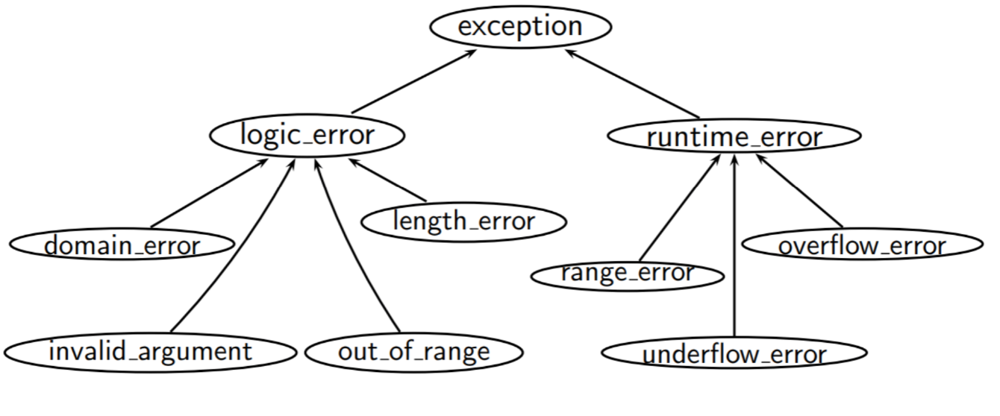
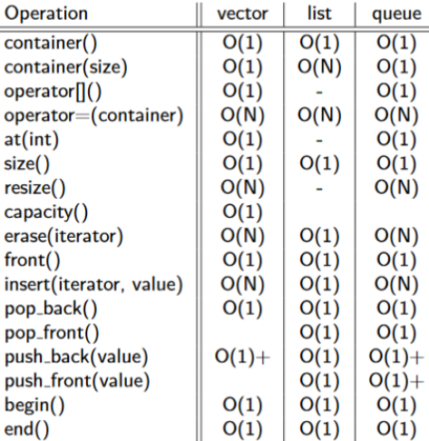

* Assignment is a deepcopy instead of reference assignment
* == is value semantics, equla to `.equals()`

# Basic C++

## I/O

> **cin**: The standard input stream
>
> **cout**: The standard output stream
>
> **cerr**: The standard error stream, unit-buffered such that characters sent to this stream are flushed on each output operation
>
> **clog**: The buffered error stream
>
> The insertion operator `<<` insert data to be displayed into **cout**
>
> The extraction operator `>>`  extracts the data from the object **cin** which is entered using the keyboard.

**string**

1. Skip all leading white space
2. Read char to the string one by one
3. Stop when EOF or next character is space (when `std::isspace(c, is.getloc())` == true)

**endl**

```c++
// The following two are equivalent
std::cout << "\n" << std::flush;
std::cout << std::endl;
```

**Multiple input**

```c++
float a, b;
char c;
cin >> a >> b >> c;
```

Each call to `operator>>(istream&, T)` (where `T` is some arbitrary type) returns a reference to its first argument. So `cin >> a` returns `cin`, which can be used as `(cin >> a) >> b` and so forth.

Note that each call to `operator>>(istream&, T)` first consumes all whitespace characters, then as many characters as is required to satisfy the input operation, up to (but not including) the first next whitespace character, invalid character, or EOF.

### Tokenize String

```c++
stringstream ss(input_string);	// Construct a stream from string
string buffer;
while (ss >> buffer) {
    cout << word << endl;
}

#include <string>
std::getline(istream is, std::string buffer, charT delimeter);
```

## Variable & Types

### Primitive Types

char, int, boolean, float, double

```c++
int* intPointer = new int{};
delete intPointer;

int* intArray = new int[SIZE];
delete[] intArray;
```

### Array

```c++
int dp[10][20] = {0};
memset(dp, 0, sizeof dp);

int dp[2][2] = {
    {1},		// row 1: {1, 0}
    {0, 1}
}
```

### Heap Memory

```c++
int* ptr{new int};

int* ptr1{ new int (5) }; // use direct initialization
int* ptr2{ new int { 6 } }; // use uniform initialization

delete ptr;		// Free the memory pointed by ptr
ptr = nullptr;	// Free does not set ptr to nullptr

int *array = new int[10];
```

### Variables

#### Declaration

```c++
int i;                        <= integer
char *cPtr;                   <= pointer to a character
float arrayOfPoints[10];      <= array of 10 floats
unsigned char uc1, uc2, uc3;  <= three separate unsigned characters.
void *genericPtr;             <= indirect pointer to anything
```

#### extern

> Declare but not define

* Declare bind type with name.It can be done many times. `extern int i;`
* Define allocates memory along while declaring. Can only be done once `int i;`

`extern` allows non-**static** global variables to be accessed in a different file.

#### const

* const objects are local to file: Compiler perform replacement. Same name const object in different file refers to different object.
* Need to be initialized when declared
* const specifies that a value cannot be modified

### Reference Type

> Reference is essentially a pointer that cannot have a null value, and it take the space of a pointer

Except for

* Normal variables: Hold values directly
* Pointers: Hold address of another variable

C++ supports a third reference type. It act as an **alias** to another object or value.

```c++
int x = 0;
int &r = x;		// r is another name of x
```

**Difference to pointers**

* Reference cannot be re-bound. It must be bound at initialization.
* The reference's own address and size is invisible
* Maximum one level of indirection for reference. (Infinite for pointers)

**Reference to const values**

* const reference cannot be modified (behave like a read-only pointer), even if the original can be modified.
* Reference to const must be const

**Applications**

* Allow modification of arguments in functions.
* Allow modification of elements in an enhanced for loop.
* Use in for loop to avoid the copy of objects (`auto const&` is advised)
	* const as there should be no need to change it

### constexpr

The `constexpr` specifier declares that it is possible to evaluate the value of the function or variable at compile time. Unlike `const`, `constexpr` can also be applied to functions and class constructors.

It can shifts potential sources of errors to compile time instead of runtime as well as speeding up the running time (Slows down compile time.)

## Functions

* Default argument

	```c++
	std::string rgb(short r = 0, short g = 0, short b = 0);
	```

* Overload: Same name different signature (Parameters' type)

### Lambda Expression

```c++
[captures] (params) -> T {function_body}
```

* **captures**: Access variables besides params
    * Capture can be by both reference and value
        * `[epsilon]` captures by value
        * `[&epsilon]` captures by reference
        * `[&]` captures all variables used in the lambda by reference
        * `[=]` captures all variables used in the lambda by value
        * `[&, epsilon]` captures variables like with [&], but epsilon by value
        * `[=, &epsilon]` captures variables like with [=], but epsilon by reference
* **params:** List of parameters. If `auto` is used, then the lambda is a generic lambda.

**When to capture by value/ by reference**

* Capture by value when the variable may change, and you want the variable at the current time
* Capture by value when the lifetime of the lambda may exceed the lifetime of the variable
* Capture by reference when the variable may change, and you want to stay updated
* Capture by reference when the variable is unable to be copied, or expensive to copy

### Function as argument

**C++: Functional Library**

```c++
void foo(std::function<bool (int)> func); // func :: int -> bool
// std::function<void (int)>: void function
```

**C: Function Pointer**

```c
void foo(void (*func)(int));

/* typedef to improve style */
typedef void (*function_type)(int);

void foo(int a) { return 1; }

functiontype func2 = &foo;
int result = func2(1);
```

## Class

> **Class VS Struct**
>
> A class and a struct in C++ are almost exactly the same . The **only** difference is that:
>
> - All members of a struct are public by default
> - All members of a class are private by default
>
> We use structs only when we want a simple type with little or no methods and direct access to the data members (as a matter of style).

### Construction

> () to call functions
>
> * () uses value initialization
>
> {} to construct objects (Major use to minimize ambiguity) or call functions
>
> * {} uses list initialisation, which implies value initialization if the braces are empty, or aggregate initialization if the initialized object is an aggregate.
>
> ```c++
> T t1, t2;
> t1 = t2;	// Overload =: Assignment constructor
> T t3 = t1;	// T(const T& t) is called: Copy constructor
> 
> // Copy constructor is called when new object is created from existing object.
> 
> // Assignment constructor is called when an already initialize object is assigned a value from another existing object
> ```

```c++
auto v41 = std::vector<int>{5, 2}; // Initialiser-list constructor {5, 2}
auto v42 = std::vector<int>(5, 2); // Count + value constructor (5 * 2 => {2, 2, 2, 2, 2})
```

### Namespace

```c++
// Definitions
namespace ns_name {declarations}
inline namespace ns_name {declarations} // Declarations will be visible in its enclosing namespace.
namespace {declarations} // Unnamed namespace is only visible in the same file (static in c)
namespace A::B::C { ... } // equivalent to namespace A { namespace B { namespace C { ... } } }

// Look-up in namespace
ns_name::name					// name look-up
using namespace ns_name;		// All name in ns_name is visible until end of scope
using ns_name::name;			// only name is visible
namespace name = qualified-namespace ;	// Create a synonym	
```

### Class Definition

```c++
class Foo {
    public:
    // Members accessible by everyone
    	Foo() {}	// Constructor
    	~Foo() {}	// Destructor

 	protected:
  	// Members accessible by members, friends, and subclasses

 	private:
  	// Accessible only by members and friends
}
```

### Constructor

**Initialization Order**

1. Construct all data members **in order of member initializer list**
2. Construct any undefined member variables that weren't defined in step (1)
    * If it is a build-int type, do nothing (leave it as whatever was in memory before)
    * Else, initialise it using the default constructor
3. Execute the body of constructor: the code may **assign** values to the data members to override the initial values

```c++
class X {
    // Convention to have trailing _
    int a_, b_, i_, j_;
    
    public:
    	const int& r_;
    
    	// member initializer list
    	X(int i): r_{a}, b_{i}, i_{i}, j_(this->i) {
            // Constructor body
        }
    	
    	// Default constructor
    	X(): X(5) {}
};
```

**Benefits of using member initializer list**

> std::string passed in can be moved to improve efficiency. `str_{std::move(arg_str)}`

* Prevent some member variables to be default constructed and then be overwritten (Constructed twice). More efficient.

#### Delegating Constructor

A constructor may call another constructor inside the member initialiser list, then the list must consist of that one member initializer **only** (Cannot initialise another member in the intialiser list).

#### Synthesized Constructor

In C++, the compiler automatically generates the default constructor, copy constructor, copy-assignment operator, and destructor for a type if it does not declare its own.

This is convenient for simple types, but complex types often define one or more of the special member functions themselves, and this can prevent other special member functions from being automatically generated. In practice:

* You can default any of the special member functions—to explicitly state that the special member function uses the default implementation, to define the special member function with a non-public access qualifier, or to reinstate a special member function whose automatic generation was prevented by other circumstances.
* You can delete special member functions as well as normal member functions and non-member functions to prevent them from being defined or called.

```c++
// Explicitly defaulted function
myClass() = default;
myClass(std::vector<int> const) = delete;
```

#### `explicit` Constructor

> * Makes a constructor explicit
> * Makes a function explicit

The compiler is allowed to make one implicit conversion to resolve the parameter of a single paremeter function.

```c++
class Age {
    int age_;
  	Age(int age): age_{age};
};

// Explicitly calling the constructor
Age age{20};

// Implicit conversion done to make this work.
Age age = 20;	// What's executed: Age age = Age{20};

// If this is not desired, add explicit keyword
explicit Age(int age): age_{age};
```

Prefixing the `explicit` keyword to the constructor prevents the compiler from using that constructor for implicit conversions.

```c++
class point {
    // Overload type conversion
    operator double() const {}
}

auto func(double item) -> void {}

int main() {
    auto p = point{1, 2};
    double p1 = p;		// Implicit cast
    double p2 = static_cast<double>(p); // Explicit
    func(p);	// func(double{p}): Implicit type conversion
}
```

### Const Function

> ```c++
> int constF() const {} 	// Define const function
> ```
>
> const member functions cannot
>
> * Modify non-static data members (Except for mutable)
> * Call **non-const** member functions

|                         | Non-const Object | Const Object |
| ----------------------- | ---------------- | ------------ |
| **Non-const Functions** | Y                | N            |
| **Const functions**     | Y                | Y            |

* The `this` pointer passed to a `const` member function is a pointer to a `const` object. That means the pointer cannot be used to modify the object's data members. (`mutable` is an exception)
* Member functions cannot be `static` and  `const`: The const keyword modifies the *this* pointer that is passed to a member function, but static member functions don't have a *this* pointer since they can be called without an object.
* A constant member function can be overloaded with a non-constant version. The choice of which version to use is made by the compiler based on whether or not the object used to call the member function is constant.
    * For example, when overloading the subscript operator`[]`, we should provide both a `const` and a non-const member function. So that both const and non-const object is able to access element using the overloaded `[]` operator.
    * Assignment operator should only has a non-const version while some should have both versions.

### Static

* Static members belong to the class, as opposed to a particular object. 
* Static data has global lifetime. (Exist for the entire run of the program)
* No access to `this` pointer

#### Function

* Call: `<classname>::<function_name>`
* Can only access static data member

#### Fields

```c++
// static Integral type can be initialized in class
class Foo {
    static int count = 0;
    static string name;
}

// other static member need to be initialized outside class
// Should be done in source code file .cpp instead of .hpp
string Foo::name = "Taeyeon";
```

### `friend`

> Put at the start of function signature

- `friend` functions are non-member **global** functions
- can access private parts of the class
- Generally bad but sometimes required
    - Non-member operator overloads
    - related classes
        - A Window class might have WindowManager as a friend
        - A TreeNode class might have a Tree as a friend
        - Container could have iterator_t as a friend
- use when
    - The data should not be available to everyone
    - There is a piece of code very related to this particular class

## Overloading

### Overview

```c++
std::ostream& operator<<(std::ostream& os, T item);
T operator+(T t1, T t2) {}
```

* Commutative operators need to have two functions to make it commutative.

**Operator that can be overloaded**

| Type                              | Operator(s)          | Member / friend                      |
| --------------------------------- | -------------------- | ------------------------------------ |
| I/O                               | <<, >>               | friend                               |
| Arithmetic                        | +, -, *, /           | friend                               |
| Relational, Equality (`std::tie`) | >, <, >=, <=, ==, != | friend                               |
| Assignment                        | =                    | member (non-const)                   |
| Compound assignment               | +=, -=, *=, /=       | member (non-const)                   |
| Subscript                         | []                   | member (const and non-const)         |
| Increment/Decrement               | ++, --               | member (non-const), post/pre differs |
| Arrow, Deference                  | ->, *                | member (const and non-const)         |
| Call                              | ()                   | member                               |

* Use members when the operation is called in the context of a particular instance
    * `return *this` to dereference the `this` pointer to this object

* Use friends when the operation is called without any particular instance
    * Even if they don't require access to private details

```c++
t1 += t2;		// Overload += as member function
t3 = t1 + t2;	// Overload + as friend function
```


```c++
class X {
public:
    X& operator+=(const X& rhs) {}
    X& operator++() {}
    X operator++(int) {}
    X& operator[](int i) {}
    
private:
    // passing lhs by value helps optimize chained a+b+c
  	friend X operator+(X lhs, const X& rhs) {} 
}
```

### Overload Practise

#### Binary Operator

```c++
struct X {

  // member binary operator
  void operator*(int) { }
};

// non-member binary operator: Can take in two different type
void operator*(X, float) { }

int main() {
  X x;
  int y = 10;
  float z = 10;

  x * y;		// x.operator*(y)
  x * z;		// operator*(x, z)
}
```

#### `++`

> Pre-increment is more efficient when post-increment as there is no need to store a copy of the old value

```c++
// Prefix increment
X& operator++() {}
 
// postfix increment
X operator++(int)
{
    X old = *this; // copy old value
    ++(*this);
    return old;    // return old value
}
```

#### `>>` `<<`

```c++
friend ostream& operator<<(ostream& os, const Date& dt)
{
    os << dt.mo << '/' << dt.da << '/' << dt.yr;
    return os;
}

friend istream& operator>> (istream& is, Date& dt)
{
    is >> dt.mo >> dt.da >> dt.yr;
    return is;
}
```

**std::copy**

```c++
#include <sstream>
#include <experimental/iterator>

auto oss = std::ostringstream{};

std::copy(ev.magnitude_.begin(),
          ev.magnitude_.end(),
          std::experimental::make_ostream_joiner(oss, " "));	// Delimited by " "

os << oss.str();
```

#### `->`

> Classes exhibit pointer-like behaviour when -> is overloaded

**Restriction**

* `->` must either return a raw pointer, or return an object (by reference or by value) with `->` overloaded
    * If an object with overloaded `->` is returned, then C++ will continue to call `->` until a ptr is returned

```c++
class StringPtr {
  public:
    StringPtr(std::string *p) : ptr{p} { }
    ~StringPtr() { delete ptr; }
    std::string* operator->() { return ptr; }
    std::string& operator*() { return *ptr; }
  private:
    std::string *ptr;
};
```

- Interesting example: std::optional
- `*` is the dereferencing operator in C, used to retrieve values from a pointer. In C++, it is used to retrieve the data encapsulated under the class.

#### `static_cast`

> Overloading types allow customised class to be used with `static_cast`

```c++
class Point {
  public:
    Point(int x, int y) : x_(x), y_(y) {}
    operator std::vector<int>() {
      std::vector<int> vec;
      vec.push_back(x_);
      vec.push_back(y_);
      return vec;
    }

  private:
    int x_;
    int y_;
};

int main() {
  	Point p{1,2};
  	std::vector<int> vec = static_cast<std::vector<int>>(p);
    vec = std::vector<int>(p);
}
```

#### Implicit Type Conversion

> An *implicit conversion sequence* is the sequence of conversions required to convert an argument in a function call to the type of the corresponding parameter in a function declaration.

```c++
// Allow: double i = Object(1, 2);
operator double() {
    // Return a double representation of Object
}

// Now an explicit conversion is needed
// Legal: double i = double{Object}
// Illegal: double i = Object;
explicit operator double() {}
```

#### Spaceship Operator

https://devblogs.microsoft.com/cppblog/simplify-your-code-with-rocket-science-c20s-spaceship-operator/

#### Hidden Friend

**Operator Overload**

Non-member operator overloads only benefit from being hidden friends. As such, declare them inside the class and **don't** **declare them at namespace scope** as well. 

This has a number of benefits in some circumstances, particularly for operator overloading. It improves compile times by reducing the number of functions the compiler needs to consider when working out what overload to call. It also prevents the function from being called in cases where *neither* argument is the correct type; this may happen due to implicit conversions, for example.

**Helper Friend Functions**

Other friend functions usually don't want to be hidden friends, unless they are customisation points*. As such, declare as friends in the class and **also declare them at namespace scope**.

## Exceptions



```c++
try {
	//do something that can throw exception
    throw std::runtime_eror{"Error!"};
} catch (invalid_argument& e) {
    cerr << e.what() << endl;
    throw e;	// Re-throw it to the outter level
} catch (...) {
    // Catch all uncaught exception
}
```

Use asserts to check for errors that should never occur. Use exceptions to check for errors that might occur

- **Throw by value, catch by const reference &** (Instead of by value, by pointer)
    - more efficient, less copying (Exception object is being copied and deconstructed)
    - no slicing problem (related to polymorphism, exploring later)

### Exception Safety Levels

```c++
noexcept	// Same as noexcept(true): No-throw
```

**No-throw guarantee**

* The function will not throw an exception or allow one to propagate (Not catch previous exceptions). e.g. Destructor of STL, closing a file
* Add `noexcept` if a function has no-fail gurantee, STL functions can operate on them more efficiently.

**Strong exception safety**

* A function that provides a strong guarantee is essentially a transaction that has commit or rollback semantics: either it completely succeeds or it has no effect. e.g. copy-constructors, copy-assignment
* Operation can fail, but they are guaranteed to have no visible effects.

<u>Achieve Strong safety</u>

Perform all <u>reversible</u> operations that might throw, then perform <u>irreversible</u> operations that don't throw

**Basic exception safety**

If an exception occurs, 

* no memory is leaked
* the object is still in a usable state even though the data might have been modified.

Move constructors that are not noexcept follow these semantics

**No exception safety**

* No guarantees

* Don't write C++ with no exception safety
    * Very hard to debug when things go wrong
    * Very easy to fix - wrap your resources and attach lifetimes
        * This gives you basic exception safety for free

### Custom exception

* Provide more informations
* Should be std::exception or subtype of std::exception

### Stack unwinding

> The process of exiting the stack frames until we find an exception handler for the function.

During stack unwinding, destructors are called on relevant objects on the way out; and any exceptions thrown in a destructor (that are not caught and handled in that destructor) cause `std::terminate` to be called

#### Issues

* Only the stack resources are deconstructed, not the heaps, so possible memory leak.

## Resource Management

### Longer Lifetimes

- There are 3 ways you can try and make an object in C++ have a lifetime that outlives the scope it was defined it:
    - Returning it out of a function via copy (can have limitations)
    - Returning it out of a function via references
        - Undefined behaviour if return a reference to a local variable
        - Only the references that were passed in
    - Returning it out of a function as a heap resource (Object is usually on stack)
        - Via `new` and `delete`, like `malloc` in C
        - Heap objects outlines the scope it was created in
        - More dynamic control of memory: stack memory usage need to be determined at compile time
        - Heap is larger than stack


To create safe object lifetimes in C++, we always attach the lifetime of one object to that of something else (Heap memory to stack objects).

### Rule of 5

> If a class requires a user-defined **destructor**, a user-defined **copy constructor**, or a user-defined **copy assignment operato**r, it almost certainly requires all three. (Usually when there is the need to manipualte heap memory)
>
> Because the presence of a user-defined destructor, copy-constructor, or copy-assignment operator prevents implicit definition of the **move constructor** and the **move assignment operator**, any class for which move semantics are desirable, has to declare all five special member functions:

- Destructor
- Copy constructor (Constructor): Constructor a new object from existing object
- Copy assignment operator (Assignmenet Operator): Assignment data of an existing object to another existing object
- Move constructor
- Move assignment operator

```c++
class vector {
  	// Constructor: Allocate an array on heap
  	vector(int size): data_{new int[size]},
    				  size_{size},
    				  capacity_{size} {}
	
    int* data_;
    int  size_;
    int  capacity_;
    
    // Destructor
    ~vector() {
        delete[] data_;
    }
}
```

#### Copy Constructor & Copy Assignment Operator

* Copy Constructor (Default)
    1. Memberwise copy, will not copy heap contents, hence they will point to the same heap memory
* Assignment Operator
    1. Clean up the destination
    2. Swap

```c++
vector a, b
a = b;			// Assignment Operator: Move existing object to an already initialized object
vector c = a;	// Copy constructor: New Object is created from existing object, without initialize
```


```c++
// Copy Constructor
vector(const Vector& original): data_{new int[original.size_]}, 
								size_{original.size_}
								capacity_{original.capacity_} 
{	
    // Copy heap memory
    std::copy(original.data_, original.data_ + original.size_, data_);
}

// Copy Assignment Operator
vector& operator=(const vector& original) {
    vecotr(original).swap(*this);		// Reuse copy constructor
    return this;
}
```

#### Move Constructor & Move Assignment Operators

> A move constructor enables the resources owned by an rvalue object to be moved into an lvalue without copying (Optimization in most case, except for move int).

```c++
// Move Constructor
auto v1 = vector{2};
auto v2 = vector(std::move(v1));

// Move Assignment
auto v1 = vector{2};
auto v2 = vector{10};
v1 = std::move(v2);
```

Move operators need to be **noexcept**, otherwise it will be slow.

```c++
// Move constructor
vector(vector&& orig) noexcept: 
	data_{std::exchange(orig.data_, nullptr)}, 		// data_=orig.data_, orig.data_ = nullptr
	size_{std::exchange(orig.size_, 0)}, 			// size_=orig.size_, orig.size_ = 0
	capacity_{std::exchange(orig.capacity_, 0)} {}

// Move Assignment Operators
vector& vector::operator=(vector&& orig) noexcept {
    // The easiest way to write a move assignment is generally to do
    // memberwise swaps, then clean up the orig object.

    // Doing so may mean some redundant code, but it means you don't
    // need to deal with mixed state between objects.
    std::swap(data_, orig.data_);
    std::swap(size_, orig.size_);
    std::swap(capacity_, orig.capacity_);

    // The following line may or may not be nessecary, depending on
    // if you decide to add additional constraints to your moved-from object.
    delete[] data_
    data_ = nullptr;
    size_ = 0;
    capacity = 0;

    return *this;
}
```


```c++
class vector {
  	// Constructor
  	vector(int size):
    data_{new int[size]},
    size_{size},
    capacity_{size} {}
  
    // Copy constructor
    vector(vector const&) = default;
    
    // Copy assignment: Overload =
    vector& operator=(vector const&) = default;

    // Move constructor
    vector(vector&&) noexcept = default;
    
    // Move assignment
    vector& operator=(vector&&) noexcept = default;

    // Destructor
    ~vector() = default;

    int* data_;
    int size_;
    int capacity_;
}
```

#### Easy Implement

```c++
private:
	swap(graph const& lhs, graph const& rhs) {}		// Swap all private members

// Move Assignment
graph& graph::operator=(graph&& other) noexcept {
    // Self reference check
    if (this == std::addressof(other)) {
		return *this;
	}
    
    swap(*this, other);
    /* Deallocate other's resource */
    return *this;
}

// Copy Assignment
graph& operator=(graph const& other) {
    auto copy = graph(other);	// Reuse copy constructor
    swap(*this, copy);
    return *this;
}
```

#### lvalue & rvalue

|            | lvalue                                               | rvalue                                                       |
| ---------- | ---------------------------------------------------- | ------------------------------------------------------------ |
| Definition | Expression that reference an object. Occupys memory. | A value that usually has no storage associated with it. Can be access but not assigned. |
| Location   | LHS or RHS                                           | RHS                                                          |

`std::move`: Convert lvalue -> rvalue, indicate that an object can be "moved from". Use to invoke move constructor.

#### Copy vs Move

Assuming we are let an object to have the contents of another object. We have to two possible argument types:

* a lvalue parameter `(const vector& lvalue)`: This means we cannot touch the content of it
* a rvalue parameter `(vector&& rvalue)`: A rvalue is a temporary value that cannot live longer beyond you using it. So, instead of copying its content, we can steal its content.

##### Implementation for light classes

Suppose your class just contains two integers. There's **no way** to steal those as they are primitive types. The only things that make sense is to **copy** and set the original to **0**. But it is extra work compare to purely copying.

Hence for light classes, offering only the l-value implementation will be more than enough.

##### Implementation for heavier classes

In the case of a heavier classes that can involve memory allocated on the heap, copying is more costly than just stealling the content. So in this case, we should provide both implementations.

**std::move**

It basically let the compiler knows that I don't need this lvalue anymore, please consider it as an rvalue.

## Smart Pointer

>  Smart pointers wrap unnamed (raw pointer) heap object in named stack, so that object lifetimes can be more manageable.
>
> Usually there's two ways of using smart pointers
>
> * unique_ptr + raw pointers ("observers")
> * shared_ptr + weak_ptr/raw pointers

### Unique Pointer

> `std::unique_ptr` is a smart pointer that owns and manages another object through a pointer and deallocation of that object when the `unique_ptr` goes out of scope. (Not the case if we are using raw pointers)
>
> Unique Pointer can be dereferened like a normal pointer as it overloads `*`
>
> Advantage:
>
> * Exception safety
> * Bind unnamed heap memory to a name on the stack
>
> Unique pointers own the resource and cannot be copied, this prevents multiple deallocation. (Reference is allow)

```c++
/* Constructor */
unique_ptr<std::string>(new std::string{"Goodbye"});
std::make_unique<std::string>("Hi");		// No use of 'new' & 'delete'

unique_ptr<int[]> data_ = make_unique<int[]>(N);		// Array of size N
    
/* Illegal use: unique_ptr's assignment operator only accepts rvalues */
auto p1 = unique_ptr<std::string>(new std::string{"Goodbye"});
auto p2 = p1;				// Illegal: No copy constructor
auto p3 = std::move(p1)		// Legal: Equivalent to p3.reset(p1.release());
```

**Methods**

| Modifiers                                  |                                                              |
| ------------------------------------------ | ------------------------------------------------------------ |
| `p.release()`                              | returns a pointer to the managed object and releases the ownership |
| `p.reset(p1)`                              | replaces the managed object with `p1`'s object, delete the previously managed object. If no `p1` presents, simply deallocate |
| `p.swap(other)`                            | swaps the managed objects with other                         |
| **Observers**                              |                                                              |
| `p.get(())`                                | returns a pointer to the managed object                      |
| get_deleter                                | returns the deleter that is used for destruction of the managed object |
| operator bool                              | checks if there is an associated managed object              |
| **Single-object version**, `unique_ptr<T>` |                                                              |
| operator`*` ` ->`                          | dereferences pointer to the managed object                   |
| **Array version**, `unique_ptr<T[]>`       |                                                              |
| operator[]                                 | provides indexed access to the managed array (public member function) |

### Share Pointer

> `std::shared_ptr` is a smart pointer that retains shared ownership of an object through a pointer. Several `shared_ptr` objects may own the same object.
>
> The object is destroyed and heap memory is released when the last owning `shared_ptr` is destroyed. (Managed by reference count)
>
> Usage:
>
> * An object has multiple owners, **and you don't know which one will stay around the longest** (This it is known, we could have use a unique_pointer and many raw pointers)
> * You need temporary ownership (outside scope of this course)

```c++
auto x = std::make_shared<int>(1);

/* Shread Pointer allowed move construction */
auto x = std::make_shared<int>(1);
auto y = x;
```


Other than the methods provided by unique pointer, shared pointers can do

| Observers      |                                                              |
| -------------- | ------------------------------------------------------------ |
| use_count      | returns the number of `shared_ptr` objects referring to the same managed object |
| unique (C++20) | checks whether the managed object is managed only by the current `shared_ptr` instance |

#### Cyclic Dependency


Solution is weak_ptr


#### Manager Object


The first `shared_ptr` contructor creates a **manager object** (On heap) which contains a pointer to the managed object. The manager object contains two reference counts.  The second instance of the `shared_ptr` simply points to the manager object.

### Weak Pointer

> std::weak_ptr is a smart pointer that holds a non-owning ("weak") reference to an object that is managed by std::shared_ptr. It must be converted to std::shared_ptr in order to access the referenced object.
>
> - Weak pointers are used with share pointers when:
>     - You don't want to add to the reference count
>     - You want to be able to check if the underlying data is still valid before using it. (Advantage over raw pointer)
>
> The only things you can do with weak_ptrs are to interrogate it to see if the managed object is still there, or construct a shared_ptr from it.

```c++
auto p1 = std::weak_ptr(std::shared_ptr p0);

auto p2 = p1.lock();
if (p2 != nullptr) {
    // Safely proceed
}
```

| Modifiers                                                    |                                                              |
| ------------------------------------------------------------ | ------------------------------------------------------------ |
| [reset](https://en.cppreference.com/w/cpp/memory/weak_ptr/reset) | releases the ownership of the managed object                 |
| [swap](https://en.cppreference.com/w/cpp/memory/weak_ptr/swap) | swaps the managed objects                                    |
| **Observers**                                                |                                                              |
| [use_count](https://en.cppreference.com/w/cpp/memory/weak_ptr/use_count) | returns the number of `shared_ptr` objects that manage the object |
| `p.expired()`                                                | checks whether the referenced object was already deleted     |
| `shared_ptr<T> lock();`                                      | creates a `shared_ptr` that manages the referenced object    |

**Usage**

A good example would be a cache.

For recently accessed objects, you want to keep them in memory, so you hold a strong pointer to them. Periodically, you scan the cache and decide which objects have not been accessed recently. You don't need to keep those in memory, so you get rid of the strong pointer.

**Without Weak Pointer**

If some other code holds a strong pointer (share_ptr) to it, the recourse will not get deallocated. And the cache can never find it again. So if another process requires it, it will have duplicate copied in memory.

**With Weak Pointer**

With weak pointers, the cache can keeps a weak pointer to the object and promote it to a strong pointer if another process needs it. If no other pointers need it, and the process that holds the strong pointer releases, the object can be released properly.


This is exactly what a weak pointer does -- it allows you to locate an object if it's still around, but doesn't keep it around if nothing else needs it.

### Use in Object

Smart Pointers should be used within object's that manages heap memory, as resources may not be released properly if an exception occur in constructor.

## Template

**Polymorphism**: Provision of a single interface to entities of different types

* Static
    * Function overloading
    * Templates (i.e. generic programing, `std::vector<int>`, `std::vector<double>`)
* Dynamic: Related to virtual functions and inheritance

**Inclusion Compilation Model**

For templates, their definition (i.e. implmentation) should be included in the .h file. As the template definition need to be known at compile time not at link time.

* In compilatin of multiple file, each file are compiled separatly before they are linked, this requires a specialised definition which templates declaration itself does not provides.
* Will expose implementation details in the .h file
* Can cause slowdown in compilation as every file using min.h will have to instantiate the template, then it's up the linker to ensure there is only 1 instantiation.

### Templates Parameter

> Template parameters can be reused in the template parameter list. e.g. Multiple class all use `T`

Templates are parameterized by one or more **template parameters**, of three kinds: 

* Type template parameters: Unknown type with no value
* Non-type template parameters: Known type with unknown value
* Template template parameters: Template parameter that is itself a template parameter (Haskell Functor ?)

|                              | Syntax                                                       |
| ---------------------------- | ------------------------------------------------------------ |
| Type template parameter      |  |
| Non-type template parameters | Same as variable declaration of: integral, pointer to object, pointer to member, etc. |
| Template template parameters | Simple nest template declarion in `<>`                       |

#### Non-Type Parameter

```c++
template<typename T, std::size_t size>
class queue {}		// size as a non-type parameter, instead of a constructor parametr
```

*Advantage:* Improved performance. Size of a queue is determined at compile time requiring less to be done / processed at runtime.

*Disadvantage:* (1) Code explosion - instantiation created for a queue of every size. (2) Unable to copy construct easily

#### Template template parameter

A template argument for a template template parameter is the name of a class template. 

* (e.g. `std::vector` fits in `template<class T> class U`)

```c++
// template <class T> class X: A parameter X that takes in another parameter T
template<template <class T> class X> class A { };
template<class T> class B { };

A<B> a;

/* Example */
template<typename T, template <class...> class X = std::vector> 	// For varadic templates
class A {
    X<T> data_;	
};
template<class T> class B { };

A<int, std::vector> a;	// data_ :: std::vector<int>
```


```c++
template <typename T, template <typename...> typename CONT>
class stack {
public:
	auto push(T t) -> void { stack_.push_back(t); }
	auto pop() -> void { stack_.pop_back(); }
	auto top() -> T& { return stack_.back(); }
	auto empty() const -> bool { return stack_.empty(); }
private:
	CONT<T> stack_;		// A generic data member
};
```

#### Default Argument

Template parameters may have default arguments. The set of default template arguments accumulates over all declarations of a given template.

```c++
template<class T, class U = int> class A;
template<class T = float, class U> class A;

template<class T, class U> class A {
   public:
      T x;
      U y;
};

A<> a;		// a.x :: float; a.y :: int
```

* Note: If one template parameter has a default argument, then all template parameters following it must also have default arguments. (i.e. Cannot have one without default argument in between two with default argument)
* Both type and non-type template parameter can have default argument

### Class Template

A class template provides a specification for generating classes based on parameters. Class templates are generally used to implement containers.

```c++
template<typename T>		
class stack {};

template<typename T>
auto stack<T>::push(T const& item) {}	
```

Lazy instantiation: Only members functions that are called are instantiated

**Static Member**

* Each template instantiation has it's own set of static members (i.e. the static member of int and double are different). The type of the static declaration can be of template argument of any defined type.
    * static members are defined separately. ` K<int>::x = 0;` for class K
* Each template class instantiation has one unique instantiation of the friend

**Friends**

[Friend function] to [Class]

```c++
class B{
   template<class V> friend int j();	/* Many to one */
}

template<class S> g();

template<class T> class A {
   friend int e();			/* One to many */
   friend int f(T);			/* One to one */
   friend int g<T>();		/* One to one */
   template<class U> friend int h();	/* Many to many */
};
```

**Member function**

A template member function can be define outside of class template. Just need to at the template declaration on top

### Function Template

```c++
/* Template is parameterized by Type parameter T and non-type parameter size */
template<typename T, std::size_t size>
auto findmin(const std::array<T, size> a) -> T {}
```

**Template argument deduction**

When you call a template function, you may omit any template argument that the compiler can determine or *deduce* by the usage and context of that template function call.

<u>Implicit Deduction</u>

```c++
/* Array to pointer */
template <typename T> f(T* array) {}

int a[] = {1, 2};
f(a);	// int* a; -> T == int

/* const qualification */
template <typename T>
f(const T item) {}

int a = 5;
f(a); // int => const int; T == int
```

<u>Explicit Deduction</u>

```c++
template<typename T>
T min(T a, T b) { return a < b ? a : b;}

auto main() -> int {
	auto i = int{0};
	auto d = double{0};
	min(i, static_cast<int>(d)); // int min(int, int)
	min(static_cast<double>(i), d); // double min(double, double)
	min<double>(i, d); // double min(double, double)
}
```

### Member Function Template

> Member function templatesare template functions that are members of a class or class templates.
>
> * Member template functions **cannot** be virtual functions, and
> * **cannot** override virtual functions of a base class.

Destructors and copy constructors cannot be templates.

```c++
/* Define member templates outside class */
template<typename T>
class stack {
   template<typename U>
   stack(stack<U>& other);
};

template <typename T>
template <typename U>	
stack<T>::stack(stack<U>& s) { /* A copy constructer compatible with another type */
	while (!s.empty()) {
		stack_.push_back(static_cast<T>(s.pop()));
	}
}
```

### Template Specialization

> A powerful feature of C++'s templates is *template specialization*. This allows alternative implementations to be provided based on certain characteristics of the parameterized type that is being instantiated. Template specialization has two purposes: 
>
> * to allow certain forms of optimization (bit shift with integer division, use 1 bit instead of 1 byte to store bool), 
> * and to reduce code bloat (臃肿)
> * to preserver existing semantics (e.g. Allow summing over pointers like over integers)
>
> Note that **Partial specialization** are only allowed for class and variable templates (not for function templates.)
>
> - http://www.gotw.ca/publications/mill17.htm

```c++
template <typename Key, typename Value>
class KeyValuePair {};

/* Explicit Specialization */
template <>
class KeyValuePair<int, std::string> {};

/* Partial Specialization */
template <typename Key>
class KeyValuePair<Key, std::string> {};
```

#### Explicit Specialization

> All template arguments are specified
>
> https://www.ibm.com/docs/en/zos/2.3.0?topic=only-explicit-specialization-c
>
> Example at: https://docs.microsoft.com/en-us/cpp/cpp/template-specialization-cpp?view=msvc-160


```c++
using namespace std;

template<class T = float, int i = 5> class A {};

template<> class A<> { public: A(); };		// Notice the syntax
template<> class A<double, 10> { public: A(); };
```

You can explicitly specialize any of the following templates:

- Function template
- Class template
- Member function of a class template
- Static data member of a class template
- Member class of a class template
- Member function template of a class template
- Member class template of a class template

##### Class Member of Explicit Specialization

A member of an explicitly specialized class is not implicitly instantiated from the member declaration of the primary template. You have to explicitly define members of a class template specialization.

#### Partial Specialization

> A specialized class with some parameters preset. Resultant class is still a template. **Not available to function.**
>
> Purpose: 
>
> * Specialize to preserve behavior
> * Implement optimization  (`vector<bool>` use only 1 bit for each bool)
>
> Types of Partial Specialization:
>
> - A template has multiple types and only some of them need to be specialized.
> - A template has only one type, but a specialization is needed for pointer, reference, pointer to member, or function pointer types. The specialization itself is still a template on the type pointed to or referenced.
>
> Example:
>
> https://docs.microsoft.com/en-us/cpp/cpp/template-specialization-cpp?view=msvc-160

**Partial Specialization for pointer type**

```c++
/* Class template */
template <class T> 
class Bag {
   T* elem;
   int size;
   int max_size;

public:
   Bag() : elem(0), size(0), max_size(1) {}
   void add(T t) {
      T* tmp;
      if (size + 1 >= max_size) {
         max_size *= 2;
         tmp = new T [max_size];
         for (int i = 0; i < size; i++)
            tmp[i] = elem[i];
         tmp[size++] = t;
         delete[] elem;
         elem = tmp;
      }
      else
         elem[size++] = t;
	}
}

/* Specialization for Pointer type: automatic dereference and null checking */
template <class T> 
class Bag<T*> {		// Notice the syntax
   T* elem;
   int size;
   int max_size;

public:
   Bag() : elem(0), size(0), max_size(1) {}
   void add(T* t) {
      T* tmp;
      if (t == NULL) {   // Check for NULL
         cout << "Null pointer!" << endl;
         return;
      }

      if (size + 1 >= max_size) {
         max_size *= 2;
         tmp = new T [max_size];
         for (int i = 0; i < size; i++)
            tmp[i] = elem[i];
         tmp[size++] = *t;  // Dereference
         delete[] elem;
         elem = tmp;
      }
      else
         elem[size++] = *t; // Dereference
   }
}
```

**Partial Specialization for Template with mutiple parameter**

```c++
template <class Key, class Value> 
class Dictionary {}

template <class Value>
class Dictionary<int, Value> {}		// Key is specialized
```

### Source Code Organization

> The definition of a class template must be organized in a way that the member definitions are visible to the compiler when it needs them. There are two choices avaiable
>
> * **Inclusion Model**: Include definition in every file that uses a template (e.g. Definition in `.h`)
>     * Simplest and most flexible
>     * Increase compilation time
> * **Explicit Instantiation model**: The template itself instantiates concrete classes or class members of specific types.
>     * Speed up compilation
>     * Limits usage to only those classes
>
> In general, the inclusion compilation model is recommanded.
>
> https://docs.microsoft.com/en-us/cpp/cpp/source-code-organization-cpp-templates?view=msvc-160

**Inclusion Model**

```c++
/* .h */
template <typename T>
auto min(T a, T b) -> T {
  return a < b ? a : b;
}
```

**Explicit Model**

```c++
// .h
template <typename T>
T min(T a, T b);

// .c
template <typename T>
auto min(T a, T b) -> T {
	return a < b ? a : b;
}

template int min<int>(int, int);
template double min<double>(double, double);
```

### Variadic Templates

> Before C++11, templates had a fixed number of parameters that must be specified in the declaration of the templates. Templates could not have a variable number of parameters. To partially alleviate this problem, you could use overloaded function templates that had a different number of parameters or extra defaulted template parameters.
>
> With the variadic templates feature, you can define class or function templates that have any number (including zero) of parameters. To achieve this goal, this feature introduces a kind of parameter called **parameter pack** to represent a list of zero or more parameters for templates.

**Parameter Packs**

> A parameter pack can pack multiple parameters into a single parameter by placing an ellipsis `...` to the left of the parameter name.
>
> * In the template definition, a parameter pack is treated as a single parameter. 
>
> * In the template instantiation, a parameter pack is expanded and the correct number of the parameters are created.

```c++
/* type parameter pack */
template<class...T> class X{};

X<> a;                    // the parameter list is empty 
X<int> b;                 // the parameter list has one item
X<int, char, float> c;    // the parameter list has three items 

/* non-type parameter pack */
template<bool...A> class X{};

X<> a;                    // the parameter list is empty 
X<true> b;                // the parameter list has one item
X<true, false, true> c;   // the parameter list has three items 
```


### Type Trait

> **Type traits** are a clever technique used in C++ template metaprogramming that gives you the ability to inspect and transform the properties of *types*.
>
> Purpose: Otherwise developers may find it difficult to build a template work for all types without knowing the characteristics of a type. 

```c++
/* pointer trait */
template <typename T>
struct is_pointer {
	static const bool val = false;
};
 
template<typename T>
struct is_pointer<T*> {
	static const bool val = true;
};

/* void trait */
template <typename T>
struct is_void {
	static const bool val = false;
};

template<>
struct is_void<void> {
	static const bool val = true;
};

auto main() -> int {
	std::cout << is_void<int>::val << "\n";
	std::cout << is_void<void>::val << "\n";
}
```

**Usage**

* Traits allow generic template functions to be parameterised

```c++
#include <iostream>
#include <type_traits>

template<typename T>
auto testIfNumberType(T i) -> void {
	if (std::is_integral<T>::value || std::is_floating_point<T>::value) {
		std::cout << i << " is a number"
		          << "\n";
	}
	else {
		std::cout << i << " is not a number"
		          << "\n";
	}
}
```

## constexpr

>  **`constexpr`** indicates that the value, or return value, is constant and, where possible, is computed at compile time. **`constexpr`** can be applied to variable, functions and class constructors.

**constexpr variable**

A reference may be declared as **`constexpr`** when both these conditions are met: 

* The referenced object is initialized by a constant expression
* and any implicit conversions invoked during initialization are also constant expressions.

```c++
constexpr int i; // Error! Not initialized
int j = 0;
constexpr int k = j + 1; //Error! j not a constant expression
```

**constexpr function**

> A **`constexpr`** function computes return value at compile time.
>
> Consuming code requires the return value at compile time to 
>
> * initialize a **`constexpr`** variable, or 
> * to provide a non-type template argument. 
>
> When its arguments are **`constexpr`** values, a **`constexpr`** function produces a compile-time constant. When called with non-**`constexpr`** arguments, or when its value isn't required at compile time, it produces a value at run time like a regular function. (To make it work, all arguments need to be **`constexpr`** values)

**constrexpr if**

```c++
if constexpr ([condition]) {}	// Evaluate branch at compile time
```

## Custom Iterators

### Iterator Traits

- Each iterator has certain properties
    - Category (input, output, forward, bidirectional, random-access)
    - Value type (T): The type iterating over
    - Reference Type (T& or const T&)
    - Pointer Type (T* or T* const)
        - Not strictly required
    - Difference Type: Signed integer identifying distance between iterator


All iterators must be *constructible*, *copy-constructible*, *copy-assignable*, *destructible* and *swappable*. (Can be done by synthesised constructor)

```c++
class Iterator {
 public:
  using iterator_category = std::forward_iterator_tag;
  using value_type = T;
  using reference = T&;
  using pointer = T*; // Not strictly required, but nice to have.
  using difference_type = std::ptrdiff_t;
	
  // Dereference
  reference operator*() const;
  // This one isn't strictly required, but it's nice to have.
  pointer operator->() const { return &(operator*()); }
    
  // Increment
  Iterator& operator++();
  Iterator operator++(int) {
    auto copy = *this;
    ++(*this);
    return copy;
  }

  // Comparable
  friend bool operator==(const Iterator& lhs, const Iterator& rhs) { ... };
  friend bool operator!=(const Iterator& lhs, const Iterator& rhs) { return !(lhs == rhs); }
};
```

Usually, a reverse_iterator requires a completely different design from the normal iterator.

### Iterator in Container

```c++
template <typename T>
class IntStack {
    private:
    	class Iterator {
            public:
            	// Overloaded operators and traits
            private:
            	// Constructor and data member
            	friend class IntStack;	// To Access private member of IntStack
        }
    
    public:
    	using iterator = Iterator;
		using const_iterator = Iterator;
		
    	// Iterator getters. begins and ends
        iterator begin();
        iterator end();

        // If you want const iterators (hint: you do), define these.
        const_iterator begin() const { return cbegin(); }
        const_iterator cbegin() const;
        const_iterator end() const { return cend(); }
        const_iterator cend() const;
}
```

If there is an existing bidirectional iterator, we can create reverse iterator using `std::reverse_iterator`

```c++
class Container {
  // Make the iterator using these.
  using reverse_iterator = std::reverse_iterator<iterator>;
  using const_reverse_iterator = std::reverse_iterator<const_iterator>;

  // Need to define these.
  reverse_iterator rbegin() { return reverse_iterator{end()}; }
  reverse_iterator rend() { return reverse_iterator{begin()}; }

  // If you want const reverse iterators (hint: you do), define these.
  const_reverse_iterator rbegin() const { return crbegin(); }
  const_reverse_iterator rend() const { return crend(); }
  const_reverse_iterator crbegin() const { return const_reverse_iterator{cend()}; }
  const_reverse_iterator crend() const { return const_reverse_iterator{cbegin()}; }
};
```

# Advance C++

## Advance Topic

### decltype

> Semantic equivalence of "typeof"

**Rule 1**:

- If expression **e** is any of:
    - variable in local scope
    - variable in namespace scope
    - static member variable
    - function parameters
- then result is variable/parameters type **T**

**Rule 2**: if e is an lvalue (i.e. reference), result is T&

**Rule 3**: if e is an xvalue, result is T&&

**Rule 4**: if e is a prvalue, result is T

https://stackoverflow.com/questions/3601602/what-are-rvalues-lvalues-xvalues-glvalues-and-prvalues

```c++
int i = 5;
int& k = i;

decltype(i) x; // int; - variable
decltype(k) y; // int& - lvalue
decltype(std::move(i)) z; // int&& - rvalue
decltype(4.2);   // double - rvalue	
```

#### Usage

* Determine return type for a template

    ```c++
    template <typename It>
    auto find(It beg, It end, int index) -> decltype(*beg) {
    	for (auto it = beg, int i = 0; beg != end; ++it, ++i)
    		if (i == index) return *it;
    	return end;
    }
    ```

### Type Transformation

> A number of **add, remove**, and **make** functions exist as part of [type traits](https://en.cppreference.com/w/cpp/header/type_traits) that provide an ability to transform types

`std::remove_reference` 

`std::add_rvalue_reference`

### Binding

> What kind of argument can bind to what kind of parameter
>
> * const T& and `template <typename T> void foo(T&& a) {}`can binds to all value

|              | lvalue & | const lvalue | rvalue && | const rvalue |
| ------------ | -------- | ------------ | --------- | ------------ |
| Template T&& | Y        | Y            | Y         | Y            |
| T&           | Y        |              |           |              |
| const T&     | Y        | Y            | Y         | Y            |
| T&&          |          |              | Y         |              |

### Reference Collapsing

[Parameter] + [Argument]

T& + & -> T&

T&& + & -> T&

T& + && -> T&

T&& + && -> T&&

### value category

https://stackoverflow.com/questions/3601602/what-are-rvalues-lvalues-xvalues-glvalues-and-prvalues

|                              |                                                              |                                                              |
| ---------------------------- | ------------------------------------------------------------ | ------------------------------------------------------------ |
| lvalue                       | Designate a function or an object                            | The result of calling a function that returns a lvalue reference |
| xvalue                       | Refer to an object near the end of it lifetime (e.g. a moved from object) | The result of calling a function that returns a rvalue reference |
| glvalue (generalized lvalue) | An lvalue or an xvalue                                       |                                                              |
| rvalue                       | An xvalue or a temporary object or subobject.                |                                                              |
| prvalue (pure rvalue)        | rvalue that is not a xvalue. (Old definition of rvalue)      |                                                              |


* The primary value categories correspond to two properties of expressions:
    - *has identity*: it's possible to determine whether the expression refers to the same entity as another expression, such as by **comparing addresses** of the objects or the functions they identify (obtained directly or indirectly);
    - *can be moved from*: move constructor, move assignment operator, or another function overload that implements move semantics can bind to the expression. We are allowed to leave the source in some indeterminate but valid state.

lvalue: has identity + cannot be moved from

xvalue: has identity + can be moved from (Result of casting a lvalue to a rvalue)

prvalue: don't have identity + can be moved from

Having the new categories, a named rvalue (moved) can be differentiate from a unnamed rvalue (no identity)

```c++
int   prvalue();
int&  lvalue();
int&& xvalue();
```

## std::forward

```c++
//clang++ -std=c++11 -g -o forward test_forward.cpp
#include <iostream>

template<typename T>
void print(T& t){
    std::cout << "lvalue" << std::endl;
}

template<typename T>
void print(T&& t){
    std::cout << "rvalue" << std::endl;
}

template<typename T>
void testForward(T&& v){
    print(v);	// Memory allocated for parameter, always lvalue
    print(std::forward<T>(v));	// Depends
    print(std::move(v));	// Always rvalue
}

int main(int argc, char * argv[])
{	
    testForward(1);

    std::cout << "======================" << std::endl;

    int x = 1;
    testFoward(x);
}

/* Output
lvalue: Was rvalue, become lvalue due to argument passing
rvalue: 完美转发 = std::foward + T&& 万能引用 + Reference collapsing
rvalue
======================
lvalue
lvalue
rvalue
*/
```

## Inheritance

```c++
class Derived : [virtual] [access-modifier] Base1, ... {}
```

* Virtual base class: Useful for multiple inheritance. 
    * Without virtual inheritance, if two classes `B` and `C` inherit from a class `A`, and a class `D` inherits from both `B` and `C`, then `D` will contain two copies of `A`'s member variables: one via `B`, and one via `C`.
    * Instead, if classes `B` and `C` inherit virtually from class `A`, then objects of class `D` will contain only one set of the member variables from class `A`.
* Access-modifier (public, private, protected): As below

### Access Control

> Access-modifier allows the derived class to restrict the access control of the base class members. 
>
> Depending on the access-modifier, the access control of the public and protected member of the base class get changed. But private members **remains** private. (e.g. In a private base class, public and protected members of the base class become private members of the derived class)

Generally *public* is used, if not, then maybe composition should be used instead.

* Both `struct` and `class` can act as the base class.

```c++
struct B {};

class D : B {};     // private derivation: implicit
struct E : B {};    // public derivation: implicit
```

### Virtual Function

**Object Slicing**

```c++
class BaseClass {
    void f() {return "BaseClass";}
}

class SubClass : public BaseClass {
    void f() {return "SubClass";}
}

void print_class_name(BaseClass base) {
  std::cout << base.f() << endl;
}

SubClass subclass;
print_class_name(subclass);	// Output: "BaseClass"
```

In the example above, the parameter is passed by value. Since the `base` variable is of type BaseClass, we only stores BaseClass in memory. So the `subclass` passed in is sliced and left with the BaseClass part, and additional part is dropped.

However, even if we change the function so that it takes in a reference, the output will still be `"BaseClass"`. This is because of static binding. (Override is not done without `virtual` keyword)

**Correctly Override**

> * Static binding: Match function with definition at compile time (Based on static type)
> * Dynamic Binding: Match function with definition at run time (Based on dynamic type)
>
> A `virtual` function do dynamic binding. The `virtual` keyword indicates to the compiler that the definition of that function should not be chosen by the type of lvalue reference, but by the type of object that the lvalue reference refers to. (Not be reference, but by actual type)
>
> C++
>
> - Statically typed (types are calculated at compile time)
> - Static binding for non-virtual functions
> - Dynamic binding for virtual functions
>
> Java
>
> - Statically typed
> - Dynamic binding

```c++
struct A {
   virtual void f() { cout << "Class A" << endl; }
};

struct B: A {
    // Override f() in A, virtual is must, override is optional
   void f() override { cout << "Class B" << endl; }	
};
```

#### VTable

Each class has a VTable stored in the data segment. It stores an array of function pointers that points to the definition of each virtual function. 

* If the VTable is non-empty for a class, then every instance of this class has an additional data member that is a pointer to the VTable (VTable is shared between instance of the same class).
* When a virtual function is called **on a reference or pointer type**, then the program follows the VTable pointer to get the correct funciton definition.

```c++
class B {
public:
  virtual void bar() {}
  virtual void qux() {}
};

class C : public B {
public:
  void bar() override {}
};
```


#### Covariant/ Contravariant

* Return value can be of derived type (Stricter postcondition)
* Parameter can be of super type (Looser precondition)

### Static/ Dynamic Binding

> Only in the case of reference and pointer there exist object has its static and dynamic type not match

### Final

> https://devblogs.microsoft.com/cppblog/the-performance-benefits-of-final-classes/
>
> The `final` specifier makes a *class* or *virtual member function* unable to be derived from or overriden. 
>
> It can also improve performance through aiding *devirtualization* (No need to look up VTable, static binding only). 
>
> Virtual functions require an indirect call through the vtable, which is more expensive than a direct call due to interactions with branch prediction and the instruction cache, and also the prevention of further optimizations which could be carried out after inlining the call. 

```c++
struct base final {};
struct derived : base {};	// Compile Error
```

### Abstract Class

> Abstract classes cannot be instantiated but can be derived. 
>
> You **cannot** use an abstract class as a parameter type, a function return type, or the type of an explicit conversion (`static_cast<>`), nor can you declare an object of an abstract class. You **can**, however, declare pointers and references to an abstract class.
>
> Abstract class contains at least one **pure virtual** member function.

```c++
class Account {
public:
   Account( double d );   			 // Non-virtual constructor 
   virtual double GetBalance();  	 // Ordinary virtual function: No necessary make this class abstract
   virtual void PrintBalance() = 0;  // Pure virtual function: Must be overriden to be not abstract
private:
    double _balance;
};
```

### Subtle issue

* Every subclass constructor must call a base class constructor.
    * Subclass cannot initialise feilds in base class
* Destructor should be made virtual whenver you expect the class to be derived.
    * Whenever destructor is declared, the move constructor and move assignment are not synthesised, but need be explicitly declares (though can be default).
* Avoid default arguments when overriding virtual functions
    * Default arguments are determined at compile time for efficiency, and does not match dynamic binding behavior. Instead, it uses the **static** type of the variable when determining default argument
    * https://slides.com/haydensmith/comp6771-21t2-9-1#/8
* Constructor and Destructor should not call `virtual` function, all functions should be `final`.
    * Dynamic binding cannot be performed if a class if fully constructed or partially destructed.

### Destruct/ Constructor Order

**Destruct**

1. Concrete class
2. Data member of concrete class
3. Base class
4.  Data member of base class

**Construct**

1. Base class data member
2. Base class
3. Concrete class data member
4. Concrete class

### Casting

**Up-Casting**

Because up-casting is always safe, C++ allow this as an implicit case.

```c++
auto dog = Dog();
 
Animal& animal = dog;		// Up-cast with references.
Animal* animal = &dog;		// Up-cast with pointers.
```

**Down-casting**

Not alway safe. So need to be explicit using `static_cast` or `dynamic_cast`.

* `static_cast`: Done at compile time, you must be certain that the cast will success. Otherwise, undefined behavior.
* `dynamic_cast`: C++ will do run time type checking, if incorrect, exception is throw for reference, null is returned for pointer.

```c++
auto dog = Dog();
auto cat = Cat();
Animal& animal_dog{dog};
Animal& animal_cat{cat};

/* Reference */

// Attempt to down-cast with references.
Dog& dog_ref{static_cast<Dog&>(animal_dog)};
Dog& dog_ref{dynamic_cast<Dog&>(animal_dog)};
// Undefined behaviour (incorrect static cast).
Dog& dog_ref{static_cast<Dog&>(animal_cat)};
// Throws exception
Dog& dog_ref{dynamic_cast<Dog&>(animal_cat)};

/* Pointers */

// Attempt to down-cast with pointers.
Dog* dog_ref{static_cast<Dog*>(&animal_dog)};
Dog* dog_ref{dynamic_cast<Dog*>(&animal_dog)};
// Undefined behaviour (incorrect static cast).
Dog* dog_ref{static_cast<Dog*>(&animal_cat)};
// returns null pointer
Dog* dog_ref{dynamic_cast<Dog*>(&animal_cat)};
```

## Polymorphism

### Polymorphic Objects

**Use pointer or reference when dealing with polymorphism, otherwise, object slicing problem.**

Store polymorphic objects require the use of pointers as we can't do vector of reference

```c++
// Java-style C++: Illegal, suffer form object slicing
auto base = std::vector<BaseClass>();
base.push_back(BaseClass{});
base.push_back(SubClass1{});
base.push_back(SubClass2{});

// C++ Solution: C++ don't allow vector of reference
auto base = std::vector<std::unique_ptr<BaseClass>>();
base.push_back(std::make_unique<BaseClass>());	// Create BaseClass
base.push_back(std::make_unique<Subclass1>());	// Create Subclass1
base.push_back(std::make_unique<Subclass2>());
```

**Wrong Example**

```c++
auto sub = SubClass{};
// This suffer from object slicing as make_unique calls constructor on BaseClass instead of SubClass
std::make_unique<BaseClass>(sub);	

// We can do this to presever polymorphism
std::unique_ptr<BaseClass> p = std::make_unique<SubClass>(sub);
```

# STL

```c++
/* Sequential */
std::array<class T, std::size_t N>			// Fixed-sized array.
std::vector			// Dynamically-sized array.
std::deque			// Double-ended queue: Chucks of vector
std::forward_list	// Singly-linked list.
std::list			// Doubly-linked list.

/* Orderred Associative Containers */
std::set<Key>		// RB Tree: collection of unique keys, sorted by keys
std::map<Key,T>		// RB Tree: collection of key-value pairs, sorted by unique keys. 
std::multimap		// RB Tree: Allow duplicate keys
std::multiset		// RB Tree: Allow duplicate keys
    
/* Unorderred Associative Containers */
unordered_set 		// collection of unique keys, hashed by keys
unordered_map		// collection of key-value pairs, hashed by keys, keys are unique
unordered_multiset	// Hash table with a count: collection of keys, allow duplicates
unordered_multimap	// Each key has a count, pair with same keys come together
  
/* Container adaptors: Different interface to sequential containers */
std::stack
std::queue			// vector, list or deque
std::priority_queue
```

## Sequantial Containers



```c++
/* Pop */
auto last = v.back();
v.pop_back();

auto first = v.front();
v.erase(v.begin());

/* Remove by index */
vec.erase(vec.begin() + index);		// index = 3, remove vec[3]

/* Insert */
vec.push_back(value);
vec.insert(pos, value);
```

### Vector

**Constructors**

```c++
vector(count, value);		// [count] copy of [value]
vector(InputIt first, InputIt last);
vector({initializer_list});
```

**Member Functions**

```c++
/* Modifier */
insert(it pos, T& value);	// Insert before pos, return iterator to the inserted item
push_back();				// emplace_back

erase(it[, last_it]);
pop_back();

clear();

/* Access */
v.front();
v.back();

/* Capacity */
v.empty();
v.size()
```

### List

**Operations**

```c++
l.reverse();
l.sort([cmp]);

l1.merge(l1[, cmp]);
```

## Assocaitive Containers

### Map

> Iterator of map points to std::pair<K, T>. In the order of increasing key, effectively sorting the inserted pairs.

**Constructor & Comparator**

```c++
struct Point { double x, y; };
struct PointCmp {
    bool operator() (const Point& lhs, const Point& rhs) const { 
        return lhs.x < rhs.x;
    }
};
 
int main() {
  // (1) Default constructor
  std::map<std::string, int> map1;
  map1["something"] = 69;
  map1["anything"] = 199;
  map1["that thing"] = 50;
  std::cout << "map1 = "; print_map(map1);
 
  // (2) Range constructor
  std::map<std::string, int> iter(map1.find("anything"), map1.end());
 
  // (3) Copy constructor
  std::map<std::string, int> copied(map1);
 
  // (4) Move constructor
  std::map<std::string, int> moved(std::move(map1));
 
  // (5) Initializer list constructor
  const std::map<std::string, int> init {
    {"this", 100},
    {"can", 100},
    {"be", 100},
    {"const", 100},
  };
 
  // Custom Key class option 1: Use a comparison struct
  std::map<Point, double, PointCmp> mag = {
      { {5, -12}, 13 },
      { {3, 4},   5 },
      { {-8, -15}, 17 }
  };
 
  // Custom Key class option 2: Use a comparison lambda
  // This lambda sorts points according to their magnitudes, where note that
  //  these magnitudes are taken from the local variable mag
  auto cmpLambda = [&mag](const Point &lhs, const Point &rhs) { return mag[lhs] < mag[rhs]; };
    
  //You could also use a lambda that is not dependent on local variables, like this:
  // auto cmpLambda = [](const Point &lhs, const Point &rhs) { return lhs.y < rhs.y; };
  std::map<Point, double, decltype(cmpLambda)> magy(cmpLambda);
 
  //Various ways of inserting elements:
  magy.insert(std::pair<Point, double>({5, -12}, 13));
  magy.insert({ {3, 4}, 5});
  magy.insert({Point{-8.0, -15.0}, 17});
}
```

**Lookup**

```c++
iterator find(key);
contains(key);

map.lower_bound(key);		// First K-V pair >= key
map.upper_bound(key);		// First K-V pair > key
```

**Modifiers**

```c++
emplace(K, V);		// Construct element in-place instead of copy
insert(K, V);		// Copy the pair to the map

/* Pop */
auto last = v.back();
v.pop_back();

auto first = v.front();
v.erase(v.begin());

/* Remove*/
map.erase(key);
map.erase(first_it[, last_it]);

/* Insert */
vec.push_back(value);
vec.insert(pos, value);
```

### Multimap

```c++
map.equal_range() = make_pair(map.lower_bound, map.upper_bound)
```

### Set

#### Tranparent Comparator

>  **Heterogenous lookup** allows searching a container using a probe that has a *different type* than objects in the container. (e.g. Search for N in an container storing `unique_ptr<N>`, search for a field within the stored object)
>
> For `vector<>`: Simply supplying a comparator function along with the query function is sufficient

**The case for `set<>` is more complex**, insertion are done by the overload `<` operator which must takes in two parameters of the stored type.

Without transparent comparator, we need construct the entire object before doing the query which is very insufficient.

```c++
// Assume Thing is an object with a field of std::string
auto it = things.find(Thing(str)); // construct probe Thing object 
// auto it = things.find(str); 6 // implicitly construct probe Thing object
```

There are two ways to use the C++14 Solution:

**Use additional overlaods of `<`**

> `less<T>` creates a function object whose operator() takes two arguments of the same type T and perform `<` comparison.
>
> So by default, declaring a set holding type T objects uses less<T> as the comparison function object.

In C++14, a specialization of `less` was added. The type parameter is generic `void`, written as `less<>`. In this case, the generated function object operator() can takes two arguments of different type and use the `<` defined for those two different types.

If `less<>` is involved, a different version of `find()` will be instantiate to accept argument of a different type.

```c++
// Two overloads of <. Comparision of Thing is defined in class`
bool operator< (const Thing& lhs, const string& rhs) {return lhs.get_name() < rhs;} 
bool operator< (const string& lhs, const Thing& rhs) {return lhs < rhs.get_name();}

// Set using no-type less<>
set<Thing, less<>> things;

// no Thing probe object needed when using find
auto it = things.find(str); 
```

Notice that you **can't use** this approach if your additional overloads involve only built-in types - remember you can't overload comparisons between two pointers, two integers, or between an integer and a pointer.

**Use Custom Comparision function object**

Instead of using the`less<>` comparison function object and overloads of `<`. We can supply our own comparator as long as it includes all the required comparison. Note that this is useful if we cannot define the `<` overload for a particular class.

```c++
struct Comp { 
    using is_transparent = std::true_type;
    
    bool operator() (const Thing& lhs, const Thing& rhs) const // compare Things
		{return lhs < rhs;} 
    
    bool operator() (const Thing& lhs, const string& rhs) const // compare Things to strings
		{return lhs.get_name() < rhs;} 
    
    bool operator() (const string& lhs, const Thing& rhs) const // compare strings to Things
		{return lhs < rhs.get_name();} 
};

set<Thing, Comp> things;
```

`std::tie` can be used to safely compare object that need to be compared on multiple fields

The template magic solution was that if the comparison function object defined a type named is_transparent, the set<> template would instantiate the multiple find functions to use the other comparisons; if not, the old homogenous lookup version of find would be instantiated instead.

##### Heterogenous Lookup with other containers

`find_if` uses a predicate to cater for any heterogenous lookup.

## Container Adaptors

### Priority queue

> Default PQ is a max heap, get min heap with an extra argument

```c++
#include <queue>

/* Definition */
auto max_heap = std::priority_queue<int>{};
auto min_heap = std::priority_queue<int, vector<int>, std::greater<int>>{};

// Pop
auto max = max_heap.top();
max_heap.pop();

// Push
max_heap.push(value);
```

**Customize comparator**

```c++
struct Comparator { 
    using is_transparent = std::true_type;
    
    bool operator() (const Thing& lhs, const Thing& rhs) const // compare Things
		{return lhs < rhs;} 
}
```

## Iterators

> Iterator is an abstract notion of a pointer.

| Iterator form          | Description                                                  | Produced by                                                  |
| ---------------------- | ------------------------------------------------------------ | ------------------------------------------------------------ |
| input iterator         | Read only, forward moving                                    | istream_iterator                                             |
| output iterator        | Write only, forward moving                                   | ostream_iterator, inserter(), front_inserter(), back_inserter() |
| forward iterator       | Both read and write, forward moving                          |                                                              |
| bidirectional iterator | Read and write, forward and backward moving                  | list, set & multiset, map & multimap                         |
| random access iterator | Read and write, random access `[]`                           | ordinary pointers, vector, deque                             |
| Contiguous Iterator    | Same as random.  Logically adjacent elements are also physically adjacent in memory. |                                                              |


### Range Access

> Abstract all containers into an array

| Methods                        | Description                                                  |
| ------------------------------ | ------------------------------------------------------------ |
| begin, cbegin (const_iterator) | returns an iterator to the beginning of a container or array (function template) |
| end, cend                      | returns an iterator to the end of a container or array (function template) |
| rbegin, crbegin                | returns a reverse iterator to a container or array (function template) |
| rend, crend                    | returns a reverse end iterator for a container or array (function template) |
| size, ssize                    | returns the size of a container or array (function template) |
| empty (C++17)                  | checks whether the container is empty (function template)    |
| data (C++17)                   | obtains the pointer to the underlying array (function template) |

**const iterator**

```c++
T* const // A const iterator to a non-const element. Corresponds to const std::vector<T>::iterator
const T* // A non-const iterator to a const element. Corresponds to std::vector<T>::const_iterator
```

A const iterator always points to the same element, so the iterator *itself* is const. But the element it points to does not have to be const, so the element it points to can be changed.

**for loop using iterator**

```c++
for (auto iter = names.begin(); iter != names.end(); ++iter) {
    std::cout << *iter << "\n";
}
```

### Iterator Operations

```c++
InputIt advance(InputIt& it, Distance n);
distance(InputIt first, InputIt last);		// #Increments require to go from first to last
InputIt prev(it, n=1);		// prev(c.end()) workds, n is optional
InputIt next(it, n=1);		// Advance an iterator by n, n is optional
```

#### Adaptors

|                                                              |                                                              |
| ------------------------------------------------------------ | ------------------------------------------------------------ |
| [make_reverse_iterator](https://en.cppreference.com/w/cpp/iterator/make_reverse_iterator)(C++14) | creates a [std::reverse_iterator](https://en.cppreference.com/w/cpp/iterator/reverse_iterator) of type inferred from the argument (function template) |
| [make_move_iterator](https://en.cppreference.com/w/cpp/iterator/make_move_iterator)(C++11) | creates a [std::move_iterator](https://en.cppreference.com/w/cpp/iterator/move_iterator) of type inferred from the argument (function template) |
| [front_inserter](https://en.cppreference.com/w/cpp/iterator/front_inserter) | creates a [std::front_insert_iterator](https://en.cppreference.com/w/cpp/iterator/front_insert_iterator) of type inferred from the argument (function template) |
| back_inserter(Container& c)                                  | Return a [std::back_insert_iterator](https://en.cppreference.com/w/cpp/iterator/back_insert_iterator) which can be used to add elements to the end of the container `c` |
| [inserter](https://en.cppreference.com/w/cpp/iterator/inserter) | creates a [std::insert_iterator](https://en.cppreference.com/w/cpp/iterator/insert_iterator) of type inferred from the argument |

### Stream iterators

|                              |                                                     |      |
| ---------------------------- | --------------------------------------------------- | ---- |
| istream_iterator<T\>(stream) | input iterator that reads from std::basic_istream   |      |
| ostream_iterator             | output iterator that writes to std::basic_ostream   |      |
| istreambuf_iterator          | input iterator that reads from std::basic_streambuf |      |
| ostreambuf_iterator          | output iterator that writes to std::basic_streambuf |      |

```c++
auto beging = std::istream_iterator<int>{in};		// begin iterator for the stream
std::istream_iterator<int> end;						// end iterator for the stream
std::cout << *begin++ << "\n";	
```

### Iterator Invalidation

Methods which modify the contents of a container may invalidate iterators and/or references.

### Usage

```c++
/* Read words into vector */
std::vector<std::string> to_word_list(std::istream& input) {
  return {std::istream_iterator<std::string>{input}, std::istream_iterator<std::string>{}};
}

/* In source/dict.cpp, write a function that uses standard algorithms to split the string into words, filtered to only words that are in the word dict, and reconstruct this into a string */
std::copy_if(
    std::istream_iterator<std::string>{input},
    std::istream_iterator<std::string>{},
    std::ostream_iterator<std::string>{output, " "},
    [&](const std::string& s) {
        return std::find(valid_words.begin(), valid_words.end(), s) != valid_words.end();
    });
```

## STL Algorithm

**Non-modifying**

```c++
// Apply a non-modifying function to input range, e.g. cout
for_each(InputIt first, InputIt last, UnaryFunction f);
find_if(first, last, pred);
```

**Modifying**

```c++
// Apply map to iterable and store the result in dest (Can be same as input)
OutputIt transform(input.begin(), input.end(), dest.begin(), BinaryOperator op);

copy_if(first, last, first, pred); 	// Destination 要用 back_inserter
remove_if(first, last, pred);
transform(first, last, first, first, binary_op);

std::reverse(beginIt, endIt);			// Reverse elements in [begin, end)
```

**Aggregation**

```c++
accumulate(InputIt first, InputIt last, T init, BinaryOperation op=addition);
reduce(first, last, init, binary_op=std::plus<>());	// random order version of std::accumulate
```

### Sort

**Quick Sort**

* RandomIt must meet the requirements of ValueSwappable and LegacyRandomAccessIterator.
* The type of dereferenced RandomIt must meet the requirements of MoveAssignable and MoveConstructible.
* Compare must meet the requirement:
    * True if the first should appear before the second

```c++
std::sort(RandomIt first, RandomIt last);
std::sort(RandomIt first, RandomIt last, Compare comp);
```

**Merge Sort**

```c++
std::stable_sort(RandomIt first, RandomIt last);
std::stable_sort(RandomIt first, RandomIt last, Compare comp);
```

# Catch2

* For each `SECTION` the `TEST_CASE` is executed from the start
* Sections can be nested

```c++
// This tells Catch to provide a main() - only do this in one cpp file
#define CATCH_CONFIG_MAIN  
#include "catch.hpp"

TEST_CASE( "vectors can be sized and resized", "[vector]" ) {
	// Get execusted in every iteration
    std::vector<int> v( 5 );

    REQUIRE( v.size() == 5 );
    REQUIRE( v.capacity() >= 5 );

    SECTION( "resizing bigger changes size and capacity" ) {
        // Get executed in the first iteration
        
        SECTION( "reserving bigger changes capacity but not size" ) {
        	// Nested section
        }
    }
    SECTION( "resizing smaller changes size but not capacity" ) {
    	// Get executed in the second iteration
    }
}
```

## Assertion Macros

* The `REQUIRE` family of macros tests an expression and aborts the test case if it fails. 
* The `CHECK` family are equivalent but execution continues in the same test case even if the assertion fails. Use when there are **orthogonal assertions** that you want to check at once.

### Floating Point comparison

```c++
REQUIRE(performComputation() == Approx(2.1));

// User-define literal
using namespace Catch::literals;
REQUIRE( performComputation() == 2.1_a );
```

### Exception

```c++
CHECK_NOTHROW(expr);			// Checks expr doesn't throw an exception.
CHECK_THROWS(expr);				// Checks expr throws an exception.
CHECK_THROWS_AS(expr, type);	// Checks expr throws type (or somthing derived from type).

// Checks expr throws an exception with a message.
CHECK_THROWS_WITH(expr, Matchers::Message("message"));

// CHECK_THROWS_AS and CHECK_THROWS_WITH in a single check.
CHECK_THROWS_MATCHES(expr, type, Matchers::Message("message"));

// REQUIRES_THROWS* also available.
```

### Expression with commas

```c++
// Will not work, as the preprocessor sees 3 argument provided
REQUIRE_THROWS_AS(std::pair<int, int>(1, 2), std::invalid_argument);

// Workaround 1
using int_pair = std::pair<int, int>;
REQUIRE_THROWS_AS(int_pair(1, 2), std::invalid_argument);

// Workaround 2
TEST_CASE_METHOD((Fixture<int, int>), "foo", "[bar]") {
    SUCCEED();
}
```

