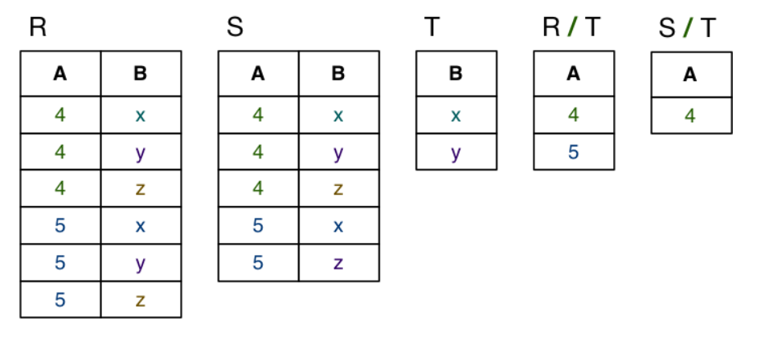
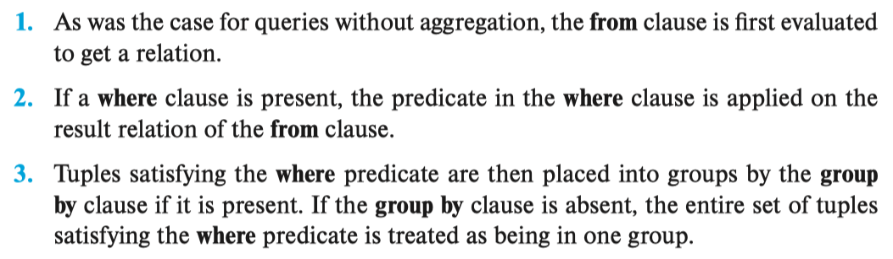

Database System Architecture


### Data Modelling

**Kinds of data models**

* Logical: abstract, for conceptual design, e.g., ER, ODL, UML
* Physical: record-based, for implementation, e.g., relational, SQL

**Design Ideas**

- start simple ... evolve design as problem better understood
- <u>identify objects (and their properties), then relationships</u>
- most designs involve kinds (classes) of people
- keywords in requirements suggest data/relationships
	(rule-of-thumb: nouns *→* data, verbs *→* relationships)
- don't confuse operations with relationships
	(operation: he **buys** a book; relationship: the book **is owned** by him)
- consider all possible data, not just what is available

#### ER Modelling

> Entity-Relationship Data Modelling

An ER diagram consists of:

- a collection of entity set definitions
- a collection of relationship set definitions
- attributes associated with entity and relationship sets
- connections between entity and relationship sets

##### Examples


##### Basic Notions

###### Entity Set

An entity set can be viewed as either:

- a set of entities with the same set of attributes (extensional)
- an abstract description of a class of entities (intensional)

###### Keys

* Key (superkey): any set of attributes whose set of values are distinct over entity set
    * natural (e.g., name+address+birthday) or artificial (e.g., SSN)
* Primary key: candidate key chosen by DB designer as the principle means of identifying tuple within a relation (Acct No, zID)
    * It should be chosen such that its attribute are never or rarely changed
* Candidate key: minimal superkey (no subset is a key)
* Foreign key: A set of attributes $A$ in relation $R_1$ is a foreign key for $R_2$ if

    - the attributes in $A$ correspond to the primary key of $R_2$
    - the value for $A$ in each tuple of $R_1$
        - either occurs as a primary key in $R_2$
        - or is entirely `NULL`
    - 一个列表中的一组Attribute是另外一个列表的Key
    - The relation $R_1$ is also called the referencing relation of the foreign-key constraint, and $R_2$ is called the referenced relation

Keys are indicated in ER diagrams by underlining

###### Relationship Sets

Relationship: an association among several entities

- e.g., Customer(9876)  is the owner of  Account(12345)

Relationship set: collection of relationships of the same type


Degree = # entities involved in relation (in ER model, *≥ 2*)

Cardinality = # associated entities on all sides of relation

Participation = must every entity be in the relationship?


Left to Right: 

* Left thin: may (0 or more)
* Left thick: must (1 or more)
* Right arrow: has relation with 1 B
* No right arrow: has relation with $\ge1$ B 

从左到右，只考虑左边线的粗细以及右边是否有箭头，从右到左同理

Example

1. L2R: Lecturer may teach one course; R2L: Courses must be taught by one or more lecturers
2. L2R: Lecturer must teach one or more courses; R2L: Courses must be taught by one or more lecturers

###### Weak Entity Sets

Weak entities

- exist only because of association with strong entities.
- <u>have no key of their own</u>; have a discriminator


###### Subclasses

A subclass of an entity set *A* is a set of entities:

- with all attributes of *A*, plus (usually) it own attributes
- that is involved in all of *A*'s relationships, plus its own

Properties of subclasses:

- overlapping or disjoint (can an entity be in multiple subclasses?)
- total or partial (does every entity have to also be in a subclass?)

Special case: entity has one subclass ("B is-a A" specialisation)

![[Diagram:Pics/er-rel/is-a.png]](Database.assets/is-a.png)


|            |                                   |
| ---------- | --------------------------------- |
| 加粗的线   | One or more A has relation with B |
| 未加粗的线 | 0 or more A has relation with B   |
| 无箭头     | A has relation with multiple B    |
| 箭头       | A has relation with only 1 B      |


##### Design with ER

ER model: simple, powerful set of data modelling tools

Some considerations in designing ER models:

- should an "object" be represented by an attribute or entity?
- is a "concept" best expressed as an entity or relationship?
- should we use *n*-way relationship or several 2-way relationships?
- is an "object" a strong or weak entity? (usually strong)
- are there subclasses/superclasses within the entities?

#### Relational Model

The relational data model describes the world as a collection of inter-connected relations (or tables). It used relations to model both entities and relationships.

Each **relation** has:

- a name  (unique within a given database)
- a set of attributes  (which can be viewed as column headings of a table)
- Each relation has a key (subset of attribute unique for each tuple)

Each **attribute** has:

- a name  (unique within a given relation)
- an associated domain  (set of allowed values: Integer, string)
    - Distinguished value **NULL** belongs to all domains
    - The domain need to be atomic, e.g. an set of phone number is not atomic, while a single phone number is

##### Relation

<u>Notions</u>

* Relation schema (outline): The logical design of a database (Type definition in a programming language)
* Tuple of R: an row in the table R
* Instance of R: a subset of R  (A set of some tuples), a snapshot of the data in the database


##### Integrity Constraints

To represent real-world problems, need to describe

- what values are/are not allowed
- what combinations of values are/are not allowed

Constraints are logical statements that do this:

- domain constraints: limit the set of values that attributes can take
- key constraints: identify attributes that uniquely identify tuples
- entity integrity constraints: require keys to be fully-defined (There cannot be NULL in the table)
- Referential integrity constraints: Require references to other tables to be valid (Something occur in one table must appear in another)

**Examples**

Domain constraints example:

- `Employee.age` attribute is typically defined as `integer`
- better modelled by adding extra constraint `(15<age<66)`
- Note: satisfies all domain constraints  (except entity integrity constraints apply)

Key constraints example:

- `Student(id, ...)` is guaranteed unique
- `Class(...,day,time,location,...)` is unique

Entity integrity example:

- `Class(...,Mon,2pm,Lyre,...)` is well-defined
- `Class(...,`**NULL**`,2pm,Lyre,...)` is not well-defined

###### Referential Integrity

A referential integrity constraint requires that the values appearing in specified attributes of any tuple in the referencing relation also appear in specified attributes of at least one tuple in the referenced relation.

**Remark**

In a foreign-key constraint, the referenced attribute(s) must be the primary key of the referenced relation. However, a referential-integrity constraint, relaxes the requirement that the referenced attributes form the primary key of the referenced relation.

In fact, foreign-key constraints are a special case of referential integrity constraints, where the referenced attributes form the primary key of the referenced relation. 


Foreign keys are critical in relational DBs; they provide ...

- the "glue" that links individual relations (tables)
- the way to assemble query answers from multiple tables
- the relational representation of ER relationships

```sql
CREATE TABLE TableName (
   attrName1 domain1 constraints1 ,
   attrName2 domain2 constraints2 ,
   ...
   PRIMARY KEY (attri,attrj,...),
   FOREIGN KEY (attrx,attry,...)
               REFERENCES
               OtherTable (attrm,attrn,...), ...
);
```

#### ER $\rightarrow$ Relational

A useful strategy for database design is to perform intial data modelling using ER and then transform it into a relational model. A formal mapping exists for ER to Relational model.

##### Mapping

Correspondences between relational and ER data models:

- attribute(ER) *≅* attribute(Rel), entity(ER) *≅* tuple(Rel)
- entity set(ER) *≅* relation(Rel), relationship(ER) *≅* relation(Rel)

Differences between relational and ER models:

- Rel uses relations to model entities *and* relationships
- Rel has no composite or multi-valued attributes (only atomic)
- Rel has no object-oriented notions (e.g. subclasses, inheritance)

Note that not all aspects of ER cab be represented exactly in a relational schema, some aspects of relational schemas (e.g. domains) do not appear in ER

##### Map weak entities


Such that each instance of contact is unique.

##### Map Binary Relations

###### N:M


In N:M, we need another table to glue the two tables.

###### 1:N


Since customers must hold joined one branch, we can has the branchNo inside customer table. 

###### 1:1


Both side has a 1:1 relation, however, you won't put both key in each others relation as it introduces redundancy. Since the L2R direction is total participation, hence we put the foreign key in to the manager.


##### Map n-way Relation

If multiple entities are involved:

- n:m generalises naturally to n:m :p:q
    - include foreign key for each participating entity
    - include any other attributes of the relationship
- other multiplicities (e.g. 1:n:m) 
    - need to be mapped the same as n:m :p:q
    - so not quite an accurate mapping of the ER

Some people advocate converting n-way relationships into:

- a new entity, and a set of *n* binary relationships

##### Map Composite Attributes


##### Map MVA

> Multi-valued Attributed


##### Map Subclass

Three different approaches to mapping subclasses to tables:

- ER style: each entity becomes a separate table,containing attributes of subclass + Foreign Key to superclass table, <u>least amount of redundancy</u>
- object-oriented: each entity becomes a separate table,inheriting all attributes from all superclasses
- single table with nulls: whole class hierarchy becomes one table,containing all attributes of all subclasses (null, if unused)

Which mapping is best depends on how data is to be used.

**ER Style**


**OO Style**


**Single Table Style**


# Query Language

## Overview

A query language is a language in which a user requests information from the database. These languages are usually on a level higher than that of a standard programming language. Query languages can be categorized as

* In an **imperative query language**, the user instructs the system to perform a specific sequence of operations on the database to compute the desired result; such languages usually have a notion of state variables, which are updated in the course of the computation. 
* In a **functional query language**, the computation is expressed as the evaluation of
    functions that may operate on data in the database or on the results of other functions; functions are side-effect free, and they do not update the program state.
* In a **declarative query language**, the user describes the desired information without giving a specific sequence of steps or function calls for obtaining that information; the desired information is typically described using some form of mathematical logic. It is the job of the database system to figure out how to obtain the desired information.

## Relation Algebra

Relational algebra is a functional query language that forms the theoretical basis of the SQL query language, it's concise and formal. Discussed in <u>Chapter 2.6</u> of the book.

### Operations

* Unary operation: Operate on one relation. Including select, project and rename
* Binary operations: Operate on paris of relations. Including union, Cartesian product and set difference

| Operations                 | Discription                                                  |
| -------------------------- | ------------------------------------------------------------ |
| Select $\sigma_\theta$     | Selects tuples that satisfy a predicate $\theta$.            |
| Project $\Pi_\theta$       | Produce a new relation with certian attributes left out, keep only attribute $\theta$. Removes duplicates. |
|                            |                                                              |
| Cartesian-Product $\times$ | Construct a new tuple out of each possible pair of tuples of the two relation. |
| Join                       | $r ⋈_θ s = σ_θ (r × s)$, Combine a selection $\theta$ and a Cartesian-Product |
| Set Operations             | Union, intersection, set-difference. Remove duplicates. union all gives bag semantics |
| Assignment                 | Assigning a an relational-algebra expression a temporary name. If it's no temporary, it is a modification. |
| Rename $\rho_x(E)$         | Rename the relation or the attributes to $x$. Can be used to rename a relation so that it can be referenced twice. |

**Additonal Operators**

* Aggregation
	* average, sum, min, max
* Natural Join: Requires equality over those attributes that appear in the schemas of both the left and right relations
* Project++
* Division

**Composing Operators**

In general, since the result of a relational-algebra operation is of the same type
(relation) as its inputs, relational-algebra operations can be composed together into a relational-algebra expression. Composing relational-algebra operations into relationalalgebra expressions is just like composing arithmetic operations (such as +, −, ∗,and ÷) into arithmetic expressions.

**Equivalent Queries**

There is often more than one way to write a query in relational algebra. 

Query optimizers in database systems typically look at what result an expression computes and find an efficient way of computing that result, rather than following the exact sequence of steps specified in the query. 

The algebraic structure of relational algebra makes it easy to find efficient but equivalent alternative expressions.

### 3311

<u>**Week 10 Tutorial Q7 gives many good questions**</u>

#### Notations

| Operations                    | 3311 Notation                                                |
| ----------------------------- | ------------------------------------------------------------ |
| Select $\sigma_\theta$        | Sel[$\theta$]\(Rel)                                          |
| Project $\Pi_\theta$          | Proj[$\theta$]\(Rel)                                         |
|                               |                                                              |
| Cartesian-Product $\times$    | Construct a new tuple out of each possible pair of tuples of the two relation. |
| Join  $r ⋈_θ s = σ_θ (r × s)$ | $r \text{ Join }[\theta] \space s$                           |
|                               |                                                              |
| Assignment                    | Assigning a an relational-algebra expression a temporary name. If it's no temporary, it is a modification. |
| Rename $\rho_x(E)$            | Rename[$S(b_1, b_2, b_3)$]$E$                                |
| Set Operations                | Union, intersection, set-difference                          |

| Joins                | Semantics                                                    |
| -------------------- | ------------------------------------------------------------ |
| Inner Join $r ⋈_θ s$ | r join s on $\theta$, without the $\theta$ makes it natural join (No duplicate attributes) |
| Outer Join $r ⟕_θ s$ | r left outer join s on $\theta$                              |
| Division $r / s$     |                                                              |

$t[AB]$: Extract attributes A and B from tuple $t$

**Division**

> Returns all tuples in T1 that matches all tuples in T2

- consider each subset of tuples in *R* that match on *t[R-S]* (The non-overlapping attributes)
- for this subset of tuples, take the *t[S]* values from each 以*t[R-S]*分组，选每个组的 *t[S]* values
- if this covers all tuples in *S*, then include *t[R-S]* in the result 如果这些value包含了所有S的tuple



<u>Example usage</u>

Usually used in question that contains "by every ..."


## SQL

The SQL (Structured Query Language) language has several parts:

* Data-definition language (DDL). The SQL DDL provides commands for defining relation schemas, deleting relations, and modifying relation schemas.
* Data-manipulation language (DML). The SQL DML provides the ability to query information from the database and to insert tuples into, delete tuples from, and modify tuples in the database.
* Integrity. The SQL DDL includes commands for specifying integrity constraints that the data stored in the database must satisfy. Updates that violate integrity constraints are disallowed.
* View definition. The SQL DDL includes commands for defining views.
* Transaction control. SQL includes commands for specifying the beginning and end points of transactions.
* Embedded SQL and dynamic SQL. Embedded and dynamic SQL define how SQL statements can be embedded within general-purpose programming languages, such as C, C++, and Java.
* Authorization. The SQL DDL includes commands for specifying access rights to relations and views.

### Data Definition

The set of relations in a database are specified using a data-definition language (DDL). The SQL DDL allows specification of not only a set of relations, but also information about each relation, including:

* The schema for each relation.

* The types of values associated with each attribute.
* The integrity constraints.
* The set of indices to be maintained for each relation.
* The security and authorization information for each relation.
* The physical storage structure of each relation on disk.

##### Types


Each type may include **null**.

**char** stores fixed-length strings (Padding appears) while **varchar** don't, comparision between the two is undefined, varchar is more recommended to be used.

##### Schema

```sql
create table department (
    dept name varchar (20), 	-- Attribute + Domain
    building varchar (15), 
    budget numeric (12,2), 
    
    primary key (dept name)		-- ⟨integrity-constraint⟩
);
```

Contraints support:

* primary key: unique && not null
* foreign key: `foreign key (degree) references Degrees(d_id)`
* not null

### Data Manipulation

```sql
drop table r;		-- Delete schema and all tuples
delete from r;		-- Retain schema, deletes all tuples

-- Add/ Delete attribute
alter table r add A D;
alter table r drop A;
```

##### Queries

The basic structure of an SQL query consists of three clauses: **select**, **from**, and **where**.

A query takes as its input the relations listed in the **from** clause, operates on them as specified in the **where** and **select** clauses, and then produces a relation as the result.

* The select clause is used to list the attributes desired in the result of a query.
	* We can do `select all` & `select distinct`
* The from clause is a list of the relations to be accessed in the evaluation of the query.
	* It defines a Cartesian product of the relations listed
* The where clause is a predicate involving attributes of the relation in the from clause.

###### where clause predicate

**between/ not between**

```sql
where salary between 90000 and 100000;
```

**Compare tuples**

$(a_1 , a_2 ) \le (b_1 , b_2 )$ is true if $a_1 \le b_1$ AND $a_2 \le b_2$

the two tuples are equal if all their attributes are equal

So instead of 

```sql
where instructor.ID= teaches.ID and dept name = 'Biology';
```

we can do 

```sql
where (instructor.ID, dept name) = (teaches.ID, 'Biology');
```

##### Additional Basic Operations

###### Rename

*old-name* **as** *new-name*

<u>Use case</u>

1. Rename attribute of resultant relation

	```sql
	select name as instructor name, course id 
	from instructor, teaches 
	where instructor.ID= teaches.ID;
	```

2. For simplicity

	```sql
	select T.name, S.course id 
	from instructor as T, teaches as S 
	where T.ID= S.ID;
	```

3. When we wish to compare tuples in the same relation

	```sql
	select distinct T.name 
	from instructor as T, instructor as S 
	where T.salary > S.salary and S.dept name = 'Biology';
	```

	Observe that we could not use the notation instructor.salary, since it would not be clear which reference to instructor is intended.

###### String Operation

`'...'` are constant strings, equality operations on string is case sensitive.

SQL also permits a variety of functions on character strings, such as concatenating (using “||”), extracting substrings, finding the length of strings, converting strings to uppercase (using the function upper(s) where s is a string) and lowercase (using the function lower(s)), removing spaces at the end of the string (using trim(s)), and so on.

**Pattern Matching**

Pattern matching can be performed on strings using the operator **like**. 

* `%` matches substring, `-` matches any single character. `\` is used as escape character
* Patterns are case sensitive

Mismatches can be searched using **not like** operator.

Some SQL implementations, notably PostgreSQL, offer a **similar to** operation that provides more powerful pattern matching than the **like** operation; the syntax for specifying patterns is similar to that used in Unix regular expressions.

###### *

Asterisk can be used in **select** clause to denote "all attribute"

`select instructor.*` indicates that all attributes of instructor are to be selected

`select *` indicates that all attributes

###### Ordering of Tuples

By default, the order by clause lists items in ascending order. To specify the sort order, we may specify **desc** for descending order or **asc** for ascending order.

```sql
select * 
from instructor 
order by salary desc, name asc;
```

If several instructors have the same salary, we order them in ascending order by name.

##### Set Operations

```sql
(<relation>) union (<relation>)		-- remove duplicates
(<relation>) union all (<relation>) -- retain duplicates

-- same goes for interset, except (set difference)
```

Set difference operator: **except**

##### Null

* The result of an arithmetic expression is null if any of the input values is null.
* To test for null, use `is null`, `is not null`
* To test for whether the result of a comparison is unknown, use `is unknown`, `is not unknown`

##### Aggregate

Aggregate functions are functions that take a collection (a set or multiset) of values as input and return a single value. SQL offers five standard built-in aggregate functions (avg, min, max, sum, count).

The result of these query is a relation with a single attribute containing a single tuple.

###### Basic Aggregation

```sql
select avg (salary) as avg salary	-- Retain duplicates
select count (distinct ID)
select count (*)
```

###### Aggregation with Grouping

The attributes given in the **group by** clause are used to form groups. Tuples with the same value on all attributes in the **group by** clause are placed in one group.

```sql
-- the number of instructors in each department who teach a course in the Spring 2018 semester
select dept_name, count (distinct ID) as instr_count 
from instructor, teaches 
where instructor.ID= teaches.ID and semester = 'Spring' and year = 2018 
group by dept_name;
```

When an SQL query uses grouping, the only attributes that appear in the **select** statement without being aggregated are those that are present in the **group by** clause. (Like dept_name above). Since in the aggreagated output, there should be only one tuple for each group, if a group has more item being aggregated, we can't figure out what value of that attribute to choose.

###### The having clause

**having** clause state a condition that applied to groups rather then to tuples.

```sql
select dept name, avg (salary) as avg salary 
from instructor 
group by dept name 
having avg (salary) > 42000;
```

As was the case for the select clause, any attribute that is present in the having clause without being aggregated must appear in the group by clause, otherwise the query is erroneous.

**Sequence of evaluation**




###### Aggregation with null

* Except for count, all others ignore null
* As some are ignored, a collection of value can be empty. The count of an empty collection is defined to be 0, and all other aggregate operations return null when applied on an empty collection.

##### Nested Subqueries

| Operation        | Syntax          |
| ---------------- | --------------- |
| Set Membership   | **in, not in**  |
| Set Comparison   | **>all, >some** |
| Test if empty    | **exists**      |
| Test Duplication | **unique**      |

###### Correlated Subquery

A subquery that uses a correlation name from an outer query is called a correlated subquery. A relations name from the outer query can be used in a subquery in the where clause. 

```sql
SELECT employee_number, name
   FROM employees emp
   WHERE salary > (
     SELECT AVG(salary)
       FROM employees
       WHERE department = emp.department);
```

The inner query will be executed for each of the employee (Every row of the employees table)

###### Set Membership

SQL allows testing tuples for membership in a relation using **in** and **not in**. This is more natural then the use of set difference (**except**). 

###### Set Comparison

all, some

###### Test if a relation is empty

The **exists** construct returns the value true if the argument subquery is nonempty (has at least one tuple).

###### Test Duplication

The **unique** construct returns the value true if the argument subquery contains no duplicate tuples.

```sql
select T.course id 
from course as T 
where unique (
    select R.course id 
    from section as R 
    where T.course id= R.course id 
    and R.year = 2017
);
```

###### Subqueries in from

###### with

The with clause provides a way of defining a temporary relation whose definition is available only to the query in which the with clause occurs.

```sql
with dept_total (dept_name, value) as 
	(select dept name, sum(salary) from instructor group by dept name), 
	
	dept_total_avg(value) as (select avg(value) from dept total) 
	
select dept_name 
from dept_total, dept_total_avg 
where dept total.value > dept total avg.value;
```

###### Scalar subqueries

SQL allows subqueries to occur wherever an expression returning a value is permit.

```sql
select dept name, 
    (select count(*) 
     from instructor 
     where department.dept name = instructor.dept name)	-- Corelation Subquery
    as num instructors 

from department;
```

##### Data Modification 

###### delete

```sql
delete from r 	-- Delete from an relation
where P;		-- where predicate P is met
```

A delete command operate on only 1 relation and can only delete tuple (not a value of attribute). It can fail is tuples are referenced by other tables

Delete Behaviors:

- **reject** the deletion (PostgreSQL/Oracle default behaviour)
- **set-NULL** the foreign key attributes in `Account` records
- delete on **cascade**: the deletion will remove all associated tuple in other relations
- delete on default: Set the tuple in other relation that reference the deleted one to default value

###### insert

```sql
-- Same order as the attributes in the table
insert into course 
	values ('CS-437', 'Database Systems', 'Comp. Sci.', 4);

-- Specify attributes
insert into course (title, course id, credits, dept name) 
	values ('Database Systems', 'CS-437', 4, 'Comp. Sci.');
```

We can insert tuples from the result of a query to an relation, there can be null

```sql
insert into instructor
	select ID, name, dept name, 18000 
	from student 
	where dept name = 'Music' and tot_cred > 144;
```

###### update

```sql
update instructor 
set salary = salary * 1.05 
where salary < 70000;
```

The order of update is important, If we changed the order of the two statements, an instructor with a salary just under $100,000 would receive a raise of over 8 percent.

```sql
update instructor 
set salary = salary * 1.03 
where salary > 100000;

update instructor 
set salary = salary * 1.05 
where salary <= 100000;
```

We can use a case construct to perform both updates together without worrying the order.

```sql
update instructor 
set salary = case
				when salary <= 100000 then salary * 1.05 
				else salary * 1.03 
            end
```

### Adv DML

#### Join Expression

Join operation can express some queries that are difficult to do with only the Cartesian product.

- natural join matches tuples via equality on common attributes
- equijoin matches tuples via equality on specified attributes
- theta-join matches tuples via a boolean expression
- outer join like theta-join, but includes non-matching tuples

###### Natural Join

This operation concatenate tuples for two relation that have the same value on those attributes that appear in both schemas.

* Notice that we do not repeat those attributes that appear in the schemas of both relations; rather they appear only once. 
* Notice also the order in which the attributes are listed: 
	1. attributes common to both relations
	2. attributes unique to the schema of the first relation
	3. attributes unique to the schema of the second relation.

```sql
-- The two queries have the same result
select name, course id 
from student, takes 
where student.ID = takes.ID;

select name, course id 
from student natural join takes;

-- This is also valid
from r 1 natural join r 2 natural join ... natural join r m
```

`join ... using`

Unlike natural join which selcted the all the matching attributes automatically, we can use `join ... using` to specify the attribute we want to look at.

```sql
select name, title 
from (student natural join takes) join course using (course id);
```

###### Join with an condition

```sql
SELECT Attributes
FROM   R1
       JOIN R2 ON (JoinCondition1)
       JOIN R3 ON (JoinCondition2)
       ...
WHERE  Condition
```

The one difference with `join ... using`is that the result of `join ... on` has the attribute compared listed twice, in the join result, once for student and once for takes. 

###### Outer Join

The above inner join operation only include tuples where there's are appropriate value in both table. But sometimes we want to preserve tuple even if a value from one relation doesn't have a correspondence in another relation. For example, in a list of `student join course_taken` even if a student haven't taken any course, we would still like him to be in the list with course_taken set to null.

There are three forms of outer join:

* Left outer join: Preserve tuples to the left of the operator
* Right outer join
* Full outer join

```sql
natural left outer join
natural right outer join
natural full outer join
```

**Use on clause with outer joins**

```sql
from student left outer join takes on student.ID = takes.ID;
```

For tuples in relation student, if <student.ID = takes.ID> is False, they will be null-padded and appear in the resultant relation.

```sql
from student left outer join takes on true;
where student.ID = takes.ID;
```

Since every tuple in student satisfy the condition *true*, this actually generate the Cartesian Product of the two relations, and (70557, Snow, Physics, 0, null, null, null, null, null, null ) that will appear in the upper query won't appear in this one as "snow" who didn't appear in <u>take</u> relation is not null padded and will be eliminated by the **where** clause.

In essense, **on** is evaluate when performing the join operation, **where** is applied on the result relation of the **join**

#### View 

SQL allows a "virtual relation" to be defined by a query. The virtual relation is not precomputed and stored but instead is computed by executing the query whenever the virtual relation is used.

###### View Definition

```sql
create view v as <query expression>;
```

Consider a clerk who needs to access all data in the instructor relation, except salary. The clerk should not be authorized to access the instructor relation. Instead, a view relation faculty can be made available to the clerk.

```sql
create view faculty as
	select ID, name, dept name 
	from instructor;
```

Views differ from the **with** statement in that views, once created, remain available until explicitly dropped. The named subquery defined by **with** is local to the query in which it is defined.

Virtual relation defined by view can be used at any place an actual relation is used.

**Specify Attribute names**

```sql
create view departments_total_salary(dept_name, total_salary) as 
	select dept name, sum (salary) 
	from instructor 
	group by dept name;
```

###### Materialized Views

Certain database systems allow view relations to be stored, but they make sure that, if the actual relations used in the view definition change, the view is kept up-to-date. Such views are called materialized views.

* Precompute the view can speed up queries. Useful if computing is costly
* Useful if updates is infrequent

SQL does not define a standard way of specifying that a view is materialized, but many database systems provide their own SQL extensions for this task.

###### Update a View

Modification to a view must be reflected on the actual relation which can be problematic. So in general modification are generally not permitted unless certian conditions are satisfied.

* The **from** clause has only one database relation.
* The **select** clause contains only attribute names of the relation and does not have any expressions, aggregates, or **distinct** specification.
* Any attribute not listed in the **select** clause can be set to null.
* The query does not have a **group by** or **having** clause.

#### Strings

- `'...'` are constant strings, e.g. `'a'`, `'abc123'`, `'John''s bag'`
- `"..."` allow non-alpha chars in identifiers and make id's case-sensitive

In the standard, all non-quoted identifiers map to all upper-case

- e.g. `BankBranches` = `bankbranches` are treated as `BANKBRANCHES`

In PostgreSQL, all non-quoted identifiers map to all lower-case

- e.g. `BankBranches` = `BANKBRANCHES` are treated as `bankbranches`

In all standards-adhering DBMSs, different quoted identifiers are different

- `"BankBranches"` ≠ `"bankbranches"` ≠ `"BANKBRANCHES"`

#### Assorted

Comments: everything after **`--`** *is a comment*

Identifiers: alphanumeric (a la C), but also `"An Identifier"`

Reserved words: many e.g. `CREATE`, `SELECT`, `TABLE`, ...

Reserved words cannot be used identifiers unless quoted e.g `"table"`

Strings: e.g. `'a string'`,  `'don''t ask'`,  but no `'\n'`  (use `e'\n'`)

Numbers: like C, e.g. `1`,  `-5`,  `3.14159`,  ...

Types:  `integer`,  `float`,  `char(n)` fixed-length,  `varchar(n)` variable-length ,  `date`, ...

* char padded character to minimum of 4, varchar doesn't do padding
* In both cases, we need to specify a maximum string length. Any `char` values that are shorter than the maximum length are blank padded. Any `varchar` values that are shorter than the specified length are stroed exactly as written.

Operators:  `=`,  `<>`,  `<`,  `<=`,  `>`,  `>=`,  `AND`,  `OR`,  `NOT`, ...

Types/ Constants

```sql
-- domains: constrained version of existing type
CREATE DOMAIN Name AS Type CHECK ( Constraint )

-- tuple types: defined for each table
CREATE TYPE Name AS ( AttrName AttrType, ... )

-- enumerated type: specify elements and ordering
CREATE TYPE Name AS ENUM ( 'Label', ... )
```

**Examples**

```sql
-- positive integers
CREATE DOMAIN PosInt AS integer CHECK (value > 0);

-- a UNSW course code
CREATE DOMAIN CourseCode AS char(8)
    CHECK (value ~ '[A-Z]{4}[0-9]{4}');

-- a UNSW student/staff ID
CREATE DOMAIN ZID AS integer
    CHECK (value betweem 1000000 and 9999999);

-- standard UNSW grades (FL,PS,CR,DN,HD)
CREATE DOMAIN Grade AS char(2)
    CHECK (value in ('FL','PS','CR','DN','HD'));
-- or
CREATE TYPE Grade AS ENUM ('FL','PS','CR','DN','HD');
```

#### Data Definition

###### Schema

```sql
CREATE TABLE Students (
    -- attribute   domain   constraints
    zid     serial,
    family  varchar(40),
    given   varchar(40) NOT NULL,	
    d_o_b   date NOT NULL,
    gender  char(1) CHECK (gender in ('M','F')),
    degree  integer,
    PRIMARY KEY (zid),	-- UNIQUE && NOT NULL
    FOREIGN KEY (degree) REFERENCES Degrees(did)
);

CREATE TABLE Courses (
    cid    serial,
    code   char(8) NOT NULL
                   CHECK (code ~ '[A-Z]{4}[0-9]{4}'),
    term   char(4) NOT NULL
                   CHECK (term ~ '[0-9]{2}T[0-3]'),
    title  text UNIQUE NOT NULL,
    PRIMARY KEY (cid)
);

DROP TABLE TableName	-- Remove a table
```

###### Default

```sql
CREATE TABLE Accounts (
    acctNo  char(5) PRIMARY KEY,
    branch  varchar(30) REFERENCES Branches(name)
                        DEFAULT 'Central',
    owner   integer REFERENCES Customers(custID),
    balance float DEFAULT 0.0
);

INSERT INTO Accounts(acctNo,owner) VALUES ('A-456',645342)
-- produces the tuple
Accounts('A-456', 'Central', 645342, 0.0)
```

#### Integrity Constrain

##### Check Clause

<u>null</u>

If **check** is evalute to **unknown**, this techinically doesn't violate, as **check** clause is satisfied if it's not false.

So if null is not desired, a separate **not null** should be specified.

##### Referential integrity

* When an action violate the referenced integrity,  other than rejecting, we can let the system take steps to change the tuple in other table to maintain the constrain

	```sql
	foreign key (dept name) references department 
		on delete cascade 
		on update cascade,
	```

* Attribute of foreign key can be **null** is there's no **not null** constrain

##### Naming constraints


This will name the constrain. And we can drop it later by


##### Assertion

Even though check can have subquery to express more complicated constrain, but it can be costly as it's not powerful enough.

An **assertion** is a predicate expressing a condition that we wish the database always to satisfy.


The syntax is:

> **create assertion** \<assertion-name> **check** \<predicate>;

The predicate usually checks for **not exist** on a query.


Currently, none of the widely used database systems supports either subqueries in the check clause predicate or the create assertion construct. However, equivalent functionality can be implemented using triggers.

### Advanced SQL

Shortcoming of declarative query language

* Not all query can be expressed in SQL
* Non-declarative actions can not be done.
    * Printing a report, interact with user.

#### Procedure & Function

SQL allows the definition of functions, procedures, and methods. They can be define by

* procedural component of SQL
* external programming language such as Java, C, or C++.

Types of functions

* Table function: Function that return a table can be thought of as parameterized views.

SQL permits procedure/ function with the same name but different signature.

##### Syntax


**for** loop can bind r to tuples of a table

**leave** exit the loop

**iterate** skips remaining statement and go to the next iteration

<u>Example</u>


```sql
create or replace
	funcName(type_arg1, type_arg2, ...)	-- Accessed as $1, $2
	returns [type_return]	-- To return a table: setof [row_type]
AS $$
    SQL statement;
$$ language sql;

create type [type_return] as (name text, addr text);
```

##### External Language Routines


#### PLpgSQL Function

> **P**rocedural **L**anguage extensions to **P**ost**g**re**SQL**

Procedures does not return a view while function does

##### Function Declaration

```sql
-- Usage: select funName()
CREATE OR REPLACE function
   funcName(param1 type, param2 type, ....)
   RETURNS rettype	-- void if no return value
AS $$
DECLARE
   variable_name type
BEGIN
   code for function
END;
$$ LANGUAGE plpgsql;
```

##### Date Type

* Standard SQL type
* User-defined type
* `RECORD`: The type is bind to the type of the first assigned value 
* Type the same as a scheme (A tuple) `[Table_name]%ROWTYPE`
* Type of existin variable (e.g. `Branches.location%TYPE`, type of the location attribute)

##### Control Structure

```sql
-- Assignment: Capture result of an query
var := expr
select value into var	-- assignment

SELECT Exp1,Exp2,...,Expn
INTO   Var1,Var2,...,Varn
FROM   TableList
WHERE  Condition

emp    Employees%ROWTYPE;
select * into emp	-- Table type

-- If	
IF Cond1 THEN S1
ELSIF Cond2 THEN S2 ...
ELSE S 
END IF;

-- Iteration
LOOP ...; END LOOP

WHILE ... 
LOOP
...;
END LOOP

FOR rec_var IN Query
FOR int_var IN lo..hi 	-- Inclusive
LOOP
END LOOP;

-- Return
RETURN NEXT expression;
RETURN QUERY query;

-- Capture the return value of an insertion (e.g. the generated serial primary key)
insert into Table(...) values ...
returning [attribute_name] into [variable_name]
```

If the select returns value of

* No result, the value get assigned is NULL
* Multiple result: Get bind to the first one

**Existence of result**

To test for the existence of return result, we use the special variable `FOUND`

* Local to each function, false at the start and become true if 

    * select find at least one tuple
    * insert/ delete/ update affects at least one tuple

    ```sql
    select a into b from R where ...
    if (not found) then
    ```

**Note**: If the select clause contains `count` which at least return 0 for null, the `FOUND` variable will be set to True

##### **Return setof values**

When a PLpgSQL function is declared to return `setof [type]`.

* `return` with no argument indicate the end of a function
* `return next [expression]` and `return query [query]`: Append rows to the function's result set, but not actually exit the function. They will be return as a whole after the function exit

##### Get value of tuple

```sql
insert into T(id,a,b,c) values (default,2,3,'red')
returning id,c into newid,colour;
```

Useful for recording id values generated for `serial` PKs

##### Debug Output

```
raise notice 'x+1 = %, y = %, z = %', x+1, y, z;
```

**raise notice** display info from a function

##### Inline query

```sql
execute '[String]'
execute 'select * from ' || quote_ident($1);	-- quote_ident: correct quote an identifier
-- quote_literal: preserve the the case for literal
```

**execute** takes a string and execute it as a SQL query. Allow parameterized query.

Howevery, **select into** can not be used inside the string, but need to be outside

```sql
declare x int; y int; z text;
execute 'select a,b,c from R where id='||n  into x,y,z;
```

##### Exeptions Handling

```sql
begin
	[function body]
exception
	when [exception 0] or [excpetion 1] then
		...
	when [exception 2] then
		...
end;
```

##### Raise Exception

```sql
raise exception 'Fatal: value was %',value;
```

##### Run Function

```sql
select functionname(arguments);
```

##### Remark

* No I/O (Print)
* No syntax check when loading in to DB
* Function are defined as string
* Parameter and variable names need to be different
* The select clause need to load **into** some variable, otherwise there will be warning
* All query need to end with `;`

#### PLpgSQL Triggers

##### Behavior

* Execute an action **before**, **after**, **instead of ** the triggering event
* refer to both **old** and **new** values of updated tuples
* limit updates to a particular set of attributes
* for **each** modified tuple, **once for all** modified tuples

##### Syntax

CREATE TRIGGER TriggerName
{AFTER|BEFORE}  Event1 [OR Event2 ...]
ON TableName
[ WHEN ( Condition ) ]
FOR EACH {ROW|STATEMENT}
EXECUTE PROCEDURE FunctionName(args...);

**create function** *function_name* **returns trigger** 


<u>Use of new and old</u>

* a `BEFORE` function must contain one of: `return old` or `return new` depending on which version is used
* `for each statement` only executes once for any given operation. `new, old` is undefined in this case
* If an exception is raised in trigger function, no changes occur


![[Diagram:Pics/dbms/trigger-seq.png]](Database.assets/trigger-seq.png)

#### Triggers

> Specifies actions that are to be carried out automatically on certian events

##### Purpose

* Check constraints
* Maintaing summary data
* Perform multi-table updates

##### Syntax

>  **create trigger** *trigger_name* **{after | before}** *event1* [OR Event 2]  
>
> [**for each row**]
>
> **on** *table_name*
>
> [**when** (*condition*)]
>
> *procedural/ SQL code*

##### Visibility of Data changes

whether or not the data change is visible

|                 | before | After |
| --------------- | ------ | ----- |
| row level       | N      | Y     |
| statement level | N      | Y     |

##### Examples

###### Rows


* Tiggers can be actived **before** or **after** an event. 
* **referencing old row as** created a variable storing the old value of an updated/ deleted row
* **referencing new row as** can be used with `updates`, `insert`
* **for each row** iterate over each row
* **after update of ** *table* **on** *attribute* monitors an update to a certain attributes

###### Statement

Instead of actions for each affected row, they can be performed on the entire SQL statement. To do so, we use **for each statement**, **referencing old table as** can be used to refer to temporary tables (Transition Table) containing all affected tows.

Transition tables cannot be used with **before** triggers, only with **after**.

In an **after** trigger, the original table name is the same as **new_table** both refer to the updated table. Even in an after trigger, the changes haven't been committed yet, we can still revert the change.

#### Recursive Queries

#### Advanced Aggregation

##### Partition By

```sql
SELECT city, date, temperature
       min(temperature) OVER (PARTITION BY city) as lowest,
       max(temperature) OVER (PARTITION BY city) as highest
FROM   Weather;
```

Firstly, the tuples are group by the city. Next the max, min temp for that city will be computed and appended to each tuple in that group (Note that unlike `group by`, each partition can have more than 1 tuple)

### ER to SQL

Differences between SQL and ER models:

- SQL uses tables to model entities *and* relationships
- SQL has no composite or multi-valued attributes (only atomic)
- SQL has no object-oriented notions (e.g. subclasses, inheritance)

Convensions

- attributes in entities are given the same name in ER and SQL
- attributes in relationships are given the same name in ER and SQL
- ER key attributes are defined using `primary key`
- text-based attributes are defined with type `text`, unless there is a size which is obvious from the context
- attribute domains can be PostgreSQL-specific types where useful
- foreign keys within entity tables are named after the relationship
- foreign keys in relationship tables are named `*table*_id`

##### Strong Entities

![[Diagram:Pics/er-sql/strongent.png]](Database.assets/strongent.png)

##### Weak Entities


The discriminator is named after the primary key <u>SSN</u>.

##### Relationships

###### N:M


```sql
create table Customers (
    custNo  serial primary key,
    name    text not null,
    address text  -- don't need to know customer's address
);
create table Accounts (
    acctNo   char(5) check (acctNo ~ '[A-Z]-[0-9]{3}'),
    title    text not null,    -- acctNos are like 'A-123'
    balance  float default 0.0,
    primary key (acctNo)
);
create table Owns (
    customer_id integer references Customers(custNo),
    account_id  char(5) references Accounts(acctNo),
    last_accessed timestamp,
    primary key (customer_id, account_id)
);
```

###### 1:N


```
create table Branches (
    branchNo serial primary key,
    address  text not null,
    assets   currency
);
create table Customers (
    custNo  serial primary key,
    name    text not null,
    address text,
    hasHome integer not null, -- total participation
    joined  date not null,
    foreign key (hasHome) references Branches(branchNo)
);
```

`hasHome` implements the 1:n relationship;  `not null` implements total participation

###### 1:1


```
create table Branches (
    branchNo serial primary key,
    address  text not null,
    assets   currency          -- a new branch
);                             --    may have no accounts
create table Managers (
    empNo    serial primary key,
    name     text not null,
    salary   currency not null, -- when first employed, 
                                --    must have a salary
    manages  integer not null,  -- total participation
    foreign key (manages) references Branches(branchNo)
);
```

If both entities have total participation, cannot express this in SQL
except by putting a (redundant)  `not null` foreign key in one table

##### n-way relationships


```
create table Customers (
    custNo   serial primary key, ...
);
create table Accounts (
    acctNo   char(5) ... primary key, ...
);
create table ATMs (
    atmID    serial primary key,
    cash     currency check (cash >= 0),
    location text not null
);
create table Withdrawal (
    customer_id  integer references Customers(custNo),
    account_id   char(5) references Accounts(acctNo),
    atm_id       integer references ATMs(atmID),
    amount       currency not null,
    when         timestamp default now(),
    primary key  (customer_id,account_id,atm_id)
);
```

##### Composite Attributes

```sql
-- Version 1: concatenated
create table People (
    ssn     integer primary key,
    name    text not null,
    address text not null -- address  =  (number::text||' '||street||', '||suburb||' '||pcode)
);

-- Version 2: flattened
create table People (
    ssn     integer primary key,
    given   text not null,
    family  text,
    number  integer not null,
    street  text not null,
    suburb  text not null,
    pcode   char(4) not null check (pcode ~ '[0-9]{4}')
);
```

Searching:  `suburb = 'Coogee'` vs  `address like '%Coogee%'` 

##### Multi-valued attributes

```sql
create table People (
    ssn      integer primary key,
    name     text not null,
    birthday date
);

-- multiple table like this for multi-valued
create table FavColour (
    person_id integer references People(ssn),
    colour    text,
    primary key (person_id,colour)
);
```

##### Subclasses


```
create table Employees (
    empID   serial primary key,
    name    text not null,
    address text not null
);
create table Permanents (
    employee_id integer primary key,
    salary      currency not null,
    foreign key (employee_id) references Employees(empID)
);
create table Casuals (
    employee_id integer primary key,
    pay_rate    currency not null,
    foreign key (employee_id) references Employees(empID)
);
```

However this this does *not* capture

* participation
	* This structure doesn't enforce employees to appear in permanent/ casual table
* disjoint-ness constraints
	* An employee appear in both tables

Would need to program a solution to this e.g web-form that requires user to enter both Employee and subclass info

## PostgreSQL

#### Use on CSE

Need to run the command  `priv srvr` once before the above will work

```shell
ssh greig
source /srvr/YOU/env
pg start
psql myDatabase
# do stuff with your database ...
pg stop
exit
```

#### Shell CMDs

CMDs end in `;` . If not supplied, the line didn't finish

**Manage DB**

```shell
createdb dbname
dropdb dbname # remove all data associated with a DB

# dump database
pg_dump dbname > dumpfile

# Create database from file
psql dbname -f [dumpfile]

psql dbname
\i [dumpfile]
```

**Manage Tables**

```sql
CREATE TABLE  table ( Attributes+Constraints )
ALTER TABLE  table  TableSchemaChanges
DROP TABLE  table(s)  [ CASCADE ]
TRUNCATE TABLE  table(s)  [ CASCADE ]
```

**Manage Tuples**

```sql
INSERT INTO  table  ( Attrs ) VALUES  Tuple(s)
DELETE FROM  table  WHERE  condition
UPDATE  table  SET  AttrValueChanges  WHERE  condition
```

SQL commands make queries and updates while psql "meta-commands"

|      |                                                          |
| ---- | -------------------------------------------------------- |
| \d   | Describe the database, can supply the name of a relation |
| \q   | Quit                                                     |

```sql
-- Bulk insertion of data. If one fail constraint, none are inserted.
COPY Stuff(x,y,s) FROM stdin;
2       4       green
4       8       \N		-- null
8       \N      red
\.						-- End of input
```

### Customized Aggregate

The computation model of an aggregation function usually goes like

```python
state = initial_state
for item in table:
	state = state_update(state, item)	# Taking element from the table

return finalize(state) 	# Finalize the state
```

To define a new aggregate, we need to supply

* Base type: The type of input values
* State type: The type of intermedia states
* state mapping function: Take a state and a item and gives a new state
* \[optionally]: An initial state value (defaults to null)
* \[optionally]: A finalize function that operate on the final state

```sql
CREATE AGGREGATE AggName(BaseType) (
    sfunc     = UpdateStateFunction,
    stype     = StateType,
    initcond  = InitialValue,
    finalfunc = Finalize_Function,
    -- The order to select item (optional), for max/min aggregates
    sortop    = OrderingOperator		
);
```

**Example**

```sql
-- Concatenate an text attribute
create function
    join(s1 text, s2 text) returns text
as $$
begin
   if (s1 = '') then
      return s2;
   else
      return s1||','||s2;
   end if;
end;
$$ language plpgsql;

create aggregate concat(text) (
   stype    = text,
   initcond = '',
   sfunc    = join
);
```

## SQLite

Meta commands

```python
.quit
.schema		# List all tables

.headers on	# Also display the attributes name
```

# Relational DB Design

Lossless Decomposition: If replacing R with two relation schema R1 and R2 results in no loss of informations. Precisely, relation r contains the same set of tuple as the result of (No more and no less)

```sql
select * 
from (select R1 from r)		-- Select the R1 part from the table
	natural join				-- And join R1 and R2 part
	(select R2 from r)
```

## Normalization Theory

Normalize a database

* If a schema is not in normal form, we decompose it losslessly into smaller normal form schemas.

**Notation**

$R$: Relation schemas

$r(R)$: Schema $R$ for relation $r$

$t_1[\alpha]$:  The value of attribute $\alpha$ of tuple 1

### Functional Dependencies

To determine if a schema is normal, we use functional dependencies approach.

#### Basis

**Definition**

Superkey uniquely identitfies an entire tuple.

A function dependency expresses constraints that uniquely identify the valus of certain attributes

<u>Examples</u>


$t_1[\alpha]$ The value of attribute $\alpha$ of tuple 1

* Superkey can be defined using functional dependency. In other words, K is a superkey if, for every legal instance of r(R), for every pair of tuples $t_1$ and $t_2$ from the instance, whenever t 1 [K] = t 2 [K], it is also the case that t 1 [R] = t 2 [R] (i.e., t 1 = t 2 ).

**Functional dependencies allow us to express constraints that we cannot express with superkeys.**

$F^+$ denotes the closure of the set $F$, that is the set of all functional dependencies that can be inferred given set $F$.

#### Lossless Decomposition

> Decomposition can be shown to be lossless by functional dependencies


In other words, if R 1 ∩R 2 forms a superkey for either R 1 or R 2 , the decomposition of R is a lossless decomposition.


### Normal Forms

#### BCNF

> One of the more desirable normal forms that we can obtain is Boyce–Codd normal form (BCNF). It eliminates all redundancy that can be discovered based on functional dependencies.

**Definition**


A database design is in BCNF if each member of the set of relation schemas that constitutes the design is in BCNF.

**Rules for decomposing schemas that are not in BCNF**

Let R be a schema that is not in BCNF. Then there is at least one nontrivial functional dependency α → β such that α is not a superkey for R. We replace R in our design with two schemas:

* (α ∪ β): A和B
* (R − (β − α)): 只保留A的非B部分

When we decompose a schema that is not in BCNF, it may be that one or more of the resulting schemas are not in BCNF. In such cases, further decomposition is required, the eventual result of which is a set of BCNF schemas.

**Downside**

In some cases, decomposition into BCNF can prevent efficient testing of certain functional dependencies. As less relation, the less of the cost.

Because our design does not permit the enforcement of this functional dependency without a join, we say that our design is not **dependency preserving**. Because dependency preservation is usually considered desirable, we consider another normal form, weaker than BCNF, that will allow us to preserve dependencies. That normal form is called the third normal form.

#### Third Normal Form

> BCNF requires that all nontrivial dependencies be of the form α → β, where α is a superkey. Third normal form (3NF) relaxes this constraint slightly by allowing certain nontrivial functional dependencies whose left side is not a superkey.


If there's multiple candidates, being contained in any is fine

#### Comparison

Our goals of database design with functional dependencies are:

1. BCNF.

2. Losslessness.

3. Dependency preservation.

Since it is not always possible to satisfy all three, we may be forced to choose between BCNF and dependency preservation with 3NF.

**Caveat**

SQL does not provide a way of specifying functional dependencies except for declaring superkeys. It can be done via complicated and costly assertions.

Since functional dependencies are done in an costly way, even if we are not able to get a dependency-preserving BCNF decomposition, it is still preferable to opt for BCNF, since checking functional dependencies other than primary key constraints is difficult in SQL (If we cannot check it, why bother preserving it).

**However,** it's worth noting that using functional dependencies to decompose schemas may not be sufficient to avoid unnecessary repetition of information in certain cases AND combining into BCNF is not neccesarily a good idea. We cover the solution in Section 7.6 and Section 7.7.

### Functional Dependency Theory

#### Closure of Functional Dependencies

The closure of $F$ denoted by $F^+$ is the set of all functional dependencies that can be inferred given set $F$.

To find the closure of $F$, we can repeatedly apply **Armstrong's axioms** to $F$.


Lemma of Armstrong's axiom that are more useful in practise


#### Closure of Attribute Sets

To test if x -> y is derivable from F, computing $F^+$ and check if x -> y is contains is too <u>expensive</u>. Knowing such result can be used to tet is a set a is a superkey.

Hence instead, we can compute the attribute closre of x. The set of all attributes that can be funcionally determined by $a$ under a set $F$ of functional dependencies is the closure of $a$ under $F$, denoted by $a+$.


**Uses of the attribute closure algrithm**


#### Canonical Cover

**Definition of canonical cover**


**Test for extraneous attribute**


考虑右边的Attribute是否Extraneous：判断去掉的可否通过左边推出来，通过在F'中Compute左边的Closure看Ａ是否包含去掉的那个Attribute

考虑左边的Attribute是否Extraneous：判断F的Closure 是否包含新的去掉左边了的FD


**Compute canonical cover**


Since the algorithm permits a choice of any extraneous attribute, it is possible that there may be several possible canonical covers for a given F.

**Test for dependency preservation**


#### Minimal Cover

> A canonical cover is "allowed" to have more than one attribute on the right hand side. A minimal cover cannot. As an example, the canonical cover may be "A -> BC" where the minimal cover would be "A -> B, A -> C". That is the only difference.

Compute the canonical cover and then split the dependencies.

#### Candidate Key

To compute candidate key using function dependencies

1. All attributes that do not appear on the RHS will be in the candidate key
2. Add attributes whose closure includes all attributes

### Normalization

#### BCNF

##### Test


However the second one doesn't work when we test BCNF on an decomposed schema. We might need to use dependency in $F^+$ to prove that the decomposed one is not BCNF.


##### Decomposition


The decomposition generated is not only in BCNF but also lossless.

**Time complexities**

The BCNF decomposition algorithm takes time exponential to the size of the initial
schema, since the algorithm for checking whether a relation in the decomposition satisfies BCNF can take exponential time. There is an algorithm that can compute a BCNF decomposition in polynomial time; however, the algorithm may “overnormalize,” that is, decompose a relation unnecessarily.

### 3NF

#### Decomposition


It's important that the set of dependencies is canonical cover.

And there must be at least one schema with a **complete** candiate key.

# Query Processing

## Overview


One view of the DB engine is being a relational algebra virtual machine that includes machine code:


For each operations, there are various data structure and algorithms available.

In general

- `SELECT` clause becomes *projection*
- `WHERE` condition becomes *selection* or *join*
- `FROM` clause becomes *join*

##### Cost Estimation

The cost of evaluating a query is determined by

- the operations specified in the query execution plan
- size of relations  (database relations and temporary relations)
- access mechanisms  (indexing, hashing, sorting, join algorithms)
- size/number of main memory buffers  (and replacement strategy)

Analysis of costs involves *estimating*:

- the size of intermediate results
- then, based on this, cost of secondary storage accesses

Accessing data from disk is the dominant cost in query evaluation

##### Implementation of RA Operators

Sorting: Merge Sort (Quicksort requires the whole array to be in the memory which is not feasible for database)

Selection  (different techniques developed for different query types)

- sequential scan  (worst case, cost *O(N)*)
- index-based  (e.g. B-trees, cost *O(logN)*, tree nodes are pages)
- hash-based  (*O(1)* best case, only works for equality tests)

Join  (fast joins are critical to success of relational DBMSs)

- nested-loop join  (cost *O(N.M)*, buffering can reduce to *O(N+M)*)
- sort-merge join  (cost *O(NlogN+MlogM)*)
- hash-join  (best case cost *O(N+M.N/B)*, with *B* memory buffers)

# Query Optimization

## Choice of Evaluation Plan

### Example

```sql
-- Original Query 1: Subquery
select name from Employee
where  salary > 50000 and
       empid in (select empid from Worksin
                 where  dept = 'Sales')
             
-- Evaluation Plan 1
SalesEmps = (select empid from WorksIn where dept='Sales')	-- Cache the result
foreach e in Employee {
    if (e.empid in SalesEmps && e.salary > 50000)
        add e to result set
}

-- Original Query 2: where clause
select name
from   Employee join WorksIn using (empid)
where  Employee.salary > 5000 and
       WorksIn.dept = 'Sales'
       
-- Evaluation Plan 2
SalesEmps = (select * from WorksIn where dept='Sales')
-- Use a smaller table in table is more efficient
foreach e in (Employee join SalesEmps) {
    if (e.salary > 50000)
        add e to result set
}
```

### Tricks in query tuning

* Can `select distinct` be saved later? As is typically requires a sort

* Avoids joins on strings, use numbers

* Sometimes `or` prevents index from being used

	```sql
	select name from Employee where Dept=1 or Dept=2
	-- vs
	(select name from Employee where Dept=1)
	union
	(select name from Employee where Dept=2
	```

## Indexing

> A **database index** is a data structure that improves the speed of data retrieval operations on a [database table](https://en.wikipedia.org/wiki/Table_(database)) at the cost of additional writes and storage space to maintain the index data structure. Indexes are used to quickly locate data without having to search every row in a database table every time a database table is accessed. Indexes can be created using one or more [columns of a database table](https://en.wikipedia.org/wiki/Column_(database)), providing the basis for both rapid random [lookups](https://en.wikipedia.org/wiki/Lookup) and efficient access of ordered records.

Indexing creates a number table only containing

* Attributes that are use to indexing
* A pointer to the whole tuple

This means each row in the index table is smaller than the original table, hence less disk block access is required to iterate through the table, hence improving the efficiency.

```sql
CREATE INDEX name ON table (attr1, attr2, ...)	
-- attr can be an expression, e.g. upper(name)
```

**Choices of BST and Hash Index**

```sql
-- use hashing for (unique) attributes in equality tests
select * from Employee where id = 12345

-- use BST for attributes in range tests, e.g.
select * from Employee where age > 60
```

### Re-phrased

The purpose of repharsing is to help the optimiser to make use of indexes

```sql
-- fix by re-phrasing condition to (salary > 36500), as salary/365 is not the index
select name from Employee where salary/365 > 100

-- fix by using Employee join Dept on (e.dept=d.id). If one table is hashed, we only need to do a sequential iterate on another table
select name from Employee
where  dept in (select id from Dept where ...)
```

### Downsides

* Indices only speed up searching queries for those selected attributes. They have to be maintained for each INSERT/ DELETE/ UPDATE operations. If these updates are frequent, then the cost of indexing will be high

## Plpgsql Analysis

```sql
EXPLAIN [ANALYZE] Query
```

* Without `ANALYZE`, `EXPLAIN` shows plan with estimated costs.

* With `ANALYZE`, `EXPLAIN` executes query and prints real costs.

# Transaction

> Transaction refers to a collection of operations that form a single logical unit of work.
>
> It is important that either all actions of a transaction be executed completely, or, in case of some failure, partial effects of each incomplete transaction be undone. This property is called atomicity. 

Transaction processing describe techniques (Serializability) for managing atomicity of DB operations

> In a database system where multiple transactions are executing concurrently, if
> updates to shared data are not controlled, there is potential for transactions to see inconsistent intermediate states created by updates ofother transactions. Such a situation can result in erroneous updates to data stored in the database. Thus, database systems must provide mechanisms to isolate transactions from the effects ofother concurrently executing transactions. This property is called isolation.

Concurrency control describes several concurrency-control techniques that help implement the isolation property.

Recovery mechanisms describes the recovery management component of a database, which implements the atomicity and durability properties. Including techniques to restore information to a consistent state, even after major hardware shutdowns/failures.

## Transaction Concept

### ACID Properties

Transactions are an ideal way of structuring interaction with a database due to three properties:

* Atomicity: The intermedia state of an transaction cannot be observed, it's "all-or-none"
* Isolation: Concurrently executing statements will not interfere with each other
* Durability: A transation's completed actions should persist across crashes.
* Consistency. Execution ofa transaction in isolation (i.e., with no other transaction executing concurrently) preserves the consistency (Constraints of the database) of the database.

## A simple Transaction model

A way to avoid the problem ofconcurrently executing transactions is to execute transactions **serially**—that is, one after the other. However, concurrent execution oftransactions provides significant performance benefits.

## Serializability

> A **serializable schedule** is a **schedule** whose effect on any consistent database instance is guaranteed to be identical to that of some complete serial **schedule** over S.

### Conflict Serializable

We say that two operations **conflict** if they are operations by different transactions on the same data item, and at least one of these instructions is a write operation. 

**Definitions**

Conflict Equivalent: If a schedule S can be transformed into a schedule S′ by a series of swaps of nonconflicting instructions (Two successive read/ at least write on different data item).

We say that a schedule S is **conflict serializable** if it is conflict equivalent to a serial schedule

#### Determine Method

Book page 845, determined using a graph. If the precedence graph for S has a cycle, then the schedule S is not conflict seriaizable, vice versa. An edge exist from T1 to T2 if an operation of T1 on an variable Q happen before T2 operate on that variable. Draw all edges for all variables on the same graph.

因为Conflict Serializability是和Serial Schedule做对比，所以即使两个操作是在不同的Data Item，还是一个Safe Schedule，但是因为不能转换为Serial Schedule所以还是不Serializable.

### View Serialilzable

>  View serializability is not used in practice due to its high degree of computational complexity.

The idea is that if schedules read the same version of the shared object and write to the same final version of object, the schedule is "safe".

View Serializability is less conservative than conflict serializability (Some safe schedules that are view seriablizable are not conflict serializable). A schedule is "safe" if view equivalent to serial schedule.


In essense,

1. The same transation first read every data item
2. The same transaction last write to every data item
3. Transactions read the data item after written by the same transaction

# Python

## Psycopg2


```python
import psycopg2

try:
    # Get a connection class
    conn = psycopg2.connect("dbname='template1' user='dbuser' host='localhost' password='dbpass'")
    conn.close()
except:
    print "I am unable to connect to the database"
    
conn.commit()		# Commit pending transactions
conn.rollback()
```


```python
cur = conn.cursor()		# Create curosr instance

cur.execute("""SELECT datname from pg_database""")
cur = conn.cursor(cursor_factory=psycopg2.extras.DictCursor)	# Result in dict
# The cursor_factory argument can be used to create non-standard cursors.

cur.mogrify		# String format of the query
```

### **Retrieve data**

```python
rows = cur.fetchall()	# Result stored in list of tuples, [] if none
tup = cur.fetchone()	# Get the next tuple, None is EOF
tup = cur.fetchmany(nTuple)	# Get the next nTuples, [] if no result
```

### **Passing parameters to SQL queries**

```python
# %s for placeholder, sequence of value as the second argument
cur.execute("""
	INSERT INTO some_table (an_int, a_date, a_string)
    VALUES (%s, %s, %s);
    """,
  	(10, datetime.date(2005, 11, 18), "O'Reilly"))

# Repeat some value in the query by naming
cur.execute("""
	INSERT INTO some_table (an_int, a_date, another_date, a_string)
	VALUES (%(int)s, %(date)s, %(date)s, %(str)s);
	""",
    {'int': 10, 'str': "O'Reilly", 'date': datetime.date(2005, 11, 18)})
```

**Remarks**

* Second argument need to be a sequence even if there's only a single variable
    * `(a,)` instead of `(a)`
* Placeholder `%s` cannot be quoted
* Cannot be used to substitute table name

### Call plpgsql function

```python
# using a standard function call from SQL
cur.execute("select * from brewer(5)")
t = cur.fetchone()
print(t[0])

# using special callproc() method
# parameters supplied as a list of values/vars
cur.callproc("brewer",[5])
t = cur.fetchone()
print(t[0])
```

## sqlite3

```python
import sqlite3,sys

# Argument checking
if len(sys.argv) < 2:
  print("Usage:",sys.argv[0],"SUBSTRING-1 SUBSTRING-2 SUBSTRING-3 ...")
  sys.exit(1)

# Make connection
try:
    con = sqlite3.connect('a2.db')
except:
    raise Exception("I am unable to connect to the database")

# Create a cursor
cur = con.cursor()

# Close connection
con.close()
```

### Construct Query

```python
cur.execute('FROM ?', [arg1])
cur.execute('FROM :table1 JOIN :table1', {'table1': arg1})
```

String does not need to be quoted, sqlite will do this automatically.

### Retrive Data

```python
rows = cur.fetchall()	# Result stored in list of tuples, [] if none
tup = cur.fetchone()	# Get the next tuple, None is EOF
tup = cur.fetchmany(nTuple)	# Get the next nTuples, [] if no result
```

