## Basic Concept

**What is Machine Learning**

A computer program is said to learn from experience E with respect to some class of tasks T and performance measure P, if its performance at tasks in T, as measured by P, improves with experience E.

**Types of Learning**

Most ML problem can be divided in to supervised learning and unsupervised learning

* Supervised Learning: 给定的数据集中已经包含了正确的输出结果，希望机器能够根据这些数据集学习一个模型，使模型能够对任意的输入，对其对应的输出做出一个好的预测。
	* Regression: Map input to some continuous function. E.g. Predicting the price of a house
	* Classification: Map input in discrete categories. e.g. classify benign and malignant tumours
* Unsupervised Learning: 给定的数据集中不包含任何输出结果，希望机器通过算法自行分析而得出结果。
	* Clustering: Group unlabelled data into clusters
	* Non-clustering: Find structure in chaotic environment (Will transform the given data)

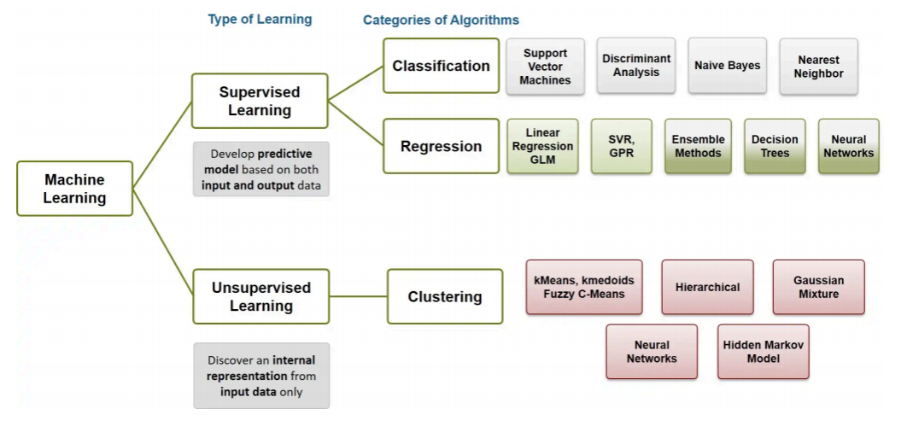

## Intro of DL

### Perceptron

Perceptron is an algorithm for supervised learning of binary classifiers. A binary classifier is a function which can decide whether or not an input, represented by a vector of numbers, belongs to some specific class.


#### **Common Activation Function**

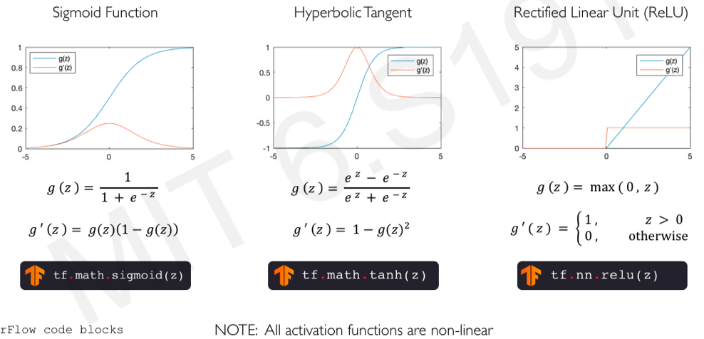

##### **tanh**

tanh is sigmoid being translated. Using tanh as an activation funciton gives activation between -1, 1 and a mean of 0. Comparing to the mean of 0.5 in sigmoid, smaller mean makes it easier for the next layer as it centres the data better.

It's almost always better than sigmoid except for binary classification purpose.

<u>Problem of tanh and sigmoid</u>

由求导法则，tanh函数的导函数为：$tanh’(z) = 1 - tanh^2(z)$

sigmoid函数的导函数则为：$\sigma’(z) = \sigma(z)(1 - \sigma(z))$

在z的值比较大时，这两个函数的导数也就是梯度值将会趋近于0，从而导致梯度下降的速度变得非常缓慢。

##### **ReLU (Rectified Linear Unit)**

When z > 0, the derivative is always 1 and it's 0 when z < 0. As the gradient is usually kept away from 0, the gradient descent process will be much faster.

**Reason for non-linearilty**

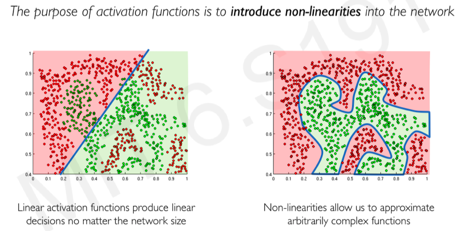

## Deep NN

### Structure

<u>Dense layer</u>

Dense layer refers to layers where all inputs are densely connected to all outputs

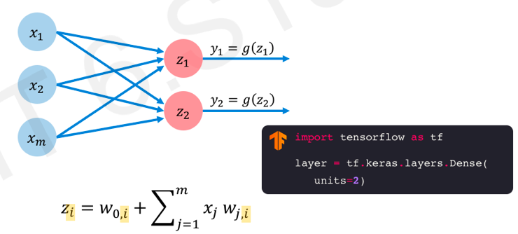

Note: Unlike w in a single perceptron network, we need to initialize the weights here randomly instead of all 0s. Otherwise the perceptrons will all be performing the same computation.

<u>Two layers neutral network</u> (with one hidden layer)

| 0           | 1            | 2            |
| ----------- | ------------ | ------------ |
| Input Layer | Hidden Layer | Output Layer |

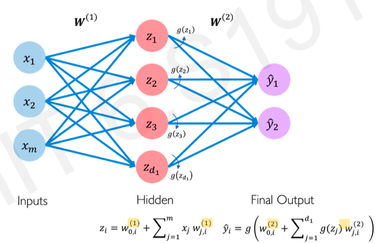

Each layer has a associated weight and bias.

| Notation    | Meaning                                                      |
| ----------- | ------------------------------------------------------------ |
| $a^{[i]}_j$ | The activation of j-th node in the i-th layer, activation is the output after applying the non-linearity. |
| $w^{[i]}_j$ | The weight of the j-th node in i-th layer                    |
| $b^{[i]}_j$ | The bias of the j-th node in i-th layer                      |
| $a^{[i]}$   | Stack all activation of the i-th layer together              |
| $z^{[i]}$   | Stack all z's in i-th layer together                         |

### Using DNN in practice

#### Loss Function

To train a network, we need to quantify the loss (error) between the network's prediction and the true answer from our training data.

##### Logistic Regression

> Classification function, discrete distribution

We cannot use the same cost function that we use for linear regression because the Logistic Function will cause the output to be wavy, causing many local optima. In other words, it will not be a convex function. So, we need the following cost function

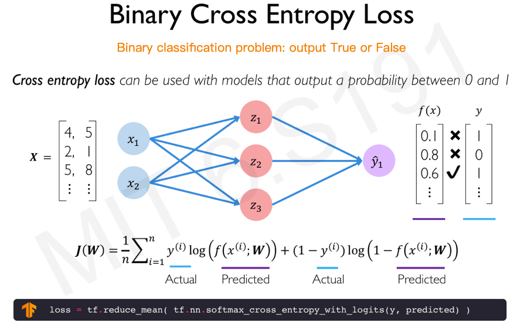

​	The loss function: Measure the error for a single training example

​	$\mathcal{L}(\hat{y}^{(i)}, y^{(i)}) = - y^{(i)}\log\hat{y}^{(i)} - (1-y^{(i)}) \log(1-\hat{y}^{(i)})$ 

​	The cost function: How well the network in doing on the whole data set, the average of the loss of every training sample

​	$\mathcal{J}(w,b) =  - \frac{1}{m} \sum_{i=1}^m y^{(i)}\log\hat{y}^{(i)} - (1-y^{(i)}) \log(1-\hat{y}^{(i)})$ 

###### Decision Boundry

The set of weight (Hypothesis + Parameters in ML) defines an decision boundry in logistic regression. Decision boundrys divide the input space into different categories.

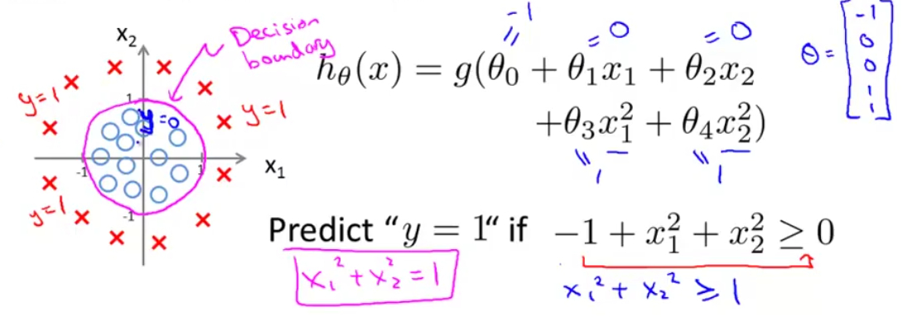

##### Multi-class Classification

> We map input to more than two discrete classes

###### One-vs-all

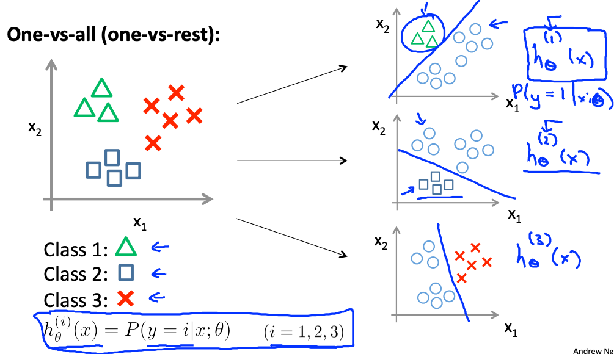

We can train a classifier for each class to predict the probability and then pick the class that has maximum pobability.

###### Neutral Network

Similar to the one-vs-all method, with neutral network we can easily do the same with a network having three output neuron. Each Neuron computes the probability of the input being one class as oppose to another.

##### Linear Regression

> Input are mapped to some continuous functions


We can make it $\frac{1}{2n}$ to make the differentiating process easier

This cost function is a convex function (Bowl-shape function that only has one global minimum)

#### Softmax

Softmax basically extends logistic regression into a multi-class world. It assigns probabilities to each class in a multi-class problem, the probabilities must add up to 1. And it's computed on $z^{[L]}$ as follows


Cost function: $J=y-\hat{y}$

#### Training

Now, we want to train our model to find the optimal set of weights that minimises the total loss over the entire test set.  W* represent that optimal set of weights.


##### Gradient Descent

**Finding the optimal set of weights**

1. Pick a random point (Start with a random weight and bias)
2. Compute its gradient with respect to all other axis using back propagation (Chain rule)
3. Update the weight in the opposite direction so that we decrease our total loss

往Gradient的反方向increment即可降低Loss

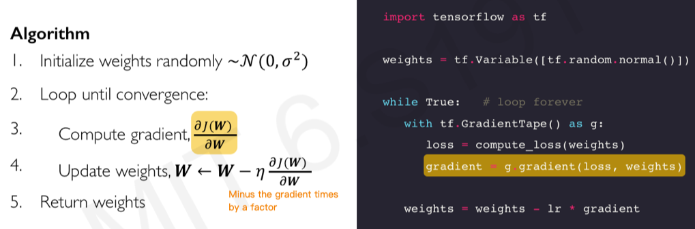

###### Back propagation

In order to compute the gradient for training, we need back propagation which is essentially train rule.

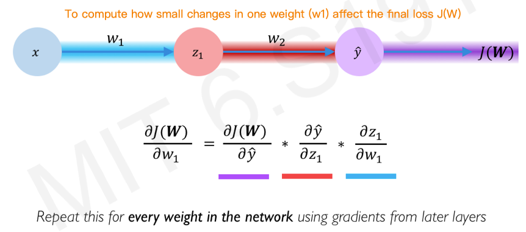

<u>Adjust parameters according to gradient descent</u>

$w_1=w_1-\eta\frac{\partial J(W)}{\partial w_1}$ 

$b=b-\eta\frac{\partial J(W)}{\partial b}$

|          | Input                                  | Output                                                       |
| -------- | -------------------------------------- | ------------------------------------------------------------ |
| Forward  | $a^{[l-1]}$                            | $a^{[l]}$                                                    |
| Backward | $\frac{\partial J }{\partial a^{[l]}}$ | $\frac{\partial J }{\partial a^{[l-1]}}$ $\frac{\partial J }{\partial w^{[l]}}$$\frac{\partial J }{\partial b^{[l]}}$ |

Backward

Suppose you have already calculated the derivative $dZ^{[l]} = \frac{\partial \mathcal{L} }{\partial Z^{[l]}}$. You want to get $(dW^{[l]}, db^{[l]}, dA^{[l-1]})$.

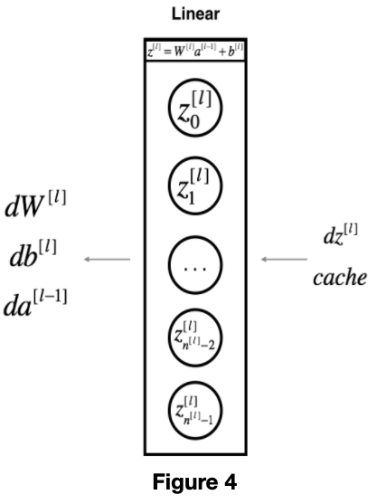

The three outputs $(dW^{[l]}, db^{[l]}, dA^{[l-1]})$ are computed using the input $dZ^{[l]}$.Here are the formulas you need:
$$ dW^{[l]} = \frac{\partial \mathcal{J} }{\partial W^{[l]}} = \frac{1}{m} dZ^{[l]} A^{[l-1] T} \tag{8}$$
$$ db^{[l]} = \frac{\partial \mathcal{J} }{\partial b^{[l]}} = \frac{1}{m} \sum_{i = 1}^{m} dZ^{[l](i)}\tag{9}$$
$$ dA^{[l-1]} = \frac{\partial \mathcal{L} }{\partial A^{[l-1]}} = W^{[l] T} dZ^{[l]} \tag{10}$$

##### Normal Equation

Except for gradient descent, for linear regression, we can also use normal equation to solve for the optimal set of weight and bias using the normal equation. 

Intuitively, normal equation uses calculus to find the set of the weights such that the derivative of the loss with respect to all weights are zero.

The formula is $w = (X^TX)^{-1}X^Ty$.

| Gradient Descent                           | Normal Equation                            |
| ------------------------------------------ | ------------------------------------------ |
| Need learning rate                         | No learning rate                           |
| Need multiple iterations                   | Result in one go                           |
| $O(kn^2)$, work well for large n (> 10000) | $O(n^3)$, expensive to compute for large n |

Even though for some matrix, $X^TX$ is not investable, cause by linear dependency

* One feature is dependent on another
* There's less training sample m than the number of features n

we can always use `pinv()` to get the pseudo inverse matrix.

Normal Equation is usually used for a smaller features set as computing the inverse matrix can be costly.

##### Other Advanced Algorithms

* Conjugate gradient
* BFGS
* L-BFGS

<u>Advantages</u>

* No need to manually pick learning rate
* Faster then gradient descent

### Implementation in Python

#### Vectorization across all perceptrons


$\text{Input: }a^{[0]} = x = \begin{bmatrix} x_1 \\ x_2 \\ x_3 \end{bmatrix}$

$\begin{aligned} z^{[1]} = \begin{bmatrix} z^{[1]}_1 \\ z^{[1]}_2 \\ z^{[1]}_3 \\ z^{[1]}_4 \end{bmatrix} & = \begin{bmatrix} w^{[1]}_1 \\ w^{[1]}_2 \\ w^{[1]}_3\\ w^{[1]}_4 \end{bmatrix} a^{[0]}+ \begin{bmatrix} b^{[1]}_1 \\ b^{[1]}_2 \\ b^{[1]}_3 \\ b^{[1]}_4 \end{bmatrix} \\ & = W^{[1]}a^{[0]} + b^{[1]} \end{aligned}$

$\text{Activation: }\begin{aligned} a^{[1]} =  \begin{bmatrix} a^{[1]}_1 \\ a^{[1]}_2 \\ a^{[1]}_3 \\ a^{[1]}_4 \end{bmatrix} & = g(\begin{bmatrix} z^{[1]}_1 \\ z^{[1]}_2 \\ z^{[1]}_3 \\ z^{[1]}_4 \end{bmatrix}) \\ & = g(z^{[1]})\end{aligned}$

每个Matrix的Dimension: 对第$l$层共有$n^{[l]}$个神经元的神经网络，第l层中的权重$W^{[l]}$是一个大小为$n^{[l]} \times n^{[l-1]}$的矩阵，偏差$b^{[l]}$则是大小为$n^{[l]} \times 1$的列向量。

```python
import tensorflow as tf

model = tf.keras.Sequential ([
    tf.keras.layers.Dense(n),	# There's n perceptrons in hidden
    tf.keras.layers.Dense(2)	# There's two in output layer
    # We can stack more layers
])
```

#### Vectorization across multiple examples


To get rid of the for loop, we simply stack x, w, and b in to matrix and get matrices Z and A 

在实际训练模型时为方便计算，通常将m训练样本放在一起组成样本空间X作为神经网络中的输入，此时a^{[0]}的大小为n^{[0]} \times m，可改用A^{[0]}进行表示。第一个隐藏层中的权重W^{[1]}和偏差b^{[1]}大小仍为n^{[1]} \times n^{[0]}、n^{[1]} \times 1，且偏差b将利用广播机制添加到矩阵相乘后所有的结果中，后面各隐藏层中的各参数的大小可根据前面所述的规律递归。最后的第L层也就是输出层中，输出的激活A^{[L]}大小将为n^{[L]} \times m。

Summary

In actual implemention, for convenience, we usually vectorise all training samples and put them into a matrix. This can save us from using costly for loops, by using matrix multiplication instead.

1. Preprocessing the dataset
2. Define helper functions
	* Intialize: Intialize the weights and bias to appropriate dimension
	* Forward Propagate: Compute the predicted output
	* Compute cost: Difference of target and predicted
	* Backward Propagation: Based on the activation function and compute the gradient of each parameters
	* Optimize: Update the weight and bias by a cycle of propating and gradient descent

## Recurrent NN (RNN)

### Design Criteria

* Handle variable-length sequences
* Track long-term dependencies
* Maintain information about order
* Share parameters across the sequence (Info shared across the whole sentense e.g. this morning)

### Intuition

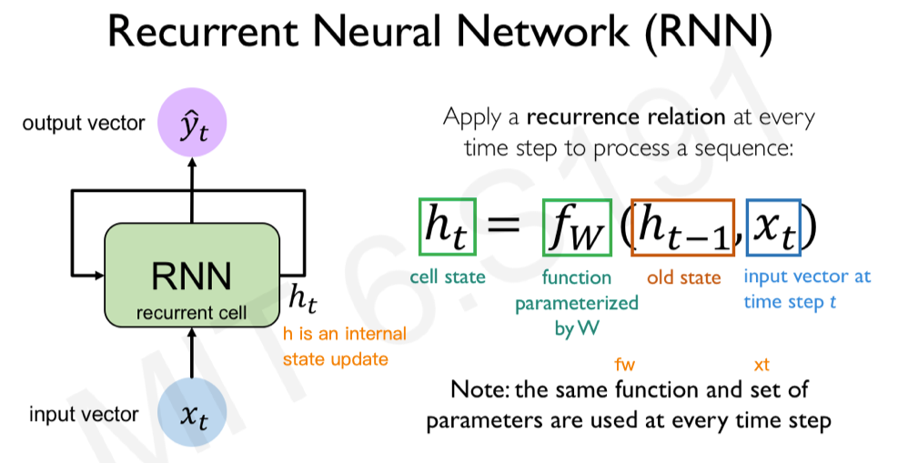


```python
def call(self, x):
    # Update the hidden state
    self.hidden = tanh(self.W_hidden * self.hidden + self.W_x * x)
    
    # Compute output
    output = self.W_output * self.hidden
    
    # Return output and hidden state
    return ouput, self.h
```

### Backpropagation through time

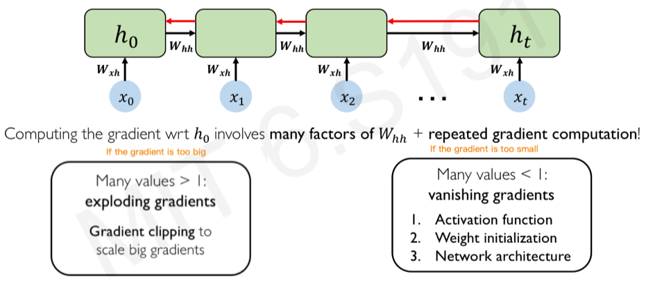

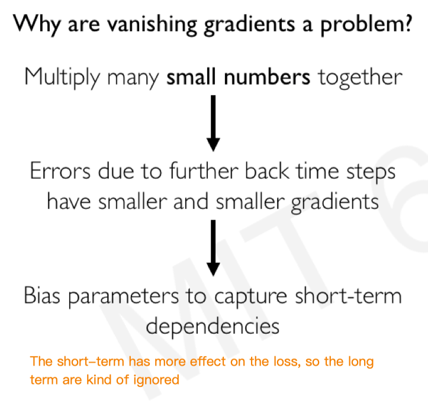

#### Solutions

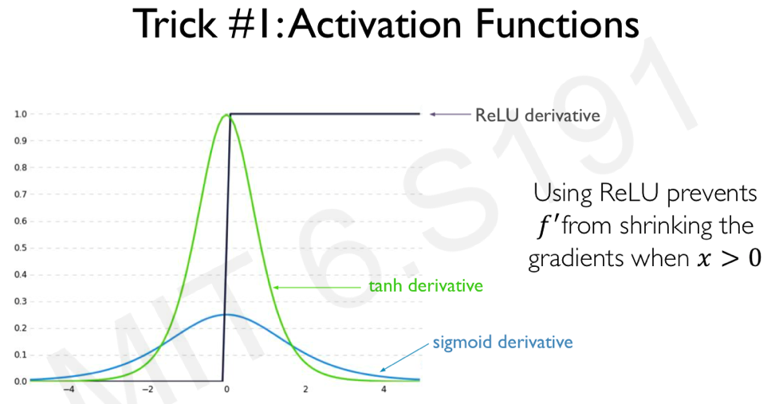

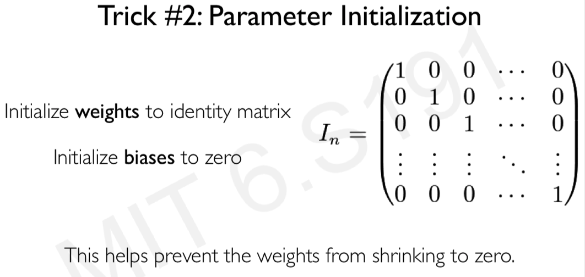

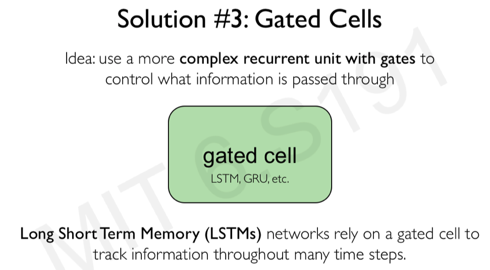

##### LSTM Networks

**Overview**

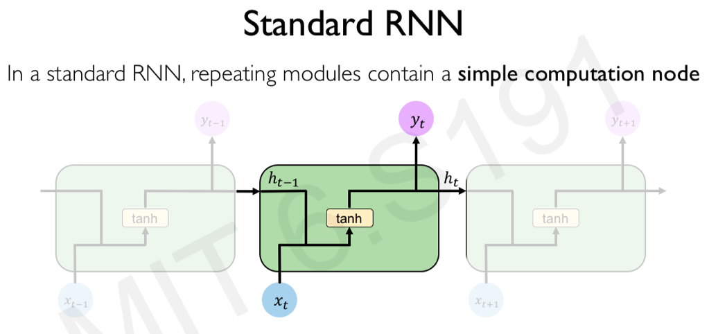

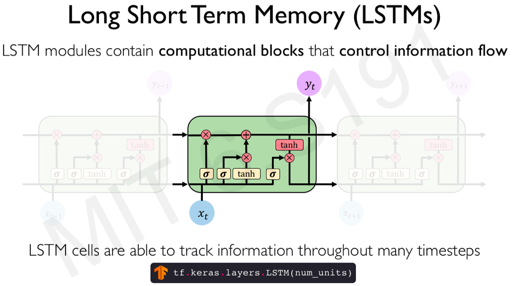

**How LSTM works**

1. Forget: Ignore irrelevant parts
2. Store: Store relevant one to the cell state
3. Update: Selectively update teh cell state to act as input for the next cell
4. Output: Compute output from the new cell state, input and internal update from previous cell

**Key Concepts**

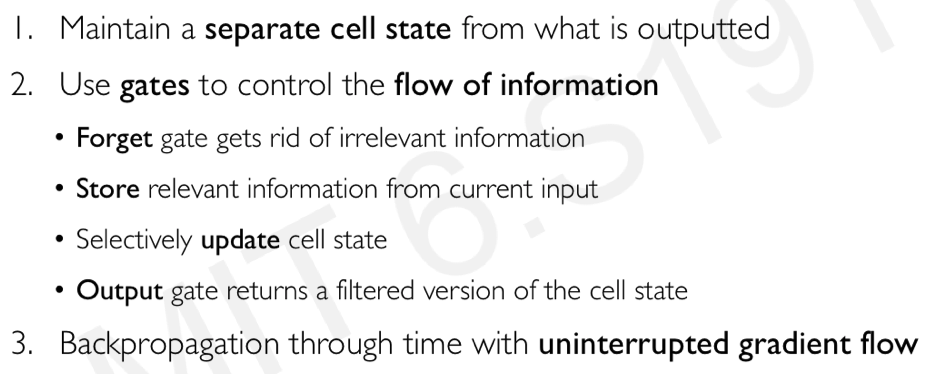


```python
tf.keras.layers.LSTM(
    dimension of the output space,
    return_sequences=True, 
    recurrent_initializer='glorot_uniform',
    recurrent_activation='sigmoid',
    stateful=True,
)
```

## Convolution NN (CV)

There are two types of task that NN can solves

* Regression: Output value are continuous
* Classification: Output are class label. Produce probability of belonging to a paritcular class

#### Convolution

To correctly identity features of a image and feed the result into dense NN for computations, we need a way that preserves spatial information of the pixels in an image. 

This can be achieved by applying filters to extract features

1. Apply a filter (A set of weights on each pixel) to patches of an image - to extract local features
2. Use multiple filters - to extract multiple features
3. Spatially share parameters of each filter (Features are shared elsewhere)

#### Convolution Operation

Put our weighted filter over the image, perform element wise multiplication and add the result

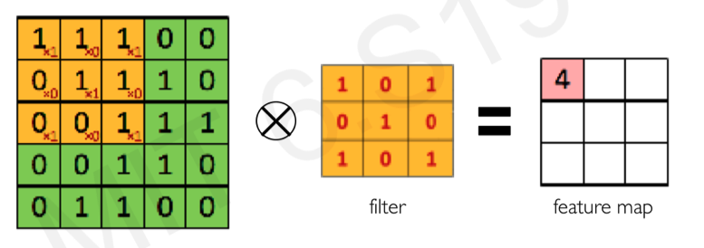

Convolution Layers

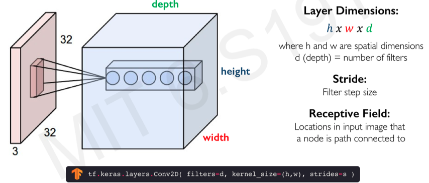

Depths: number of feature map (Equals to the number of filter used)

Receptive Field: Define the spatial location of the output of the convolution layer

#### Non-linearity

After every convolution opertion, ReLU (Rectified Linear Unit), a activation function is usually applied.

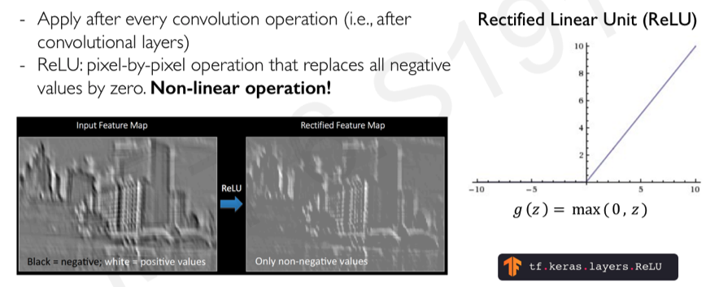

#### Pooling

Pooling downsamples each feature map, it reduces the dimention of our feature map. Basically it downsizes our feature map.

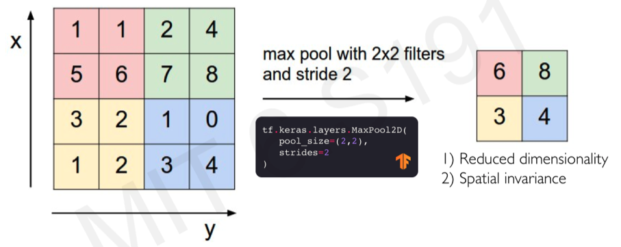

Stride is how many pixel the filter moves.

#### CNN

<u>Feature Learning</u>

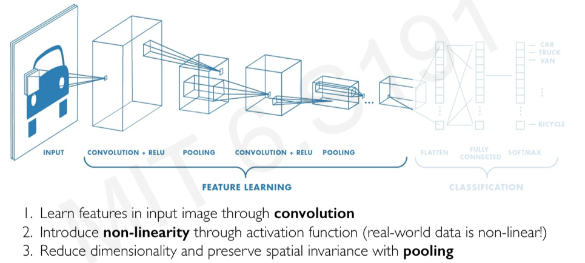

<u>Classification</u>

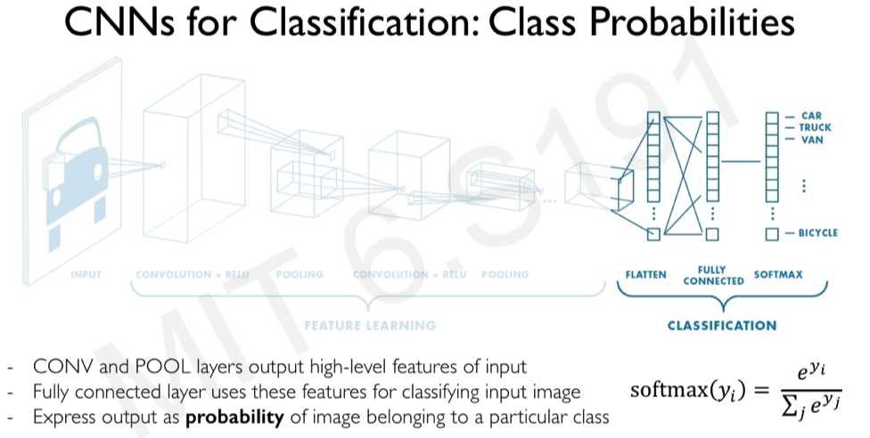

The softmax function is a function that turns a [vector](https://deepai.org/machine-learning-glossary-and-terms/vector) of K real values into a vector of K real values that sum to 1 (sigmoid 使每个Output都是0-1, softmax 使所有Output的总和为1).

**TensorFlow**

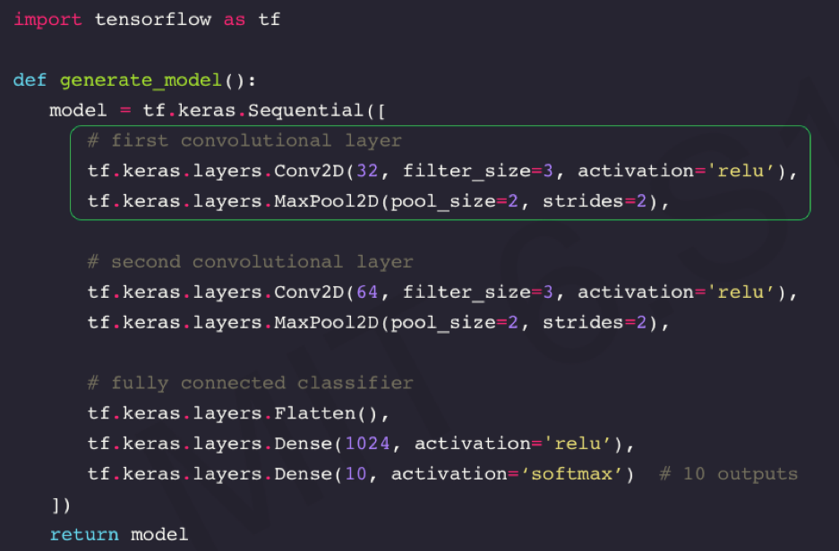

```python
tf.keras.Sequential([
        #The first convolutional layer
        tf.keras.layers.Conv2D(filters=24, kernel_size=(3,3), activation=tf.nn.relu),
        tf.keras.layers.MaxPool2D(pool_size=(2,2)),

        # The second convolutional layer
        tf.keras.layers.Conv2D(filters=36, kernel_size=(3,3), activation=tf.nn.relu),
        tf.keras.layers.MaxPool2D(pool_size=(2,2)),
		
    # Dense Layer
        tf.keras.layers.Flatten(),
        tf.keras.layers.Dense(128, activation=tf.nn.relu),

        # output
        tf.keras.layers.Dense(10, activation=tf.nn.softmax)
    ])
```

**Other Applications of CV**

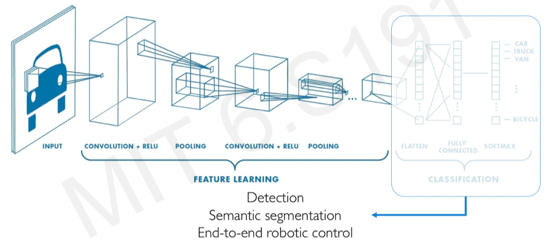

## Generative Models

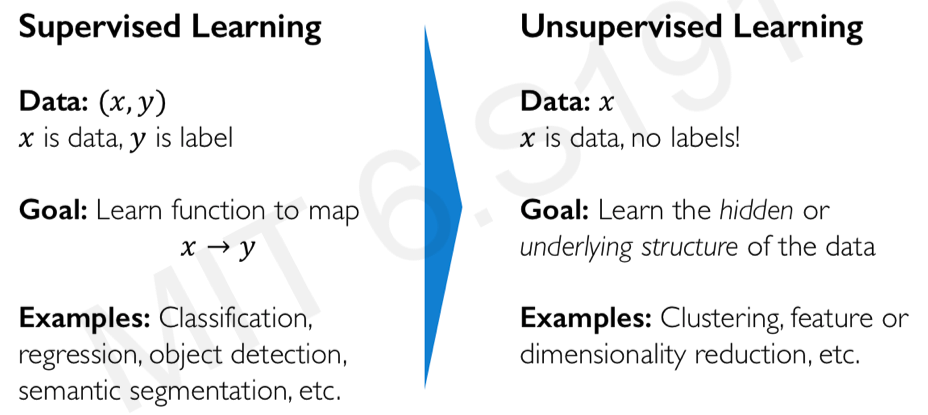

Goal of generative modelling: Take input training samples from some distribution and learn a model that represents that distribution. And we do this for two main aims:

* Density Estimation
* Sample Generation

Application

* Debiasing: In facial detection, as the training data is biased to some feature of the faces. Using generative model to actually learn the underlying features can uncover the underrepresented part of the data to actually create fair more representation datasets to train an unbiased classificaiont.

	For example, training a facial recognition system on white people might not work as well when used on black people.

* Outlier detection: Learning the training distribution helps generate models to detect outliers.

#### Latent Variable Models

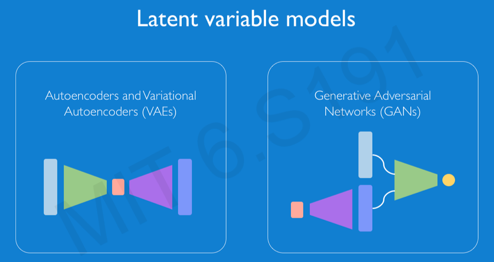

##### Latent variables

Latent variables are variables taht cannot be directly observed but are rather inferred from other observed variables. They are the underlying true explanatory factors that results in the observed variables. And the goal of generative modelling is to find ways of learning these latent variables from the observed data.

##### VAE (Variational Autoencoders)

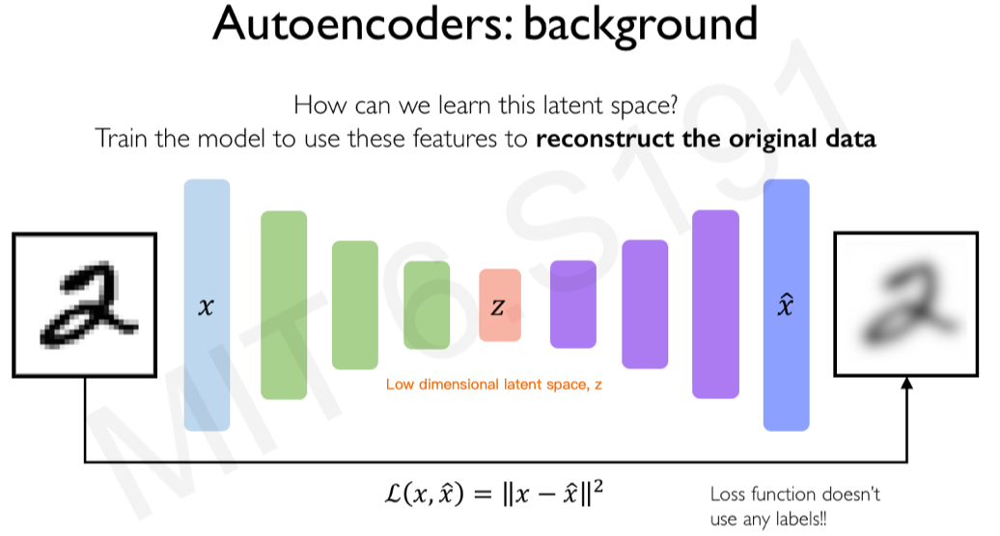


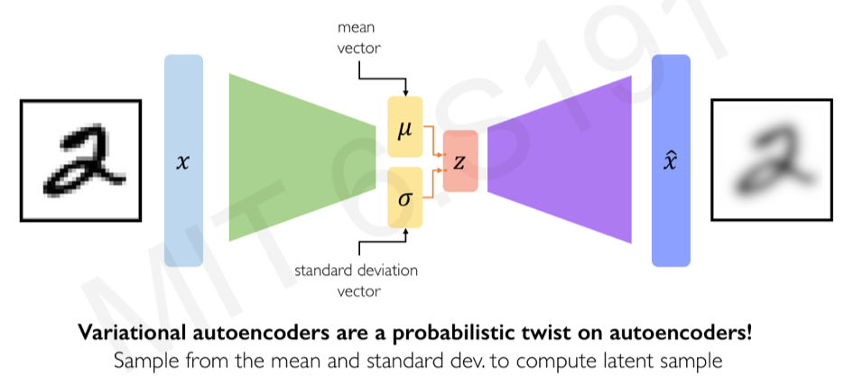

Instead of deterministic layer z, we replace it with stochastic sampling operation. So instead learning the concrete variable, we learn from the parameterised probability distribution from each of the latent variables.

回忆一下我们在Autoencoder中所做的事，我们需要输入一张图片，然后将一张图片编码之后得到一个Latent vector，这比我们随机取一个随机噪声更好，因为这包含着原图片的信息，然后我们隐含向量解码得到与原图片对应的照片。

但是这样我们其实并不能任意生成图片，因为我们没有办法自己去构造隐藏向量，我们需要通过一张图片输入编码我们才知道得到的隐含向量是什么，这时我们就可以通过变分自动编码器来解决这个问题。

其实原理特别简单，只需要在编码过程给它增加一些限制，迫使其生成的隐含向量能够粗略的遵循一个标准正态分布，这就是其与一般的自动编码器最大的不同。

这样我们生成一张新图片就很简单了，我们只需要给它一个标准正态分布的随机隐含向量，这样通过解码器就能够生成我们想要的图片，而不需要给它一张原始图片先编码。

**Loss function**


Recounstruction loss: The difference between x and x^

Regularization term: A function that capture the divergence between the inferred distribution of the latent space and the prior fixed distribution

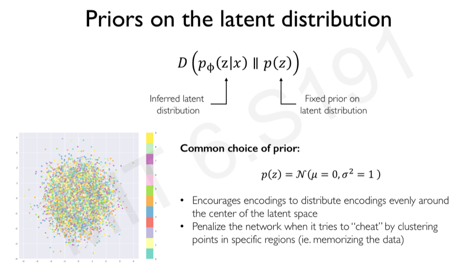

**Backpropagation**

Now that we want to train the network, we want to perform backpropatation. However as z is resulted from an stochastic sample of the distribution, we cannot back propagate through. As we need deterministic nodes. 

<u>Reparametrizing</u>

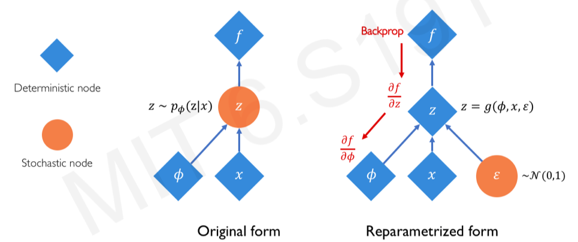

**Latent perturbation**

Each dimension of of latent variable encode a feature of the image. So if we fix all other variable and just changes one, we can tell what feature that latent variable is controlling.

Ideally, we want latent variables to be uncorrelated with each other. Disentanglement is the idea of enforcing diagonal prior on the latent variable to encourage indenpendence beween these variables to allow the richest and most compact representation possible.

##### GAN (Generative Adversarial Network)

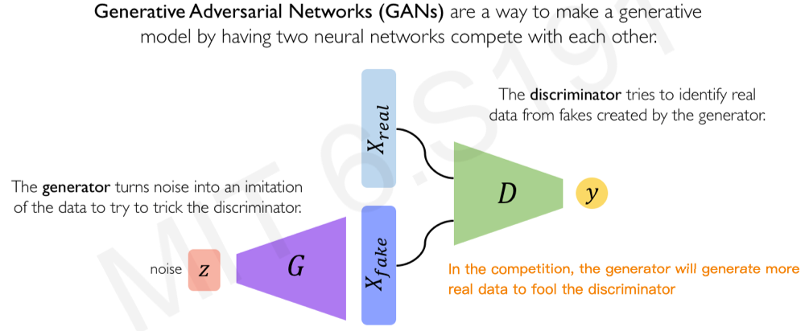


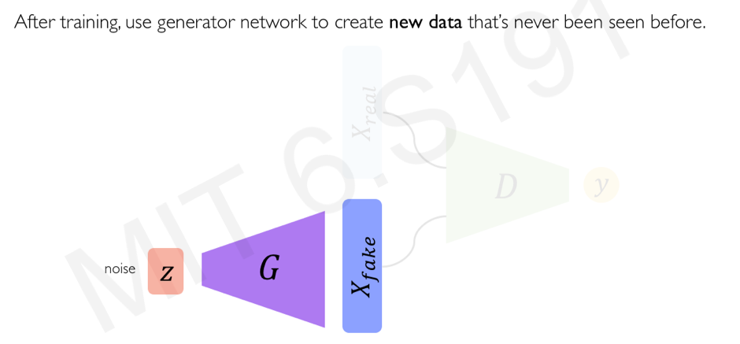

## Deep Reinforcement Learning

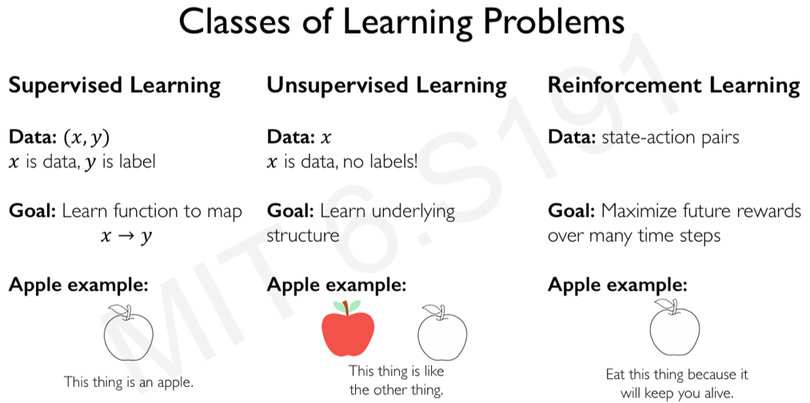

#### Vocabs

| Term                    | Meaning                                                      |
| ----------------------- | ------------------------------------------------------------ |
| Agent                   | The thing that takes actions                                 |
| Environment             | Where the agent take actions                                 |
| Action space            | The set of possible action a agent can make                  |
| Observation             | The return state change from environment                     |
| Reward                  | Feedback that measures the success/ failure of the agent action, not instantaneous |
| Total Reward            | The total reward from time t to infinity                     |
| Discounted total reward | The total reward except for the discouted factor, to reduce the weight of rewards in the future |

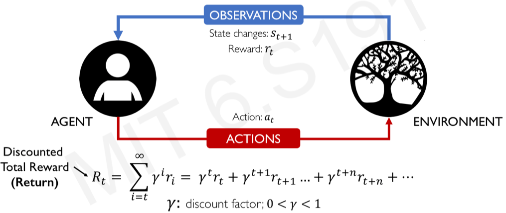

**Q-function**

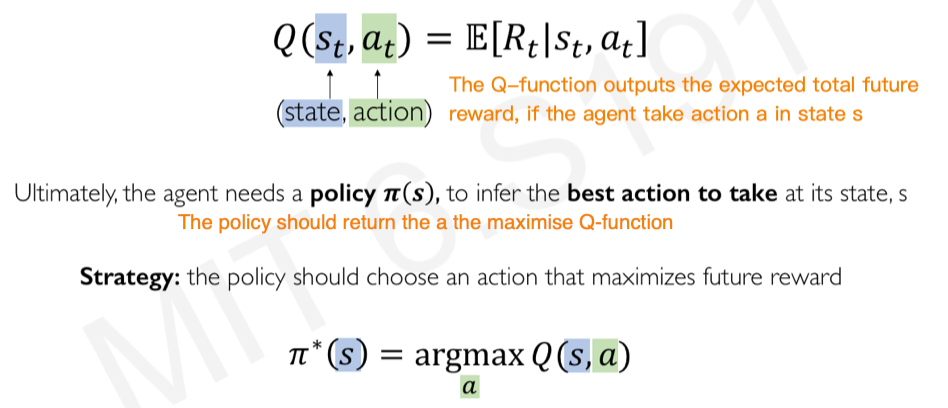

#### DRL algorithms

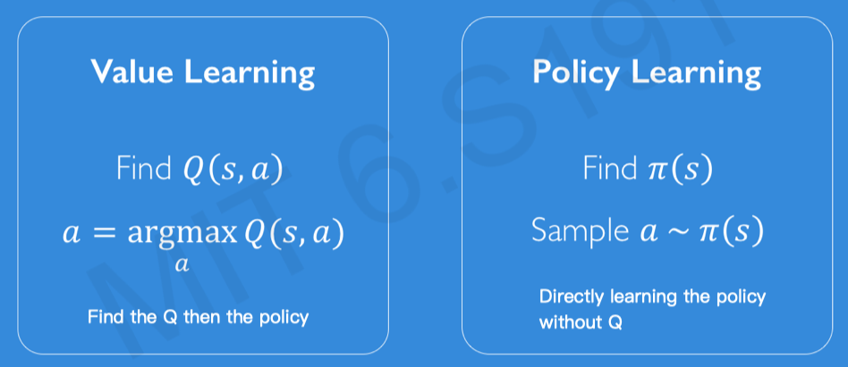

##### Q-Value Learning (Find the Q)

Basically, we use a random Q function and compute the Q function by trial and error.

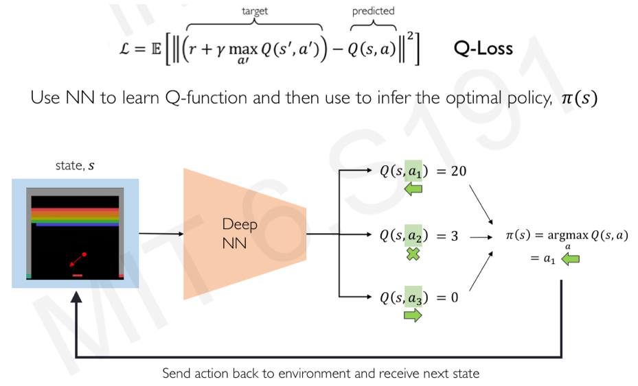

Downside

* Complexity
	* Can only handle scenarios where the action space is discrete and small
	* Cannot handle continuous action spaces (There's infinite amount of actions)
* Flexibility
	* Policy is deterministically computed from Q, hence it cannot learn stochastic policies.

##### Policy Gradient Learning (Find the Policy Directly)

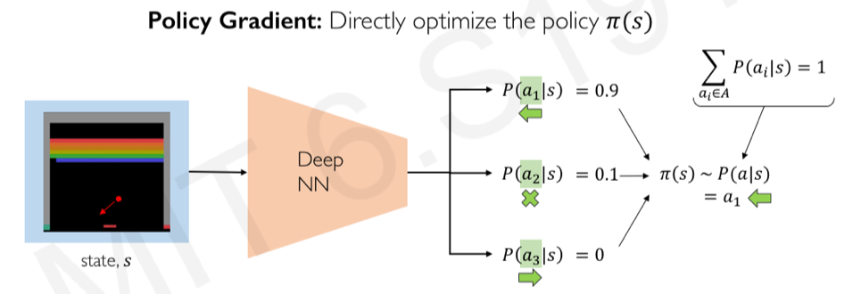

Advantages:

* Instead of just getting discrete action, we can get continuous action space as the output in a pobability.

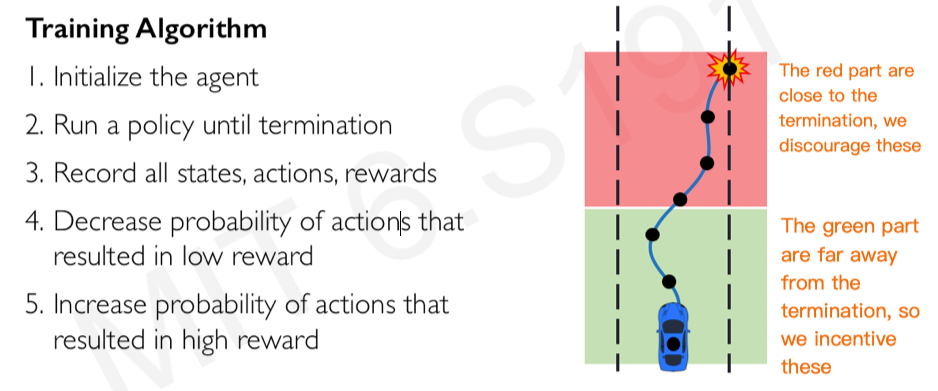

Intially, the award will be initialized to all 0 and the action will be randomly generated. Then, everytime the loss will be computed to update the network.

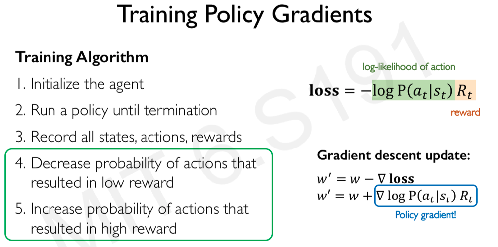

Intuitively, if an action has a high probability and low reward, this will cause a greater loss then an action that has a high probability and a high rewards, so this loss function can guide the training of the network.


The problem of application deep reinforcement learning to real life is that the 'run until termination' isn't applicable to many cases.

### Limitation of DL

* Adversarial Attacks on Neural Network
	* Our network is trained by fixing the input and target, and change the weight to reduce the loss
	* However, in the other way, adversarial images are those that fix the weight and the label, but modifies the input to increase the loss, normal NN cannot detect them
* Poor at representing uncertainty
	* When we input something new (has never being change) to a NN, a probability can still be generated, but it won't make sense. Probability is not a metric of confidence. It would be desirable for the network to also give a confidence in its prediction.
	* Ensembling
		* One way to address this is via dropout. For example, in a convolution operation, we can stochastically drop out some of the weights in the filter. And by looking at the expected value and variance of those predictions obtained from different filters, we can get a sense of the network's certainty in that prediction.
		* 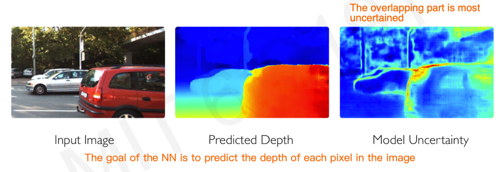
	* Evidential Deep Learning
		* Evidential Deep learning trains the network to also compute evidence which is an indication of confidence
		* 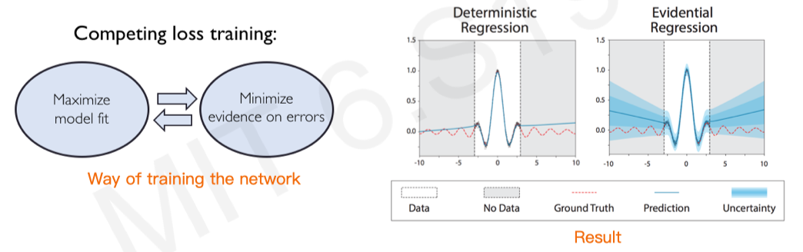
		* As the picture is pertubated more, the degree of uncertainty increases
		* 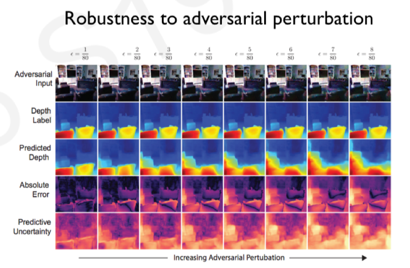

## Optimisation

### Data Preprocessing

#### Date Normalization

Normalize values of feature to make them fall into a certain small ranges decrease the time for the model to coverage. 

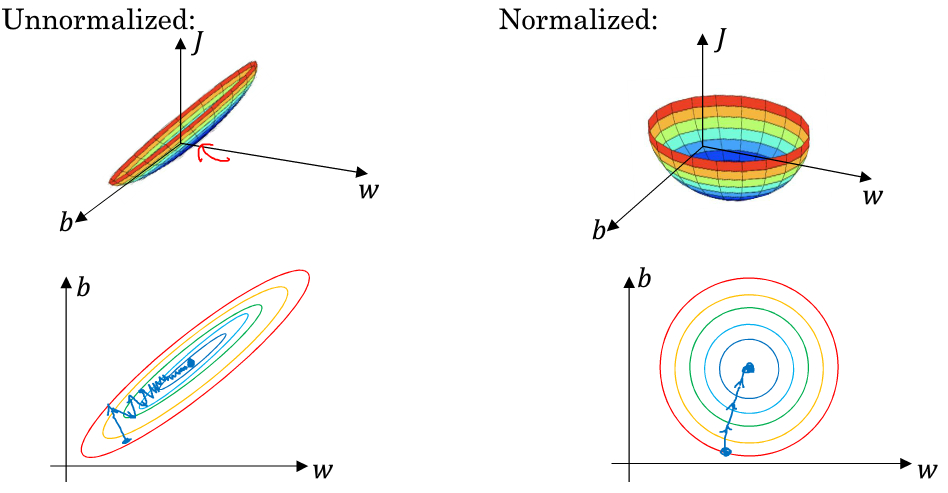

* Min-max normalization

	$$x_i := \frac{x_i - \text{min}(x)}{\text{max}(x)-\text{min}(x)}$$

	All feature will be within [0, 1]

	$x_i := \frac{x_i - \text{average}(x)}{\text{max}(x)-\text{min}(x)}$

	Within [-1, 1]

* Z-score normalization

	$x_i := \frac{x_i - \mu}{\sigma}, \mu \text{: Mean, } \sigma\text{: Standard deviation}$

	All features have average 0 and standard devaition of 1

### Batch Normalization

To facilitate learning, we typically normalize the initial values of our parameters by initializing them with zero mean and unit variance. As training progresses and we update parameters to different extents, we lose this normalization, which slows down training and amplifies changes as the network becomes deeper.

Batch normalization reestablishes these normalizations for every mini-batch and changes are back-propagated through the operation as well. By making normalization part of the model architecture, we are able to use higher learning rates and pay less attention to the initialization parameters. Batch normalization additionally acts as a regularizer, reducing (and sometimes even eliminating) the need for Dropout.

|      |                                                              |                                                              |
| ---- | ------------------------------------------------------------ | ------------------------------------------------------------ |
| 1    | $z^{[l](i)} = w^{[l]}a^{[l-1](i)}$                           | Compute the layer l of the i-th training example normally, b is omitted as it's subtracted anyway |
| 2    | $z^{[l](i)}_{norm}=\frac{z^{[l](i)}-\mu}{\sqrt{\sigma + \epsilon}}$ | Normalised this layer across all training example in a certain mini-batch |
| 3    | $\hat{z}^{[l](i)}=\gamma^{[l]} z_{norm} + \beta^{[l]}$       | To not fix a distribution of mean 0 and variance 1           |

Batch normalization works because

* reduce the amount that the distribution of the activations changes, so that when the weight of the previous layer changes, it won't make a huge impact on the next layer as the distribution is still similar

It has a slight regularization effect

* Each mini-batch is scaled by the mean/variance computed on just that mini-batch, this adds some noise to the values z in that mini batch
* A bigger mini batch size reduce the regularization effect as the noise reduces

#### Use on test set

When training the network, batch normalization takes the $\mu, \sigma$ of each mini batch. However, when testing the the network, we only have one example to feed forwardly, it doesn't make sense to calculate the $\mu, \sigma$ for one example. Hence we need to estimate them using exponential weighted average.

What we do is as follows, during training, we compute the $\mu, \sigma$ of each mini batches and record their EMWA. And use that as our estimate when passing a single example through the network.

### GD Optimisation 

#### Adaptive learning

<u>Learning Rate</u>

Learning rate is the gradient descent factor we take when descenting our gradient to compute the most optimal weight. In essence, it's how big of a step we take in the descent direction.


* Potential Issue
	* Small learning rate: Converage to the global minimum can be slow
	* Large learning rate: Might overshot the optimal

<u>Adaptive learning</u>

Adaptive learning rates refers to rates that are no longer fixed, but changes depending on the various factors.


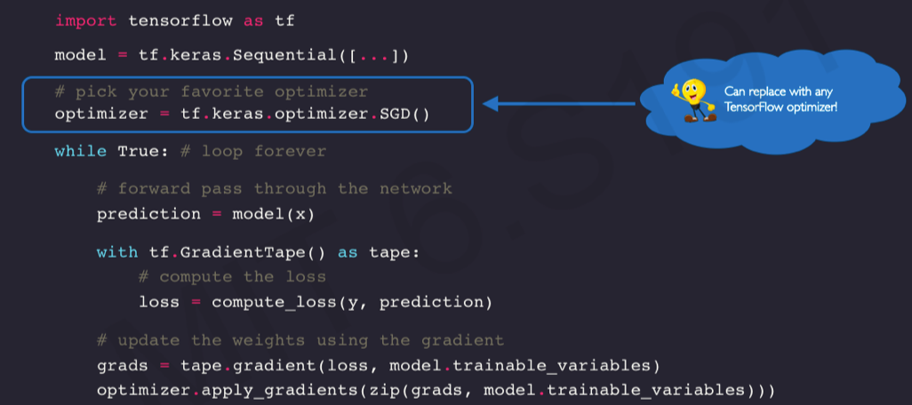

#### Batching

> Stochastic Gradient Descent: Update gradient using a single training example
>
> Mini-Batch Gradient Descent: Update gradient using a small batch
>
> Batch gradient descent: Each step of gradient descent uses all training example

In the optimisation section, computing the gradient can be expensive. Hence instead of computing all the points or only one point, we compute the average gradient with respect to a mini-batches of data points.

Usually stochastic gradient descent is hard to converge as single training example makes the gradient flunctutate.

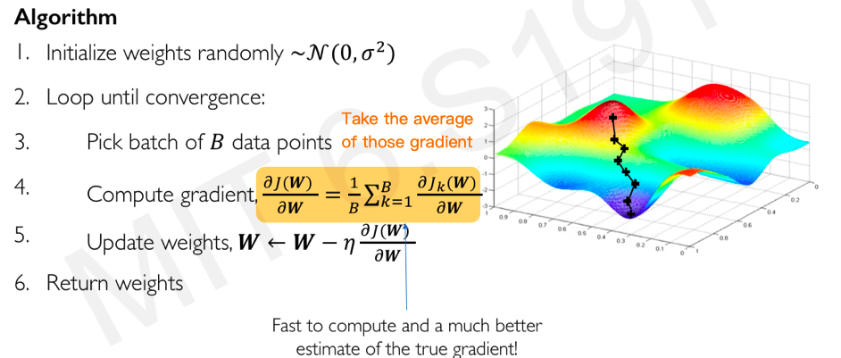

**MBGD**

Split $m$ training example into $k$ batchs, where each batch has $t=m/k$ examples. And we end up with

$$X = \{x^{\{1\}},x^{\{2\}},\cdots,x^{\{k\}}\}$$, $Y = \{y^{\{1\}},y^{\{2\}},\cdots,y^{\{k\}}\}$

where

$x^{\{k\}} = [x^{(k)},x^{(2k)},\cdots,x^{(tk)}]$

$y^{\{k\}} = [y^{(k)},y^{(2k)},\cdots,y^{(tk)}]$

Then in each gradient update, we only compute gradient with respect to a small batch. $t$ is a hyperparameter that needs to be set.

In this case, it's possible to compute the cost over one batch and plot the averages every 1000 example instead of over the whole training set every time. This is less costly.

* **Advantages**: Allow us to reach our target weight much faster.

* **Disadvantages: ** The gradient descent can take detour when converges, more likely to converge to local optimal, the cost function is noisier

	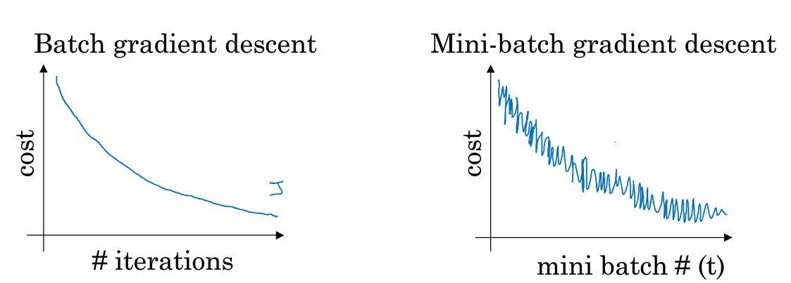


### Adam

> Adaptive Momentum Estimation

#### EWMA

> Exponentially Weight Moving Average

* Simple Moving Average: Unweighted mean of the previous $n$ data-points, $\bar{p}_{n}=\frac{p_{1}+p_{2}+\cdots+p_{n}}{n}$
	* The next mean can be cheaply computed, with a FIFO buffer, $\bar{p}_{n}=\bar{p}_{n-1}+\frac{1}{n}\left(p_{n}-\bar{p}_{n-1}\right)$
	* It's a effective method fro eliminating fluctuation
	* The key limitation is that older data are not weighted any differently than data points near the beginning of the data set.
* Cumulative Moving Average: Consider SMA to be a sliding window of fix size $M$, CMA has a increasing size of $1$ to #dataset, it considers all prior observations. $C M A_{n+1}=\frac{x_{n+1}+n \cdot C M A_{n}}{n+1}$

* Weighted Moving Average assigns a heavier weighting to more current data points since they are more relevant than data points in the distant past.

* EWMA is a  filter that applies weighting factors which decrease exponentially. The weighting for each older data-point decreases exponentially, never reaching zero.

	* $V_{t}=\left\{\begin{array}{ll}p_{1}, & t=1 \\ \beta p_{t}+(1-\beta) \cdot V_{t-1}, & t>1\end{array}\right.$ where $p_t$ is value of series $P$ at time $t$, $V_t$ is the value of EMMA at time $T$ 

	* $\beta$ represent the degree of weight decrease, a higher $\beta$ accounts for the previous data-points more, give a more smooth curve.

		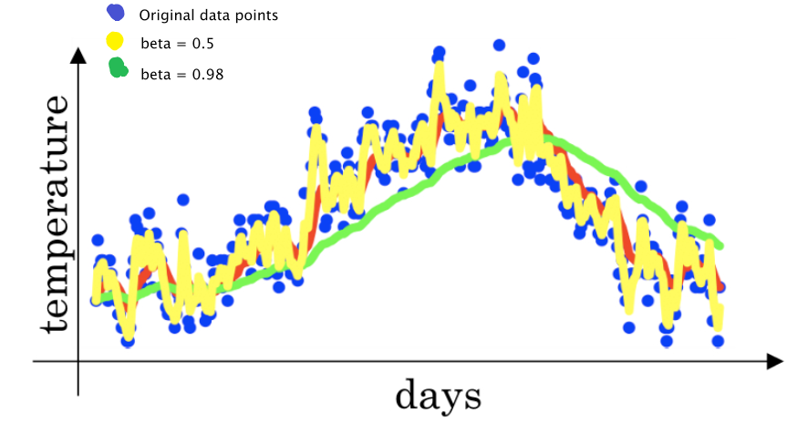

**EWMA remarks**

* As the weight decreases exponentially, we are effectively average $\frac{1}{1-\beta}$ data points prior to $p_n$. 

>  We have $\lim_{n \to \infty} (1- \frac{1}{n})^n = \frac{1}{e} \approx 0.3679$, which is equal to $\lim_{\beta \to 1} \beta^{\frac{1}{1 - \beta}} = \frac{1}{e}$, if we consider $\frac{1}{e}$ is a factor small enough to be ignore, then the $\frac{1}{1-\beta} + 1$-th data point has exactly that factor.

* In some case, we have $V_1=\beta p_1+ (1-\beta)V_0$, where $V_0$ is 0, in this case the starting value of $V$ will be too small (We expect the green line but instead we get the purple line), hence we need to divide it by $ (1-\beta_1^t)$ to correct the bias

	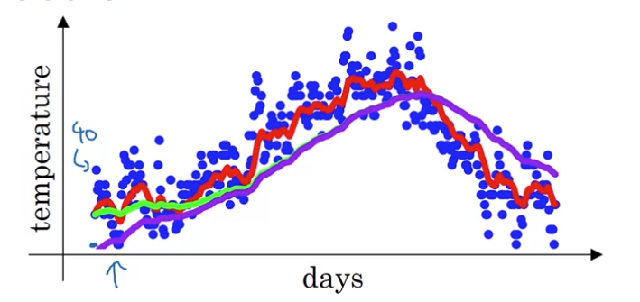

#### GD with Momentum

The normal GD has trouble nagivating the global minimum. It oscillates across the slope, moving too fast in the vertical direction and too slow in the horizontal momentum.

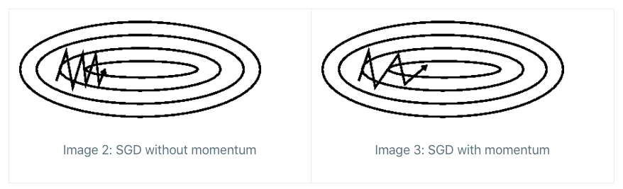

After computing the gradient normally, GD with momentum use the EWMA as the gradient to update the parameter.

$v_{dW_t} = \beta v_{dW_{t-1}} + (1-\beta)dW_t$

$v_{db_t} = \beta v_{db_{t-1}} + (1-\beta)db_t$

$W_t = W_{t-1} - \alpha v_{dW_t}$

$b_t = b_{t-1}  -\alpha v_{db_t}$

where $v$ is the EWMA value of each gradients, initial value of $v_0$ is 0.

**Overview**

Essentially, when using momentum, we push a ball down a hill toward global minimum. The ball accumulates momentum as it rolls downhill, becoming faster and faster on the way. Every time we fix our direction, we end up with too big of an oscillation.

The same thing happens to our parameter updates: $v$ is the momentum and $dW_t$ is the acceleration in the right direction. The momentum term increases for dimensions whose gradients point in the same directions (The horizontal) and reduces updates for dimensions whose gradients change directions (The vertical). As a result, we gain faster convergence and reduced oscillation.

#### RMSprop

> Root mean square prop

The main purpose of RMSprop is to resolve the infinitely small learning rate of AdaGrad. The idea of these two algorithm are both to have an adaptive learning that various as the size of the gradients changes. When gradient $dW$ is too big, the EWMA term $s$ penalise the learning rate to diminish the oscillations. The purpose of $\epsilon$  is to avoid division by 0.

$s_{dW_t} = \beta s_{dW_{t-1}} + (1-\beta)dW^2_t$

$W_t := W_{t-1}  - \frac{\alpha}{\sqrt{s_{dW_t}+\epsilon}}dW_t$

#### Adam

Adam incorporates momentum and RMSprop. We first calculate the EWMA value of the gradients and the square of the gradients,

$v_{dW_t} = \beta_1 v_{dW_{t-1}} + (1-\beta_1)dW_t$

$s_{dW_t} = \beta_2 s_{dW_{t-1}} + (1-\beta_2)dW_t^2$

Unlike the previous algorithms, we  need to apply bias correction to the value of $v, s$

$\hat{v}_{dW_t} = \frac{v_{dW_t}}{(1-\beta_1^t)}$

$\hat{s}_{dW_t} = \frac{s_{dW_t}}{(1-\beta_2^t)}$

And then update the parameters

$W_t = W_{t-1} - \frac{\alpha}{{\sqrt{\hat{s}_{dW_t}} +\epsilon}} \hat{v}_{dW_t}$

#### Summary


### Overfitting

**Overfitting**


Regularization is a techinique that constrains our optimization problem to discourage complex models.

#### Dropout

> Drop some features


The idea behind drop-out is that at each iteration, you train a different model that uses only a subset of your neurons. With dropout, your neurons thus become less sensitive to the activation of one other specific neuron, because that other neuron might be shut down at any time.

##### Implementation (Inverted Dropout)

1. Random generate a matrix $d_3$ that has the same dimension as activation $a_3$ and compare it with the probability of keeping a node, 1 if keep, 0 if drop.
2. $A^{[l]} = A^{[l]} D^{[l]}$ (Element-wise)
3. $A^{[l]}/\text{keep_prob}$, so that the expected value of this layer's activation won't decrease due to dropping out some activations from the previous layer

Dropout is only used when fitting the model not when making predictions

```python
import numpy as np

keep_prob = 0.8		# Probability of keeping a node
d3 = np.random.randn(a3.shape[0], a3.shape[1]) < keep.prob 
a3 = np.multiply(a3, d3)
a3 /= keep.prob
z4 = np.dot(w4, a3) + b4
```

#### Early Stopping


The point when the losses begin to diverge (when we should stop) is when the network begins to memory some patterns of the training data.

Under-fitting: Bias Problem

Over-fitting: Variance Problem

#### Data augmentation

Larger training data can help prevent overfitting, but what if we can't get more data? We can apply distortion to existing data, e.g. flipping, random cutting, to gain more training examples.

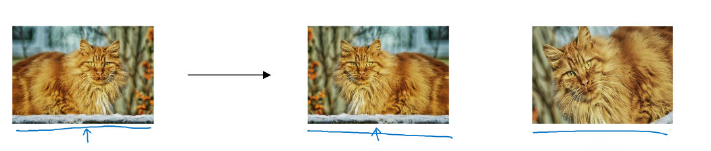

#### Regularization

The smaller the parameters of the model, the simpler the hypothesis function is, and overfitting is less likely. 

Hence we can add the parameters (Weight, bias) into the loss function, such that we can minimize them while performing gradient descent.

**Gradient Descent**

$\text{Regularization term: }\vert \vert w \vert \vert ^2_2 = \sum_{j=1}^{n_x} w^2_i = w^Tw$ essentially the sum of all weights' square.

Our new cost function:

$J_{regularized} = \small \underbrace{-\frac{1}{m} \sum\limits_{i = 1}^{m} \large{(}\small y^{(i)}\log\left(a^{[L](i)}\right) + (1-y^{(i)})\log\left(1- a^{[L](i)}\right) \large{)} }_\text{cross-entropy cost} + \underbrace{\frac{1}{m} \frac{\lambda}{2} \sum\limits_l\sum\limits_k\sum\limits_j W_{k,j}^{[l]2} }_\text{L2 regularization cost} \tag{2}$

In back propagation, after adding regularization we have 

$dW^{[l]} = \frac{\partial \mathcal{L}(W, b)}{\partial W^{[l]}} + \frac{\lambda}{m} W^{[l]}$

**Normal Equation**

We regularise normal equation by adding L into the equation. 

Meanwhile, now that we add a term, $\left( X^TX + \lambda \cdot L \right)^{-1}$ will be always invertible.

| Before                | After                                                        |
| --------------------- | ------------------------------------------------------------ |
| $w = (X^TX)^{-1}X^Ty$ | $\begin{align*}& \theta = \left( X^TX + \lambda \cdot L \right)^{-1} X^Ty \newline& \text{where}\ \ L = \begin{bmatrix} 0 & & & & \newline & 1 & & & \newline & & 1 & & \newline & & & \ddots & \newline & & & & 1 \newline\end{bmatrix}\end{align*}$ |

#### Choosing Hyperparameters

##### Regularization Term

> How do we choose the factor $\lambda$ of the regularization term

1. Create list of $\lambda$
2. Create a set of models of different polynomial degrees
3. Iterate through all the $\lambda$ over the training set to learn some weights
4. Compute the cross validation error using the learned $W$ on cross validation set **without regularization term**
5. Select the best combo of model and $\lambda$
6. Using the combo on test set **without regularization term** to see if it has a good generalisation of the problem

In essense, we use regularization when training the system, but not when we measure the error.


High lambda prevents model from overfitting the training set, but can cause underfitting which increase $J_{CV}$ 

Low lambda can overfit $J_{CV}$

### Problem of local optima

In our intuition, there will be many local optima that we need to avoid, however, in actually scenario, the saddle on the RHS is more likely to happen, they also contribute to a large proportion of the point where the gradients is zero, hence local optima is not that big of an issue.

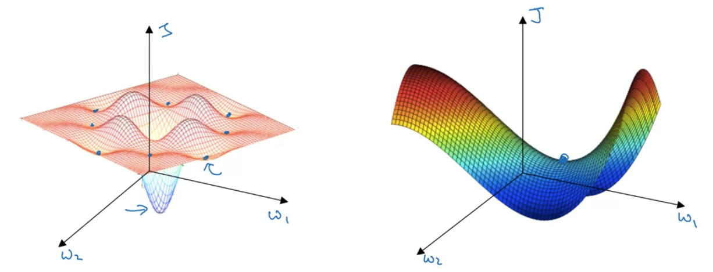

Plataeus can really slows down the learning process, it will take significant amount of time for the algorithm to get off the platae.

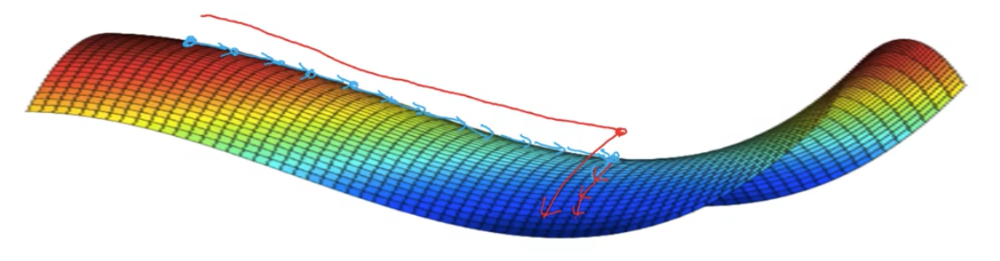

### Vanishing/ Exploding gradient

In DNN, if all weights's initial value are greater than 1, in the process of back propagation, the derivation of the n-th layer contains the product of all the products before, this can result in an **exploding** gradient. On the contrary, if all weights are smaller than 1, the gradient will **vanishes**.

Vanishing gradient slows done gradient descent and if it coverages to 0, the network will stop further training.

#### Weight initialization

The idea is to initialize the weight such that the weight is optimal

**tanh (Xavier Initialization)**

```python
w_l = np.random.randn(layers_dims[l],layers_dims[l-1]) / np.sqrt(layers_dims[l-1])
```

The division ensure the standard deviation of the input and output are equal which prevents all activation converges to 0

**Relu (He Initialization)**

```python
w_l = np.random.randn(layers_dims[l],layers_dims[l-1]) / np.sqrt(layers_dims[l-1]/2)
```

For a Relu activation layer, assuming only half of the neutron is activated, we need to further divide by two.

### Learning curves

##### High Bias 

> Underfitting

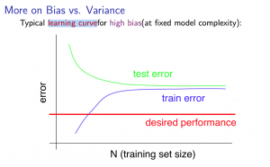

If a learning algorithm is suffering from **high bias**

* Getting more training data will not help much, as the model is underfitting the datas
* Adding more features, using bigger network helps

##### High Variance

> Overfitting


If a learning algorithm is suffering from **high variance**

* Getting more training data is likely to help, as more data prevents model from overfitting
* Using a small set of feature, adding regularisation, changing network structure can help .

##### High Variance & Bias

Note that high bias and high variance can happen at the same time when the model is doing better on training set and yet still performs badly. 

In the following graph, the classifier is clearly underfitting the data but at the same time it overfits some datas.

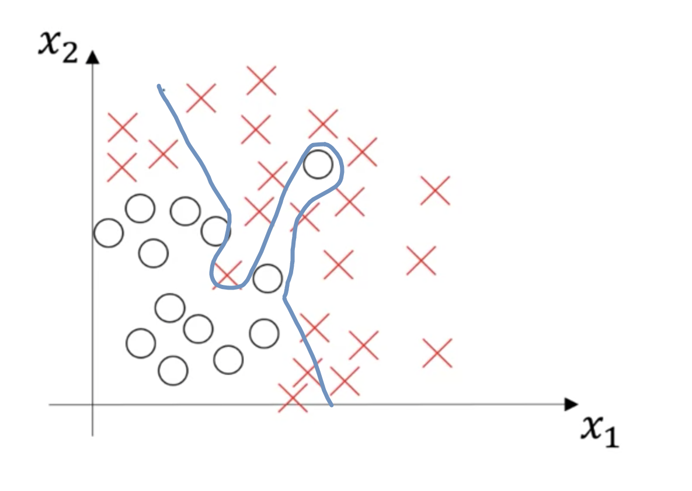


## Tensor

Tensors are n-dimensional array. It has

* Shape: Defines dimension and number of elements in each dimension
	* Shape = [2, 1] is like int[2\]\[1]
	* Shape = [1, 2] is like int[1\]\[2]  which is effectively a pair
	* Shape = [3, 2, 5], this shape has three dimension, axis 0 has 3 elements, axis 1 has 2  elements and axis 2 has 5 elements
	* Shape = [2, 1] is an column vector with two dimensions
* Rank: Number of dimensions. A scalar has rank 0, vector has rank 1, matrix has rank 2
* Size: the total number of items

##### Indexing

slicing: `start:stop:step`

```python
[::-1]		# Reversed
[::2]		# Every other element
[2:7]		# Index 2-6
[:4]		# Before 4
```

#### tf.keras

##### Classes

* Model: Groups layers into object with training and inference features

	* ```python
		tf.keras.Model(inputs, outputs, name)
		```

	* There's two ways to instantiate a `Model`

		* Pass objects to the inputs and outputs parameter
		* Subclass the `Model` class, define customized call function

* Sequential: Groups a linear stack of layers into a model object

##### Modules

* activations: Contains activation functions

* layers: Contains many layer classes

	```python
	# Downsampling
	MaxPool2D(pool_size=(2, 2), strides=None)
	
	# Convolution over images
	Conv2D(filters, kernel_size, strides=(1, 1), activation=None)
	# filter: Dimension of output space
	# Kernal size: Dimension of the convolution window
	# Strides: How big a step the convolution window moves
	
	# Dense NN
	Dense(dimension of output unit, activation=None)
	```

**Methods of the Model class**

```python
# Returns the loss value & metrics values for the model in test mode
evaluate(x=None, y=None, batch_size=None, steps=None)

# Config the model with losses, metrics and loss function
compile(optimizer='rmsprop', loss=None, metrics=None)

# Train the model. 
# epochs: #Iteration of the whole dataset
# batch_size: #sample used in one propagation, use more memory
# For 1000 training examples, with batch size is 500, then it will take 2 iterations to complete 1 epoch.
fit(input_data, target, batch_size=None, epochs=1)

# Make prediction. Return Numpy array of predictions
predict(input_data, batch_size=None)
```

<u>Evaluate</u>

Return the loss value & metrics value (defined when compile)

<u>Compile</u>

* Loss function: Define how we measure the accuracy of the model during training. 
* Optimizer: How the model is updates based on the input and loss function. We can use the stochastic gradient descent method `tf.keras.optimizers.SGD(learning_rate=1e-1)`
* Metrics: Define metrics to monitor and training and testing steps. 'accuracy' if we want the fraction of the images that are correctly classified.

#### tf.GradientTape

```python
def train_step(input, target)
    with tf.GradientTape() as tape:
        # Compute the Loss
        loss = compute_loss(target, model(input)

        # Te gradients 
        # model.trainable_variables: list of all model prameters
        grads = tape.gradient(loss, model.trainable_variables)

      # Apply the gradients to the optimizer to update the model
      optimizer.apply_gradients(zip(grads, model.trainable_variables))
      return loss

# Function Body
history = []
for iter in range(num_training_iterations):

  # Grab a batch and propagate it through the network
  x_batch, y_batch = get_batch()
  loss = train_step(x_batch, y_batch)

  # Update the progress bar
  history.append(loss.numpy().mean())
  plotter.plot(history)

  # Update the model with the changed weights!
  if iter % 100 == 0:     
    model.save_weights(checkpoint_prefix)
                            
# Save the trained model and the weights
model.save_weights(checkpoint_prefix)
```

## ML System Design

### Tuning

#### Methodology

One way to select a good model is to break down our dataset into the three sets is:

- Training set: Used to fit the model

- Cross validation set: Used to estimate prediction error for model selection/ tuning hyperparameters (Such as regularization factor $\lambda$).

	The model becomes more biased as skill on the validation dataset is incorporated into the model configuration. Hence performance on cross validation set isn't a great indication of performance.

- Test set: Used for assessment of the generalization error of the final chosen model.

如果只有Train和Test Set，model本身可以看作是一种Parameter (Degree of the polynomial), 选出的Model在Test set中表现好可以视为是被Test Set额外的Train了一遍，所以不能体现Model的Real World Performance。因此我们需要额外的一组Unseen Set来测试Model的Performance.

#### Scales of hyperparameter

Suppose we want to try out learning rate from $0.0001$ to $1$.

Doing `np.random.rand(0.0001, 1)` will make us having 90% of the values between 0.1 and 1 ($\frac{1-0.1}{0.1-0.0001}\approx 9$ ) which is not reasonable. Hence instead of linear scale, we should use log scale. 

The value we want to explore is between $10^{-4}, 10^{0}$ . We should let $r\in [-4,1]$ and sample from $\alpha=10^r$ 

### Building Steps

How to improve accuracy

* Collects dataset
* Develop sophisticated features (Email's header info)
* Process the input (Recognize misspelling in spam)

Recommanded appraoch

* Start with a simple algorithm, and test it early on cross validation set
* Have a numerical metric to evaluate how the system perform and make system design choices

Error Analysis

* Learning curve
	* Decide how we want to change dataset, #features, $\lambda$
* Manually examine the errors made
	* Add more features particular to the trends in the errors

### Error Metric for skewed classes (Biased)

**Motivation**

In the case of training a model on an skewed classes (Unevenly distributed or when there's a high cost associated with a particula type of error), accuracy isn't a good indication of the model. 

For example, we are give a dataset with 0.5% of patient with cancer, if we were to measure the accuracy of a dummy algorithm that always return 1 (The person has cancer), it will be 99.5% which is pretty unreasonable

**Precision and Recall**


In the case of predicting cancer,

$\text{Precision} = \frac{\text{# true positives}}{\text{# predicted as positive}}$

$\text{Recall} = \frac{\text{# true positives}}{\text{# actual positives}}$

Change of threshold impact precision and recalls, usually increase in one cause decrease in another.

In analysis of binary classification, the F-score (0-1) is a measure of a test's accuracy, calculated from precision and recall. Provide a metric for the accuracy of a classifier.

**Ingredient for an accurate model**

* Learning algorithm with many parameters (which can represent complex function): Low Bias
* Large training set: Low variance, makes model unlikely to overfit the training data
* Features of the input x need to contain enough information to predict y accurately (If a human expert on this domain can confidently predict y given x)

### Ceiling Analysis

Ceiling analysis is the process of manually overriding each component in your system to provide 100% accurate predictions with that component. Thereafter, you can observe the overall improvement of your deep learning system component by component.

## SVM

> Support Vector Machine

The objective of SVM algorithm is to find a N-1 dimension hyperplane in a N dimension feature space that classifies the data points and leave the largest margin between the two classes.

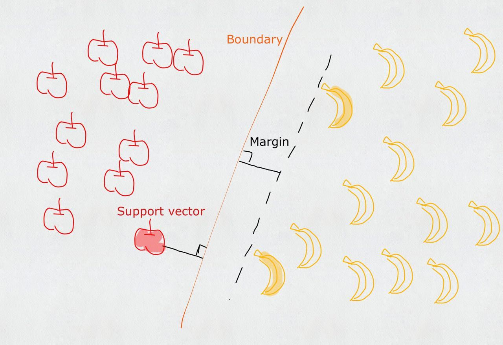


Hypothesis

x -> f -> theta * f

training

cost: cost1(theta * f) + cost0(theta * f)

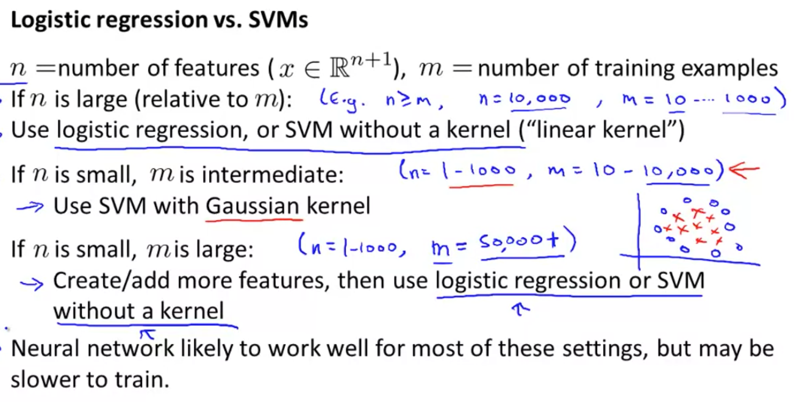

## Unsupervised Learning

### K-Means

> Solve Clustering Proble

**Inputs**

* Number of clusters (K)
* Unlabelled data set  {x_1 ... x_m}

**Algorithms**

```python
Randomly initialize K cluster centrods: centrod[K]

while True {
    # Cluster assignment: Choose c minimize J
 	for i in range(1, m + 1):
    	c[i] = index of centroid closest to x_i
    
    # Move centroid: Choose mu minimize J
    for k in range(1, K + 1):
    	centrod[k] = mean of points assigned to cluster k 
}
```

**Cost Function**

$J = \frac{1}{m}\sum_{i=1}^{m} ||x^{(i)}-\mu_{c^{(i)}}||^2$

The average distance between each point and its assigned centroid

The cost should continuous to decrease with respect to #iterations as the loop continous to minimize it.

**Random Initialization**

Suppose we run the loop enough for the cost function to converage, the only factor to the cost function will be how the centroids were initialized. An unlucky initialization can cause a local optimal instead of a global one. 

So we should do multiple random initialization and choose the one with the best result.

For each initialization, we can randomly pick K points from the training set and assign them as the centroid.

### Pincipal Component Analysis

> Use for data's dimension reduction

**Principal component analysis** (**PCA**) is the process of computing the principal components and using them to perform a change of basis on the data, sometimes using only the first few principal components and ignoring the rest.

A best-fitting line is defined as one that minimizes the average squared distance from the points to the line. 

It's commonly used for dimensionality reduction by projecting each data point onto only the first few principal components to obtain lower-dimensional data while preserving as much of the data's variation as possible.

#### Application

* Compression
	* Reduce storage needed to store data
	* Speed up learning algorithm as the input's dimension is reduced
* Visualization
	* Reduce data to 2D or 3D allow the visualization of datas
* Bad Use of PCS
	* Use PCA to reduce the number of features in order to prevent overfitting
		* This is not a good idea, you might be throwing away valuable information in the compression, regularization is always a better idea.

#### Algorithm

1. Preprocess the data set: Mean normalization/ Featurue scaling
2. Compute covariance matrix $\sum$
3. Compute the principle components $U$: The Eigenvectors of $\sum$
4. Reduce matrix $U_{reduce} = U(:, 1:k)$: That converts data to k-dimension
5. Reduced input $z=U_{reduce}^T \times x$

 To reconstruct from compressed representation, we simply let $x=U_{reduce} \times z$

#### Parameter Selection


> The distance moved with respect to the original distance is less than 1%

A equivalent less costly computation can be done by


## Application of ML

### Anomaly Detection

**Anomaly detection** is the identification of rare items, events or observations which raise suspicions by differing significantly from the majority of the data. Typically the anomalous items will translate to some kind of problem such as bank fraud, a structural defect, medical problems or errors in a text.

Three broad categories of anomaly detection techniques exist.

* **Unsupervised anomaly detection** techniques detect anomalies in an unlabeled test data set under the assumption that the majority of the instances in the data set are normal by looking for instances that seem to fit least to the remainder of the data set. 
* **Supervised anomaly detection** techniques require a data set that has been labeled as "normal" and "abnormal" and involves training a classifier (the key difference to many other [statistical classification](https://en.wikipedia.org/wiki/Statistical_classification) problems is the inherent unbalanced nature of outlier detection). 
* **Semi-supervised anomaly detection** techniques construct a model representing normal behavior from a given *normal* training data set, and then test the likelihood of a test instance to be generated by the learnt model.

#### Algorithm 

**Density Estimation (Unsuperviase)** 

1. Choose features sets $x = \{x_1, x_2, x_3 ...\}$

2. Compute parameter

    * $\mu_j=\frac{1}{m}\sum x_j^{(i)}$
    * $\sigma_j^2=\frac{1}{m}\sum (x_j^{(i)} - \mu_j)^2$

3. Given new example $x$, compute $p(x)$

    $p(x)=\prod p(x_j; \mu_j, \sigma_j^2)$ and it's anomaly if $p(x)<\epsilon$ 

**Evaluation of algorithm**

1. Fit model $p(x)$ on training set
2. On cross validation set, make prediction and compute precision/ recall, choose parameter $\epsilon$

**Diagonose**

Suppose the algorithm is performing poorly and cannot differentiate positive and negative example, we can try coming up with more features to distinguish the normal and anomalous examples.

#### Which algo to use?

##### Anomaly detection (Density Estimation)

* Very small number of positive (Anomalous) examples and large number of negative (Normal) examples.  
* Many different “types” of  anomalies. Hard for any algorithm to learn from positive examples  what the anomalies look like
* Future anomalies may look nothing like any of the anomalous examples we’ve seen so far.

##### Supervised learning

* Large number of positive and negative example
* Enough positive examples for  algorithm to get a sense of what  positive examples are like
* Future  positive examples likely to be  similar to ones in training set. 

### Collaborative Filtering

#### Content based recommander

* Given features defining the types of movies $x$, and ratings user gives, we compute $\theta$ where $\theta^{T} x$ predicts the rating a certain user will give to a certain type of movie. 
* Or, given the ratings user gives and user's favoring types, we can compute the types of a movie $x$  
    * Find $x$ such that for all $\theta$ , $\theta ^T x$ is the closest to the rating that user gives

##### Problem formulation

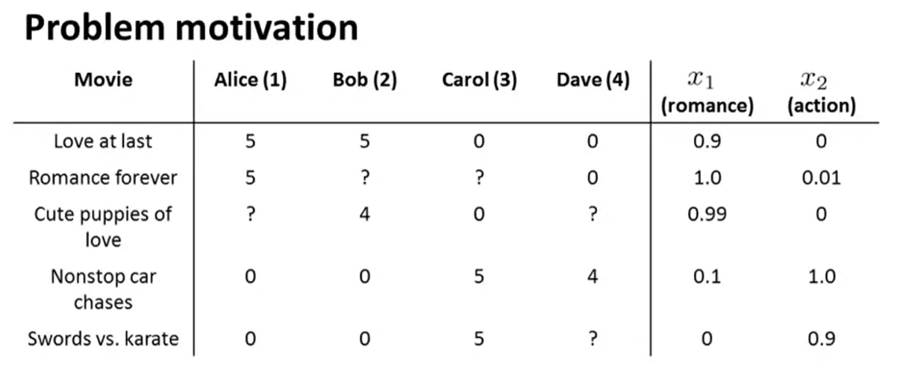

Each movies has a feature vector describing its type.

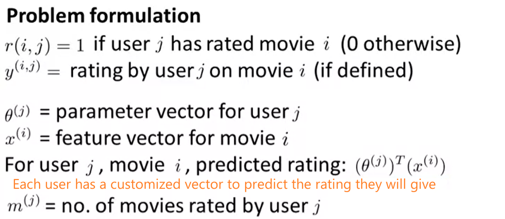

##### Cost Function

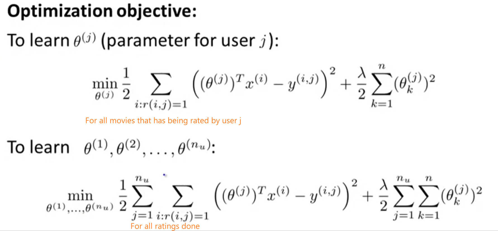

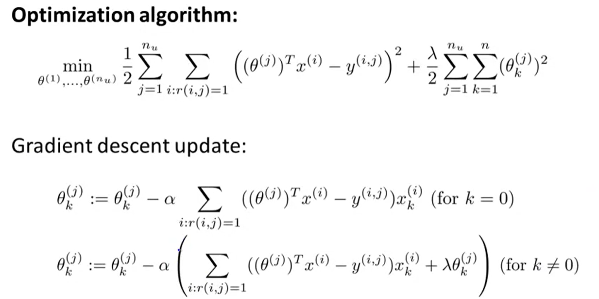

#### Collaborative Filtering

##### Predict rating and user preference

Since we can learn $\theta$ (User preference) from $x$ (The type of movie) and the rating,  as well as $x$ from $\theta$ (Modelled by user's preference), we can combine the learning process for both together.

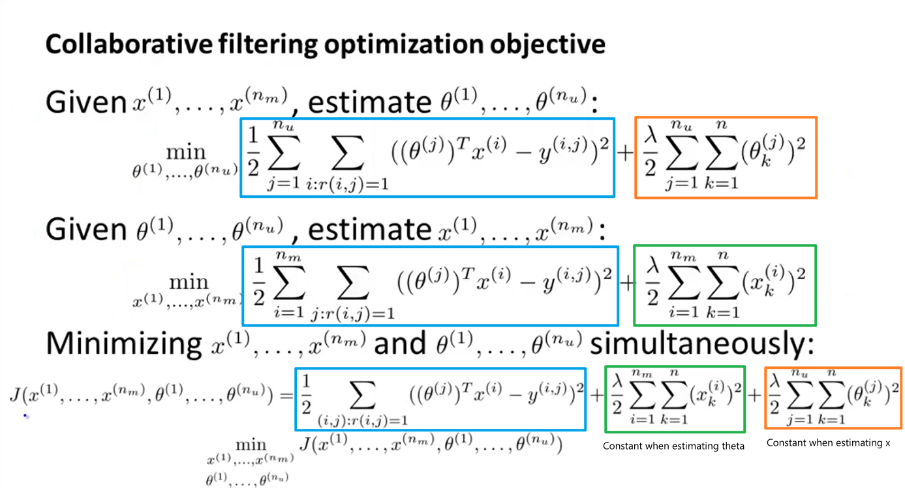

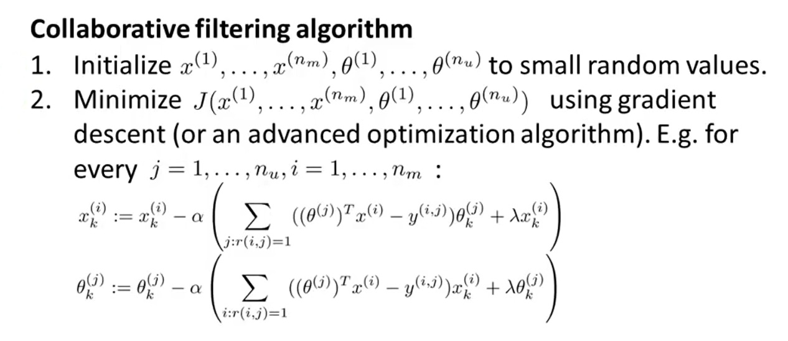

##### Predict similarity

Given product A, B with features $x_1, x_2$, computing  $||x_1 - x_2||$ gives the degree to which they are similar.

##### Preprocessing

Suppose there's a user who has never rated any movies, as a result of the cost's function's optimizing objective, $\theta$ will be set close to 0 and we will predict that the person will rate 0 for all movies which doesn't make sense. 

To resolve this, we can perform mean normalizaiton

1. Subtract each user's rating gave by the mean of that movie (Mean becomes 0)
2. Apply the usual Collaborative Filtering algorithm
3. Add the mean back and obtian the actual rating predicts

This way, that user will predict the mean score for every movie.

## Pytorch

channels

An images has a width and height, each pixel on the images haves 3 **channels**: RGB. 

A convolution layer received image $(w\times h\times c)$ as input and generate an activation of $(w'\times h'\times c')$ . The fileter for such convolution is a tensor of dimension $(f×f×c×c′)$ where $(f\times f \times c)$ is the dimension of the kernel, and $c'$ is the number of kernel applied. One filter gives one value, $c'$ values correspond to $c'$ channels in the output.

```python
torch.nn.Conv1d(in_channels, out_channels, kernel_size)
```


```python
torch.max(input, dim, keepdim=False, *, out=None)
```

