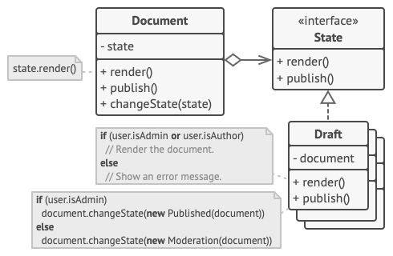
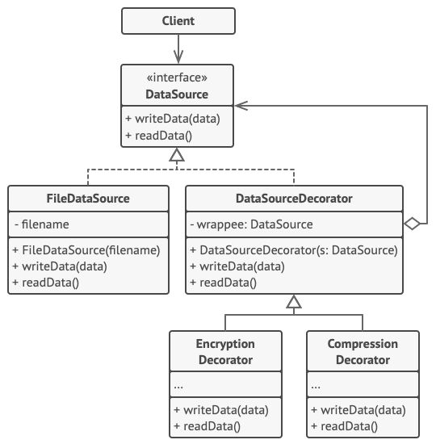
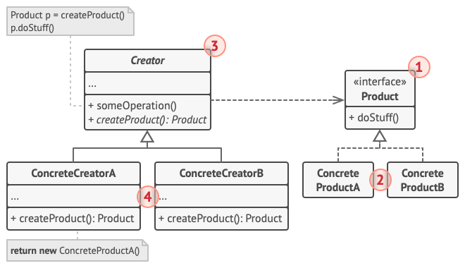

# Java Overview

## Java Framework

Java is system that includes

* The Java syntax
* VM for different hardware platform
* Byte code ended in `.class`
* Java API (provided by jdk), official library
* Commercial and third party libraries


`.java`: Source code written in plain test file

`.class`: Compiled `.java` non-machine-specific byte code

The Java VM (Machine-specific) can then run `.class` file as executable.

# The Language

## OOP Concepts

### Object

Real-world objects share two characteristics: *state* and *behavior* which are translate the the world of OOP.

* state - fields (Attributes)
* behavior - methods

Hiding internal state and requiring all interaction to be performed through an object's methods is known as ***data encapsulation*** — a fundamental principle of object-oriented programming.

### Class

A *class* is the blueprint from which individual objects are created. It summarises the properties (attributes) and operations (methods) of a specific kind of objects.

In object-oriented terms, we say that your bicycle is an *instance* of the *class of objects* known as bicycles

### Inheritance

Different kinds of objects often have a certain amount in common with each other. Yet each also defines additional features that make them different.

OOP allows classes to *inherit* commonly used state and behavior from other classes to provoke **code reuse**. In the Java programming language, each class is allowed to have one direct superclass, and each superclass has the potential for an unlimited number of *subclasses*.

### Interface

Objects define their interaction with the outside world through the methods that they expose. Methods form the object's *interface* with the outside world.

Implementing an interface allows a class to become more formal about **the behavior it promises to provide**. Interfaces form a contract between the class and the outside world. 

And this contract is enforced at build time by the compiler. If your class claims to implement an interface, all methods defined by that interface must appear in its source code before the class will successfully compile.

### Inheritance VS Interface

Use an **interface** if you want to define **a contract**. I.e. X must take Y and return Z. It doesn't care *how* the code is doing that. A class can implement *multiple* interfaces.

Use an **abstract class** if you want to define **default behaviour** in non-abstract methods so that the endusers can reuse it without rewriting it again and again.

### Implementation

#### Encapsulation


#### Inheritance

#### Polymorphism

Polymorphism is Java is allowing 

* a subclass to be passed in where superclass is needed
* Let a superclass reference type points to a subclass instance

## Java Language Basics

### Variables

#### Primitive Type

> byte (1), short (2), int (4), long (8)
>
> * L enforce long
> * Binary 0b; Hex 0x; Oct 0
>
> float (4), double (8)
>
> * D enforce double, F enforce float
>
> char (2)
>
> * `'` encloses char
> * `"` encloses String
>
> boolean (1)

#### Array

```java
/* 1D Array: declaration */
int[] a = new int[10];
int[] a = new int[]{1, 2, 3, 4};
int[] arr = {1, 2, 3, 4};

/* 2D Array: declaration */
int[][] arr = new int[3][4];
int[][] arr = new int[3][];  /* The second layer is not initialized */
int[][] arr = {{1,2},{3,4,5,6},{7,8,9}};

/* Clone a 2D Array */
boolean copy = Arrays.stream(game_state).map(boolean[]::clone).toArray(boolean[][]::new);
```

### Operators

### Expression

### Control Flow

```java
/* if */
if () {}
if () {} else {}
if () {} else if {} else {}

/* while */
while (true){}

do {
     statement(s)
} while (expression);

/* for */
for (initialization; termination; increment) {
    statement(s)
}    

for (int item : numbers) {}
    
/* switch 
 * All statements after the matching case label are executed in sequence. Hence break is      
 * needed.
 */
switch (variable) {
    case [value]: case [value]:
        break;
    default:
        break;
}
```

## Class and Objects

### Class

#### Declaration

```java
class MyClass extends MySuperClass implements Interface1, Interface2  {
    // field, constructor, and 
    // method declarations
}
```

#### Visibility modifiers

| Access Modifier | within class | within package | outside package by subclass only | outside package |
| :-------------- | :----------- | :------------- | :------------------------------- | :-------------- |
| **Private**     | Y            | N              | N                                | N               |
| *No modifier*   | Y            | Y              | N                                | N               |
| **Protected**   | Y            | Y              | Y                                | N               |
| **Public**      | Y            | Y              | Y                                | Y               |


The following table shows the visibility of Alpha to other classes.

| Modifier      | Alpha | Beta | AlphaSub | Gamma |
| ------------- | ----- | ---- | -------- | ----- |
| `public`      | Y     | Y    | Y        | Y     |
| `protected`   | Y     | Y    | Y        | N     |
| *no modifier* | Y     | Y    | N        | N     |
| `private`     | Y     | N    | N        | N     |

* `public` and `private` are the most commonly used
* Use the most restrictive access level
* Avoid `public` for constants

#### Constructor

> A class contains constructors that are invoked to create objects from the class blueprint. Constructor declarations look like method declarations—except that they use the name of the class and have no return type.

##### Object Creation Rule

When instantiating an object, its super classes get to initialize their variables first, in an top down manner. 

The field varaibles are initialized prior to the constructor.

**Compiler Rule**

* If a class doesn't have an explicit superclass, the compiler will add `extends Object` for you.
* If a class doesn't have an constructor, the compiler will automatically create a constructor for you and call `super() ` inside it (If there's no non-argument constructor in the super class, it will cause compiler error)
* The first line of a constructor must be either `this(...)` or `super(...)` (In subclass, we should call super and then set the subclass instance variables)

#### Parameters

##### Variable number of argument

```java
/* args is treated as an array of arguments */
public Polygon polygonFrom(Point... corners) 
public PrintStream printf(String format, Object... args)
```

A construct called *varargs* can be used to pass arbitray number of values to a method. When there's multiple arguments, it's the last one.

### Objects

#### Create Object

```java
Point originOne = new Point(23, 94);
```

Each of these statements has three parts (discussed in detail below):

1. **Declaration**: The LHS are all variable declarations that associate a variable name with an object type. (Allocate a variable)
2. **Instantiation**: The `new` keyword is a Java operator that creates the object (Allocate memory and return a reference).
3. **Initialization**: The `new` operator is followed by a call to a constructor, which initializes the new object. (Initialize the allocated object)

#### Using Object

##### Referencing Field

Within its own class: Use bare variable name

Outside the class: Use `.`

##### 'this' Keyword

**Usages**

* Reference a shadowed field
* Call another constructer in the same class to provoke code reuse (If present, must be the first line)

##### 'static' Keyword

> The use of the `static` keyword to create fields and methods that belong to the class, rather than to an instance of the class.

```java
private static int numberOfBicycles = 0; // Class fields
public static int getNumberOfBicycles() {};   // Class methods
static final double PI;  // Class constants
```

###### Class field

Should be referenced by the class name instead of object reference.

###### Class methods

Class methods cannot access instance variables or instance methods directly. As they belong to instance not the class

###### Class constants

Usually all upper case.

static cannot use `this`, `super` as them refer to object.

#### Initializing fields

**Static initialization blocks** and **instance initialization blocks** can be used to place initialization code that depends on the outside environment. The runtime systems will put them back to the constructor.

static initialization code gets called only once when the class itself is initialized whereas the instance initialization code get called every time an instance is constructed.

```java
public class Foo {
    private static final int widgets;

    /* Only get called one */
    static {
        int first = Widgets.getFirstCount();
        int second = Widgets.getSecondCount();
        // Imagine more complex logic here which really used first/second
        widgets = first + second;
    }
    
    /* Get invoked for every instance construction */
    {
        // Instance initialization block
    }
}
```

## Interfaces

Interface is a contract that defines the desired behavior of a class.

In the Java, an *interface* is a reference type, similar to a class, that can contain *only* constants, method signatures, default methods, static methods, and nested types. 

Method bodies exist only for default methods and static methods. Interfaces cannot be instantiated—they can only be *implemented* by classes or *extended* by other interfaces. 

### Declaration

```java
public interface GroupedInterface extends Interface1, Interface2, Interface3 {
    // constant declarations: Implicitly public, static, final
    double E = 2.718282;
 
    // All methods implicitly public
    void doSomething (int i, double x);  // Abstract Methods
    void default_method() {}    // Default: Invoked with instance
    static void static_method() {}   // Static: Invoked with interface
    
    // Default and static need a function body
    // Default can be overriden while static cannot
}
```

An interface can extend other interfaces, just as a class subclass or extend another class. 

However, whereas a class can extend **only one** other class, an interface can extend **any number** of interfaces. The interface declaration includes a comma-separated list of all the interfaces that it extends.

#### Implement Interface

```java
public class AList<Item> implements List61B<Item> {
    @Override // For the purpose of error checking
}
```

### Use Interface as a type

Whenever an interface is declared, a new reference data type is declared. A reference variable whose type is an interface can only be assigned to object that's an instance of a class that implements the interface.

When a class implement an interface, their instances object can be of both their own class (or superclass) type and a interface type.

This allow methods to be defined that can operates on all classes that implements certain interface.

### Adding methods to interface

Suppose after some time, you wish to add a new method to the interface. Adding it directly can break the old classes that implements it. So to do this safely, we could define a new interface that **extends** the old interface and let the developers decide if they want to immigrate.

Note that the adding of **default** or **static** method won't break the old classes.

### Default methods

> Default methods enable you to add new functionality to existing interfaces and ensure binary compatibility with code written for older versions of those interfaces. In particular, default methods enable you to add methods that accept lambda expressions (lambda functions) as parameters to existing interfaces.

Default methods of an interface cannot access instance variable of the subclasses. Default methods can only call methods that are defined in the interface.

* Subclass can inherit default methods from the superclass.
* Default methods can be overridden.
* Default methods are invoked using instance

#### Extend an interface

When extending an interface that contains a default method, you can do the following:

- Not mention the default method at all, which lets your extended interface inherit the default method.
- Redeclare the default method, which makes it `abstract`.
- Redefine the default method, which overrides it.

#### Example

> This section demonstrates how the **Comparator** interface has been enhanced with default and static methods.

##### Comparable

Comparable is an java interface that contains default methods. Classes that implement its abstract methods `int compareTo(T o)` can make use of them.

```java
public interface Comparable<T> {
    int compareTo(T o);
}
```

##### Comparator

Comparator is a functional interface and can therefore be used where lambda expression or method reference is needed.

```java
public interface Comparator<T> {
    // Abstract Methods
    int compare(T o1, T o2);
    boolean equals(Object obj);
    
    // Default Methods
    
    /* Returns a comparator that imposes the reverse ordering of this comparator. */
    default Comparator<T> reversed() {}

    // Static Methods
    
 /* Accepts a function that extracts a sort key from a type T, and returns a 
 Comparator<T> that compares by that sort key using the inputted Comparator. */
 static Comparator<T> comparing(Function keyExtractor, Comparator keyComparator) {}
}
```

##### reversed (Default)

The default `reversed` method is able to create a new Comparator from an existing one, which enhance the Comparator interface.

##### comparing (Static)

The static `comparing` method creates a Comparator from an key extracting function, enhanced the capability of the Comparator interface.

### Static methods

A static method is a method that is associated with the class in which it is defined rather than with any object. Every instance of the class shares its static methods. **Static methods cannot be overridden (Default method can).**

static methods can also be defined in interface. This makes it easier for you to organize helper methods in your libraries; you can keep static methods **specific to an interface** in the same interface rather than in a **separate class**.

**static methods in interfaces are never inherited.**

## Inheritance

> Excepting `Object`, which has no superclass, every class has one and only one direct superclass (single inheritance). In the absence of any other explicit superclass, every class is implicitly a subclass of `Object`.

```java
class SuperClass {
    int i = 1;
    int f() {}
}

class SubClass extends SuperClass {
    int i;      // Hide i from super class
    int f() {     // Override 
        i = super.i + 1;  // Retrive hidden field
        return super.f() + i; // Invoke overridden functions
    }
}
```

### Subclass

A subclass inherits

* *public* and *protected* members
* *package-private* members, if the subclass is in the same package as its parent

<u>Constructors</u> are not members, so they are not inherited by subclasses, but the constructor of the superclass can be invoked from the subclass.

You can use the inherited members as is, replace them, hide them, or supplement them with new members:

**Declare new**

- You can declare new fields/ methods in the subclass that are not in the superclass.
- You can write a subclass constructor that invokes the constructor of the superclass, either implicitly or by using the keyword `super`.

**Hide**

- **Field** in the subclass with the same name *hiding* the one in superclass (not recommended). The `super` keyword can be used to refer to overriden method/ hidden field in the subclass.
- **Static Method** with the same signature can be hidden.

#### Private Members

Subclass does not inherit the <u>private</u> members. However, the superclass has public or protected methods (getters/ setters) for accessing its private fields, these can also be used by the subclass.

A nested class has access to all the private members of its enclosing class—both fields and methods. Therefore, a public or protected nested class inherited by a subclass has indirect access to all of the private members of the superclass.

#### Casting

We can do logical test before casting to avoid runtime error.

```java
if (obj instanceof MountainBike) {
    MountainBike myBike = (MountainBike)obj;
}
```

### Overriding/ Hiding

**Defining a Method with the Same Signature as a Superclass's Method**

> Signature only includes function name and parameters (Return type does not matters)

|                          | Superclass Instance Method | Superclass Static Method |
| ------------------------ | -------------------------- | ------------------------ |
| Subclass Instance Method | Overrides                  | Error                    |
| Subclass Static Method   | Error                      | Hides                    |

- The static method that gets invoked depends on the declared type of reference.
- Instance method depends on concrete type, not the type of reference.

#### Interface Methods

Default methods and abstract methods in interface are inherited like instance methods.

When the supertypes of a class or interface provide multiple default methods with the same signature, the compiler follows inheritance rules to resolve the name conflict. 

* Instance methods invoked instead of interface default methods
* Methods that are already overridden by other candidates are ignored. This circumstance can arise when supertypes share a common ancestor.
* Inherited instance methods from classes can override abstract interface methods. 从Super Class继承的Methods可以Override Interface的Methods

#### Modifier

The access specifier for an overriding method can allow more, but not less, access than the overridden method. 可以给更多权限，但不能给更少。

#### Covariance

* Covariance: Return type can be the same or a subtype (Postcondition can only be stricter)
    * Contra-variance of method argument is not overriding but overloading

### 'Object' Class Methods 

> The 'Object' class is the top of the class hierarchy tree. Every class will inherits the instance methods of 'Object'. You may  need to override some of them specific to your class. 
>
> The methods that will be discussed are the following:

```java
protected Object clone();   /* Create and return a copy */
public boolean equals(Object obj); /* Indicate whether equal */
protected void finalize();   /* Called by garbage collecter to check #reference */
public final Class getClass();  /* Return run-time class */
public int hashCode(); 
public String toString();
```

#### clone()

`Object`'s implementation checks whether the object implements the `Cloneable` interface. 

If the object does not, the method throws a `CloneNotSupportedException` exception.

#### equals()

The default implementation in `Object` use `==` to check if the two objects are equal which usually not our desired behavior, hence we should override it. 

**Note:** If you override `equals()`, you must override `hashCode()` as well. 

```java
public boolean equals(Object o) {
    if (o == null) return false;
    if (o == this) return true;
    if (o.getClass() != this.getClass()) return false;
    
    // Some sort of casting then compare
    Objects.equals(o.field1, field1);
}
```

#### hashCode()

The return value will be an integer generated by a hashing algorithm.

By definition, if two objects are equal, their hash code *must also* be equal. If you override the `equals()` method, you change the way two objects are equated and `Object`'s implementation of `hashCode()` is no longer valid. Therefore, if you override the `equals()` method, you must also override the `hashCode()` method as well.

#### getClass()

It cannot be overridden.

It return a `Class` object which has methods that can be used to get information about the class. 

```java
getSimpleName();
getSuperclass();
getInterfaces();
```

#### toString()

It returns a `String` representation of the object which can be used with `System.out.println()`.

### Final Classes/ Methods

`final` keyword indicated that the method cannot be overriden by subclasses.

Methods called from constructors should generally be declared final. If a constructor calls a non-final method, a subclass may redefine that method with surprising or undesirable results.

An entire class can be declared to be final. Such class cannot be subclassed. This is particularly useful, for example, when creating an immutable class like the `String` class.

### Abstract Methods/ Classes

> An *abstract class* may or may not include abstract methods. It cannot be instantiated, but it can be subclassed.
>
> An *abstract method* is a method that is declared without an implementation.

If a class contains abstract methods, the class need to be declared `abstract`

```java
public abstract class GraphicObject {
   abstract void draw();
}
```

When an abstract class is subclassed, the subclass usually provides implementations for all of the abstract methods in its parent class. However, if it does not, then the subclass must also be declared `abstract`.

> Methods in an interface that's not default or static is implicitly abstract.

`this` reference to the same object in the super abstract class as in the subclass.

#### Difference to Interfaces

In abstract classes, we can have

* Non static, final fields (Not constant)
* public, protected and private concrete methods (Non-abstract), as oppose to only public in interface
* you can extend only one class, whether or not it is abstract, whereas you can implement any number of interfaces.

#### Choose which to use

**Abstract classes**

* Share code among closely related classes
* The subclasses require access modifiers other than public.
* You want to declare non-constant fields. This allow methods that can access and modify the state of the object.

**Interface**

* Expect nunrelated classes to implement this interface (Comparable is implemented by all unrelated classes)
* Wish to specify the behavior of particular data type (This class), but not about who implements its behavior
* You want to take advantage of multiple inheritance of type.

**Examples in JAVA**

An example of an abstract class in the JDK is [`AbstractMap`](https://docs.oracle.com/javase/8/docs/api/java/util/AbstractMap.html)is part of the Collections Framework. Its subclasses (which include `HashMap`, `TreeMap`, and `ConcurrentHashMap`) share many methods (including `get`, `put`, `isEmpty`, `containsKey`, and `containsValue`) that `AbstractMap` defines.

Note that many software libraries use both abstract classes and interfaces; the `HashMap` class implements several interfaces and also extends the abstract class `AbstractMap`.

#### Example

In an object-oriented drawing application, you can draw circles, rectangles, lines, Bezier curves, and many other graphic objects. These objects all have certain states (for example: position, orientation, line color, fill color) and behaviors (for example: moveTo, rotate, resize, draw) in common. Some of these states and behaviors are the same for all graphic objects (for example: position, fill color, and moveTo). Others require different implementations (for example, resize or draw). All `GraphicObject`s must be able to draw or resize themselves; they just differ in how they do it. This is a perfect situation for an abstract superclass. 

#### Abstract Class implement Interface

Unlike a normal class, an `abstract` class need not to implement all of an interface's methods.

## Summary

### Interface & Abstract Class

```java
/* Declaration */
public interface GroupedInterface extends Interface1, Interface2 {
     // Implicitly public, static, final (Constant)
    double E = 2.718282;
 
    // All methods implicitly public
    void doSomething (int i, double x);  // Abstract Methods
    void default_method() {}    // Default: Invoked with instance
    static void static_method() {}   // Static: Invoked with interface
}

/* Implements */
public class AList<Item> implements List61B<Item> {}
```

| Similarity                | Difference                                                   |
| ------------------------- | ------------------------------------------------------------ |
| Cannot be instantiate     | Abstract class can have **non-constant** fields, **non-public** methods |
| Contains abstract methods | Abstract class can have **concrete** methods                 |
|                           | One can **extends** one abstract class, but **implements** more inte |

### Inheritance

Inherited: *public* and *protected* members

Not inherited: Constructors (Invoked with `super()`)

Same signature

|        | Field   | Instance Method | Static Methods                    |
| ------ | ------- | --------------- | --------------------------------- |
| Nature | Hide    | Override        | Hide                              |
| Invoke | `super` |                 | Whether invoked from super or sub |

## Numbers & Strings

## Generic

> Genric enables type to be parameters when defining classes, interfaces and methods. This provokes code re-use.
>
> Advantages
>
> * Strong type checks at compile time
> * Elimination of casts in the use of Object

### Generic Type

```java
class name<T1, T2, ..., Tn> {}
```

The type parameter secion `<>` specifies the type parameters that will be used. A type variable can be any any **non-primitive** type you specify.

**Naming Conventions**

By convention, type parameter are single, uppercase letters.

- E - Element (used extensively by the Java Collections Framework)
- K - Key
- N - Number
- T - Type
- V - Value
- S,U,V etc. - 2nd, 3rd, 4th types

**Invoke and instantiat a Generic Type**

```java
/* Box<T> */
Box<Integer> integerBox = new Box<Integer>();

/* Since JAVA can do type inference, we can also do */
Box<Integer> integerBox = new Box<>();

/* The type paremeter can be substitute with a parameterized type */
OrderedPair<String, Box<Integer>> p = new OrderedPair<>("primes", new Box<Integer>());
```

### Generic Methods

> *Generic methods* are methods that introduce their own type parameters. This is similar to declaring a generic type, but the type parameter's scope is limited to the method where it is declared.

```java
public class Util {
    /* Type parameters session written before teh return type */
    public static <K, V> boolean compare(Pair<K, V> p1, Pair<K, V> p2) {
        return p1.getKey().equals(p2.getKey()) &&
               p1.getValue().equals(p2.getValue());
    }
}

/* Explicit invocation  */
boolean same = Util.<Integer, String>compare(p1, p2);

/* Type inference */
boolean same = Util.compare(p1, p2);
```

### Bounded Type Parameter

> Bounded type parameters allows restriction on types that can be used as type argument in a parameterized type. It also allows you to invoke methods defined in the bounds (e.g. Use methods that assume the type).

```java
public <U extends Number> void inspect(U u) {}

/* Multiple Bounds: A type variable with multiple bounds is a subtype of all the types listed in the bound. If one of the bounds is a class, it must be specified first. */
<T extends B1 & B2 & B3>	// <T extends Comparable<T>>
```

#### Generic Methods with Bounded Type Parameters

```java
/* This will not compile. Because the greater than operator (>) applies only to primitive types such as short, int, double, long, float, byte, and char. */
public static <T> int countGreaterThan(T[] anArray, T elem) {
    int count = 0;
    for (T e : anArray)
        if (e > elem)  // compiler error
            ++count;
    return count;
}

/* To fix the problem, use a type parameter bounded by the Comparable<T> interface */
public interface Comparable<T> {
    public int compareTo(T o);
}

public static <T extends Comparable<T>> int countGreaterThan(T[] anArray, T elem) {
    int count = 0;
    for (T e : anArray)
        if (e.compareTo(elem) > 0)
            ++count;
    return count;
}
```

### Inheritance & Subtype

> `Box<Integer>` is not a subtype of `Box<Number>` even though `Integer` is a subtype of `Number`.


Otherwise, you can perform the following illegal operation

```java
Box<Integer> b1 = new Box<>();
Box<Number> b2 = b1;
b2.put(new Double(0.5));	// Illegal
```

> However, the subtyping relationship is preserved between the types if the type argument is the same.


### WildCard (万能牌)

> WildCard represent an unknown type.

#### Bounded Wildcard

```java
List<? extends Number>;		/* Upper Bounded: Read only */
List<?>;					/* Unbounded */
List<? super Integer>;		/* Lower Bounded: Insertion safe */
```

**Upper Bounded**

`List<Number>`: Matches list of `Number` only

`List<? extends Number>`: Matches a list of type `Number` or any of its subclasses. e.g. Double, Integer ...

**Unbounded**

```java
/* Does not work on List<Integer>, List<String>, as subtype relation is not preserved for generic */
public static void printList(List<Object> list) {
    for (Object elem : list)
        System.out.println(elem + " ");
    System.out.println();
}

/* Work as for any concretet type A, List<A> < List<?> */
public static void printList(List<?> list) {
    for (Object elem: list)		// Unbounded wildcard type can be treated as Object
        System.out.print(elem + " ");
    System.out.println();
}
```

`List<Object>` and `List<?>` are not the same. You can insert an `Object`, or any subtype of `Object`, into a `List<Object>`. But you can only insert `null` into a `List<?>`

Useful in two cases:

* If you are writing a method that can be implemented using functionality provided in the `Object` class.
* When the code is using methods in the generic class that don't depend on the type parameter. For example, `List.size` or `List.clear`. In fact, `Class<?>` is so often used because most of the methods in `Class<T>` do not depend on `T`.

#### Subtype Relation


#### Wildcard GuildLine

> https://docs.oracle.com/javase/tutorial/java/generics/wildcardGuidelines.html
>
> For purposes of this discussion, it is helpful to think of variables as providing one of two functions:
>
> - **An "In" Variable**
>
>     An "in" variable serves up data to the code. Imagine a copy method with two arguments: `copy(src, dest)`. The `src` argument provides the data to be copied, so it is the "in" parameter.
>
> - **An "Out" Variable**
>
>     An "out" variable holds data for use elsewhere. In the copy example, `copy(src, dest)`, the `dest` argument accepts data, so it is the "out" parameter.

**Wildcard Guidelines:** 

- An "in" variable is defined with an upper bounded wildcard, using the `extends` keyword.
- An "out" variable is defined with a lower bounded wildcard, using the `super` keyword.
- In the case where the "in" variable can be accessed using methods defined in the `Object` class, use an unbounded wildcard.
- In the case where the code needs to access the variable as both an "in" and an "out" variable, do not use a wildcard.

Generally, a list defined by `List<? extends ...>` can be informally thought of as read-only. As we don't know what the list is actually containing, so we cannot insert to it.

These guidelines do not apply to a method's return type. Using a wildcard as a return type should be avoided because it forces programmers using the code to deal with wildcards.

### Restriction on Generic

* Cannot Instantiate Generic Types with Primitive Types

	* Use Integer, Character instead of int, char (The object wrapper takes more space)

* Cannot Create Instances of Type Parameters

	* ```java
		E elem = new E();  // compile-time error
		```

* Cannot Declare Static Fields Whose Types are Type Parameters `static T x`

* Cannot Use Casts or instanceof With Parameterized Types. 

* Cannot Create Arrays of Parameterized Types

* Cannot Create, Catch, or Throw Objects of Parameterized Types

* Cannot Overload a Method Where the Formal Parameter Types of Each Overload Erase to the Same Raw Type

## Packages

> This lesson explains 
>
> * how to bundle classes and interfaces into packages
> * how to use classes that are in packages
> * how to arrange your file system so that the compiler can find your source files.

**Create a package**

Put `package <package_name>` at the top of each file that's to be included in the package. Only one type in a single source file can be `public` and its name need to be the same as the filename.

**Naming a package**

* All lower case
* begin with a domain name

### Import

> For convenience, the Java compiler automatically imports two entire packages for each source file: (1) `java.lang` (2) the current package (the package for the current file).

To use a member from outside the package

- Refer to the member by its fully qualified name. e.g. `graphics.Rectangle myRect = new graphics.Rectangle();`

- Import the package member

	```java
	import graphics.Rectangle;
	Rectangle myRectangle = new Rectangle();
	
	/* Import public nested classes, will not import Rectange */
	import graphics.Rectangle.*;
	```

- Import the member's entire package

	```java
	import graphics.*;
	Rectangle myRectangle = new Rectangle();
	```

**Hierachies of Packages**

Packages are not hierarchical. For example, `java.awt` does not include `java.awt.color` or `java.awt.font`

**Ambiguities**

If a member appear in both packages, they should be referenced using fully qualified name.

**Static Import**

```java
import static java.lang.Math.PI;
import static java.lang.Math.*;
```

We could use this statement to import constants and static methods.

### Manage Package File

The name of the package member should be parallel to its path name

- **class name** – `graphics.Rectangle`
- **pathname to file** – `graphics\Rectangle.java`

**CLASSPATH**

> Where the compiled `.class` file are placed

If `<class_path>\classes` is set in the CLASSPATH variable, a `.class` files of the package `com.example.graphics` should be place in`<class_path>\classes\com\example\graphics`

# Essential Classes

## Exeptions

### Category

> **Check or Specify Requirement**: Code that might throw **checked** exceptions must be enclosed by either  `try` handler or a method that specifies the exceptions that can be thrown.

* **Checked Exception**: Exceptions that a well-written application should be able to anticipate and recover from. All exceptions are checked exceptions, except for those indicated by `Error`, `RuntimeException`, and their subclasses.
* **Error**: Exceptional conditions <u>external</u> to the application. Application cannot anticipate or recover from them. Errors are indicated by `Error` and its subclasses.
* **Runtime excetpion**: Exceptional conditions <u>internal</u> to the application. These usually indicate programming bugs, such as logic errors or improper use of an API. The application can catch this exception, but it probably makes more sense to eliminate the bug that caused the exception to occur.  Runtime exceptions are those indicated by `RuntimeException` and its subclasses.


```java
public void writeList() throws IOException { // Only checked are necessary
    try {
        // Codes that might throw exception
    } catch (ExceptionType name) {
        
    } finally {
        // Alway execute then try block exists
        // Can contains clean up code
    }
}
```

### Execution Order

* If catch contains a return statement, the return value will be stored to be returned after the exection of the finally block.
    * If the finally block contains a return statement, the return statement in the catch will not be executed.
    * It is not a good pratise to have return statement in the finally block.

### Methods

- getCause()：返回抛出异常的**原因**，即异常提示信息。如果 cause 不存在或未知，则返回 null。
- getMessage()：返回异常的**消息信息**，即该异常的名称与详细信息字符串
- printStackTrace()：在控制台输出该**异常的名称与详细信息字符串、异常出现的代码位置**

### Inheritance

* If the superclass declares an exception list, the subclass can choose to not declare one
* All exceptions in the subclass's list must belongs to the exception list of its superclass. It must not throw more exceptions.

## I/O

### I/O Stream

#### Byte Stream

All  byte Stream's abstract superclass: `InputStream`, `OutputStream`

```java
/* OutputStream */
public abstract class OutputStream {
    void close(); // close if not null
    void flush();

    void write(byte[] b); // Write multiple bytes
    void write(byte[] b, int offset, int len);
    abstract void write(int b);  // write a byte
}

/* FileOutputStream */
public class FileOutputStream extends OutputStream {
    // Contrustors
    FileOutputStream(String name);
    FileOutputStream(String name, boolean append);
    
    // Instance methods
    write(byte[] b); // "Hello".getBytes() will do
    ...
}
```


```java
public abstract class InputStream extends Object implements Closeable {
    void close();
    
    abstract int read(); // -1 if EOF
    int read(byte[] b);
    int read(byte[] b, int off, int len);
    long skip(long n);  // lseek
}

public class FileOutputStream extends OutputStream {
    // Constructor
    FileOutputStream(File file);
    FileOutputStream(String name, boolean append);
}
```

#### Character Stream

All character stream's abstract superclass: `Reader`, `Writer`

```java
public abstract class Writer extends Object implements Appendable, Closeable, Flushable {
    abstract void close();
    abstract void flush();
    
    write(char[] cbuf);
    write(char[] cbuf, int off, int len);
    write(int c);
    write(String str);
}

public class FileWriter extends OutputStreamWriter {
    // Constructors
    FileWriter(File file);
    FileWriter(String fileName, boolean append);
}
```

### File I/O

#### The Path Class

>  A `Path` object contains the file name and directory list used to construct the path, and is used to examine, locate, and manipulate files.

##### Path Operations

#### The File Class

> This class offers a rich set of static methods for reading, writing, and manipulating files and directories.

**—创建功能—**

- `public boolean createNewFile()`：**创建文件**，如果文件已存在，不再创建
- `public boolean mkdir()`：**创建单级文件夹**，如果文件夹已存在，不再创建
- `public boolean mkdirs()`：**创建多级文件夹**，文件夹已经存在了,不在创建

> ```
> mkdirs()` 也可以创建单级文件夹，所以推荐使用 `mkdirs()
> ```

**—删除功能—**

- `public boolean delete()`： **删除文件或者文件夹**，不走回收站，**直接从硬盘删除**！

> 如果此路径名表示一个**目录**，则该目录 **必须为空** 才能删除。

**—重命名功能—**

- `public boolean renameTo(File dest)`： **重新命名文件**

**—判断功能—**

- `public boolean isFile()` ：判断File构造方法中封装的路径**是不是文件**
- `public boolean isDirectory()`：判断File构造方法中封装的路径**是不是文件夹**
- `public boolean exists()`： 判断File构造方法中封装的路径**是否存在**
- `public boolean canRead()` ：**读权限**
- `public boolean canWrite()` ：**写权限**
- `public boolean isHidden()` ：**是否隐藏**

**—基本获取功能—**

- `public String getAbsolutePath()`：**获取绝对路径**，返回 **String** 对象
- `public File getAbsoluteFile()`：**获取绝对路径**，返回 **file** 对象（**推荐使用**）

> eclipse和 IDEA环境中,写一个相对路径，获取的绝对位置是**工程根目录**

- `public String getPath()`：将抽象路径名**转换为字符串**（就相当于 **toString**）
- `public String getName()`：返回路径中表示的**文件名**或者**文件夹名** (获取路径中的**最后部分的名字**)
- `public long length()` ：返回路径中表示的**文件的字节数**（文件夹为 0）
- `public long lastModified()` ：上次修改的时间
- `String getParent()`: **获取父路径**，返回String对象
- `File getParentFile()`: **获取父路径**，返回File对象（**推荐使用**）

##### **5. File类高级获取功能**

- `public String[] list()`

- - 获取到 File 构造方法中封装的路径中的**文件和文件夹名** (**遍历一个目录**)，**返回只有名字**
	- 如果此抽象路径名**不表示一个目录**，那么此方法将返回 **null**
	- 返回的是一个**字符串数组**
	- **不会递归的获取**子目录中的信息（文件或者目录的名称）

- `public File[] listFiles()`

- - 获取到 File 构造方法中封装的路径中的**文件和文件夹名** (**遍历一个目录**)，返回的是目录或者文件的 **全路径**
	- 返回一个 **File对象数组**
	- **不会递归的获取**子目录中的信息（文件或者目录的名称）

> **注意**：在获取指定目录下的文件或者文件夹时必须满足下面两个条件
> 1，指定的目录**必须存在**
> 2，指定的**必须是目录**。否则容易引发 **返回数组为null**，出现NullPointerException

##### **6. 文件过滤器**

- `listFiles(FileFilter filter)` : 传递 FileFilter 接口的**实现类**

- `FileFilter 接口`:

- - 必须**自定义** FileFilter 接口实现类，重写抽象方法，然后将接口实现类对象传递到遍历方法 listFiles
	- `boolean accept(File pathname)` 返回 true 满足条件，回false不满足过滤条件
	- 过滤器中的 `accept()` 方法接受一个参数，这个参数就**当前文件或文件夹对象**(全路径)

- `FilenameFilter接口`:

- - 过滤器中的 `accept()` 接受**两个参数**，一个当前文件或文件夹所在的**路径**，一个是当前文件或文件夹对象的**名称**
	- `boolean accept(File dir, String name)` 返回true满足条件，回false不满足过滤条件

- 当我们需要**过滤文件名称**时就可以使用 `FilenameFilter` 这个过滤器，当我们想对**当前文件或文件夹**进行过滤，就可以使用 `FileFilter`

> 对于一个目录下，文件或文件目录的筛选工作代码：
> 不变——**筛选过程**
> 变化——**筛选条件**

- **原理分析**

> **listFiles()** 遍历目录的同时，获取到了文件名**全路径**，调用过滤器的方法 **accept()**，将获取到的路径传递给 accept()，accept() 方法接收了参数，参数是 listFiles 传递来的，在 accept()方法中，进行判断，如果满足过滤条件，返回true，否则返回false，一旦方法返回了true，listFiles 就将路径保存到 **File数组** 中

##### **7. 递归遍历全目录**

```java
public class FileDemo {
    public static void main(String[] args) {
        File dir = new File("E:\\a");
        getAllDir(dir);
    }

    // 定义方法,实现目录的全遍历
    private static void getAllDir(File dir) {
        //调用方法listFiles()对目录,dir进行遍历
        File[] fileArr = dir.listFiles();
        for(File f : fileArr){
            //判断变量f表示的路径是不是文件夹,是，则递归遍历
            if(f.isDirectory()){
                getAllDir(f);
            }else{
                System.out.println(f);
            }
        }
    }
}
```


### Princeton StdIn/ StdOut

**StdOut**


**StdIn**


## Concurrency

# Collection Framework

> A *collection* is simply an object that groups multiple elements into a single unit. Collections are used to store, retrieve, manipulate, and communicate aggregate data.

`Collection` — the root of the collection hierarchy. A collection represents a group of objects known as its *elements*. The `Collection` interface is the least common denominator that all collections implement and is used to pass collections around and to manipulate them when maximum generality is desired. Some types of collections allow duplicate elements, and others do not. Some are ordered and others are unordered. The Java platform doesn't provide any direct implementations of this interface but provides implementations of more specific subinterfaces, such as `Set` and `List`.


**Paradigm of OOP in Collection Framework** 

* **Interface**: Define the least common denominator of all collections
* **Abstract Class**: Implement functions common to multiple Collection class, allow code re -use across concrete classes
* **Concrete Class**: Inherits abstract class, implements interface


## Interfaces

### Collection

#### Length

```java
Collection.size();
String.length();
Array.length();
```

#### Single Operations

```java
boolean add(E e); // Add to the end, T on success
boolean contains(Object o);
boolean remove(Object o);
```

#### Bulk Operations

```java
boolean addAll(Collection c);  // Add two collections
boolean removeAll(Collection c); // Set different
boolean containsAll(Collection c); // T: Contains all C's elements
boolean retainAll(Collection c); // Set intersaction
void clear()      // Remove all items
```

#### Array Operations

```java
Object[] toArray();
T[] toArray(T[] a);  // Runtime type of returned array equals a's type
```

#### Traversing

> There are three ways to traverse collections: (1) using aggregate operations (2) with the `for-each` construct and (3) by using `Iterators`.

```java
/* To array */
C.toArray();

/* Enhanced for loop */
for (Object o : collection)
    System.out.println(o);
```

##### Aggregation

> In JDK 8 and later, the preferred method of iterating over a collection is to obtain a stream `.stream()` and perform aggregate operations (`filter`, `forEach`, `map`, `reduce`) on it.

A pipelines is a sequence of aggregate operations performed on a collection. Its usage is composed of three components

1. A source: Can be a collection, array, generator or I/O channel. `roster`
2. 0 or more intermediate operations: These operations takes in stream and return a new stream. `filter`
3. A terminal operation: It produces a **non-stream** result. `forEach`

```java
roster
    .stream()
    .filter(e -> e.getGender() == Person.Sex.MALE)
    .forEach(e -> System.out.println(e.getName()));
 // .collect(Collectors.toList()) :: Stream -> List
```

<u>stream</u>

A *stream* is a sequence of elements. Unlike a collection, it is not a data structure that stores elements. Instead, a stream carries values from a source through a pipeline.

<u>terminal operations</u>

> e.g. average, sum, count

Except for these, JDK also provides general-purpose reduction operations `reduce` and `collect`

```java
Stream.reduce(idenity, accumulator);
/* identity: initial and default value (if empty)
 * accumulator: Take in an intermedia and the next item
 */

Stream.collect(supplier, accumulator, combiner);
/* Reduce create new value while collect mutate the existing value.
 * More efficient to create collection from stream
 */
```

##### for-each

> Enhanced for loop

```java
for (Object o : collection)
    System.out.println(o);
```

##### Iterator

```java
public interface Iterator<E> {
    boolean hasNext();
    E next();
    
    /* The only safe way to modify a collection during iteration, remove last element returned by next */
    void remove(); //optional
}
```

Use `Iterator` instead of the `for-each` construct when you need to:

- Remove the current element.
- Iterate over multiple collections in parallel.

```java
static void filter(Collection<?> c) {
    for (Iterator<?> it = c.iterator(); it.hasNext(); )
        if (!cond(it.next()))
            it.remove();
}
```

#### Casting in Collection

If elements in placed in collection, they will be promoted to Object, casting is required to access type specific methods.

### Set

> A Set is a Collection that cannot contain duplicate elements.

* Traversing
	* Iterator
	* for each
	* Aggregate

#### HashSet

> * hash table
> * best-performing (log time for most operations)
> * Not thread safe
> * But does not gurantee the order of iteration.

Two parameters that can be turned

* Initial capacity
* Load factor

Customized object need to override `hashCode()`, `equals()`

<u>LinkedHashSet</u>

> Implemented as a hash table runnig through linked list, **order on insertion order**,
>
> Faster than TreeSet, slower than HashSet

#### TreeSet

> Implemented using a red-black tree, order items using value. Much slower than HashSet.

**To use Customized Object**

1. Extend the Comparable interface
2. Pass in an comparator when initialising

**Remarks**

Once element is added to the TreeSet, its value should not be modified. Because the TreeSet will not adjust that elements position in the tree.

#### Choice

* TreeSet
	* Need the operations in the `SortedSet` interface
	* Value-ordered iteration is required
* LinkedHashSet
	* Provides *insertion-ordered* iteration
	* Much faster than TreeSet
* HashSet: Most common choice

### List

> Features of a list in addition to Collections
>
> * Positional access
> * Allow duplicates
> * Search
>
> Java contains two List implementation
>
> * ArrayList: Usually better-performing
> * LinkedList: Better performing under certain circumstances

```java
/* Positional access operations */
add(int index, Object e);
remove(int index);   // Return the removed value
set(int index,E element); // Return the replaced value
get(int index);
```

#### Iterators

> Beside the conventional `Iterator` return by `iterator()`. List provides a richer iterator called `ListIterator` which allows
>
> * Traversal in either direction
> * Modify the list during iteration
> * Obtain the posisiton 

```java
public interface ListIterator<E> extends Iterator<E> {
    boolean hasPrevious();
    E previous();
 void add(E e);
    
    /* Remove last element returned by pervious/next */
    void remove();
}

public interface List<E> extends Collection<E> {
    /* Iterator positioned at the begining */
    ListIterator<E> listIterator();
    
    /* Iterator lseek to positioned at index */
    ListIterator<E> listIterator(int index);
}
```

**Five possible cursor position**


**Iterating Backward**

```java
// Place a cursor at the end
for (ListIterator<Type> it = list.listIterator(list.size()); it.hasPrevious(); ) {
    Type t = it.previous();
    ...
}
```

#### ArrayList

Implemented by array, not thread safe, fast look up, slow add and remove.

#### LinkedList

Implemented by doubly linked list, not thread fast, look up slow, fast add and remove

### Map

> A Map is an object that maps keys to values. A map cannot contain duplicate keys: Each key can map to at most one value.
>
> The three general-purpose Map implementations are HashMap, TreeMap and LinkedHashMap. They are analogous to Set.

```java
/* null: if the key not exist; oldvalue: If a pair already exist */
put(K key, V value);
get(Object key);
```

**Use customized object as key**

* Override `hashCode()` and `equals()`

#### Iteration

```java
Set<K> keySet();
Collection<V> values();
Set<Map.Entry<K,V>> entrySet();  // Set of pairs

public static interface Map.Entry<K,V> {
    K getKey();
    V getValue();
    V setValue(V value);
}
```


```java
/* For each */
for (KeyType key : m.keySet())
    System.out.println(key);
```

# JavaFX

## Architecture


### Scene Graph

The `javafx.scene` API allows the creation and specification of several types of content, such as:

- **Nodes**: Shapes (2-D and 3-D), images, media, embedded web browser, text, UI controls, charts, groups, and containers
- **State**: Transforms (positioning and orientation of nodes), visual effects, and other visual state of the content
- **Effects**: Simple objects that change the appearance of scene graph nodes, such as blurs, shadows, and color adjustment

## Hierarchy Overview

* **Scene graph**: A hierarchical tree of nodes that represents all of the visual elements of the application's user interface. It can handle input and can be rendered.
* **Node** 
    * A single elment in a scene graph. 
    * Properties: ID, style class (e.g. Button, Pane), bounding volume. Can have event handlers.
    * Each node is either a branch node (Composite) or a leaf node (Leaf). The first node is always the root node.
        * Classes can act as eitehr root, branch or leaf nodes.


* `Stage`: Top-level JavaFx container
* `Scene`: Container for all contents. 
* `Node`: The content of the scene is a hierarchical scene graph of nodes.

```java
public class Controller {
    private model;
    
    @FXML
    private Button startButton;
    
    public Controller() {
        // Instantiate the Backend Model
    }
    
    @FXML
    public void initialize() {
        // Bind Control to Backend
    }
    
    @FXML
    public void handlestartButton(ActionEvent event) {}
}

public class Application extends Application {
    @override
    public void start(Stage primaryStage) throws Exception {
        // Root Node can be from FXML or Java Code
        FXMLLoader loader = new FXMLLoader();
        Parent root = loader.load();
        
        // Add node via Java code instead of FXML
        Group root = new Group();
        root.getChildren().addAll(new Rectangle);	
        
        // Each scene need only one root node
        Scene scene = new Scene(root);	
        
        // A stage can only display one scene at a time
        primaryStage.setScene(scene);
		primaryStage.setTitle("Hello World");
        primaryStage.show();
    }
    
    public static void main(String[] args) {
        launch(args);	// Invoke Application.launch() methods
    }
}

/* Constructors */
Scene(Parent root, double width, double height, Paint fill);	// only root is necessary
```

### Classes

- `Node`: The abstract base class for all scene graph nodes.
- `Parent`: The abstract base class for all branch nodes. (This class directly extends `Node`).
    - `Control`, `Group`, `Region` are branch node classes that inherit directly from `Parent`
- `Scene`: The base container class for all content in the scene graph. An Application can have multiple scene, but only one can be displayed on the stage.

## MVC

Model: Encapsulates the application state

View: The UI Layout, renders the model

Controller: Map user action to model or view update (Changes to another view)


### In JavaFX

**View** `[name]View.fxml`

* Define nodes id, style class and event handler
* Define the layout of the UI

**Controller** `[name]Controller.java` (One Controller per view)

* Tag non-public controller member field & handler methods `@FXML`
* Stores the model
* Maintain bindings
    * Register mapping between event handler and methods in Model in `initialize()`
    * Mapping between Nodes to Model's field

**Model** `[name].java`

* Maintain state


**Driver** `[name]Application.java`

* Load `.FXML` or create root node
* Load the root node into a scene
* Load scene into the stage
* Show the stage

## Event Handling

### Overview

Event

* Properties: Event type, source, target (Node on which the action occurred)

#### Event Delivery Process

1. **Target Selection**: Select the target of this event. The topmost node is considered the target for overlapping nodes.
    * When a mouse button is pressed and the target is selected, all subsequent mouse events are delivered to the same target until the button is released.
2. **Route construction**: The default path from the stage to the target.
3. **Event capturing**
    * The event is dispatched by the root node and passed down the event dispath path to the target node.
    * If any node in the chain has an <u>event filter</u> registered for the type of event that occurred, that filter is called. When the filter completes, the event is passed to the next node down the chain.
4. **Event bubbling**
    * After the event target is reached and all registered filters have processed the event, the event returns from the target to the root node.
    * If any node in the chain has a handler for the type of event, that handler is called.
    * When the handler completes, the event is returned to the next node up the chain. All the way up to the root node.

**Consuming an Event**

An event can be consumed by an <u>event filter</u> or an <u>event handler</u> at any point in the event dispatch chain by calling the `consume()` method. 

This method signals that processing of the event is complete and traversal of the event dispatch chain ends.

However, if the node that consumes the event has more than one filter or handler registered for the event, the peer filters or handlers are still executed.

**Event Filters**

An event filter for a parent node can provide common event processing for multiple child nodes and if desired, consume the event to prevent the child node from receiving the event.

### Convenient Methods

> The setter methods for the event handler properties are **convenience methods** for registering event handlers. 
>
> e.g. setOnKeyTyped, setOnAction

```java
// setOn[Event-type](EventHandler<[event-class or its super class]> value);
// Handler need to implement handle()
new Button.setOnAction(new EventHandler<ActionEvent>() {
 
    public void handle(ActionEvent event) {
        System.out.println("Hello World");
    }
});

textBox.setOnKeyReleased(new EventHandler<KeyEvent>() {
    public void handle(KeyEvent ke) {
        System.out.println("Key Released: " + ke.getText());
    }
});
```

### Event Handlers

There can be only one handler of same type with convenience method.

Note that an event handler that is defined for one type of event can also be used for any subtypes of that event.

```java
void addEventHandler(EventType<T> eventType, EventHandler<? super T> eventHandler);
void removeEventHandler(EventType<T> eventType, EventHandler<? super T> eventHandler);
```

## Timeline

An animation is created by changing the Node's properties, such as size, location, and color etc. Timeline animation updates the property values as time goes by.

JavaFX supports key frame animation. The animated state scene are declared by start and end key frames at certain times.

### KeyValue

The JavaFX allows us to create timed events that can interpolate over pre-defined values to produce animation.

KeyValue Object defines a key value to be interpolated for a particular interval along the animation. A [`KeyFrame`](https://docs.oracle.com/javase/8/javafx/api/javafx/animation/KeyFrame.html), which defines a specific point on a timeline, can hold multiple `KeyValues`. `KeyValue` is an immutable class.

```java
KeyValue(WritableValue<T> target, T endValue, Interpolator interpolator=Inpolator.LINEAR);

// Define the end value of opacity to 0
KeyValue keyValue  = new KeyValue(rectangle.opacityProperty(), 0);
```

#### Interpolator

> Interpolators define the interpolation between two `KeyFrames`, how a specific property transits from start value to end value.

By default, a KeyValue object will have a linear interpolator.

Java built-in Interpolator includes

* `DISCRETE ` Built-in interpolator that provides discrete time interpolation.
* `EASE_IN ` Built-in interpolator instance that provides ease in behavior.
* `EASE_OUT` Built-in interpolator instance that provides ease out behavior.
* `LINEAR ` Built-in interpolator that provides linear time interpolation.

### KeyFrame

Defines target values at a specified point in time for a set of variables that are interpolated along a Timeline.`onFinished` function is invoked on each KeyFrame if provided.

```java
// Constructors
KeyFrame(Duration time, EventHandler<ActionEvent> onFinished, KeyValue... values);
KeyFrame(Duration time, KeyValue... values);
```

**Examples**

The following code defines a keyframe to move a rectangle's upper-left corner (0, 0) to point (100, 100) in 1000 milliseconds.

```java
Rectangle rectangle  = new Rectangle(0, 0, 50, 50);

KeyValue xValue  = new KeyValue(rectangle.xProperty(), 100); 
KeyValue yValue  = new KeyValue(rectangle.yProperty(), 100);

KeyFrame keyFrame  = new KeyFrame(Duration.millis(1000), xValue, yValue);
```

### Timeline

A `Timeline`, defined by one or more `KeyFrames`, processes individual `KeyFrame` sequentially, in the order specified by KeyFrame.time. The animated properties, defined as key values in KeyFrame.values, are interpolated to/from the targeted key values at the specified time of the KeyFrame to Timeline's initial position, depends on Timeline's direction (`setAutoReverse()`).

* Interpolate between initial value and target value.

If a KeyFrame is not provided for the time==0s instant, one will be synthesized using the target values that are current at the time Animation.play() or Animation.playFromStart() is called.

```java
// Common usage
final Timeline timeline = new Timeline();

timeline.setCycleCount(2);
timeline.setAutoReverse(true);

timeline.getKeyFrames().addAll([KeyFrames]);

timeline.play();
timeline.stop();
```


| Attributes  | Setter                              | Description                                        |
| ----------- | ----------------------------------- | -------------------------------------------------- |
| cycleCount  | `setCycleCount(Timeline.INDEFINIT)` | The number of times to play the animation          |
| autoReverse | `setAutoReverse(true)`              | If the animation can play the timeline backwardly. |


```java
// Timeline animation
final Rectangle rectBasicTimeline = new Rectangle(100, 50, 100, 50).setFill(Color.RED);
...
final Timeline timeline = new Timeline();
timeline.setCycleCount(Timeline.INDEFINITE);
timeline.setAutoReverse(true);

final KeyValue kv = new KeyValue(rectBasicTimeline.xProperty(), 300);
final KeyFrame kf = new KeyFrame(Duration.millis(500), kv);
timeline.getKeyFrames().add(kf);
timeline.play();

// Timeline events
final Circle circle = new Circle(20,  Color.rgb(156,216,255));
...
timeline = new Timeline();
timeline.setCycleCount(Timeline.INDEFINITE);
timeline.setAutoReverse(true);

//create a keyValue with factory: scaling the circle 2times
KeyValue keyValueX = new KeyValue(stack.scaleXProperty(), 2);
KeyValue keyValueY = new KeyValue(stack.scaleYProperty(), 2);

//one can add a specific action when the keyframe is reached
EventHandler onFinished = new EventHandler<ActionEvent>() {
    public void handle(ActionEvent t) {
        stack.setTranslateX(java.lang.Math.random()*200-100);
    }
};

KeyFrame keyFrame = new KeyFrame(Duration.millis(2000), onFinished , keyValueX, keyValueY);

//add the keyframe to the timeline
timeline.getKeyFrames().add(keyFrame);

timeline.play();
```

## SceneBuilder

**Generate Controller Skeleton**

* Under the controller on the left menu, enter appriopriate **Controller Class**. 
* At the top menu, click on **View** and **Show Sample Controller Skeleton.**

# 2511

## Domain Modelling

> Requirements analysis determines external behaviour 
>
> * “What are the features of the system-to-be and who requires these features (actors) ” 
>
> Domain modelling determines (internal behavior)
>
> * “how elements of system-to-be interact to produce the external behaviour”

### Relationships


* **Dependency**: The loosest form of relationship. A class in some way depends on another.
* **Association:** The weakest relationship between otherwise unrelated objects. It represents a "uses" relationship.
* **Directed Association**: Refines assocaition by indicating which class has knowledge of the other
* **Aggregation (空心菱形):** One object owns (contains) another object while they each have their own life-cycle.
* **Composition (实心菱形):** Another containing relationship, but the child object is not meaningful without being in the parent object.

菱形在Owner那边。

### OOP

* **Inheritance:** Firm arrow
* **Extends:** Dotted arrow

### Access Modifier

* Public (+)
* Private (-)
* Protect (#)
* Package (~)
* Derived (/)
* Static (underlined)
* *Abstract Class* (*Italic*)

### Cardinalities

* 0..*

* 1..* 

## Design Principles

> **Design Smells**
>
> Rigidity, Fragility, Immobility, Viscosity, Opacity, Needless complexity, Needless repetition
>
> **Good Design**
>
> Loose coupling + High cohesion
>
> **Coupling**: the degree of interdependence between software modules. High coupling would make it difficult to change and maintain your code; since classes are closely knit together, making a change could require an entire system revamp.
>
> **Cohesion**: the degree to which the elements inside a module belong together. High cohesion means the class is focused on what it should be doing.

### SOLID

* Single responsibility principle: A class should only have a single responsibility.
* Open–closed principle: Software entities should be open for extension, but closed for modification.
* Liskov substitution principle: Objects in a program should be replaceable with instances of their subtypes without altering 
    the correctness of that program.
* Interface segregation principle: Many client-specific interfaces are better than one general-purpose interface.
* Dependency inversion principle: One should "depend upon abstractions, [not] concretions.”

### Law of Demeter

> aka. The principle to least knowledge
>
> Helps to design "loosely coupled" system

- Each unit should have only limited knowledge about other units: only units "closely" related to the current unit.
- Each unit should only talk to its friends; don't talk to strangers.
- Only talk to your immediate friends.

More formally, the Law of Demeter for functions requires that a method `m` of an object `a` may only invoke the methods of the following kinds of objects:

- `a` itself;
- `m`'s parameters;
- any objects instantiated within `m`;
- `a`'s attributes;
- global variables accessible by `a` in the scope of `m`.

In particular, an object should avoid invoking methods of an object returned by another method. e.g. `a.m().n()`

### LSP

> Liskov Substitution Principle

If *S* is a subtype of *T*, then objects of type *T* in a program may be replaced with objects of type *S* without altering any of the desirable properties of that program.

The subtype is not substitutable for the super type in the case that the behaviour of methods differs. Which means the subtype has override methods in a way that changes the behavior of this method. In this case, inheritance shouldn't be used.

**Options beside inherit**

> Design Principle: Favour composition over inheritance

Delegation: delegate (委托) the functionality to another class. By passing object to the receiving class.

Composition: Reuse behaviours of one or more classes by having instance of those classes withint this class (Method forwarding)

Replace switch statement with polymorphism

## Refactor

### Smells

* **Bloaters:** Code, methods and classes that grown in size. Accumuale over time
    * long method, large class, primitive obsession (String for LocalDateTime), long parameter list, data clump (Same group of variable everywhere, when connect to a database)
    * *Solution:* method, parameter object, replace temp with query, extract class
    * Long Method: Extract method, replace temp with query, parameter object
    * Large class: Extract class, subclass, interface
    * Long parameter list: Replace parameter with method call (Pass in object), introduce parameter object
    * Data clump: Parameter object, data class, more the repeating data to the field of a class
* **OO Abusers:** Incorrect or incomplete application of OO principles
    * Switch statement: Replace with polymorphic solution
    * Refused Bequest: Not all superclass methods make sense for a subclass
        * Replace inheritance with delegation
        * Extract fields and method to the subclass
* **Change Preventers**: Code changes are difficult (rigid code)
    * Divergent change: One class is changed in different ways for different reasons
        * Split up behavior of a class (Extract Class)
        * Combine classes through inheritance (Extract superclass/ subclass)
    * ShotGun Surgery (霰弹枪): A small change requires lots of little change to different classes (Opposite to Divergent change)
        * Move classes together (Move method/ field)
        * If moving method/ field make a class empty, get rid of that clas (Inline Class)
    * Parallel Inheritance hierarchies: Whenever you create a subclass for a class, you find yourself needing to create a subclass for another class.
* **Dispensables**: Code that is pointless and unnecessary
    * Comments: Rename variable, class, methods
    * Duplicate code
        * Duplication in the same class (Extract method)
        * In two subclass (Pull up field: Move to superclass)
    * Lazy Class: Class that don't do much
        * Move postcode to the Address Class (Inline Class)
    * Data Class: Class that only has data and raw getter, setter (Unlike LocalTime)
        * Move client usage of the class to the data class (Move method)
    * Speculative generality: Unused class, method, field, or parameter
* **Couplers**: Excessive coupling between classes
    * Feature Envy: A method accesses the data of another object more than its own data. 
        * Move methods relevant to these datas to the data class (Move method)
        * If a method uses function from several other class. put the method into the class that contains most of the data used.
    * Inappropriate intimacy: A class use internal field and method of another class
        * Move field and method to one class. Only work if the first class truly doesn't need these part.
        * Extract them to a separate class and use composition to delegate work.
    * Message Chains: `a.b().c().d()`. This means the client is dependent on navigation along the class structure. Any change let to shortgun surgery.
        * Use composition (Hide delegate)
        * Sometimes it’s better to think of why the end object is being used. Perhaps it would make sense to use Extract Method for this functionality and move it to the beginning of the chain, by using Move Method.

### Common Sign of refactoring

* Duplicated Code
	* Same code structure in more than one place or 
	* Same expression in two sibling classes 
* Long Method
* Large Class (when a class is trying to do too much, it often shows 
	up as too many instance variables)

### Techinques

* Extract methods (Encapsulation)
	* Put chunks of code into a function
* Rename variables
* Move methods (Delegation)
	* If part of a code only operates on a certain class, might as well move that code into that class
* Replace conditional logic with polymorphism


**Moving functionalities along inheritance hierarchy**

* Pull up/down field/method/constructor body
* Extract subclass/superclass/interface
* Collapse Hierarchy
* Replace Inheritance with Delegation
* Replace Delegation with inheritance

## Design Pattern

>  **A design pattern**
>
> * Represents a template for how to solve a problem
> * Captures design expertise and enables this knowledge to be transferred and reused
> * Provide shared vocabularies, improve communications and eases implementation
> * Is not a finished solution, they give you general solutions to design problems

**Design Patterns Categories**

* Behavioural Patterns: Converned with algorithms and assignment of responsibility between objects
	* Strategy: Algorithm can be selected at runtime by composition and delegating work
	* State: Allow object to alter its behavior as state changes. It appears as if the object changed its class.
	* Observer: Distributive event handling
	* Template Method: Define skeleton of an algorithm, but let subclass override specific steps of the algorithm
	* Iterator: Allow traversal without exposing underlying representation
	* Visitor: Separate algorithm from object on which they operate
* Structural Patterns: How to assemble objects and classes into larger structures
    * Adapter: Allow objects with incompatible interfaces to collaborate
    * Composite: Allow composing objects into tree structure, where leaf and composite node has the same interface. (might involve aggregating children's result)
    * Decorator: Add additional responsibilities to the wrapped object at runtime
* Creational Patterns: Object creation mechanism
    * Factory: Provide an interface for creating object that implement the same interface
    * Abstract Factory: Allow the production of families of related object
    * Builder
    * Prototype: Allow copying of existing object without making code dependent on their class
    * Singleton: Ensure a class only has one instance while proving a global point of access

### Strategy Pattern

> **Overview:** pattern defines a family of algorithms, encapsulates each one. Let the owner compose and delegate.
>
> **Uses case**: A class has two methods that each has 8, 4 ways to implement it. We wish to efficiently instantiate class that has any combination of the two methods. Without strategy pattern, we have two options:
>
> * Create 4 * 8 = 32 subclasses. Not a good idea, even adding one extra way for a method will introduce tons more subclasses. Pros: Code reuse.
> * Have two interfaces for these two methods, let each subclass we need to implement them. Not a good idea either, there's no code resue (duplicates code). Pros: we don't need that many subclass, only introduce when we need a certian kind of subclass.

This is the situtaion where strategy pattern it useful. Its idea is simple: Identify aspects of your code that varies and “encapsulate” and separate it from code that stays the same. So that later alteration can be done on those encapsulated part without affect those that stays the same.


The solution is to have an interface that represent the behavior. Each instance will have a specific "behavior" class. When invoking those interface methods, the work is delegated to those encapsulated "behavior" classes. This no only allow code reuse, but also saves the need for tons of subclasses. 


#### Summary

**Applicability**

* when you have a lot of similar classes that only differ in the way they execute some behavior.
* when you want to use different variants of an algorithm within an object and be able to switch from one algorithm to another during **runtime.**
* when your class has a massive conditional operator that switches between different variants of the same algorithm (e.g. if or switch). Move each branch into concrete strategy class
* Use the pattern to isolate the business logic of a class from the implementation details of algorithms that may not be as important in the context of that logic.

**Benefits**

* Replace inheritance with composition. Better decoupling between behaviors and context

**Drawback**

* Increase number of objects and interfaces. If just a few algorithms and rarely change, no need to strategy pattern.
* Clients must be aware of the differences between strategies to be able to select a proper one.

### State Pattern

> A finite-state machine (FSM), is an abstract machine that can be in exactly one of a  finite number of states at any given time. 
>
> An finite-state machine is defined by
>
> * a list of its states
> * the conditions for each transition
> * its initial state


**Naive Approach**

To model a program that behave like a FSM, a naive approach will be to have only one class that stores the current state and has lots of conditional operators in each transition methods. The weakness is maintainability. Because any change to the transition logic may require changing state conditionals in every method.

#### Solution


The state pattern suggests that

* Define a interface contains method fro all possible **actions** in the FSM.
* Implement a state class for all possible **states** of the FSM.
* Let the original object, called **context** stores reference to one of the state object and delegates the state-related methods to that object.



When there is the need for state class to access private members of the context, we have the following options

* **Make public**: Make these fields or methods public.
* **Protected getters**: Have protected getters in the 
* **Let Context do the work**: Turn the behavior you’re extracting into a public method in the context and call it from the state class. This way is ugly but quick, and you can always fix it later.
* **Nested Class**: Nest the state classes into the context class, but only if your programming language supports nesting classes.


#### Summary

**Applicability**

* Use the State pattern when you have an object that behaves differently depending on its current state, the number of states is enormous, and the state-specific code changes frequently.
* Use State when you have a lot of duplicate code across similar states and transitions of a condition-based state machine.
    * The State pattern lets you compose hierarchies of state classes and reduce duplication by extracting common code into abstract base classes.

**Pros**

* *Single Responsibility Principle*. Organize the code related to particular states into separate classes.
*  *Open/Closed Principle*. Introduce new states without changing existing state classes or the context.
*  Simplify the code of the context by eliminating bulky state machine conditionals.

**Cons**

* Applying the pattern can be overkill if a state machine has only a few states or rarely changes.

### Observer Pattern

> Observer pattern is mainly used to implement distributed event handling system.
>
>  **Subject** (Publisher) maintains a list of its dependents, **observers** (Subscribers) and <u>notify</u> the **observers** when any state changes in the **subjuct.**
>
> The aims are
>
> * Define a one-to-many dependency between objects without making the objects  tightly coupled.
> * automatically notify/update an open-ended number of observers (dependent  objects) when the subject changes state
> * be able to dynamically add and remove observers

```java
public interface Subject {
    void attach(Observer observer);
    void detach(Observer observer);
    void notifyObservers(Object subject, UpdateMessage change);
}

public interface Observer {
    /* This method is called whenever the observed object is changed. */
    update(Observable o, Object arg);
}
```


#### **Passing data**

* **Push**: Subject passes certain data to its observers by calling `update(arg1, arg2 ...)`. All observers must implement this method
* **Pull:** Subject passes reference to itself to the observers. The observers pull the data from the subject

#### Summary

**Advantage**

* Loose coupling between **subjects** and **observers**
* Allow subject and observers to have different levels of abstractions in a system.
* Allow **dynamic** registration and deregistration

**Be careful**

* A change in the subject may result in a chain of updates to its observers and in  turn their dependent objects – resulting in a complex update behaviour.
	* A subject can also be an observer
* Subscriber are notified in random order.

### Iterator

> **Iterator** is a behavioral design pattern that lets you traverse elements of a collection without exposing its underlying representation


### Composite Pattern

> **Composite** is a structural design pattern that lets you compose objects into tree structures and then work with these structures as if they were individual objects.
>
> The composite pattern describes a group of objects that are treated the same way as a single instance of the same type of object. The intent of a composite is to "compose" objects into tree structures to represent part-whole hierarchies. Implementing the composite pattern lets clients treat individual objects and compositions uniformly.

#### Example


Suppose we have an ordering system that can contain

* Simple products with no wrapping
* Box stuffed with box/ simple products.

How can we determine the total price of an order.

**Naive Approach**

We may try to **discriminate** box and product and unwrap everything to calculate the box. Which makes it awkward to implement.

#### Solution

The Composite pattern suggests that you work with `Products` and `Boxes` through a common interface which declares a method for calculating the total price. When quering for the price, we can treat both classes as the same, no discrimination.


* The **Component** interface describes operations that are common to both simple and complex elements of the tree.
* The **Leaf** is a basic element of a tree that doesn’t have sub-elements.
* The **Container** (aka *composite*) is an element that has sub-elements: leaves or other containers. A container doesn’t know the concrete classes of its children. It works with all sub-elements only via the component interface.
    * Upon receiving a request, a container delegates the work to its sub-elements, processes intermediate results and then returns the final result to the client.

#### Summary

**Applicability**

* Use the Composite pattern when you have to implement a tree-like object structure.
    * A container contains both leaves and other containers
* Use the pattern when you want the client code to treat both simple and complex elements uniformly.

#### Type Safe vs Uniformity


**Uniformity**

* **Feature:** Include all child-related operations in the `Component` interface. The `Leaf` class will choose to do nothing or throw exception.
* **Pros:** Client can treat all elements equally, even when composing the tree.
* **Cons:** Loose type safety because Leaf and Composite types are not cleanly separated.
* **Applicability:** Useful for dynamic structures where children types change dynamically (from Leaf to Composite and vice versa), and a client needs to perform child-related operations regularly.

**Type Safety**

* **Feature:** Only define child-related operations in the Composite class
* **Pros:** Preserve type constraints, child-related operations cannot be performed on `Leaf`
* **Cons:** `Leaf` and `Composite` need to be treated differently
* **Applicability:** Useful for static structures where a client doesn’t need to perform child-related operations on “unknown” objects of type Component

### Visitor Pattern

> Allow the separation of algorithm from the objects on which they operate. (Add additional behaviors)

#### Example

Imagine that your team develops an app which works with geographic information structured as one colossal graph. Each node of the graph may represent a complex entity such as a city, but also more granular things like industries, sightseeing areas, etc. The nodes are connected with others if there’s a road between the real objects that they represent. Under the hood, each node type is represented by its own class, while each specific node is an object.

**Task**

Implement exporting the graph into XML format. 

**Wrong Solution**

Add an export method to each node class and then leverage recursion to go over each node of the graph, executing the export method. 

The solution was simple and elegant: thanks to polymorphism, you weren’t coupling the code which called the export method to concrete classes of nodes.

**Defects**

* Must modifiy the original class
* It does not makes sense to have the XML export code within the node classes. The primary job of these classes was to work with geodata. The XML export behavior would look alien there.
* Highly likely that after this feature was implemented, someone from the marketing department would ask you to provide the ability to export into a different format, or request some other weird stuff. This would force you to change those precious and fragile classes again.

#### Structure


* **Visitor** provide a set of visiting methods that operate on the concrete classes (e). Different version of the same behavior is provided to tailored for different concrete class.

* The **Element** interface declares a method for “accepting” visitors. So that all the concrete class can invoke the correct visiting method from the passed in *visitor*. Save the visitor from doing `instanceof` to select the correct version.
    * Each **Concrete Element** must implement the acceptance method. Even if a base element class implements this method, all subclasses must still override this method in their own classes and call the appropriate method on the visitor object.
    * This is a technique called "Double Dispatch"
        * An object "accepts" a visitor and tellls it what visiting method should be executed.
* The **Client** usually represents a collection or some other complex object (for example, a Composite tree). Usually, clients aren’t aware of all the concrete element classes because they work with objects from that collection via some abstract interface.

#### Summary

**Applicability**

* Use the Visitor when you need to perform an operation on all elements of a **complex object structure** (for example, an object tree).
    * Let the composite node override `accept()` in a way that delegate to all its subcomponent and then itself.
* Use the Visitor to clean up the business logic of auxiliary behaviors. Extract all other irrelevant behaviors to a set of visitor classses.
* Use the pattern when a behavior makes sense only in some classes of a class hierarchy, but not in others. 
    * Only implement visiting method that takes in certain class of object.

**Pros**

* Open/ Closed principle

**Cons**

* All visitors need to be updated each time a class is added or removed
* Visitors might lack access to private field or methods

### Design Contract Pattern

> The DbC approach assumes all client components that invoke an operation on a server component will meet the preconditions specified as required for that operation. (as opposed to defensive programming)

DbC prescribes that every software element should define a <u>formal, precise and verifiable</u> interface specifications that governs its interaction with the rest of the software components.

A contract should address:

* **Pre-condition**
* **Post-condition**
* **Invariant**

**Benefits**

* Reduce amount of error checking, prevent redundant validation tasks
* The behavior is clearer to the clients
* Responsibilities are clearly assigned, this helps in locating errors and resulting in easier code maintenance. 

#### In Practise

Both the pre & post condition can be tested using assertion.

**Inheritance**

* **Pre-condition**: Precondition can be relaxed in the subclass.
* **Post-condition**: Postcondition can be more restricted in the subclass.
* **Invariant**: Class invariants must be obeyed by the subclass.

### Decorator Pattern

> Decorator pattern allows behavior to be added to an object (not the class) at runtime, without affecting hte behavior of other objects in the same class.
>
> Decorator use can be more efficient than subclassing, because an object's behavior can be augmented without defining an entirely new object.
>
> Objects can be decorated multiple times, in different order, due to the recursion involved  with this design pattern.


* Client: Client can wrap components in multiple layers of decorators
* Component: A common interface for the concrete component and the decorator that wraps the concrete component
* Component: Objects that are decorated
* Base Decorator (Abstract class): Maintain a reference to the a `Component`, and forward requests to the wrapped component
* Concrete Decorator (Concrete class): Perform additional functionality before or after forwarding the request.

**Feature**

* Decorated components are identity to raw component from the perspective of the client.
* Hence object can be decorated multiple times.

#### Example: Java I/O




* BufferedInputStream: Buffers input to improve performance
* LineNumberInputStrean: Adds the ability to count the line number as it read

#### Summary

**Applicability**

* Use the Decorator pattern when you need to be able to assign extra behaviors to objects at runtime without breaking the code that uses these objects.
*  Use the pattern when it’s awkward or not possible to extend an object’s behavior using inheritance.

**How to implement**

* Create a component interface and declare methods that are common to both the primary component and the optional layers.
* Create a base decorator class. It has a reference to a wrapped object
* Create concrete decorators by extending them from the base decorator. A concrete decorator must execute its behavior before or after the call to the parent method (which always delegates to the wrapped object).

**Pros**

-  You can extend an object’s behavior without making a new subclass.
-  You can add or remove responsibilities from an object at runtime.
-  You can combine several behaviors by wrapping an object into multiple decorators.
-  *Single Responsibility Principle*. You can divide a monolithic class that implements many possible variants of behavior into several smaller classes.

**Cons**

-  It’s hard to remove a specific wrapper from the wrappers stack.
-  It’s hard to implement a decorator in such a way that its behavior doesn’t depend on the order in the decorators stack.
-  The initial configuration code of layers might look pretty ugly.

### Adaptor Pattern

> Adapter patterns allows the interface of an existing class to be used as another interface. It is often used to make existing class work with client without modifying their source code.
>
> **Compare to Decorator**
>
> Adapter changes the interface of an existing object, while Decorator enhances an object without changing its interface. In addition, Decorator supports recursive composition, which isn’t possible when you use Adapter.

#### Object Adaptor


* Client Interface: The interface we wish to provide
* Service: The class whose interface we want to adapte to
* Adapter: Implements the client interface, receive and translate call from the client to the wrapped service object.

#### Class Adaptor


This implementation uses inheritance: the adapter inherits interfaces from both objects at the same time (Saves the need to wrap the service object). Note that this approach can only be implemented in programming languages that support **multiple inheritance**, such as C++.

### Template Method

> **Template Method** is a behavioral design pattern that define the skeleton of an algorithm in an operation, deferring some steps to subclasses.  Template Method lets subclasses redefine certain steps of an algorithm  without changing the algorithm's structure.


* **templateMethods**: defines the skeleton of an algorithm, consisting of a series of calls to various step are that either default behavior or overriden by the subclass.
* **Steps**: Operation that have default implementation or must be provided by subclass
* **Hook operations** `step2()`: concrete operations that do nothing by default and can be redefined  by subclasses if necessary. This gives subclasses the ability to “hook into” the algorithm  at various points 

#### Summary

**Applicability**

* Use the Template Method pattern when you want to let clients extend only particular steps of an algorithm, but not the whole algorithm or its structure.
* Use the pattern when you have several classes that contain almost identical algorithms with some minor differences. As a result, you might need to modify all classes when the algorithm changes.

**VS Strategy**

* Template Pattern works by <u>inheritance</u> at the class level, so it is static.
* Strategy works on the object level at runtime by <u>composition</u>

### Factory Patttern

> **Factory Method** is a creational design pattern that provides an interface for creating objects in a superclass, but allows subclasses to alter the type of objects that will be created.
>
> Factory Pattern can be considered a specialization of the Template pattern



* **Product**: An interface common to all objects produced by the creator
* **Creator**: Declares the factory method `createProduct()` that returns a product instance.
    * Despite its name, product creation is **not** the primary responsibility of the creator. Usually, the creator class already has some core business logic related to products produced. The factory method helps to decouple this logic from the concrete product classes. 
* **Concrete Creator**: Override the base factory method to return a different type of product

### Abstract Factory

> Intent: Abstract Factory is a creational design pattern that lets you produce families of  related objects without specifying their concrete classes.


* **Abstract Factory**: Interface of the product that the factorys can create **(Can be an abstract class if needed)**
* **Abstract Product**: Interface to set of distince by related produced (e.g. Two kinds of chair)

**Applicability:**

*  Use the Abstract Factory when your code needs to work with various families of related products, but you don’t want it to depend on the concrete classes of those products—they might be unknown beforehand or you simply want to allow for future extensibility.

#### Example: Furniture


### Builder Pattern

> **Builder** is a creational design pattern that lets you construct complex objects step by step. The pattern allows you to produce different types and representations of an object using the same construction code.


1. The **Builder** interface declares product construction steps that are common to all types of builders. 

    * `reset()` clears result, to get ready for the next construction. Called in `getResult()`

2. **Concrete Builders** provide different implementations of the construction steps. Concrete builders may produce products that don’t follow the common interface.

3. **Products** are resulting objects. Products constructed by different builders <u>don’t have to belong to the same class hierarchy or interface.</u>

4. The **Director** class defines the order in which to call construction steps, so you can create and reuse specific configurations of products.

5. The **Client** must associate one of the builder objects with the director. Usually, it’s done just once, via parameters of the director’s constructor. Then the director uses that builder object for all further construction. 

    However, there’s an alternative approach for when the client passes the builder object to the production method of the director. In this case, you can use a different builder each time you produce something with the director.

#### Example


```java
public static void main(String[] args) {
     Director director = new Director();

     // Director gets the concrete builder object from the client
     // (application code). That's because application knows better which
     // builder to use to get a specific product.
     CarBuilder builder = new CarBuilder();
     director.constructSportsCar(builder);	// Configure the builder

     // The final product is often retrieved from a builder object, since
     // Director is not aware and not dependent on concrete builders and
     // products.
     Car car = builder.getResult();		// The builder builds the car
     System.out.println("Car built:\n" + car.getCarType());


     CarManualBuilder manualBuilder = new CarManualBuilder();

     // Director may know several building recipes.
     director.constructSportsCar(manualBuilder);
     Manual carManual = manualBuilder.getResult();
     System.out.println("\nCar manual built:\n" + carManual.print());
}
```

#### Summary

**Applicability**

* Use the Builder pattern to get rid of multiple overloaded constructors. 
    * The Builder pattern lets you build objects step by step, using only those steps that you really need. After implementing the pattern, you don’t have to cram dozens of parameters into your constructors anymore.
    * e.g. No need to pass in `hasWindow` to a house builder, but instead calling the method in `Director`
* Use the Builder pattern when you want your code to be able to create different representations of some product (for example, stone and wooden houses).
    * Concrete builders override steps in the pre-set construction order.
*  Use the Builder to construct Composite trees or other complex objects.
    * The Builder pattern lets you construct products step-by-step. You could defer execution of some steps without breaking the final product.

### Prototype

> The **prototype pattern** is a creational design pattern in software development. It is used when the type of objects to create is determined by a prototypical instance, which is cloned to produce new objects. This pattern is used to:
>
> * avoid subclasses of an object creator in the client application, like the factory method pattern does.
> * avoid the inherent cost of creating a new object in the standard way (e.g., using the 'new' keyword) when it is prohibitively expensive for a given application.


**Applicability**

* Use the Prototype pattern when your code shouldn’t depend on the concrete classes of objects that you need to copy.
* Use the pattern when you want to reduce the number of subclasses that only differ in the way they initialize their respective objects. Somebody could have created these subclasses to be able to create objects with a specific configuration.

### Singleton

> **Singleton** is a creational design pattern that lets you ensure that a class has only one instance, while providing a global access point to this instance.
>
> Both the getInstance method and all methods that will be called in multiple threads should be synchronized.

The Singleton pattern solves two problems at the same time

* Ensure that a class has just a single instance
    * Creating an instance the second time will return the one created the first time
* Provide a global access point to that instance
    * Just like a global variable, the Singleton pattern lets you access some object from anywhere in the program. However, it also protects that instance from being overwritten by other code.


**Implementation**

All implementations of the Singleton have these two steps in common:

- Make the default constructor private, to prevent other objects from using the `new` operator with the Singleton class.
- Create a **static creation method** that acts as a constructor. Under the hood, this method calls the private constructor to create an object and saves it in a **static field**. All following calls to this method return the cached object.

### MVC


Model: Encapsulate the application state (Independent of view and controller)

View: The UI Layout, renders the model

Controller: Map user action to model or view update (Changes to another view)


