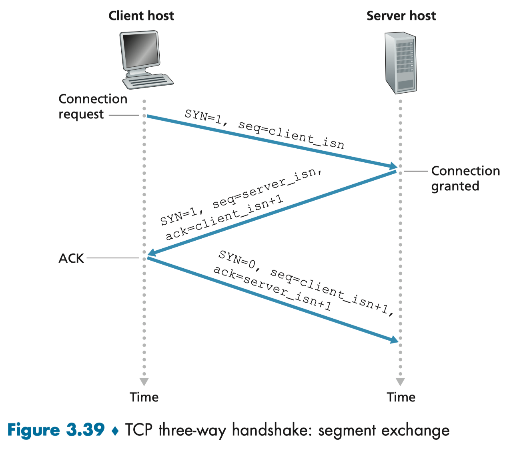

# Internet

## Edge

End System (Host): Includes computers, servers and mobiles. Referred as *hosts* as they host application programs. Can be divided into *clients* and *servers*.

### Access Network

**Home Access**

* **DSL**: Telephone
* **Cable**: TV
* **FTTH**

**Enterprise**

* **Ethernet**
* **WiFi**

**Wide-Area Wireless Access**

* 3G, LTE, 5G: Send/ Receive packets through a base station.

### Physical Media

> Bits are sent by propagating electromagnetic waves/ optical pulses across a **physical medium**. Examples of such medium includes:
>
> * Twisted-pair copper wire (10Mbps - 10Gbps C6a): Cheapest. Rate depend on wire thickness and distance.
> * Coaxial 同轴 cable: Two copper conductor are concentric rather than parallel. Common in TV. Can be used as a shared medium.
> * Multimode fibre-optic cable (51.8Mbps - 39.8Gbps): Immune to EM interference, low signal attenuation. Prevalent in Internet backbone. Transmitter, receiver and switches are expensive.
> * Terrestrial radio spectrum:
> * Satellite radio spectrum: A satellite links two or more Earth-based microwave transmitter/ receivers.
>
> These physical media fall into two categories:
>
> * Guided media:  Waves are guided through a solid medium (e.g. cable)
> * Unguided media: Waves propagate in the atmosphere and outer space. (e.g. wireless LAN or satellite channel)

## Core

> Core: The mesh of packet switches and links that interconnect the Internet's end system.

### Packet Switching

Source data is broken in to **packets** that travels through links and **packet switches** (routers/ link-layer switches).

**Store-and-forward Transmission**

Packet switch must buffer the entire packet before transmitting. Induce store-and-forward delay.

**Queuing Delays and Packet Loss**

Each switch has a output buffer: Stores packets that the router is about to send to that link.

Queuing delays: Waiting for the busy link to be available.

Packet loss: Occurs when the buffer is full, either the arriving packet or a queued packet will be dropped.

**Forwarding Tables and Routing Protocols**

> How routers determine which link it should forward the package to.

The header of the packets sent by the source contains the destination's IP address. The router then map the IP address to one of its outbound links.

### Circuit Switching

> An altertive way to moving data through a network of links and switches.

**Overview**

In circuit-switched networks, the resources needed along a path (buffers, link transmission rate) between the end systems are reserved for the duration of the communication session between the end systems. (Similar to tradition telephone network)

In packet-switched networks, these resources are not reserved; a session’s messages use the resources on demand and, as a consequence, may have to wait (that is, queue) for access to a communication link.

**In Detail**

In jargon of telephony, the connection before transmission starts is called a **circuit**. After the circuit is established, a constant transmission rate is reserved in the network's links for the entire duration of the connection. (Guaranteed constant rate)

**Downsides**

* Wasteful: The dedicated circuits are idle and cannot be used by others during silent periods (When one stop talking)

* Complex: Establishing end-to-end circuits and reserving end-to-end transmission capacity is complicated and requires complex signaling software to coordinate the operation of the switches along the end-to-end path.

#### Multiplexing

> A circuit in a link is implemented with either **frequency-division multiplexing** (FDM) or **time-division multiplexing** (TDM).
>
> * FDM: the frequency spectrum of a link is divided up among the connections.
> * TDM: time is divided into **frames** of fixed duration, and each frame is divided into a fixed number of **time slots**. Network dedicates one time slot in every frame to a reserved connection.


### Packet VS Circuit

Circuit switching pre-allocates use of the transmission link regardless of demand, with allocated but unneeded link time going unused. 

Packet switching on the other hand allocates link use on demand. Link transmission capacity will be shared on a packet-by-packet basis only among those users who have packets that need to be transmitted over the link.

**Downsides of circuit switching**

* Inefficient: Communication tends to be bursty. Unused link cannot be shared
* Fix datar rate
* Connection state maintenance: Overhead with maintaining the connection state.

### Network of Network

#### **Primitive Models**

1. All access ISP connects with a single global transit ISP
2. Access ISP connects to a reginal ISP which then connects to one of several tier-1 ISP.
3. Not only there are multiple competing tier-1 ISP, there are competing regional ISPs in each region.
    * Access ISP pays regional ISP, regional ISP pays tier-1 ISP, tier-ISP pays no one.

#### **Network Structure 4**

On top of structure 3, 4 adds

* **PoP (Point of Presence)**: A group of routers in the providers network to which the customer ISP's connect to
* **Multi-home**: ISP choose to multi-home connects to two or more providers ISPs. So that when one providers has a failure, it can continue to send and receive in the internet.
* **Peering**: A pair of nearby ISP at the same level in the hierarchy choose to peer connects their network together. So that the traffic between them passes through direct connection rather than through their providers. This save costs. Tier-1 ISP can also peer with one another.
* **IXP (Internet exchange points)**: A meeting point where multiple ISPs peer together.

#### **Network Structure 5**

Builds on top of 4 by adding **content-provider network**.

Google has major and smaller data centres that are interconnected via Google's private TCP/ IP network. The private network attempts to “bypass” the upper tiers of the Internet by peering (settlement free) with lower-tier ISPs, either by directly connecting with them or by connecting with them at IXPs. However, because many access ISPs can only reachable via tier-1 networks, the Google network also connects to tier-1 ISPs, and pays those ISPs for the traffic it exchanges with them.

**Advantages**: By creating its own network, a content provider not only reduces its payments to upper-tier ISPs, but also has greater control of how its services are ultimately delivered to end users.

**Customer Relationship**

User, Content-Provider => Lower-tier ISP => Higher-tier ISP


## Delay, Loss, Throughput

### Overview of Delay

Types of delay, together, these delays accumulate to give a **total nodal delay**.

* **nodal processing delay (mili):** Time required to examine the header and determine which link to direct.
    * Check bit error, determine output link
* **queuing delay (micro - mili):** Time spent waiting in the switch's queue. 0 if empty queue.
* **transmission delay:** Time required for the router to push all out the packet. Depend on packet length and link transmission rate
* **propagation delay (mili):** Time requried to propagate from the begining of the link to router B. Depend on physical medium and the length of the link.

Transmission delay is like the time to get through a tollbooth, while propagation delay is the time taken to travel on the highway between two tollbooth.

### Queuing Delay

a packet/s, each packet is L bits, transmission rate R bits/ s. **Traffic intensity**: aL/ R.

If the traffic intensity > 1, the queue will increase without bound.


When the traffic intensity <= 1, the queuing delay is dependent on the nature of the arriving traffic (How often does packet arrives).

Consider the cases where traffic intensity both equals to 1

* 1 packet per L/R seconds: Average queuing delay is 0

* N packet per NL/R seconds: Average queuing delay is L(N-1)/(2R)

    

One important fact that as the traffic intensity approaches 1, the average queuing delay increases rapidly.

The fraction of lost packets increases as the traffic intensity increases.

### End-to-End Delay

> End-to-End delay is the accumulated delay between two end host. Sum of all delays in the links and routers between.

#### Traceroute

> Traceroute is a simple program that can run in any Internet host. It provides delay measurement from source to router along end-end Internet path towards destination. For all routers, it sends three packets and the router will return the packets to the sender. The time interval between transmission and reply is measured.

### Throughput

> In addition to delay and packet loss, another critical performance measure in computer networks is end-to-end throughput.
>
> Throughput: rate (bits/time unit) at which bits are being sent from sender to receiver
>
> * Instantaneous: rate at which Host B is receiving the file
> * Average: average rate the file is receiving
>
> For internet telephone, low delay and instantaneous throughput above some threshold is desired while for large file transfers, delay is not critical, it is desirable to have the highest possible throughput

For a simple two-link network, the throughput is the transmission rate of the **bottleneck link**.


## Protocal Layer & Service Model

### Layered Architecture

A layered architecture allows us to discuss a well-defined, specific part of a large and complex system. 

Each layer provides its service by

1. performing certain actions within that layer (Support the layer above) and by
2. using the services of the layer directly below it (for example, in the gate layer, using the runway-to-runway passenger transfer service of the takeoff/landing layer).

Layered architecture providing modularity, making it much easier to change the implementation of the service provided by the layer.

### Protocol Layering

> Service Model: What services a layer offers to the layer above.
>
> 
>
> **Application**: How application message are encoded and decoded
>
> **Transport:**
>
> **Network:** Delivers datagram between hosts.


* **Application:** How applications on end system exchange **message** (application level packet).

    * HTTP (Web document request and transfer), SMTP (Transfer of email), FTP (Transfer of file)

* **Transport:** Transports application-layer packets between application endpoints via **segment** (Transport-layer packet).

    * TCP: Connection-oriented service, guarantee message delivery + flow control (Sender/receiver speed match) + congestion-control (Does not overload the entire network)
    * UDP: Connectionless service, nothing above is provided. 

* **Network**: Moving **datagrams** (Network-layer packets) from source to destination. Transport-level protocol (TCP/ UDP) in the source host pass a transport-layer segment and a destination address to the network layer.

    * IP Protocol: Defines the fields in datagram and how end system and routers act on these fields
        * Only one IP protocol
    * Routing protocol: Determine the routes that datagrams take between source and destinations.
        * ​	There exist many routing protocols

* **Link:** The network layer routes a datagram through routers. While the link layer move packets from one node to the next node in the route.  怎么到下一个Link。

    In particular, at each node, the network layer passes the datagram down to the link layer, which delivers the datagram to the next node along the route. At this next node, the link layer passes the datagram up to the network layer.

    * Ethernet, WiFi
    * A datagram may be handled by different link-layer protocols at different links along its route.
    * **Frame**: Link-layer packets

* **Physical Layer:** Move the inidividual bits within frame from one node to the next. The protocols in this layer are again link dependent and further depend on the actual transmission medium of the link.


#### Router

Usually implement upt to layer 3

* Physical Layer: Physical bits arrive on the wire
* Link: Packest need to be delivered to the next link
* Network: Participate in the global delivery, route the segment

# Application Layer

## Principle of Network Application

### Application Architectures

**Client-server architecture** (HTTP, IMAP, FTP)

* Server
    * Always-on host (data center)
    * Permanent IP address
* Client
    * Communicate with the server
    * Intermittently connected
    * Dynamic IP address

**Peer to Peer (P2P)** (BitTorrent files sharing)

* no always-on server
* end systems directly communicate
* peers request service from other peers, provide service in return to other peers
* peers are intermittently connected with changing IP addresses, results in compelx management

### Process Communicating

#### Client and Server Processes

> * within same host, two processes communicate using inter-process communication (defined by OS)
> * processes in different hosts communicate by exchanging messages

* **client process:** process that initates communication
* **server process**: process that waits to be conteacted.

In P2P file sharing, a process can be both a client and a server.

#### Socket: API between process and network

> Process send/ receive messages to/from network through a software interface called **socket.** Socket is the interface btween appplication layer and the transport protocol layer.
>
> The application developer has control on the application-layer but has little control of the transport-layer side of the socket. The only control that the application developer has on the transport layer side is
>
> 1. the choice of transport protocol and
> 2. perhaps the ability to fix a few transport-layer parameters such as maximum buffer and maximum segment sizes

#### Addressing processes

In order to a process running on one host to send packets to a process running on another host, the receiving process needs to have an address. To identify the receiving process, two information is needed

1. **IP Address (32-bit):** the address of the host and
2. **Port Number (16-bit):** an identifier that specifies the receiving process in the destination host.

#### Application-layer protocol

* types of messages exchanged, (e.g., request, response)
* message syntax: what fields in messages & how fields are delineated
* message semantics: meaning of information in fields
* rules for when and how processes send & respond to messages

### Transport Protocols

Many networks, including the Internet, provide more than one transport-layer protocol. We usually compares protocols in four dimensions:

* data integrity: guarantee that the datas are delivered. Some apps require 100% reliability while some tolerate some loss.

* throughput: guarantee throughput at specified rate. 

    * **Bandwidth-sensitive applications** require a minimum throughput to be "effective". (e.g. multimedia applications). 
    * **Elastic applications** can make use of whatever throughput they get.

* timing: guarantee delays. Real-time applications requires a low delay to be "effective".

* security: provide confidentiality between the two processes, even if the data is somehow observed between sending and receiving processes.

    

#### TCP & UDP

Usually two transport protocols are available:

**TCP**

The TCP service model includes a connection-oriented service and a reliable data transfer service.

* Connection-oriented server
    * Handshaking: Client and server exchange transport control information before application messaging starts
* Reliable data transfer service: provide data integrity.
* congestion-control: Avoid overloading the network
* flow control: sender won't overwhelm receiver

Does not provide: timing, minimum throughput guarantee, security

**UDP**

UDP is a no-frills, lightweight transport protocol, providing minimal services. UDP is connectionless, so there is no handshaking before the two processes start to communicate.

* No data integrity guarantee and the messages can arrive out of order
* No congestion-crontrol mechanism


Internet telephony application uses UDP to bypass TCP's congestion control and packet overheads. But because many firewalls are configured to block (most types of) UDP traffic (Since no congestion control can results in exploding queue), Internet telephony applications often are designed to use TCP as a backup if UDP communication fails.

## Web and HTTP

### HTTP Overview

> The HyperText Transfer Protocol (HTTP) is the Web’s application-layer protocol. 
>
> HTTP is implemented in two programs: a client program and a server program. The client program and server program, executing on different end systems, talk to each other by exchanging HTTP messages (requests and response). HTTP defines the structure of these messages and how the client and server exchange the messages.

**Web Page**

Web pages consists of objects stored at different servers. An object is simply a file—such as an HTML file, a JPEG image, a Javascrpt file, a CCS style sheet file, or a video clip—that is addressable by a single URL. Most Web pages consist of a **base HTML file** and several referenced objects.

The base HTML file references the other objects in the page with the objects’ URLs.

**URL**

>  protocol://host-name[:port]/directory-path/resource

URL has two components: hostname of the server + the object's pathname.

* protocol: http, ftp, https, smtp etc.
* hostname: DNS name, IP address
* port: defaults to protocol’s standard port; e.g., http: 80 https: 443
* directory path: hierarchical, reflecting file system
* resource: Identifies the desired resource

**HTTP uses TCP**

1. client initiates TCP connection (creates socket) to server, port 80
2. server accepts TCP connection from client
3. HTTP messages (application-layer protocol messages) exchanged between browser (HTTP client) and Web server (HTTP server)
4. TCP connection closed

**Stateless**

HTTP is said to be a stateless protocol as the server maintains no information about the clients.

### HTTP Message Format

> There are two types of HTTP messages, request messages and response messages.

#### Request


* Entire message is in readable ASCII text.
    * Downsides
        * Waste space
        * Non-text content need to be encoded
* Each line finisheds with a carriage return `\r` and a line feed `\n`. The last line is followed by an additional pair.
    * Historically `\n` moves the carriage down, 
    * `\r` move the carriage back to the left side of the page.

**Structure**

* Request line: 
    * Method field: GET, POST (Update), HEAD (Server only return header, diagnostic purpose), PUT, DELETE
    * URL field
    * HTTP version field:
* Header lines:
    * Host: The host on which the object resides.
    * Connection (close): Determine whether the connection is persistent.


#### Response


**Structure**

* status line
    * status code: 200 (OK), 301 (Request object is moved, new location specified in Location field), 400 (message not understood), 404 (Object not found), 505 (HTTP Version not supported)
* header lines
    * Connection: close if the server will close TCP after this message. Keep-Alive if otherwise.
* entity body

### Connections Persistence


**Non-persistent connections**

A TCP connection is initialized and closed for each object transmitted.

<u>Disadvantages</u>

* A brand-new connection must be established and maintained for each requested object.
* Each object suffers a delivery delay of two RTTs—one RTT to establish the TCP connection and one RTT to request and receive an object.

**Persistent connections (HTML 1.1)**

In persistent connections, 

* the server leaves the TCP connection open after sending a response. 
* Subsequent requests and responses between the same client and server can be sent over the same connection. In particular, an entire Web page (in the example above, the base HTML file and the 10 images) can be sent over a single persistent TCP connection.
* Moreover, multiple Web pages residing on the same server can be sent from the server to the same client over a single persistent TCP connection. 
* These requests for objects can be made back-to-back, without waiting for replies to pending requests (pipelining). 

Typically, the HTTP server closes a connection when it isn’t used for a certain time. When the server receives the back-to-back requests, it sends the objects back-to-back. The default mode of HTTP uses persistent connections with pipelining.

**Persistent without pipelining** 

* client issues new request only when previous response has been received
* one RTT for each referenced object

**Persistent with pipelining**

* client sends requests as soon as it encounters a referenced object (The base HTML-file)
* as little as one RTT for all the referenced objects

#### Summary

Non-persistent: Each object need two RTTs. (One for handshake, one for receive and request)

Persistent without pipelining: 2 RTT (Handshaking + Index file) + Each object need one RTT (No need to handshake)

Persistent with pipelining: 2 RTT (Handshaking + Index file) + Multiple object need only one RTT (Requests are made back-to-back without waiting for the response)

### Cookies


Cookie technology has four components

* cookie header line in the HTTP response message
* cookie header line in the next HTTP request message
* cookie file kept on user’s end system, managed by user’s browser
* back-end database at Web site

**Process**

1. The server create a unique identification number and sent is back in the response.
2. After seeing the response, the browser appends a line to the cookie files it manages
3. Each time a request is made, the browser consult the cookie and send the number for this site in the request header lines.

### Caching

> A Web cache—also called a proxy server—is a network entity that satisfies HTTP requests on the behalf of an origin Web server. The Web cache has its own disk storage and keeps copies of recently requested objects in this storage.
>
> A user’s browser can be configured such that each browser request for an object is first directed to the Web cache.

A cache is both a server and a client at the same time. Typically a Web cache is purchased and installed by an ISP. Web caching has seen deployment for two reasons. 

* The response time can be significantly reduced. 
* By reducing traffic, the institution does not have to upgrade bandwidth as quickly or pay for the use of higher level ISP, thereby reducing costs. 
* Web caches can substantially reduce Web traffic in the Internet as a whole, thereby improving performance for all applications.

**Conditional GET**

> The mechanism to verify the consistency of cache and the server.

1. After caching the object, upon request, the proxy will still perform an up-to-date check by issuing a conditional GET. That contains metadata of the cached object.
2. If the server decides that the object is up-to-date, the web server will send a response with **empty** entity body.

### HTTP Performance

Page Load Time (PLT) is an important metric of the performance of HTTP. It depends on many factors such as 

* page content/structure,
* protocols involved and
* Network bandwidth and RTT

**How to improve PLT**

* Reduce content size for transfer: Smaller images, compression
* Change HTTP to make better use of available bandwidth: Persistent connections and pipelining
* Change HTTP to avoid repeated transfers of the same content: Caching and web-proxies
* Move content closer to the client: 
    * CDNs: Provide caching and replication as a service
* Improve response time
    * Replication: Replicate website across many machine
        * Load balancing

### HTTP2

> HTTP/2, standardized in 2015 serves the primary goals of
>
> * reduce perceived latency by enabling request and response multiplexing over a single TCP connection
> * provide request prioritization and server push, and 
> * provide efficient compression of HTTP header fields
>
> HTTP/2 does not change HTTP methods, status codes, URLs, or header fields. Instead, HTTP/2 changes how the data is formatted and transported between the client and server.

#### HOL Blocking

> Head of Line (HOL) blocking problem is when a largest file is requested along with some smaller objects. Using a single TCP connection, the video clip will take a long time to pass through the bottleneck link, while the small objects are delayed as they wait behind the video clip
>
> The typically work around in HTTP1.1 is to have multiple parallel TCP connections.

HTTP2 solution for HOL is by breaking each message into smaller frames, and interleave the request and response messages on the same TCP connection.


The most important enhancement of HTTP/2 is the ability to break message into independent frames, interleave them and reassemble them on the other end.

The framing is done by the framing sub-layer of the HTTP/2 protocol. 

* When a server send an HTTP response, the framing sub-layer process it and break it into frames. 
    * The header field of the response becomes one frame, and the body of the message is broken down into one for more additional frames. 
    * The frames of the response are then interleaved by the framing sub-layer in the server with the frames of other responses and sent over the single persistent TCP connection. 
* As the frames arrive at the client, the framing sub-layer reassembles them into the original response messages before being processed by the browser. 
* Similarly, a client’s HTTP requests are broken into frames and interleaved.

#### Prioritization and Server Pushing (Not in PPT)

* Message prioritization allows developers to customize the relative priority of requests, so that the server can send first the frames for the responses with the highest priority.
    * In addition, the dependency between messagees can be specified.
* Server can now predict what will be needed to render the HTML base page and send multiple additional (Not requested yet) responses for a single client request. Server push eliminates the extra latency due to waiting for the requests.

## Email

The internet mail system is consist of user agent, mail servers and Simple Mail Transfer Protocol (SMTP). 

* SMTP is an application -level protocal for email.
* SMTP use TCP to reliably transfer message to server, port 25


Three phases of transfer

* SMTP Application Level Handshaking (Besides TCP handshake)
* Transfer
* Closure

**Why we need server**

Instead of agent directly talks to each other, we have alway-on server so that the delivery won't be affectly when the receiver is temporarily down.

### Email Format

* Header: From, to, Subject
* Body: 7-bits ASCII only. Multimedia data need to be encoded and then decoded.

### Access Protocols


1. Alice use SMTP or HTTP to push
2. Bob use HTTP (Web-based interface) or IMAP (Client application) to pull as SMTP is a push protocol instead of a pull one

## DNS

> Domain name system (DNS) maps readable variable length **hostname** into fixed-length, easy processed **IP Address**.
>
> **Protocol Layer**: Application-layer protocol
>
> **Transport Layer**: UDP, port 53

### Services Provided

* Host aliasing: A canonical host can have multiple more mnemonic alias hostnames.
* Mail server aliasing: The domain of a email address is usually not the canonical hostname. So DNS need to retrieve the actual hostname.
* Load distribution: The DNS answer qeury with multiple IP addresses in rotation to distribute the load.

### Working Process

#### Goal

* No naming conflicts (uniqueness) 
* Scalable: many mappings + frequent updates
* Distributed, autonomous administration: 
    * Ability to update my own (domains’) names
    * Don’t have to track everybody’s updates
* Highly available
* Lookups should be fast

#### Centralize DNS Server

> Does not satisfy: Scalable, distributed administration, highly available, fast lookup

* **A single point of failure**. If the DNS server crashes, so does the entire Internet!
* **Traffic volume**. A single DNS server would have to handle all DNS queries (for all the HTTP requests and e-mail messages generated from hundreds of millions of hosts).
* **Maintenance**. The single DNS server would have to keep records for all Internet hosts. Not only would this centralized database be huge, but it would have to be updated frequently to account for every new host.
* **Distant centralized database.** A single DNS server cannot be “close to” all the querying clients. If we put the single DNS server in New York City, then all queries from Australia must travel to the other side of the globe, perhaps over slow and congested links. This can lead to significant delays.

#### Distributed, Hierachical Database

> Resolve all issues with centralized DNS Server


**Hierarchy**

* Root DNS Server: Provide IP address of the TLD servers. 13 different root servers, duplicate to 1000 roots instances.
* Top-level domain (TLD) DNS server: Provided the IP address of teh authoritative DNS servers
* Authoritative DNS servers: Organisations that holds the mappings of their own service.
    * e.g. edu provide IP to berkeley, while berkely maintain its own hostname like EECS.

There is another type of DNS server that does not strictly belong to the hierarchy. Local DNS servers acts as a proxy, forwarding the query into the DNS server hierarchy.


DNS queries can be either recursive queries or iterative queries:

* The query sent from cse.nyu.edu to dns.nyu.edu is a recursive query, since the query asks dns.nyu.edu to obtain the mapping on its behalf. **Recursive query replies with the desire IP address.**
* The subsequent three queries are iterative since all of the replies are directly returned to dns.nyu.edu. **Iterated query replies with server to contact.**

In theory, any DNS query can be iterative or recursive.

**Caching**

We can cache the mappings to affect unnecessary traffics. In fact, because of caching, root servers are bypassed for all but a very small fraction of DNS queries.

### Record and Messages

#### Records

> The DNS servers store resource records (RRs). RRs provide mappings. Each DNS reply **message** carries one or more resource **records**.

A resource record is a four-tuple that contains the following fields:

(Name, Value, Type, TTL)

**TTL**: Time to live. Determines when the resource should be removed from the cache. So that update of DNS records can be reflected eventually.

| Type  | Name                                           | Value                                                      |
| ----- | ---------------------------------------------- | ---------------------------------------------------------- |
| A     | Hostname (eecs.berkeley.edu)                   | IP                                                         |
| NS    | Domain (berkeley.edu)                          | Hostname of an authoritative DNS server (dns.berkeley.edu) |
| CNAME | Hostname (berkeley.edu)                        | Canonical hostname (CSNO1.berkeley.com)                    |
| MX    | Alias hostname of a mail server (berkeley.edu) | Canonical name of a mail server (mail.berkeley.edu)        |

* If a DNS server is authoritative for a particular hostname, then the DNS server will contain a Type A record for the hostname. (Even if the DNS server is not authoritative, it may contain a Type A record in its cache.)
* If a server is not authoritative for a hostname, then the server will contain a Type NS record for the domain that includes the hostname; it will also contain a Type A record that provides the IP address of the DNS server in the Value field of the NS record.

#### Message

> Both DNS query and reply messages have the same format.


* Answer section: IP address mapping
* Authority section: Authoriative DNS servers
* Additional sectiosn
    * Answer to a MX query can contains the canonical hostname of a mail server
    * Answer to a A record can provide the IP address and the canoncial hostname of the mail server


##### Flag

AA = Authoritative Answer

TC = Truncation

RD = Recursion Desired (set in a query and copied into the response if recursion is supported)

RA = Recursion Available (If set, denotes recursive query support is available)


AD = Authenticated Data (for DNSSEC only; indicates that the data was authenticated)

CD = Checking Disabled (DNSSEC only; disables checking at the receiving server)

#### Update DNS Servers

>  Remember that old records may be cached in other DNS servers (for up to TTL) 

General guidelines

* Record the current TTL value of the record
* Lower the TTL of the record to a low value (e.g., 30 seconds)
* Wait the length of the previous TTL
* Update the record
* Wait for some time (e.g., 1 hour)
* Change the TTL back to your previous time

#### WWW vs Non-WWW

> Non-WWW is usually referred to as apex or naked domains.

There are 2 main advantages of using www

* DNS requires apex domains to always point to type A record. CNAME record cannot coexist with other RR types (Non-www 只能直接指向IP，不能有CNAME Record，所以就没有办法使用不同IP)
    * With www domains, offloading to a CDN is easy:
        *  www.metalhead.com CNAME somecdn.com
        *  metalhead.com A 156.23.34.252
    * Note: Some CDN providers have workarounds for the above 
* Cookies of the non-WWW domain are automatically passed down to sub-domains (metalhead.com to static.metalhead.com and mail.metalhead.com) 一个网站的Cookies会自动Pass到其他Sub-domains
    * Unnecessary cookies hurt performance
    * Security issue

## P2P

> The applications described in this chapter thus far—including the Web, e-mail, and DNS—all employ client-server architectures with significant reliance on always-on infrastructure servers.
>
> With P2P architecture, there is minimal (or no) reliance on always-on infrastructure servers.

### Scalability

**Client-server**

The server send a copy of the file to each and every one of the peers. The total distribution time taken increase linearly with the number of peers.

**P2P Architecture**

In P2P file distribution, each peer can redistribute any portion of the file it has received to any other peers, thereby assisting the server in the distribution process. In particular, when a peer receives some file data, it can use its own upload capacity to redistribute the data to other peers.

In another word, the total upload rate is the sum of the server and all the peers instead of only the server in the client-server model. This substantially speed up the distribution process.


Thus, applications with the P2P architecture can be self-scaling. This scalability is a direct consequence of peers being redistributors as well as consumers of bits.

### Bit Torrent

> BitTorrent is a popular P2P protocol for file distribution.

**Overview**

In BitTorrent lingo, the collection of all peers participating in the distribution of a particular file is called a torrent. Peers in a torrent download equal-size chunks of the file from one another, with a typical chunk size of 256 KBytes. 

When a peer first joins a torrent, it has no chunks. Over time it accumulates more and more chunks. While it downloads chunks it also uploads chunks to other peers. 

 Once a peer has acquired the entire file, it may (selfishly) leave the torrent, or (altruistically 无私心) remain in the torrent and continue to upload chunks to other peers. Also, any peer may leave the torrent at any time with only a subset of chunks, and later rejoin the torrent.

#### Operations

**DHT (Distributed Hash Table)**

> Map each peer's key to an integer. A peer queries DHT with key, or insert pairs.

**Tracker**

Each torrent has an infrastructure node called a tracker. It keeps track of the peers that in the torrent. 

* When a peer joins a torrent, it registers itself with the tracker and periodically informs the tracker that it is still in the torrent.
* When a peer joins, the tracker randomly selects some peers and sends the IP addresses of them for Alice to establish TCP connections with them.

**Get chucks**

Periodically, Alice will ask each of her neighboring peers (over the TCP connections) for the list of the chunks they have and make two decision:

1. Which chuck should be requested first?
    * Rarest first. Aim to equalise the distribution between rare and common chucks.
2. Which neighbour she should respond to?
    * Clever trading algorithm (tit-for-tat): Respond (Send chuck) on the four neighbour that feed she data at the highest rate.
    * Every 10 seconds, she recalculate the rate and modify the set of four peers (**unchoked peers**).
    * Every 30 seconds, she picks an random additional neighbour Bob and sends he her chuck.  (**optimistically unchoked**)
        * A new partner is chosen and if both peers are satisfied with the trading, they will put each other in their top four list and continue trading, until one finds a better partner.
        * The random neighbor selection also allows new peers to get chunks, so that they can have something to trade.
        * All other neighbouring peers beside the five (Top four + one probing peer) are **choked**. That is they never recieve any chuck from Alice.

The tit-for-tat incentive mechanism makes the ecosystem wildly successful.

## Video & CDN

> Video Streaming = Encoding + DASH + Buffering

### Video Encoding

A video is a sequence of images, typically being displayed at a constant rate, for example, at 24 or 30 images per second. An uncompressed, digitally encoded image consists of an array of pixels, with each pixel encoded into a number of bits to represent luminance and color. 

**Compress**

An important characteristic of video is that it can be compressed, thereby trading off video quality with bit rate. Today’s compression algorithms can compress a video to essentially any bit rate desired. The higher the bit rate, the better the image quality and the better the overall user viewing experience.

* Spatial coding: Instead of sending N values of the same colour, send one and specifies the number of times to repeat

* Temporal coding: Instead of sending two distinct frames, only send the difference.

**CBR (Constant bit rate)** vs **VBR (Variable bit rate)**

### HTTP & DASH

**Challenge: Heterogenious Network Bandwidth**

In Dynamic Adaptive Streaming over HTTP (DASH), the video is encoded into several different versions, with each version having a different bit rate.

 The client dynamicly request chunks of video segments of a few seconds in length depending on the available bandwidth.

**Operation**

The HTTP server has a **manifest file** that mappings video version of different bit rate to their respective URL. The client first requests the manifest file and learns about the various versions. The client then selects one chunk at a time by specifying a URL and a byte range (Request only a portion of a file) in an HTTP GET request message for each chunk.

### CDN

#### Central Center

Problem with single massive data center

* Single point of failure
* Throughput limited by links on the route, likely to happen for a long route
* Multiple copy of the same video get sends around, waste money on ISP.

#### Distributed CDN

A CDN (Content Distribution Networks) manages servers in multiple geographically distributed locations, stores copies of the contents in its servers, and attempts to direct each user request to a CDN location that will provide the best user experience.

**Category**

The CDN may be a private CDN, that is, owned by the content provider itself; for example, Google’s CDN distributes YouTube videos and other types of content.

The CDN may alternatively be a third-party CDN that distributes content on behalf of multiple content providers

**Server placement philosophies**

* Enter Deep: Deploy large number of small server in access ISPs. Goal is to decrease the numerb of links to the end user. Maintaining and managing is challenging due to the highly distributed design.
* Bring Home: Deploy small number of large clusters in IXP. Lower maintenance and managment overhead. 

#### CDN Operation

CDN needs to perform two operations

* Determine a suitable cluster for the client
* Redirect request to a server in that cluster

Most CDNs take advantage of DNS to intercept and redirect requests.


The content provider itself respond to the request and direct the query to the appropriate DNS server.

#### Cluster Selection

> CDN learns the IP address of the client’s LDNS server via the client’s DNS lookup. After learning this IP address, the CDN needs to select an appropriate cluster based on this IP address.

**Geographically closest**

* The closest doesn't mean  the closest interns of length or number of hops of the network path
* Does not work for users that are configured to use remotely located LDNSs.

**Real-time Measurements**

CDN can perform periodic real-time measurement of delay and loss between it and all LDNSs around the world. Drawback is that many LDNSs are configured to not respond to such probes.

## Socket Programming

### TCP

1. Handshake
2. Create a unique four-tuple connection
3. Send data through the socket.


serverSocket: The welcome port.

connectionSocket: Newly created socket dedicated to the particular client.


# Transport Layer

## Overview

> A transport-layer protocol provides for logical communication **between application** processes running on different hosts, while a network-layer protocol provides logicalcommunication **between hosts**.
>
> Analogy:
>
> * Network layer is the postal server that delivers from house to house.
> * Transport layer take those received segments and distribute them to the destination applications within the house.

**Network Layer**

* IP provides logical communication between hosts. Find paths through the network.

    

* Does not guarantee segment delivery

* Does not guarantee orderly delivery of segment

* Does not guarantee the integrity of the data in the segments.

**Transport Layer**

The job of UDP and TCP is to extend IP’s **host-to-host delivery** to **process-to-process delivery**. This is called transport-layer multiplexing and demultiplexing.

| UDP: Connectionless         | TCP: Connection-Oriented |
| --------------------------- | ------------------------ |
| Process-to-process delivery | Reliable delivery        |
| Error checking              | In order delivery        |
|                             | Flow control             |
|                             | Congestion control       |

Not provided by both:

* Delay gurantee
* Bandwidth gurantee

## Multiplexing & Demultiplexing

> Demultiplexing is the job of delivering the data in a transport-layer segment to the correct socket.
>
> Multiplexing is the job of gathering data chunks at the source host from different sockets, encapsulating each data chunk with header information (used in demultiplexing) to create segments, and passing the segments to the network layer.

### Multiplexing

A UDP socket is uniquely identified by a two-tuple of the dest IP address and dest port number.

TCP socket is identified by a four-tuple: (source IP address, source port number, destination IP address, destination port number).

This decide how many value is required to direct the message to the socket.

With UDP, the server can have only one socket to respond to all clients, but with TCP, the server need to have a socket for each client.  As each TCP socket is also identified by the source IP and port,.

### Demultiplexing

Multiplexing happen at all layer


In UDP, the server can have only one socket to respond 


Demultiplexing using 4-tuple

TCP: Uniquely identify by four value. Just using dest port is not enough

### Socket and Port

> A TCP connection is uniquely identified by four-tuple. Only knowing the destination IP and port is not enough to pass the message to the correct process.
>
> Two different socket on the same server can share the same port. They differs by the source IP and port.

**A TCP socket is an endpoint instance** defined by an IP address and a port in the context of either a particular TCP connection or the listening state.

**A port is a virtualisation identifier** defining a service endpoint (as distinct from a service *instance* endpoint (session identifier).

**A TCP socket is not a connection**, it is the endpoint of a specific connection.

**There can be concurrent connections to a service endpoint**, because a connection is identified by *both its local and remote* endpoints, allowing traffic to be routed to a specific service instance.


A port is a virtualised endpoint. This virtualisation makes multiple concurrent connections on a single network interface possible.

## UDP

**Applcation that use UDP**: DNS, Internet telephone, HTTP3

**Advantage of UDP**

* No connection establishment, one less RTT

* No connection state to maintain, e.g. state variable, receive/send buffer, less overhead

* Smaller header size
* No congestion control: Send instantly, no need to wait for ACK

**Usage**

* Real time application
* Game

### Structure


#### Checksum

Sum of all 16 bits number in the segment  == 0.

This is achieve by letting the Checksum be the 1's complement of the sum of all the field excluding the Checksum field.

1 bit error can be detected but not 2 bit error

## Reliable Data Transfer

#### rdt1.0

Assuming that the underlying Network layer is reliable, all the transport layer have to do is as follows.


### Deal with Corruption

#### rdt2.0: ACK & NAK

> **Error Detection**:  Checksum
>
> **Deal with Corruption**: If ACK, send next packet. If NAK, retransmit.
>
> **Problem:** If ACK/ NAK is corrupted, the sender doesn't know what happened at receiver. Retransmit may cause duplicate.

#### rdt2.1: ACK & NAK + #Sequence

Add a sequence number in the sent packet to avoid duplicate. Receiver can use sequence number to distinguish duplicate. The sequence number only need to be 1 bit, as it suffice to know whether the two neighbouring packet are the same.

#### rdt2.2: ACK(#Squence)

Remove NAK by adding the sequence number in the ACK.

### Deal with Loss

#### rdt3.0: Timer

The sender set a timer aftering sending a packet. If no ACK is received after the timer, it will retransmit the packet. With the aid of #sequence, duplicate is not an issue.

### Pipelined RDT

Although rdt3.0 does work, it spends too much time on stop-and-wait. 

This can be solved by pipelining: Send multiple packets without waiting for ACK. This lead to the following consequences

* **Sequence Number**: It need to be increasing and unique.
* **Buffer**: The sender and receiver need to buffer more than one packets. 

Two basic approaches toward pipelined error recovery can be identified: Go-Back-N and selective repeat.

#### GBN

#### Selective Repeat

##### Receiver

**Package in the Window**: Selective ACK

**Package outside Window**: ACK this package

##### Sender

**Timeout**: Retransmit

**ACK**: Mark off, potentially move the window

## TCP

**Applcation that use TCP**: SMTP, Telnet, SSH, FTP, DASH

### Connection Management




## Cogestion Control


# Network Layer

## Data Plane

## Control Plane

# Link Layer & LAN

# Tools

https://webcms3.cse.unsw.edu.au/COMP3331/21T3/resources/65909

```shell
ping host
ping -s [packetsize] host		# Default is 56 Bytes
ping -i [interval] host			# Interval between sending ping request

traceroute host

# Connect from one host to another. Log onto another machine
telnet host [port]
```


```shell
dig @[DNS-sever-address] [hostname/IP to lookup] [Query type]
dig -x [hostname/IP to lookup]		# Do inverse query, IP => Hostname
```


