# OS Overview

### Role

What's the role of an OS

* Abstraction Machine
	* Extends the basic hardware with added functionality
	* Provides high-level abstractions (e.g. Filesystem instead of just registers on a disk controller)
* Resource Manager
	* Responsible for allocating resources to users and processes
	* Must ensure
		* No Starvation: e.g. First come, first serve
		* Progress
	* Overall, that the system is efficiently used

### Kernal

* Portion of the operating system that is running in <u>privileged mode</u>
  * Applications not in privileged mode should not be able to interfere or bypass the operating system
      * OS can enforce the “extended machine”
      * OS can enforce its resource allocation policies
      * Prevent applications from interfering with each other
* Usually resident (stays) in main memory
* Contains fundamental functionality
	* Whatever is required to implement other services
	* Whatever is required to provide security

### System Libraries

* Only a subset of library functions are actually system calls
	* strcmp(), memcpy(), are pure library functions
		* manipulate memory within the application, or perform computation
	* open(), close(), read(), write() are system calls
		* they cross the user-kernel boundary, e.g. to read from disk device
		* Implementation mainly focused on passing request to OS and returning result to application

# Processes and Threads

Major Requirements of an Operating System

* Interleave the execution of several processes to maximize processor utilization while providing reasonable response time 
* Allocate resources to processes
* Support interprocess communication and user creation of processes

Processes:

* Also called a task or job
* Execution of an individual program
* **“Owner” of resources** allocated for program (Thread) execution
* Encompasses (包含, 涉及) one or more threads

Threads:

* Unit of execution
* Can be traced
	* **list the sequence of instructions** that execute
* Belongs to a process
	* Executes within it.
* More lightweight than a process


**Process termination**

Conditions which terminate processes

1. Normal exit (voluntary)
2. Error exit (voluntary)
3. Fatal error (involuntary)
4. Killed by another process (involuntary)

**Process/ Thread states**

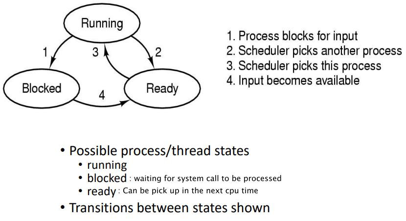

Events that causes transitions

* Running → Ready
	* Voluntary Yield()
	* End of timeslice 
* Running → Blocked
	* Waiting for input
		* File, network
	* Waiting for a timer (alarm signal)
	* Waiting for a resource to become available

Scheduler/ Dispatcher


**Threads Analogy**

Process: The Hamburger restaurant

**Single-Threaded Process**

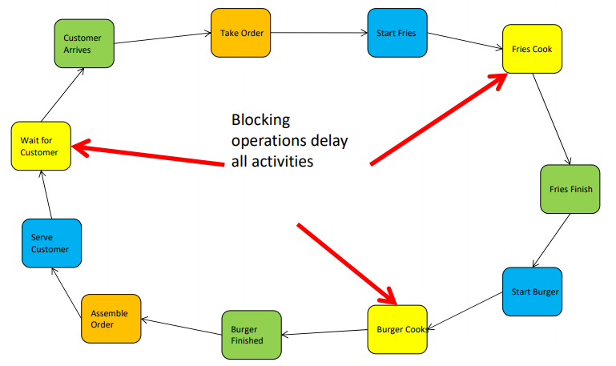

The thread need to wait for a system call to return

**Multi-threaded Process**

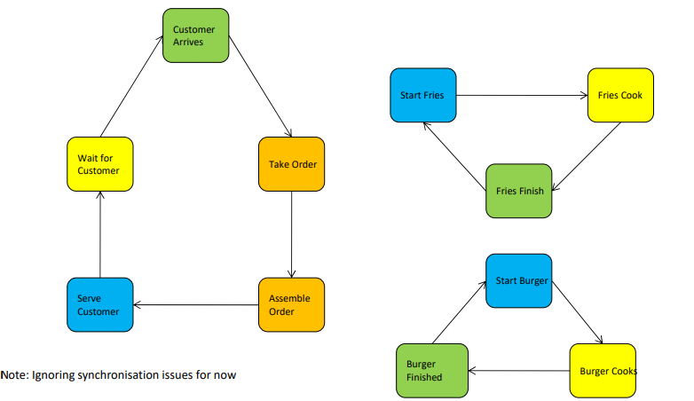

Now each threads are operating independently, when one is blocked the others can continue to run. It enables scalability, we can scale the system by adding more thread cooking fries and burgers.

**Finite-State Machine**


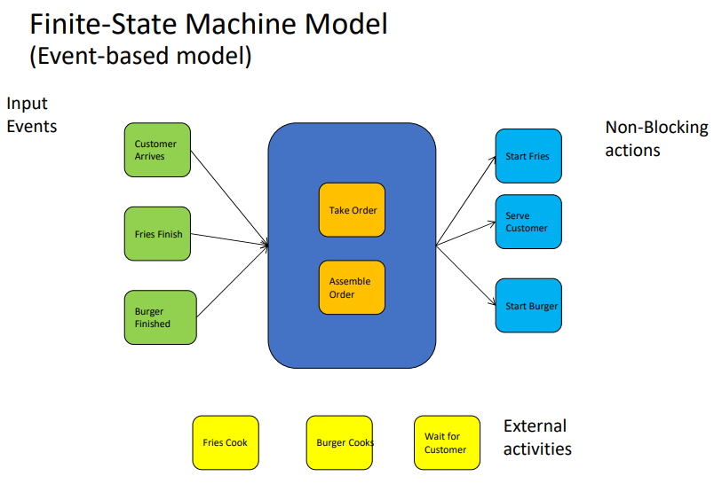

Input event: Those requires an responding action

Non-blocking actions: Asynchronous events that can happen in the background

External activities: Non blocking system calls

The system continues to take order and make asynchronous system calls, when a systems call returns, we will then serve the customer. There's no blocking events. This way, we can continues to take orders without having to wait for fries and the burgers to be done. However, we would need to explicitly manage the stack of requests.

| Model                 | Characteristics                                    |
| --------------------- | -------------------------------------------------- |
| Single-thread process | No parallelism, blocking system calls              |
| Multi-thread process  | Parallelism, blocking system calls                 |
| Finite-state machine  | Parallelism, non blocking system calls, interrupts |

For a blocking system call, the caller can't do anything until the system call returns (e.g. Read from file). One solution is multi-threaded - while one thread is block, the others can continue to work.

The alternative is non-blocking system calls. In this case, a lengthy system calls is tither sent to the caller later or polled by the caller later. This allows you to have a single thread waiting for many different lengthy system calls to complete at the same time; and avoids the hassle of threads (and locking, race conditions, the overhead of thread switches, etc. ). However, it also increases the hassle involved with getting and handling the system call's results. 

## Process

## Thread

* Each process has an address space and a single thread of control.
* Threads run in the same address space and share data.

### Multithreaded Usage

* Simplicity: In some program models, multi-threads makes the programming model simpler.
* Lighter weight than processes: Threads are easier to create and destroy than processes.
* Performance: Threads yield no performance gain when all of them are CPU bound. But when there is substantial computing and also substantial I/O, having threads allows these activities to overlap, thus speeding up the application.
* Paralleslism on multiple CPUs.
* Responsiveness: Allow an application to remain responsive to input. In single-thread program, if the main thread blocks, the entire program appear to freeze.

**Drawbacks**

* Synchronization: Avoid race conditions, deadlock
* Untestable

##### Example

Suppose that the word processor is written as a two threaded program. One thread interacts with the user and the other handles reformatting in the background. As soon as the sentence is deleted from page 1, the interactive thread tells the reformatting thread to reformat the whole book. Meanwhile, the interactive thread continues to listen to the keyboard and mouse and responds to simple commands like scrolling page 1 while the other thread is computing madly in the background.


### User-Level Threads


**Implementation at user-level**

* User-level Thread Control Block (TCB) (PCB for process control block), ready queue, blocked queue, and dispatcher
	* Thread control block (TCB): stores information used by the scheduler and queues about a thread.
	* Ready queue: stores threads that are unblocked and are candidates to run next.
	* Blocked queue: stores threads that can't progress until some event occurs.
	* Scheduler: chooses which thread from the ready queue to run next.
* Kernel has no knowledge of the threads (it only sees a single process)
* If a thread blocks waiting for a resource held by another thread inside the same process, its state is saved and the dispatcher switches to another ready thread
* Thread management (create, exit, yield, wait) are implemented in a runtime support library

##### Operation

* Run-time system: A collection of procedures (create, exit, yield, wait) that manage threads
* Thread table: Keep tracks of per-thread properties (PC, $sp, registers, etc.)

The `thread_yield` procedure 

1. Saves the thread's state
2. Looks into thread table for a ready thread to run
3. Reload the machine register and the new thread is ready to run

##### Pros/ Cons

<u>Pros</u>

* Thread management and switching at user level is faster than kernel
	* No need to trap (take syscall exception) into kernel and back to switch
* Scheduling algorithm can be tuned to the application (Priorities some threads)
* Can be implemented on an operating system that does not support threads
* Cannot benefit from multi-processor system as there can be at most one thread running.
* Can easily support massive numbers of threads on a per-application basis
	* As a large amount of virtual memory is provided by the kernel
	* Kernel memory more constrained. Difficult to efficiently support wildly differing numbers of threads for different applications.

<u>Cons</u>

* No other thread in that process will ever run unless the first thread voluntarily gives up the CPU ( yield() manually ) as no <u>clock interrupt</u> can reach the user level
	* A single poorly design/implemented thread can monopolise the available CPU time
* Does not take advantage of multiple CPUs (Kernal is not aware of the threads)
* If a thread makes a blocking system call (local blocking calls are fine) or page fault, the process (and all the internal threads) blocks, even though the other thread can still run (But OS don't know about that)
	* Can’t overlap I/O with computation

### Kernal-level Thread


Thread control blocks are stored in the kernel

Thread management calls are implemented as system calls instead of user library calls.


##### Pros/ Cons

<u>Pros</u>

* Preemptive multithreading (Threads can switch automatically without programmers need to yield within a thread to allow others to run)
* Parallelism
	* Can overlap blocking I/O with computation
	* Can take advantage of a multiprocessor

<u>Cons</u>

* Thread creation and destruction, and blocking and unblocking threads requires kernel entry and exit. More expensive than user-level equivalent.
	* One solution can be to recycle threads by not destroying them but marked as not runnable.

### Hybrid

Various ways have been investigated to try to combine the advantages of userlevel threads with kernel-level threads. One way is to allow the programmer to determine how many **kernel threads** to use and how many **user-level** threads to multiplex on each one. This model gives the ultimate in flexibility.

### MIPS

Branch Delay Slot: The instruction after `branch` or `jump` is always executed before reaching the destination of jump. We can use `nop` (No op) to prevent an unpredicted result.


The instructions are fetch, decode, and running at the same time.


Argument Passing


Frame Pointer: Start of the current frame

Stack Pointer: End of the current frame (Grow or shrink to allocate memory)

If more than 4 parameters needs to be passed in, they are stored above the $sp (Assuming memory are allocated downward: - to allocate)

### Context Switch

Context switch is a switch between threads or processes. It can happen

* On a system call (Blocking syscall or exit())
* On an exception
* On an interrupt (Triggering by a schedular, due to running too long)

It can happen between any two machine instruction.

It need to be transparent.


**Steps**

1. Switch to the kernal stack on an context switch (Changinging the $sp)
2. Push a *trapframe* onto the stack which include all user-level PC, RA, GP, SP
3. Call 'C' code to process syscall/ exception/ interrupt which builds up a 'C' activation stack. 
	* Determines the source of the interrupt to be the timer device
	* Calls the *Timer Interrupt Handler*
	* Acknowledges the interrupt to the timer device
	* Calls the *Scheduler* (dispatcher)
	* Chooses a new process to run
4. Next the kernel is ready to perform a context switch, it will choose a target thread/ process (need to be in kernal mode as well) and pushes the in-kernal context of the previous running process on to the stack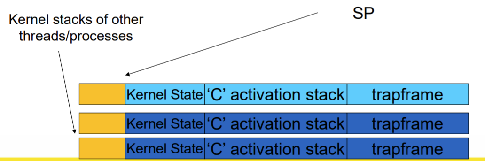
5. Save the current SP to PCB (Process control block) and load the SP of the target thread.
6. After restoring the registers of the target thread backward, we has performed a switch by jumping to the target thread's PC

```assembly
static void thread_switch(threadstate_t newstate, struct wchan *wc) {
    struct thread *cur, *next;
    cur = curthread;
    
    do {
    	# Get the next ready thread
    	next = threadlist_remhead(&curcpu->c_runqueue);
        if (next == NULL) cpu_idle();
    } while (next == NULL);
    
    # do the switch (in assembler in switch.S)
    switchframe_switch(&cur->t_context, &next->t_context);
}

# a0: The address of SP in the old thread
# a1: The address of SP in the new thread
switchframe_switch:

/* Allocate stack space for saving 10 registers. 10*4 = 40 */
addi sp, sp, -40

/* Save the registers */
sw ra, 36(sp)
sw gp, 32(sp)
...

/* Store the old stack pointer in the old thread */
sw sp, 0(a0)

/* Get the new stack pointer from the new thread */
lw sp, 0(a1)
nop		# delay slot for load

/* Now, restore the registers from the new thread stack*/
lw s0, 0(sp)
lw s1, 4(sp)
...
w ra, 36(sp)
nop /* delay slot for load */

/* and return. */
j ra
addi sp, sp, 40 /* deallocate the stack for the new thread */
```

# Concurrency and Synchronization

**Critical Region**

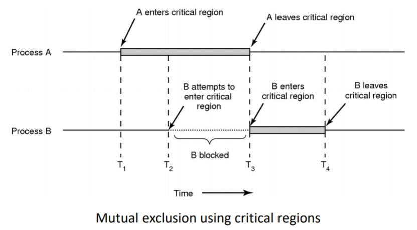

Properties of a critical region

1. Mutual Exclusion: No two processes simultaneously in critical region
2. No assumptions made about speeds or numbers of CPUs
3. Progress: No process running outside its critical region may block another process
4. Bounded: No process waits forever to enter its critical region

### Mutual Exclusion

#### Taking Turns

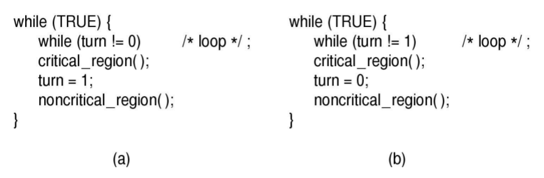

**Cons**

- A thread must wait for its turn, even if the other thread is doing something unrelated.
- If different threads use the critical region at different rates, performance is limited by the most infrequent user, i.e. the system progresses at the rate of the slowest thread.
- If one thread no longer needs its turns, the other thread may not progress.


* Busy waiting (Spin lock): All process are waiting
	* Should only be used when there's little contention
	* Waste CPU times.
* Violate property 3 (Progress) of critical session
  * Condition: (Turn = 1) After process **a** had its turn and finish its non critical region, it's waiting before while loop for process **b** to finish its noncritical region. **b** need to go into the critical region and change the turn before **a** can proceed.
  * This violate condition 3 as process **a** is blocked by a process not in its critcal region
  * This means taking turn is not a good idea when one of the processes is much slower than the other.

#### Disable Interrupts

Before entering a critical region, disable interrupts. After leaving the critical region, enable interrupts. (Disable scheduler) 

Processes are only switched by clock or interrupts.

| Pros   | Cons                                                         |
| ------ | ------------------------------------------------------------ |
| Simply | Only available in the kernel (User level shouldn't be given this privilege) |
|        | Blocks everybody else, even with no contention (争吵)        |
|        | Does not work on a multiprocessor                            |

#### Hardware Lock Variable

[Load - Observe - Write back] in one atomic instruction with hardware support. Unlike the taking turn solution, they are done in one atomic instruction hence it preservers progress.

| Pros                                                         | Cons                                                         |
| ------------------------------------------------------------ | ------------------------------------------------------------ |
| Simply                                                       | All other process are waiting (Consumes CPU)                 |
| We can have multiple locks to control multiple resources     | Starvation is possible (Some process don't get to run their critical session if there's many process waiting, as the next process to be run is random) |
| Unlike disabling interrupts, it doesn't reduce the OS ability to take back controls |                                                              |

### Sleep/ Wakeup

**Spin Lock**

> AKA: Busy waits

A spinlock is a lock which causes a thread trying to acquire it to simply wait in a loop ("spin") while repeatedly checking if the lock is available. Since the thread remains active but is not performing a useful task, the use of such a lock is a kind of busy waiting and it's wasteful.

One possible solution will be the Sleep/ Wakeup idea. It blocks an process instead of wasting CPU time.

**Properties of sleep/ wakeup**

* When process is waiting for an event, it calls sleep to block, instead of busy waiting.
* When the event happens, the event generator (another process) calls wakeup to unblock the sleeping process.
* Waking a ready/running process has no effect.

##### Producer- Consumer Problem

>  A classic example of a multi-process synchronization problem that can be solve by sleep/ wakeup

There is a fixed size buffer and the **producer** produces items and enters them into the buffer. The **consumer** removes the items from the buffer and consumes them.

**Problem Modelling**

We must keep an accurate count of items in buffer

* Producer
    * should sleep when the buffer is full and wakeup when there is empty space in the buffer
        * The consumer can call wakeup when it consumes the first entry of the full buffer
* Consumer
    * should sleep when the buffer is empty and wake up when there are items available
        * Producer can call wakeup when it adds the first item to the buffer

There can be a race between consumer/ Producer. One think there's it still an item but it has actually been taken away.

##### Race Condition

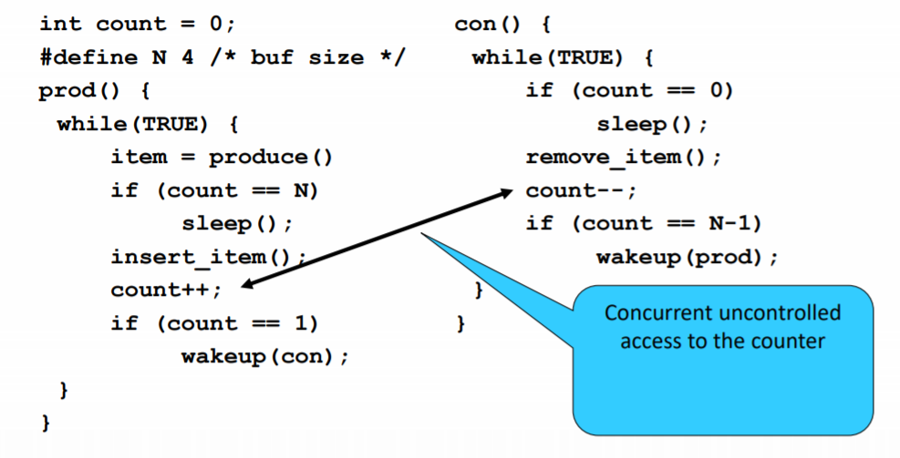

##### Trial: Lock

Use a lock to protect concurrent access

* When testing for sleep condition
* When incrementing/ decrementing the counter


This doesn't work. The left process that's holding the lock while going to sleep prevent others from entering the critical session to wake you up.

##### Semaphores

> A semaphore is a variable or abstract data type used to control access to a common resource by multiple processes and avoid critical section problems in a concurrent system such as a multitasking operating system.

**Implementation of semaphores**

```c
typedef struct {
	int count;			// #Process that can run simultaneously
	struct process *L;	// LL of blocked/ waiting processes
} semaphore;

// The two operations must be atomic (e.g. Interrupts are disabled)

// Before a process run
void wait_P(S) {
    S.count--;
    // If there's no available resourse
    if (S.count < 0) {
        add this process to S.L;
        sleep;		// Assume atomic
    }
}

// After a process run
void signal_V(S) {
    S.count++;
    // If there's process waiting
    if (S.count <= 0) {		// Count <= 0 means there are waiting, >0 means there is excessive resource
        remove a process P from S.L;
        wakeup(P);	// Assume atomic
    }
}
```

`wait (P)`: Decrement

`signal (V)`: Increment

**Solution using semaphores**

```c
#define N = 4				// Size of the buffer
semaphore mutex = 1;		// Ensure insert/ remove is primitive

semaphore empty.count = N;	// At most N producer can run
semaphore full.count = 0; 	// Counting the #consumer, intially 0

void prod() {
    while(TRUE) {
        item = produce()
        wait(empty);		// At most N producer can run
        
        wait(mutex);
        insert_item();
        signal(mutex);
        
        signal(full);		// After 1 is produced, a consumer can run
    }
}

void con() {
    while(TRUE) {
        wait(full);			// At most 0 consumer can run if full isn't signalled in prod()
        
        wait(mutex);
        remove_item();
        signal(mutex);
        
        signal(empty);		// After removing an item, 1 producer can run
    }
}
```

To avoid starvation, a semaphore has an associated queue of processes so that every processes get a turn.

The semaphores used serves two purposes:

* Mutual Exclusion (Mutex): Gurantee that only one process can read or write to the buffer
* Synchronization (Full & Empty): Gurantee that certain event sequences do or do not occur. In this case, ensure producer stop when full and consumer stop when empty.

##### Mutex

> Mutex is semaphore lacking the ability to count

Behavior when the lock is taken

* Lock: Loop until free (Busy Waiting)
* Mutex: Yield and give up the CPU (Test the lock when it runs next time), no busy waiting

**Pros**

* Put process to sleep instead of looping
	* More efficient is there's lots of contention compare to lock

**Cons**

* Context switching in kernal is expensive
	* Not good is there's very little contention

There's some minor differences between binary semaphores and mutex.

##### Futex

> Fast user space mutex: Context switching in user space
>
> Spin locks are fast if the wait is short, but waste CPU cycles if not.
>
> Mutex works well under heavy contention, but switching to kernel is expensive。
>
> Futex tries to combine the best of both worlds

Futex is feature of Linux that implements basic lock but avoid getting into the kernel as switch in the kernel is expensive. 

It provide a wait queue that allows multiple processes to wait on a lock. If a process requires an costly system call, it should be avoided to put on the queue.

The unlock and lock operation of <u>mutex</u> requires a syscall while futex doesn't.

##### Monitors

> A **monitor** is a synchronization construct that allows threads to have both mutual exclusion (Only one thread in critical) and the ability to wait (block) for a certain condition to become false (If the thread in the critical session need to be blocked and wait for others to run, this can be done with monitor). Monitors also have a mechanism for signaling other threads that their condition has been met (If successive thread have finish their job and want to call the blocked process, this can be done).
>
> Monitors provide a mechanism for threads to temporarily give up exclusive access in order to wait for some condition to be met, before regaining exclusive access and resuming their task.


> Monitors are a programming language construct designed to simplify control of concurrent access. Code related to a shared resource (and the shared resource itself) is placed in a monitor, then the compiler ensures that there is only one thread executing inside the monitor at a time. When thread calls monitor method while monitor is processing another thread, it is queued and sleeps until other thread exits monitor.
>
> Condition variables are entities used within monitors to block and wait for an event, the operations 'wait' waits for the event to occur and 'signal' operation is used to generate the event. The thread invoking 'wait' sleeps until another thread wakes it with 'signal'. Additionally, one thread can 'broadcast' or signal all blocked threads to wake up.


A monitor consists of a mutex (lock) object and **condition variables**. A **condition variable** essentially is a container of threads that are waiting for a certain condition. It enables a thread to wait for an event and gain control after the event happens.

A monitor contains a set of operations, shared data. Only one operation can be ran at anytime. Other calls to the operations will be placed in a queue.

<u>Pros</u>

* No need to be careful about the sequence of using semaphores and locks

**Condition Variables**

<u>Operations</u>

* `wait c, m`: This operation is called by a thread that needs to wait until the assertion c is true before proceeding. What it does are
1. Atomically
		1. release the mutex `m`,
		2. move this thread from the "running" to `c`'s "wait-queue" (a.k.a. "sleep-queue") of threads, and
		3. sleep this thread. (Context is synchronously yielded to another thread.)
	
2. Once this thread is subsequently notified/signaled (see below) and resumed, then automatically re-acquire the mutex `m`.
* `signal c`: A thread calls it to indicate that the assertion c is true. Depending on the type and implementation of the monitor, this moves one or more threads from `c`'s sleep-queue to the "ready queue" or another queues for it to be executed.
* `broadcase c`: A similar operation that wakes up all threads in c's wait-queue. This empties the wait-queue.

<u>Recheck the condition slept on</u>

```c
// This is mutex and conditionval variable example, not monitor
void consumer() {
    lock_acquire(l)
    while (count == 0)		// Recheck condition
    	cv_wait(empty,l);
    item = remove_item();
    count--;
    cv_signal(full,l);
    lock_release(l);
    consume(item); 
}

void producer() {
    item = produce()
    lock_aquire(l)
    while (count == N)		// Recheck condition
    	cv_wait(full,l);
    insert_item(item);
    count++;
    cv_signal(empty,l);
    lock_release(l)
}
```

The condition need to be rechecked. Otherwise a consumer might have run before and already consume the item.

<u>wait before signal</u>

Condition variables are not counters. They do not accumulate signals for later use the way semaphores do. Thus, if a condition variable is signaled with no one waiting on it, the signal is lost forever. In other words, the `wait` must come before the `signal`. This rule makes the implementation much simpler.

**Solution**

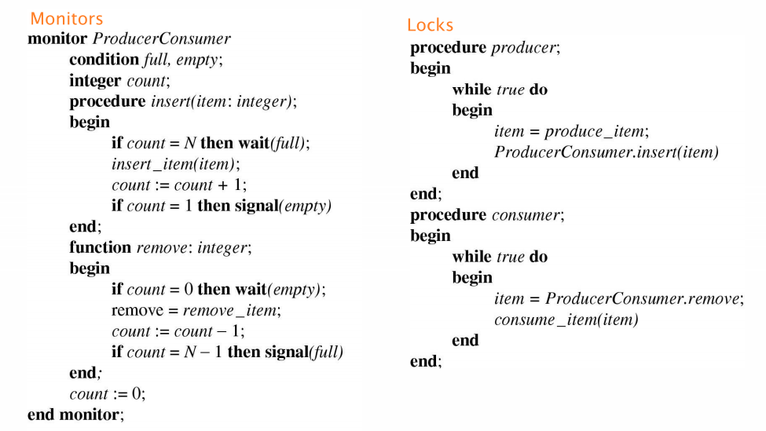


**Benefit of a monitor**

* This ADT save us from placing locks manually
* Allows process to be waken while sleeping with a lock

Since mutual exclusion is implicit with monitors, no extra effort is necessary to protect the critical section. In other words, the solution shown below works with any number of producers and consumers without any modifications.

### Concurrency Problems

#### Dining Philosophers

#### R/ W Problem

In an airline reservation system, it's acceptable to have multiple processes reading at once but if one process is writing, then all other process should be blocked.

Refer to the textbook

# Dead Lock

### Intro

**Resources**

* Preemptable resources: Resources can be taken away from a process and return it later (Virtual Memory)
* Non-preemptable resources: If resources is taken away, it will fail (Printer)

**Dead Lock**

Suppose a process holds resource A and requests resource B, at same time another process holds B and requests A, both are blocked and remain.

```c
semaphore res_1, res_2;
void proc_A() {
    down(&res_1);
    down(&res_2);
    use_both_res();
    up(&res_2);
    up(&res_1);
}
void proc_B() {
    down(&res_2);
    down(&res_1);
    use_both_res();
    up(&res_1);
    up(&res_2);
}
```

<u>Formal defintion</u>

A set of processes is deadlocked if each process in the set is waiting for an event that only another process in the set can cause.

At this point, none of the processes can run/ release resourses/ be awakened.

**Conditions for Deadlock**

1. Mutual Exclusion condition: Resource are only available to 1 process

2. Hold and wait condition: There exist process holding resources are requesting for more

3. Non preemption condition: Previously granted resources cannot be taken awy

4. Circular wait condition: Circular chain of 2 or more process, each waiting for resource held by next member of the chain. This condition is TRUE if there's a chain

    Requesting resource in different order fulfill this condition.


### Ignore

This Ostrich Algorithm basically pretend there's no problem. It's reasonbale if

* deadlocks occur very rarely
* cost of prevention is high
    * Example of “cost”, only one process runs at a time

* UNIX and Windows takes this approach for some of the more complex resource relationships they manage
* It’s a trade off between
    * Convenience (engineering approach)
    * Correctness (mathematical approach)

### Prevention

> Negate one of the four deadlock condition

* Mutual Exclusion: make resource sharable
    * Not feasible in general, some resource are not shareable
* Hold and Wait
    * Require processes to request resources before starting: Most may not know what are the required resources
    * Processes must give up all resources if it is blocked from getting additional resource (Require process to require all required resource initially)
        * However, this is prone to livelock. Livelocked processes are not blocked, change state regularly, but never make progress.
* No Preemption: Take resources away (Preempt the resource). Not viable at all (Printer Example)
* Circular Wait: Resources are ordered. Processes can only request resources  in numerical order. It has to know what resource it will need in advance, and requrie them in an order.
    * If a process initially requests 9 and 10, and then releases both of them, it is effectively starting all over, so there is no reason to prohibit it from now requesting resource 1.
    * If a process is requesting a previous one, it will be postponed until that resource is released


### Detection & Recovery

We need a method to detect if a system is deadlocked and restore progress to the system.

#### Detection

Graph the resource ownership and requests, and check if there's cycle


However, this won't work for resource that have multiple units of them. (RAM, slots in a buffer, blocks in a hard disk) In order to do so, we need a special data structure and algorithm.

**Dectection of multiple resources**

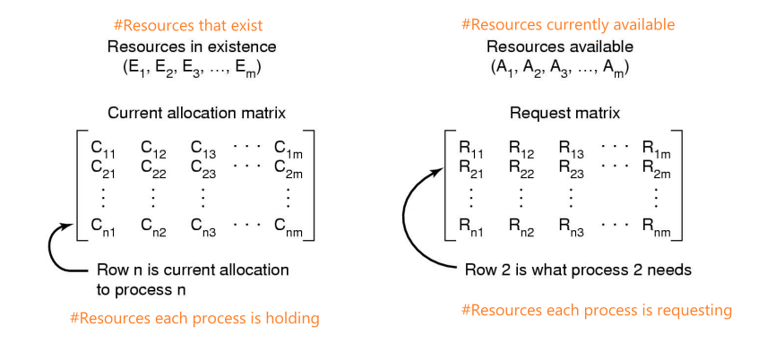

Invariant: Sum of current resource allocation + resources available = resource that exists

**Detection Algorithm**

1. Look for an unmarked (Request not fulfilled) process Pi, for which the i-th row of R is less than or equal to A (Allocate resource from available to requested)
2. If found, add the i-th row of C to A, and mark Pi (Release resource). Go to step 1
3. If no such process exists, terminate

If there's any remaining processes, they are deadlocked.

#### Recovery

* Recovery through preemption
    * Not all resources can be taken
* Recovery through rollback
    * checkpoint a process periodically and restart the process if it is found deadlocked
    * No guarantee is won’t deadlock again
* Recovery through killing processes
    * kill one of the processes in the deadlock cycle, so that the other processes get its resources
    * choose process that can be rerun from the beginning

### Avoidance

> Resource allocation

**Bankers Algorithm**

This apporach is viable if we know in advance the maximum number of each resources requried.


This trajectory demonstrate two process requesting resources.

* A need printer l1 - l3, plotter l2 - l4
* B need plotter l5 - l7, printer l6 - l8

Enterring the square unsafe section means no way back, unsafe section is prone to deadlock, hence we should not enter by letting A finish all its job before B begins.

**Safe and Unsafe States**

A state is <u>safe</u> if

* The system is not deadlocked
* There exists a scheduling order that results in every process running to completion, **even if they all request their maximum resources immediately** (Worst case scenario)

> Dead lock: Two or more process currently blocked waiting for each other.

An unsafe state may not necessarily lead to deadlock as a process might not actually started waiting (Instead of waiting for resource, it can release the resource it held). So in a unsafe state, if the worst case didn't happen, the system can avoid the deadlock.

Demonstration of how to check if safe and unsafe in Lecture W2L1

<u>Strategy</u>

Before granting an resource, we check if the system become unsafe after to grant the resource, if so, then we will postpone that request until it's say to do so.

**In practise**

Bankers Algorithm is not commonly used in practice as it is difficult (sometimes impossible) to know in advance the resources a process will require or the number of processes in a dynamic system.

### Starvation

A process never receives the resource it is waiting for, despite the resource (repeatedly) becoming free, the resource is always allocated to another waiting process.

# System Calls

**Steps**

1-3: Before performing the system call, the calling program pushed the parameters (fd, buffer, nbytes) on stack

4. Call the library procedure (call syscall, still in user mode)
5. Put system call numeber into register for kernel to read
6. `TRAP` to switch to kernel mode 


**Difference of syscall and function call**

* Syscall can change user mode to kernel mode
* Restrict possible entry point of the memory location (Can't jump to an abitrary address)

We goes on talking about different type of system calls

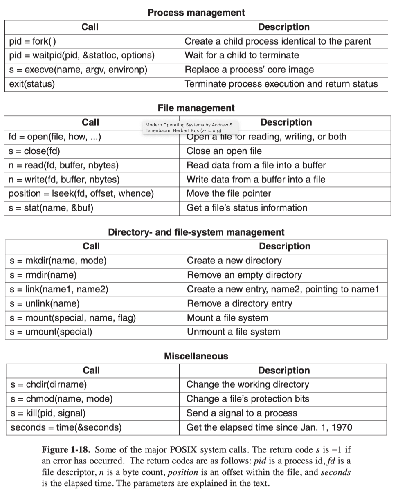

### Types of syscall

#### Process Management

`fork` create a child process that have the identical variable values.

Shell process have three segments.


#### File Management

#### Directory Management

`link`: Allow the same file to appear under two or more names, often in different directories.

`mount`: Merge two file systems into one, `mount("/dev/sdb0", "/mnt", 0);`


### Model of Computation

|           | User-mode                                                    | Kernel-mode                                                  |
| --------- | ------------------------------------------------------------ | ------------------------------------------------------------ |
| Registers |  |  |


Fetch-execute cycle

### Syscall on MIPS

#### MIPS Aritechture

MIPS has processor control registers (Assesable in kernel mode) that located in CP0 which includes

* Exception/ Interrupt management registers
	* c0_cause: Cause of the recent exception
	* c0_status: Current status of the CPU (Interrupt & Mode)
	* **c0_epc**: Address of the instruction that caused the exception
* Translation management registers

##### c0_status


- IM: Mask bit for interrupts
- KU: 0 if kernel, 1 if user mode
- IE: 0 if all interrupts masked, 1 if interrupt enable
- c, p, o represent the current, previous, and old value of the KU and IE registers (c > p > o)

##### c0_cause


* IP (Interrupts pending)

* CE (Coprocessor error)

* BD: 

* ExcCode: Code number of the exception being handled

	

	

	

#### Exception Preparation and finish

1. Store current PC to EPC (Store the error line of code)
2. Turn interrupts off (Move previous KU, IE, to a previous slot, and set KUc, IEc to 0) and switch to kernel
3. Cause is set to 0 (The program stop because an exception happens and interrupt stopped it)
4. Set PC to the general exception vector that handles exception, we will run it next

##### Return from an exception

```assembly
lw r27, saved_epc	# Retrieve where we left off
nop
jr r27				# Jump back to that line
rfe					# Return from exception
```

`rfe`: Restore the KU, IE registers to what they previously are.

And we are now back in the same state as we were when the exception happened.

#### Handing Procedure

**Overview**

1. Change to kernel stack
2. Preserve registers by saving to memory (on the kernel stack)
3. Leave saved registers somewhere accessible to
4. Read arguments
5. Store return values
6. Do the “read()” 
7. Restore registers
8. Switch back to user stack
9. Return to application

**Preparation**

1. Set up syscall arguments, then call syscall
	* same as a non syscall function, but it also moves the syscall number into register $v0

<u>Switch to kernel mode</u>

1. Save user stack pointer to `k1`
2. Check if we are in kernal model with `c0_status`, if not, we load kernal stack pointer to `sp` and get into the kernel
3. Load excpetion cause `c0_cause` into `k0`

Now, `k0`: Exception cause value, `k1`: User stack pointer, `sp`: Kernel stack pointer. All other registers remain untouched.

<u>Create trap-frame</u>

4. Jump to kernel stack
5. Store previous stack pointer, $gp the address of the command that cause the exception `c0_epc` to the kernel stack. As well as co-processor registers `c0_status`, `c0_cause`
6. Save all other user registers

<u>Prepare argument for C code</u>

6. Create an argument that points to the bottom of the trap-frame, to pass to C handler code later

```c
addiu a0, sp, 16 /* a0 pointer to the bottom of the trapframe */
jal mips_trap 	/* call C handler */
nop 			/* delay slot */
```

**Handler**

```c
void mips_trap(struct trapframe *tf);	// Exception handler
```

Now that the C handler can inspect what happened and it can modify the trapframe freely.

**Return from kernel**

7. Restore all register using data on the stack
8. Fetch the EPC into `k0` so that we can return to it

```assembly
lw r27, saved_epc	# Retrieve where we left off
nop
jr r27				# Jump back to that line
rfe					# Return from exception
```

# Computer Hardware

### Memory

#### Hierarchy

Memory system is constructed as a hierarchy of layers. The upper the memory, the smaller capacity, more expensive and faster they are.


**Question**

Describe the memory hierarchy. What types of memory appear in it? What are the characteristics of the memory as one moves through the hierarchy? How can do memory hierarchies provide both fast access times and large capacity?

> The memory hierarchy is a hierarchy of memory types composed such that if data is not accessible at the top of the hierarchy, lower levels of the hierarchy are accessed until the data is found, upon which a copy (usually) of the data is moved up the hierarchy for access.
>
> Registers, cache, main memory, magnetic disk, CDROM, tape are all types of memory that can be composed to form a memory hierarchy.
>
> In going from the top of the hierarchy to the bottom, the memory types feature decreasing cost per bit, increasing capacity, but also increasing access time.
>
> As we move down the hierarchy, data is accessed less frequently, i.e. frequently accessed data is at the top of the hierarchy. The phenomenon is called "locality" of access, most accesses are to a small subset of all data.

#### Registers

#### Cache

* Cache hit: Request is satisfied from the cache
* The effective access time is dependant on the hit rate, $t_{eff}=P(\text{Hit})\times t_{\text{memory 1}}+(1-P(\text{Hit}))\times t_{\text{memory2}}$

#### Main memory

* RAM: Fast, volatile
* ROM (Read Only): Fast, non-volatile, cannot be channged
* EEPROM: Non-volatile that can be erased and rewritten. But slower than RAM and can wear out.
* CMOS: Volatile, can be powered by a small battery.

#### Magnetic disk

Disk can R/W data relatively fast. However, the access time is dominated by the time to locate the head over data, this involves rotational latency and seek time.

# File Systems

### File

#### File Structure

Files can be structured in many ways, the three common possibilities are

1. Files are regarded as meaningless byte sequence. The meanings are imposed by user-level programs. This provide the maximum flexibility. This is used in Windows and UNIX.
2. Byte Sequence: In this model, a file is a sequence of fixed length records. It allows convenient read operation that returns one record for append and overwrite.
3. Tree: In this model, a file is made of a tree of records, each containig a key that allow rapid seraching. This type is used on large commercial data processing.


#### File types

* Regular file: User information
    * Either ASCII (Can be printed) or binary files (Can only be understood by the programs)
* Directories: Maintaining the structure of the file system
* Device Files
    * Character special files: IO (terminal, printers, networks)
    * Block special files: Model disks

#### File Access

* Sequential Access: Read from start to finish, cannot jump around. (Useful in magnetic tape age)
* Random access: Bytes/ records that can be read in any order (lseek)

#### Access Right

* None: User do not know the existence of the file. Not allowed to read the directory that contains the file
* Knowledge: User can only determine that the file exists and who its owner is
* Execution
* Reading
* Appending
* Updating
* Changing protection
* Deletion
* Owner

#### File Attributes


### Directories

Directory provide a mapping from file names to files. Contains attribute of the files. Directory itself is a file owned by the OS that record the information of the file in it.

### File System Implementation

Now it is time to turn from the user’s view of the file system to the implementor’s view. 

Users are concerned with how files are named, what operations are allowed on them, what the directory tree looks like, and similar interface issues. 

Implementors are interested in how files and directories are stored, how disk space is managed, and how to make everything work efficiently and reliably.

#### UNIX Storage Stack


The arrow between application and FD table represent the syscall interface (`creat, open, read, write`).

The function of the other component are as follows

* FD/ OF (File Descriptor, Open file table)
    * Keep track of files opened by user-level processes
    * Matches syscall interface to VFS interface
* VFS (Virtual File system): Unified interface to multiple FS (Make data on different disk appear to be uniform)
* FS (File system): Provide abstraction for the disk. 
    * Hide physical location of data on the disk
    * Expose the directory hierachy, symbolic file names, random-access files and protection
* Buffer cache && Disk schedular: Provide optimisation for disks. 
    * Keep recently accessed disk blocks in memory
    * Schedule how the read head run when encountering access from multiple processes (For performance and fairness)
* Device Driver: Hide the geometry on the disk, bad sectors. Expose the storage as a linear sequence of blocks.

#### Implementing Files

The job of FS is to map symbolic file name into collection of block addresses. The FS keep track of

* which block belong to which file
* in what order does the block form the file
* which blocks are free

##### Contiguous Allocation

The simplest allocation scheme is to store each file as a contiguous run of disk blocks.


| Pros                                       | Cons                                                         |
| ------------------------------------------ | ------------------------------------------------------------ |
| Good performance for sequential operations | After files are deleted, the disk becomes fragmented with free space everywhere. |
| Simple to implement                        | Need to know the maximum size for the file beforehand        |

It's feasible on CD-ROMs and they are fixed in size and read only.

##### Dynamic Allocation

Allocatioin disk space as needed and allocation occurs in fixed-size blocks.

| Pros                                      | Cons                                             |
| ----------------------------------------- | ------------------------------------------------ |
| No external fragmentation                 | Internal fragmentation (Partially filled blocks) |
| Doesn't require pre-allocating disk space | Not as sequential efficient                      |
|                                           | Need metadata management (Map blocks to file)    |

External fragmentation: The space wasted external to the allocated memory regions

* Memory space exists to satisfy a request but it is unusable as it is not contiguous

Internal fragmentation: The space wasted internal to the allocated memory regions

* Allocated memory may be slightly larger than requested memory; this size difference is wasted memory internal to a partition

###### Linked List Allocation

Each block contains a pointer to the next block in the chain. Free blocks are also linked.

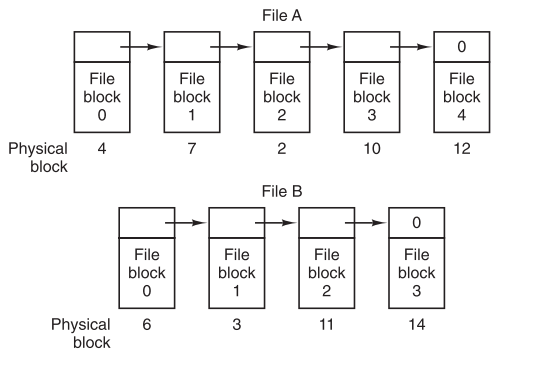

Pros:

* No external fragmentation
* Good performance for sequential access

Cons

* Random access is slow
* The free list eventually will scatters around the disk
* Pointer takes some space, so read a full block size requries acquiring and concatenating information from two disk block.

###### LL Allocation with a table in memory (Indexed Allocation)

> The table is called FAT (File Allocation Table)

Both disadvantages of the linked-list allocation can be eliminated in this implementation. 

We can have a pointer table in the memory. Each file has a pointer to a entry in the table, and each table will contains the block number of the next block of this file. For example, File A below uses blocks 4, 7, 2, 10 and file B uses blocks 6, 3, 11, 14. The chain will terminate with a special marker (-1)


Although the chain still need to be followed to perform random access. The **chain is in memory** and disk which is much faster.

Cons: 

* Storing the entire table is the memory is not storage efficient. (2GB for a 1TB Disk)
* Free block loopup is slow (Search a free entry in table)


###### I-nodes

The idea is to keep separate table for each file. We can only keep the table of the opened files in the memory. The Windows NTFS FS uses this idea.

**i-node Allocation**

i-node a fixed proportion of a disk (There's a maximum number of file that can be stored on a disk). i-node are allocated dynamically. Each i-node is of fixed size, so it's convention to reserve the last i-node entry for a pointer to an extension i-node in case a file takes too much space.

**Free space management**

Free block list: link unused blocks to each other in a linked list. One block is kept in memory.

- \+ Doesn't use up extra disk space. (The next pointer is stored in the free blocks)
- \+ Can just keep a block of pointers in memory, saving memory space
- \- Difficult to find free blocks as the list doesn't guarantee contiguity (though this can be alleviated with background tasks that reorganise the list to some degree)Free blocks will end up scramble around the disk. Background job can be done to re-order them to provide better contiguity on physical disk.
- \- Can use a lot of disk IO when block in memory is close to full or empty. This can be alleviated by moving the block to disk when it reaches a 'high water mark'.

Bitmap-based allocation: store a bitmap on disk indicating which blocks are free.

- \+ Can concentrate allocations in one area.
- \+ Fast to find contiguous free blocks.
- \- Can be large in size. This can be alleviated using a multilevel table
- \- Expensive to search


#### Implementing Directories

Directories are stored like normal file. The mapping between filename and file need to be stored on the disk in the same File System as the machine FS. The main purpose of the directory is to map the ASCII filename to the information that needed to locate the data.

##### Storing Attributes


A: Disk address and attributes in directory entry (FAT)

B: Directory where each entry just points the i-node (UNIX)

##### Filenames

* Fixed-size directory entries: Not flexible, either too small or too big

* Variable-size name: One disadvantage is that when a file is removed, external fragmentation is introduced. (Compaction can be perform when block is in RAM)

	

##### Locate file in directory

* Linear Search (Can use cache to help)
* Hash table
* BST

##### FS Block Size

File system could use multiple physical block to form a virtual larger block. Larger blocks

* Require less FS metadata
* More internal fragmentation that waste disk space
* Faster Squential Access (Less IO operations, more contiguous the disk accesses)
* Slower Random Access (Can read in more unrelated data to the memory, when we don't need the whole block)
	* Spatial locality of access improves the situation

#### Virtual File System

Virtual file system coordinates multiple different file system. 

* VFS provides single system call interface for many file systems. 
* It provides a framework to support multiple file system types concurrently without requiring each file system to be aware of other file system types.
* It provides a clean interface between the file system independent kernel code and the file system specific kernel code.
* File like interface to arbitrary device or kernel structure (`/dev`, `/proc`: List of processes)


The concrete file system need to satisfy the VFS interface for VFS compatibility. Thus the VFS has two distinct interfaces: the upper one to the user processes and the lower one to the concrete file systems.

Internally, most VFS implementation are object oriented. There are three major one: Superblock, v-node, directory

##### SuperBlock (VFS)

Describe a whole physical file system. Includes functions like `mount`, `unmount` to register the FS with VFS. When a FS registers, it provide a list of function pointers that the VFS interface requires.

```c
struct fs {
    int (*fs_sync)(struct fs *);	// Force FS flush the caches to disk
    const char *(*fs_getvolname)(struct fs *);	// Get volumn name
    struct vnode *(*fs_getroot)(struct fs *);	// Get the vnode of the root dir
    int (*fs_unmount)(struct fs *);				// Unmount FS
    
    // File system specific data: differentiate between volumns
    void *fs_data;
};
```

##### V-node

Describe a file (inode). Include functions like `read`, `write`. Points to the real inode on the disk.

```c
struct vnode {
    int vn_refcount;	// #References (#Process open this vnode) to this vnode
    struct spinlock vn_countlock;k	// Lock for mutual exclusive access
    struct fs *vn_fs;	// Point to FS containing the Vnode
    void *vn_data;		// FS specific vnode data
    
    // Array of pointers to interface of vnode
    const struct vnode_ops *vn_ops;
};
```

##### Directory

##### Steps of using a file on VFS

`open("/usr/include/unistd.h", O RDONLY)`

1. The FS registered with VFS and being `mount`
2. When parsing a path, VFS looks for the FS's superblock by searching through all the mounted FS.
3. VFS create a v-node for `include/unistd.h` and copied it to RAM.
4. VFS makes an entry in the FD table for the calling process and sets it to point to the new v-node.
5. When the process does a read using the FD, VFS locate the v-node from the process and FD, and call the `read` interface function. <u>The VFS has no idea where the data is coming from, it's just an interface.</u>


#### FD & OP Tables

Each opened file has a file descriptor to specify which file we want to operate on.

##### FD

* Single global file array

    

    * fd in an index in an vnode pointer array
    * However, since every process should have its own FD table so that stdout (fd:1) can be different for every process.

* Per-process file descriptor array

    

    * Issue
        * Fork: The child process shared the file descriptor with the parent (**The position in file is shared, i.e. share the same OF entry**)
        * Dup2: Can define a new fd to the same file within a process (**Share OF entry**)

* Per-Process table with global open file table (FD table + OF table (Statically sized > 128))

    

    * Different process can share the fd (for fork)
    * There can be multiple fd that point to the same file in a process with different position (dup2)
    * Used by Linux and Unix

#### Buffer

Temporary storage used when transferring data between entities. Usefully in the case of 

* When entities work at different rates
* when the unit of transfer is incompatible (Get one byte from a block in disk, write a block back to the disk). The buffer can group the data for the program

##### Implementation

A hash table that hashes device# and block# that link to the buffer cache. If it's not already cached, it will be cached.

##### Replacement

An algorithm is used to perform replacement when the buffer it full.

#### Cache

Fast storage (RAM) used to temporarily hold data to speed up repeated access to the data, reduce disk accesses.

**Write Policy**

Write-through cache performs write immediately to the disk, but still preserve the efficiency of reading. (Suitable for removable storage devices)

**LRU is undesirable in some cases**

Inode block should be written to the disk as soon as possible and it is not likely going to the referenced two times within a short interval. It should be placed at the end of the list to be evicted earlier.

## Example File systems

### Ext2

> Second version of the extended file system

#### Inode

##### **Recap**

Inode

* Contains the file metadata
	* Access rights, owner, accouting info
	* (Partial) index table for blocks storing the file
* Contains a unique inode number

##### Inode Contents


* **Reference count** stores the number of hard link to this file. If it's not 0, the file will not be deleted
* **Size & Block count** 
	* Size: Offset of the hightest byte written
	* Block count: Number of blocks occupied by the file and indirect blocks used by the filesystem to keep track of the file data blocks themselves.
	* Block <= size

###### Inode Addressing Schema

* Single Indirect: Block number of block that contains the block number for the rest of the file

* Double indirect: Block number of blocks that contains th eblock number of **single indirect**

As illustrated below


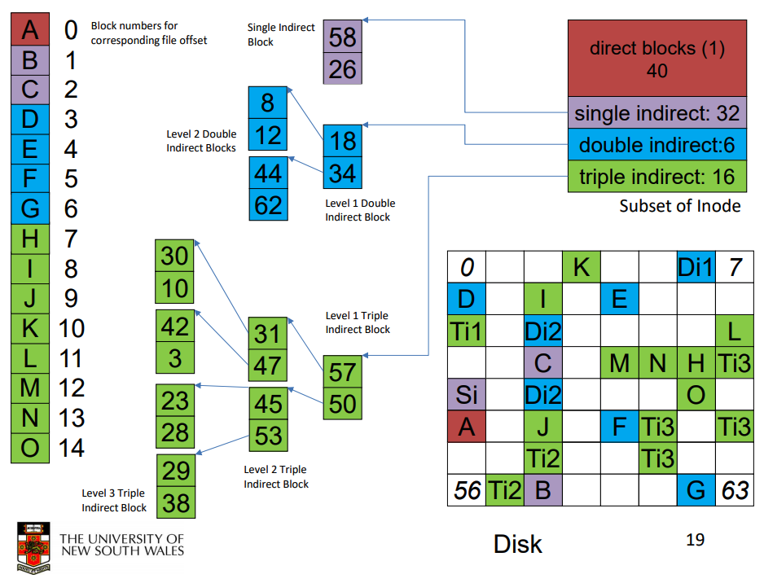


Assume the that the size of each block is 4096 bytes, and the address of each block is 4 bytes, 

* The direct block is of size 4 bytes * 12 = 48 bytes
* The single indirect block is 4 bytes, point to a block that stores the address of 1024 blocks

###### Best and Worst case Access

|                       | Best               | Worst                                                        |
| --------------------- | ------------------ | ------------------------------------------------------------ |
| Read                  | 1 via direct block | 4 read (3 indirect + 1 data block)                           |
| Write                 | 1 via direct block | 4 read + 1 write (Read the data block before writing to it, hence 4 read) |
| Write (uninitialized) |                    | 4 write (create 3 indirect + 1 data)                         |
|                       |                    | 3 reads, 2 writes (Read the first three indirect, write 1 indirect, 1 data) |
|                       |                    | 4 write + 1 read (Read the first indirect, write 3 indirect + 1 data block) |
|                       |                    | 2 read + 3 write (Read the first two indirect, write 2 indirect, 1 data block) |

We have to first read an indirect to figure out that the next indirect doesn't exist

##### Summary

The use of indirect table make it efficient in random and sequential access via indexed allocation.

#### FS Layout

##### f5fs


* Boot block: Code to boot the OS
* Super block: Attributes of the FS. (Size, number of inodes, free inode list ...)
* Inode Array
* Data blocks

**Downside**

* The inode and data of a file will be placed too far that the seeking time will be long
* Since there's only one superblock, not robust to correuption
* Block allocation can introduce external fragmentation
* Free inode list will be randomised over time

##### **Ext2**


**Features**

* Multiple super block to provide redundancy
* Bitmap to keep track of free blocks (Fast Lookup)
* Proximity between inode table and data blocks
* Pre-allocation of blocks on write (Only need 1, will allocate 8)
    * Allocate more space even if not needed now, so that the follow up data are written side by side.
    * Aim to store files within a directory in the same group

**Components**

* Super block
    * Size of FS
    * Block size
    * Free inode and block counters
    * Data indicating whether file system check is needed
* Group descriptors
    * Location of bitmaps
    * Counter for free blocks
    * Number of directories in the group

#### Directory

Feature of directories in Ext2

* Directories are just file of special types
* Provide mapping from name to inode numbers
* Entries can be deleted by setting the inode to 0

##### Contents of a directory file


##### Links

**Hard link**


Three different filename all points to the same inode.

The reference count in the inode stores exactly how many hard links to the file.

Only user with proper permission can create hard link to a file. Otherwise deleting the file has no meaning when others can freely hard link the file.

**Symbolic link**

Symbolic link is a file that contains a reference to another file or directory. It has its own inode and data block, and the data stores a path to the target file.

* It can point across file system boundaries (Hard link can only link file in the same FS)
* To avoid cyclic symbolic link, linux will only track up to a certain steps along the symbolic link

#### FS reliability

* Disk write are buffered, if power outage occur, data in the buffer will be lost
    * Commit writes to disk periodically
    * Or force FS flush
* FS operations are non-atomic
    * Imcomplement transation can leave FS in consisten state. e.g.
        * Delete a file has three steps, they must all finish to delelte correctly
            * Remove directory entry
            * Mark i-node as free
            * Mark disk block as free
    * e2fsck
        * Scans the disk after an unclean shutdown and attempt to resotre FS invariants
    * Journaling file system
        * Before performing an update, write it to a journal, then replay the last journal entries upon an unclean shutdown
        * so that we can recover from that later (ext3)

### Ext3

#### Features of ext3

* Add journaling capability to the ext2
* Backward and forward compatibility with ext2 (Allow ext2 partitions to be mounted on ext3)

#### Types of journal


ext3 implements option 2


#### JBD

> Journaling block device

**Process of a transaction**


**Journaling Process**

Only after the log entry has been written, do the various operations begin. After the operations complete successfully, the log entry is erased. If the system now crashes, upon recovery the file system can check the log to see if any operations were pending.

##### Journaling Mode

Journaling transaction effectivelly require noting down all the operations performed, which can be a downside to performance. There's are two journaling modes that compromise between integrity and efficency

1. Journalize all metadata + data: Enforce atomicity in all FS operations, slow
2. Only journalize the metadata (Data block directly written to disk)
    * Improves performance
    * Enforce only the atomicity of the file system, not the datas

##### Storage

JBD can be keep on

* A block device (SSD for performance)
* File

This enables compatibility with ext2 (journal can be just a ext2 file)


JBD is independent of ext3-specific data structure which means it can be used on any other file systems.

# Memory Management

## Fixed Partition

### Equal Size Partition

Divide memory into equal size partition

* Internal Fragmentation
* Inability to run processes greater in size than a partition, but smaller then memory.

### Variable Sized Partition

Divide memory into different sized partition with a queue for each partition. Process are placed in a queue for the smallest partition that it fits in.

The workload is not balanced, there might be some partition completely idle

* Small jobs available, but only large partition free
* Workload is unpredictable

## Dynamic Partition

In DP, partitions are of variable length, allocated on -demand from ranges of free memory.

Fragmentations

* External Fragmentation: The space wasted external to the allocated memory regions.
	* Memory space exists to satisfy a request, but it is unusable as it is not contiguous.
* Internal Fragmentation: The space wasted internal to the allocated memory regions.
	* allocated memory may be slightly larger than requested memory; this size difference is wasted memory internal to a partition.

### Managing Free Memory

A linked list can be used to keep track of allocated and free memory segments. 

#### Dynamic Partitioning Placement Algorithm

* First fit: Scan the list for the first entry that fits
	* Left holes at the start of the list, need to skip a lot of unusable
	* Leave large blocks at the end of memory
* Next fit: Start from the point of the last succeded request
	* Allocation is more uniform as it avoid skipping over the small holes at the begining
	* Performs worse than first-fit as it breaks up the large free space at end of memory.
* Best fit: Find the block that's closest in size to the request
	* Costly to loop through the list
	* Create many tiny unusable holes (The best it fit the smaller the holes)
* Worst fit: Choose the largest block
	* Idea: Leave usable fragment left over
	* Costly to loop the list
	* Does not result in less fragmentattion

### Base and Limit

An **address space** is the set of addresses that a process can use to address memory.

We can use two register: base and limit to provide a simple dynamic relocation solution.


They restriction the view of memory for a program.

Base and limit registers are changed when

* Load time
* Relocation (Compaction)
* On a context switch

**Pros**

* Support protecterd multi-processing

**Cons**

* Physical memory allocation must still be contiguous
* The entire process must be in memory
* Do not support partial sharing of address spaces
	* No shared code, libraries, or data structures between processes


Above is a typical address space layout. The bottom of the address space doesn't have any matching physical page, so that dereferencing NULL pointer will generate a segmentation fault.

### Swapping

Swapping bringing in each process in its entirety (Continuous Memory Allocation), running it for a while, then putting it back on the disk. Idle processes are mostly stored on disk, so they do not take up any memory when they are not running 


Swapping can creates holes in the memory and it is possible to be solve by **memory compaction** (Shuffle memory contents to place all free memory together in one large block. pointers will be a problem).

**Pros**

* Allow OS to run more programs than what physical memory can support

**Cons**

* Swapping is slow as the entire program is copied in and out.

Three timing when memory addresses is bound to the program.

* Compile/link time
    * Compiler/Linker binds the addresses
    * Must know “run” location at compile time • Recompile if location changes
* Load time
    * Compiler generates relocatable code. Loader binds the addresses at load time
    * Slow loading, and increased executable file size
* Run time
    * Logical compile-time addresses translated to physical addresses by *special hardware*
    * More flexible, but most costly when every translation occurs.

### Problem

Pro: 

* Supportes multi-processing
* Memory can be allocated dynamically 
* Compaction is possible

Cons

* Physical memory allocation need to be contiguous
* The entire process need to be in the memory
* Do no support partial sharing of address spaces (code, libraries, data structure)

## Virtual Memory

External Fragmentation: total memory space exists to satisfy a request, but it is not contiguous.

Internal Fragmentation: allocated memory may be slightly larger than requested memory; this size difference is memory internal to a partition, but is not being used.

### Paging

> Paging is where main memory is divided into equal-sized chunks (frames) and the programs address space (virtual address space) is also divided up into matching-sized chunks (pages). Memory is transfered to and from disk in units of pages.


The basic idea behind virtual memory is that each program has its own address space, which is broken up into chunks called **pages**. 

Each page is a contiguous range of addresses. These pages are mapped onto physical memory (made of **frames**), but not all pages have to be in physical memory at the same time to run the program. 

The OS will maintains a page table to map between virtual and physical

#### MMU

> Memory Management Unit


MMU maps **virtual addresses** to **physical addresses** including those in the RAM and on the disk.


The mapping can be summaried as follows:

* The virtual address is split into a virtual page number (high-order bits) and an offset (low-order bits). 
* In an 16 bits memory addresss and a 4 KB page size situation. The upper 4 bit specify one of the 2^4 = 16 pages and the lower 12 bits will specify how far are we in that page (offset.) 
* $2^{12} = 4096$ which means 12 bits can address all 4096 bytes within a page.

### Page Fault

> The trap that caused by accessing an absent page is called **page fault**.

Page fault cause CPU to trap to the OS, the OS will then write the content to an empty frame, update the page table and restarts the faulting instrctions.

If the program was accessing an illegal address, OS will be signalled or the process will be killed.

### Page Table

The page table only hold the information that the harware need to translate a virtual address to a physical address. The disk address of absent page is not part of the page table. The information OS need to handle page fault is in the OS. Hardware don't need it.


Page table allow the ease of sharing a page between two process (e.g. a copy of the C library)

#### Page Table entry

The exact layout of an entry in the page table is highly machine dependent, but the kind of information present is roughly the same from machine to machine. The size varies from machine, but 32 bits is a common size.


| Name                    | Usage                                                        |
| ----------------------- | ------------------------------------------------------------ |
| Page frame number       | The physical frame number used to locate page in RAM         |
| Present/ Absent (Valid) | Keep track of whether the page is in memory or disk          |
| Protection              | What kind of access are permitted. e.g. read/ write/ executing |
| Referenced              | Whether the page has been read/ written to. Help the OS choose a page to evict when a page fault occur. |
| Modified                | If a page has been modified, it must be written back to the disk. If it hasn't been modified, it can just be abandoned since the disk copy is still valid. |
| Caching disable         | This feature is important for pages that map onto device registers rather than memory (Data needed to control a physical device). If the operating system is sitting in a tight loop waiting for some I/O device to respond to a command it was just given, it is essential that the hardware keep fetching the word from the device, and not use an old cached copy. |

### Speed Up Paging

In paging system, there are two major issues

* **Time**: The mapping from virtual address to physical address need to be fast
    * All instruction need to make more than 1 page table references
* **Space**: If the virtual address is large, the page table will be large
    * If we have 4096 Bytes per page, a 4GB virtual address need to be addressed with $2^{32}\div2^{12}=2^{20}$ entries in the page table 
    * 32 bit address sapce can reference 1 million pages, the page table must then have 1 million entries. And each process will need its own page table.

Pros/ Cons of keep having one huge table

* Straightforward and fast
* Expensive if the page table is large
* The whole table need to be loaded at every context switch which can be slow

### TLB

> Translation Lookaside Buffers

When a virtual address is presented for MMU to translate

1. Hardware compare the virtual page number with all the entried of TLB (64 to 128 entries) concurrently (Need hardware support). Doing so require special hardware so the size of TLB won't be very large
2. If it isn't in the TLB, MMU will detects the miss and do an ordianry page table lookup.
    1. If not in memory, fetch from disk
3. Evicts one of the entries in TLB and replaces with the page that just looked up.

The whole process doesn't involve trapping to OS.


<u>There are two types of TLB</u>

* Process-specific: context switch will flush the all the TLB entries which is costly when loading them back in when we switch back.
* TLB with **entries that are tagged by** address-space identifiers (ASIDs). Each process has a separate address space with an assigned unique 8-bit ASID. This allows context switch that doesn't require invalidating all TLB entries as they can be differentiate by ASID (Virtual address and ASID pair is a primary key).

<u>TLB Effect</u>

* Without TLB: Averge 2 reference
* With TLB (Assume 99% Hit rate): 0.99 * 1 + 0.01 * 2 = 1.01

<u>Methods of reducing TLB misses</u>

* Predict what pages will be needed next, then when handling the first TLB fault, it loads the next predicted pages into TLB to reduce the possibility to the next TLB.
* Keep TLB entries always in cache.

Soft miss: Page reference not in TLB, but in memory

Hard miss: Not in memory, but in disk

**Software TLB Management**

In some machines, there is no hardware TLB, instead, all page management in done is software. When a TLB miss occurs, instead of MMU fetching the needed frame (Do not trap to the OS), a TLB fault is generated and have to trap to the OS to do it which is costly.

The gain is a much simpler MMU, giving more area for caches and other features. Also, TLB in software has more flexibility than hardware.

Using Software TLB doesn't means that the TLB doesn't have hardware support, it's just that software TLB load the page into TLB via software as oppose to hardware.

### Page table for large memories

#### Multilevel Page Table


(a) is a 32-bits virtual address that's partition into PT1 + PT2 + Offset. 12 bit offset address a whole 4k page.

The top level table has 1024 entries which reference by the 10-bit PT1 field. Each of the these entry rerpesent 4M = 4K * 1024 (PT2).    

In reality, the PT1 and PT2 can have different allocation and there can be more level page table.

#### Inverted Page Tables

**Features**

It is an alternative to the level system, it's first used by processers as the PowerPC. In this design, there is one entry per frame rather than one entry per page table. Each entry keeps track of which process's which virtual page is located in the page frame. 

**Search**

Now to find a physical frame of an virtual page, we need to search through the whole table to find out where is the physical page.

One feasible way is to have a hash table. The hash table hashes the vritual address and chain all the virtual pages that have the same hash value. If we have as many slots as the physical frames, the average chain will be only one entry long. Once it's found, the new (virtual, physical pair) is entered into the TLB. 

The hash table will record the PID so that two process giving the same virtual address can be differentiate. The next field goes to another entry with the same hash.


Pros

* IPT grows with frames, not virtual address which saves space
* Each node in multiple level table is of size 8 bytes in 64 machine, while IPT doesn't need that many entries, it saves space

Cons

* Need a separate table to record absent pages (Cannot record if a page is on disk)
* Sharing frame in IPT is difficult to achieve

#### Hash Page table

The pid and the virtual address are hashed to index an hash table. It can have multiple entry for the same physical frame. So that sharing frame in this table is fast.

The difference with IPT is that the table is no longer indexed by physical frame, but simply a serials of mappings.


### MIPS R3000

#### Overview

**TLB Entry**


| Field         | Functions                                                    |
| ------------- | ------------------------------------------------------------ |
| Not cacheable | Map to kseg0 or kseg1                                        |
| Dirty         | 0 Read, 1 R/W                                                |
| Global        | Whether ASID is ignored in lookup                            |
| Valid         | Can we perform the translation (Set to 0 act as flushing this TLB entry) |

**Address Space**


Device access will usually use kseg1 as caching is turned off. 

Only kuseg is for user processes.

kuseg (2GB), kseg0/1(512M)

#### TLB

> Even if TLB in MIPS has the software to load pages into TLB, TLB itself is still a hardware-based translator.

In MIPS TLB refill is handled by an TLB miss exception handler. Since TLB refill exceptions are expected to be frequent, the CPU optimised for handling kuseg TLB refills by having a special exception handler just for TLB refills.

**Procedures**

1. Compare request with TLB
2. If not, TLB refill handler find the page and filled it in

**Optimisation**

* Does not need to check the exception type
* Does not need to save any registers. It uses a specialised assembly routine that only uses k0 and k1.
* Does not check if page table entry exists

**MIPS Virtual Memory Exceptions**

* TLB Refill: Handled by special exception vector
* Others handled by general exception vector
	* TLB Mod: TLB modify exception, attempt to write to a read-only page
	* TLB Load: Attempt it load from a page with an invalid translation
	* TLB Store: Attempt to store to a page with an invalid translation

**Registers used in handling**

<u>Register</u>

c0_EPC and c0_badvaddr (Address of the page fault) can potentially be the same if the process is trying to load source code.

<u>TLB Relate Registers</u>


* c0_Index: Use to index the TLB array


**TLB Register Manage Instructions**

* TLBR (Read)
	* Input: Index from c0_Index
	* Output: The page table address in EntryHi & EntryLo
* TLBP (Probe)
	* Input: The virtual page that you with to match from EntryHi
	* Output: The index of that entry in c0_Index
* TLBWR (Write Random)
	* Input: A page address that's not in TLB yet from EntryHi & EntryLo
	* Effect: That page will be loaded to a pseudo-random location in TLB
* TLBWI (Write to Index)
	* Write a page to a specific index to TLB pointed by c0_Index
	* More expensive to use than TLBWR

#### TLB miss handling

Status of c0 registers on refill exception


Process Outline

1. Look up PTE corresponding to the faulting address
2. If found
    1. Load c0_EntryLow with translation
    2. Load into TLB using TLBWR
    3. Return from exception
3. Else page fault
    1. Access to illegal address
    2. The page is not allocated yet and it within legal region (Need to be checked)
        1. Allocate a frame with corresponding region permission
        2. Insert to page table
        3. Load to TLB

#### Initialize Address Space

```c
/*
 * Functions in addrspace.c:
 *
 *    as_create - create a new empty address space. Initialize structures for as
 *
 *    as_copy   - create a new address space that is an exact copy of
 *                an old one. Probably calls as_create to get a new
 *                empty address space and fill it in.
 *
 *    as_activate - make curproc's address space the one currently
 *                "seen" by the processor. Usually involve operations on TLB
 *
 *    as_deactivate - unload curproc's address space so it isn't
 *                currently "seen" by the processor. This is used to
 *                avoid potentially "seeing" it while it's being
 *                destroyed. Can be flushing all TLB.
 *
 *    as_destroy - dispose of an address space. You may need to change
 *                the way this works if implementing user-level threads.
 *				  Destroying the structures for as.
 *
 *    as_define_region - set up a region of memory within the address
 *                space. Involing the range of addresses and permission
 *
 *    as_prepare_load - this is called before actually loading from an
 *                executable into the address space. So that codes can be
 *                loaded to write only regions
 *
 *    as_complete_load - this is called when loading from an executable
 *                is complete. Reset the loading_flag
 *
 *    as_define_stack - set up the stack region in the address space.
 *                (Normally called *after* as_complete_load().) Hands
 *                back the initial stack pointer for the new process.
 */

struct addrspace *as_create(void);
int               as_copy(struct addrspace *src, struct addrspace **ret);
void              as_activate(void);
void              as_deactivate(void);
void              as_destroy(struct addrspace *);

int               as_define_region(struct addrspace *as,
                                   vaddr_t vaddr, size_t sz,
                                   int readable,
                                   int writeable,
                                   int executable);
int               as_prepare_load(struct addrspace *as);
int               as_complete_load(struct addrspace *as);
int               as_define_stack(struct addrspace *as, vaddr_t *initstackptr);
```

## Page Replacement Algorithm

### Basis

**Demand Paging**

With virtual memory, only parts of the program need to reside in to the memory for execution. Hence when we need to load pages from disk to memory, we need an replacement algorithm.

Demand page load pages from disk on demand. When a process first start it won't have any pages mapped, it relies on page fault to load pages into memory.

**Pre-paging**

Load more pages than what's actually needed. More wasteful if we load the wrong page.

* Wastes I/O bandwidth if pre-fetched pages aren’t used
* Especially bad if we eject pages in working set in order to pre-fetch unused pages.

#### Principle of locality

* Temporal locality: states that recently accessed items are likely to be accessed in the near future.
* Spatial locality: says that items whose addresses are near one another tend to be referenced close together in time.

The graph below depict the page access footprint of gcc. Horizontal proves temporal locality while the verticle proves spatial locality


#### Working Set

>  The pages/segments required by an application in a time window ($\Delta$) is called its memory working set. 

Working set is an approximaion of a program's locality. Hence the choice of $\Delta$ is important in measuring locality.

* $\Delta$ too small: Will not encompass entire locality
* $\Delta$ too large: Emcompass several localities
* $\Delta=\infty$: Emcompass the entire program

$\Delta$ is an application specific tradeoff. System should keep resident at least a process's working set.

#### Thrashing


CPU utilisation tends to increase with the degree of multiprogramming as there's more process that can keep the CPU busy while doing I/O. However, more processes means less memory available per process which increases page fault rate. Eventually we cannot find a runnable process as the system become I/O limited and the CPU utilisation then decreases. This is called thrashing.

Thrashing occurs as the **sum of working set size > total physical memory size.** Resulting in excessive disk i/O

##### Detecting

Page fault is more often then usual

##### Recovery

In the presence of increasing page fault frequency and decreasing CPU utilisation

1. Suspend a few processes to reduce degree of multiprogramming
2. Resident pages of suspended processes will migrate to backing store
3. More physical memory becomes available
	* Less faults, faster progress for runnable processes
4. Resume suspended processes later when memory pressure eases

## VM Mangement Policies

Operation and performance of VM system is dependent on a number of policies:

* Page table format (may be dictated by hardware)
* Page size (may be dictated by hardware)
* Fetch Policy (On demand/ Prediction)
* Replacement policy
* Resident set size
	* Minimum allocation: Fair division
	* Local versus global allocation: Larger ones get more
* Page cleaning policy (Some OS only writes pages to disk upon replacement)

### Page Size


**Pros**

* Less page, smaller page table
* Increase TLB coverage
* Increase the amount of data that can be swapped in each seek (原话 Increases swapping I/O thoughput)

**Cons**

* Increases internal fragmentation
* Increase page fualt latency (Need to read more from disk)


Optimal page size is a trade-off

**Working Set size**

Working Set Size Generally Increases with Increasing Page Size: True/False? T

If the page size is small, the work set size is smaller (in terms of memory used, not absolute number of pages) as the pages more accurately reflect current memory usage (i.e. there is less unrelated data within the page).

If the page size is large, working set also increases as more unrelated data within the larger pages are included in the current working set.

### Fetch Policy


### Page Replacement Algorithm

Frame that cannot be replace

* Kernel code
* Main kernel data structure 
* I/O buffers
* Performance-critical user-pages (e.g. for DBMS)

Performance Rank

1. Optimal: The page whose next use will occur farthest in the future will be replaced.
2. LRU: Assume time locality, replace the page that's least recently used, require a timestamp
3. Clock Page: Keep a circular list of pages. Reset reference bit as it goes, replace the first page with zero reference bit
4. FIFO: Replace the oldest page

#### Optimal

#### FIFO

#### Clock Page

#### LRU

### Resident Page Size

**Fixed Allocation**: Gives a process a fixed number of pages within which to execute. It isolates process memory usage from each other.

* Low utilisation: Some processes have high fault rate while others don’t use their allocation.

**Variable Allocation**: Number of pages allocated to a process varies over the lifetime of the process

* Easy to implement, used by many OS
* Automatic balancing across program usage
* However, it does not provide guarantee for important activities

**Variable Allocation, Local Scope**: Allocate number of page frames to a new process based on

* Application type
* Program request, etc.

This means the amount of allocation is re-evaluate over time.


### Cleaning Policy


# Multiprocessor Systems

## Overview

As advances in CPU clock speed slows down, one approach to greater computation speed is through massively parallel computers.

Amdahl's law states that "Given a proportion P (In fraction) of a program that can be made parallel, and the remaining serial portion (1-P), speedup by using N processors is $\frac{1}{(1-P)+\frac{P}{N}}$" 

Basically a program have two propertion, a serial one that cannot be parallel and another parallelizable part.

## Hardware

### UMA MP

> Uniform memory access multiprocessors has a property that access to all memory occurs at the same speed for all processors. 
>
> On the contrary, on Non-UMA MPs access to some parts of memory is faster for some processors than other parts of memory.


#### a

Simplest MP is more than one processor on a single bus connect to memory. The bus bandwidth becomes a bottleneck with more than just a few CPUs.

#### b

The solution to a is to add cache to each CPU which reduce the need to access to memory. However, this bus bandwidth will still still become a bottleneck.

#### cache consistency

Now that each CPU has its own cache. It's important to update each CPU with the lastest copy of caches.

The consistency is usually handled by the hardware. If a CPU attempts to write a word that is in one or more remote caches, the bus hardware detects the write and puts a signal on the bus informing all other caches of the write. 

If other caches have a ‘‘clean’’ copy, that is, an exact copy of what is in memory, they can just discard their copies (e.g. set the valid bit) and let the writer fetch the cache block from memory before modifying it. 

If some other cache has a ‘‘dirty’’ (i.e., modified) copy, it must either write it back to memory before the write can proceed or transfer it directly to the writer over the bus.

#### c

Another possibility is to provide each CPU with private memory. 

To use this configuration optimally, the compiler should place all the program text, strings, constants and other read-only data, stacks, and local variables in the private memories. 

The shared memory is then only used for writable shared variables. 

In most cases, this careful placement will greatly reduce bus traffic, but it does require active cooperation from the compiler.

### Summary

Multiprocessors can

* Increase computation power beyond that available from a single CPU
* Share resources such as disk and memory

Under the conditions that

* Parallelizable workload to be effective
* Not I/O bound

Shared buses (bus bandwidth) limits scalability

* Can be reduced via hardware design
* Can be reduced by carefully crafted software behaviour (Good cache locality together with limited data sharing where possible)

## OS Types

### One OS/ CPU


**Features**

* Statically allocate physical memory to each CPU
* Each CPU runs its own independent OS
* Share peripherals
* Each CPU (OS) handles its processes system calls 

**Drawbacks**

* No shareing of processes: One processor can be overloaded while the other idle
* No sharing of physical pages (Fixed partition): One thrashing and the other with free memory
* Inconsistent result: If the OS maintains a buffer cache of disk blocks and each OS does this independently. A certain disk block might be written differently in multiple buffer caches leading to inconsistant result.

### Master-Slave MP


The problem with this model is that with many CPUs, the master will become a bottleneck. After all, it must handle all system calls from all CPUs. Thus this model is simple and workable for small multiprocessors, but for large ones it fails.

### Symmetric MP


In this model, the OS kernel runs on all processors. Hence the workload and resources are balanced between all processors. When a system call is made, the CPU on which the system call was made traps to the kernel and processes the system call.

**Issues** being concurrency management in the kernel.

#### Locks

##### Big Kernel Lock

One solution is to have a single utex that makes the entire kernel a large critcal session. This is as bad as master-slave and the lock becomes a bottleneck.

##### Independent Locks

Many parts of the operating system are independent of one another. Hence we can identify largely independent parts of the kernel and make each of them their own critical section which allows more parallelism in the kernel.

However this introduces new issues:

* Deadlock: Complex locking ordering schemas
* Split kernel into independent part that can be run concurrently by different CPU
* There's a chance that one of the locks will become the bottleneck and we would want to split this lock which lead to further complications.

## MP Synchronization

> The CPUs in a multiprocessor frequently need to synchronize. We just saw the case in which kernel critical regions and tables have to be protected by mutexes.

### **Disable Interrupt**

In a MP, disabling interrupt does not work. Other CPU can still run during critical session.

### **Common Memory Lock**

TSL (Test and Set Lock) fails on an **MP** as the atomicity of TSL is not gurantee.


To prevent this problem, one solution is to first lock the bus, preventing other CPU from accessing it. Then write to the common memory. However, this would require hardware support.

### **Test and Set**

**TSL that Invalidate others copy**

Except for bus lock, another way is to give the CPU that calls TSL an exclusive copy of the lock variable from the lock holder and invalidate any other copies, this mutual exclusion method uses a **spin lock** primitive. **Busy wait** is bad in two ways

* Waste CPU time
* When other CPU inspect the common memory, there's bus contention

When a CPU calls TSL it'll grab a copy of the lock from another cache and invalidate every other cache's copy, then another CPU wants to do a TSL it'll do the same, this results in the lock bouncing around caches which also creates bus traffic but it's better than the previous solution because other CPUs can still use the bus it's just less bandwidth better than none.

<u>Caching does not help reduce bus contention</u>

Caching does not reduce bus contention - either TSL locks the entire bus, or the bus is used to synchronise cache entries regarding the lock.

Since the TSL instruction is a write (because it modifies the lock), it needs exclusive access to the cache block containing the lock. Therefore every TSL invalidates the block in the lock holder’s cache and fetches a private, exclusive copy for the requesting CPU. Consequently, the entire cache block containing the lock is constantly being shuttled between the lock owner and the lock requester, generating even more bus traffic than individual reads on the lock word would have.

**TSL that Lock the bus**

Test-and-Set Hardware locks the bus during the TSL instruction to prevent memory accesses by any other CPU Issue: Spinning on a lock requires bus locking which slows all other CPUs down

### **Read before TSL**

One solution is to read the lock variable before attempting TSL. This allows the cache block of the lock to be read-only and eliminate all cache-block transfers.

When the lock is finally freed, the owner does a write, which requires exclusive access, thus invalidating all copies in remote caches. On the next read by the requesting CPU, the cache block will be reloaded.

### Spin VS Blocking Locks

> Spinning locks have program sitting in a while loop testing if the lock is free. Consuming CPU times.
>
> Block locks blocks the process if the lock is not currently available and will be awaken when it is availabe.

Blocking and switching: Takes time to idle and switch to another process: Save and restore states

while Spinning  wastes CPU time directly.

Normally, if the critical session is short (No I/O wait, no nesting lock), spin is more efficient.

If the spinlock holder is preempted at the end of execution, all other CPUs need to wait for it to get scheduled.

#### Uniprocessor


As in a uniprocessor, busy wait prevent another threads to run completely. **It never makes sense to spin on uni-processor**

##### MP


Overhead is longer than critical session, so spinlock faster.


When the critical session is longer, switching to another thread can get more work down. So blocking lock is faster.

# Scheduling

## Application Behaviors


**I/O Bound Process**: Like process (b), spends most of time doing I/O then using CPU

**CPU Bound Process**: Like process (a), spends most of time computing

In an system, there's usually a mixed of both types and process transits between these two states. We need to arrange them in a way that the CPU and I/O systems are both busy.

<u>Insights</u>: 

* Choosing to run an I/O-bound process delays a CPU-bound process by very little
* Choosing to run a CPU-bound process prior to an I/O-bound process delays the next I/O request significantly
	* No overlapping of I/O with computation, not fully loading the I/O devices

Hence, generally, we should give I/O bound processes higher priority.

## Overview

### Types of Scheduling Algorithms

* Batch Systems: No users directly waiting, can optimise for overall machine performance
* Interactive Systems: Assume users directly waiting for their results, can optimise for users perceived performance
* Realtime Systems: Jobs have deadlines, must schedule such that all jobs (predictably) meet their deadlines

### Goals of Scheduler

* Fairness: Give each process a fair share of the CPU
* Policy Enforcement: What ever policy chosen, the scheduler should ensure it is carried out
* Balance/Efficiency: Try to keep all parts of the system busy

**Interative Algorithms**

* Minimise response time: Important to user's perception of the performance
* Provide proportionality: User expects that short jobs have short response time and long job have a long response time. In general, **favour short jobs**.

**Real-time Algorithm**

* Must meet deadlines of each task
* Provide predictably: for some task (DVD decoding), occasional missed deadline is acceptable.

## Iteractive Scheduling

### Round Robin Scheduling

Each process is given a timeslice to run. When the time limit is reached, the next gets to run.

Pros: Easy to implement

Cons: Assume every process is equal

**Length of timeslice**

* Too short: Waste time switching between processes.
* Too long: Sytem is not responsive.

### Priorities Scheduling

Each process is associated with a priority, both internally (I/O or CPU bound) and externally (User decision).

The idea of this scheduling is that whenever a higher priority process comes. The ones that's currently served is postponed and it gets to run first.


This can be implemented using a priority queues. The disadvantages are that the low priorities can starve. This can be resolved by re-evalute the priorities periodically based on execution history. 

## Unix Scheduler


Unix has a two-level scheduler where the higher half schedules processes between memory and disk and the low is CPU scheduler. The priorities are re-calculated once per second to prevent starvation.


Priorities are recomputed based on the CPU usage.

Even a process with low priority will be scheduled eventually, since the priority of processes that are continually scheduled eventually also receive a low or lower priority.

Also note that the recorded amount of CPU consumed (that is used to calculate priority) is aged (reduced) over time, and hence CPU-bound processes also increase in priority is they are not scheduled.

## Multiprocessor

> Scheduling for X processes given an Y CPUs machine.

**Single Shared Ready Queue**

Whenever a CPU goes idle, it takes the highest priority process from the share ready queue.

Pros: Simple and automatic load balancing

Cons

* Lock contention on the shared queue can be bottleneck
* Not all CPU are equal. The last CPU a process ran on is likely to keep more related entries in the cache. Not good cache locality.

**Multi-Queue Scheduling**

Each CPU has its own ready queue, an algorithm assigned processes to CPUs. If nothing a available from the local ready queue, it can run a process from another CPU instead of going idle.

The advantages include

* No lock contention
* Automatic affinity to a single CPU for more cache friendly behaviors.

Disadvantage

* No load balancing

**Thread Affinity**

Thread affinity is when a scheduler will try to schedule a thread on a particular processor or processors in a multiprocessor machine. This increases the probability that the thread will be scheduled on a processor it has already run on. This generally improves performance because the processor has accumulated cache entries related to the thread, so later runs of the thread may not need to reload these cache entries again.

# I/O 

## Overview

### Device Drivers

**History**

In the old days, drivers are compiled into the kernel, loading new drivers require re-compiling the kernel which is very inconvenient. 

In order to load them dynamically, we need to classfied drivers into similar categories and define a standard interface that all the drivers conforms to.

**Job of a device driver**

Device drivers job is to translate request sent to device-independent standard interface into appropriate sequences of commands (Device dependent) for the particular hardware.

As well as intializing and shutting the device down.

**After issuing command**

After issuing command, the device either

* Completes immediately and return to the caller
* The drivers blocks waiting to the device to process the request and callback via an I/O complete interrupt.

Drivers need to be thread-safe as they can be called by another process while blocked.

## Hardware

### Category

**Block Device**: Stores information in fixed-sized blocks, each with its own address. It is possible to R/W each blocks indenpendently of all the other ones. (e.g. Disk)

**Character Device**: Deliver or accepts a stream of characters, it's not addressable or lseekable. (e.g. Printers, network, mice, keywords)

### Memory-Mapped I/O

Each controller has a few registers that are used for communicating with the CPU. By writing and reading off these registers, the OS can sent commands and read the state of the device.

There are different approaches that enables the communication between CPU and the control register/ data buffer.


* **Sperate I/O and memory space (Old)** 
    * Each register is assigned an I/O port number. The set of all I/O ports form the I/O port space
    * Special I/O instruction is used to access these registers
    * Adds overhead
* **Memory-mapped I/O (Modern)**
    * Map all registers into the memory space
    * Use normal load/ store instruction to access (Should not be cached)
* **Hybrid**
    * Both ports and mapped memory for compatility (x86)

### Bus Architecture


Since I/O controllers is much slower than RAM, so having multiple buses maximize efficiency.

### Interrupts


Devices connected to an Interrupt Controller, and causes interrupt via a signal on a bus line.

Interrupts get ignored if there's already pending interrupts. In this case, it continues to assert interrupt signal on the bus until it is serviced by the CPU.

### Direct Memory Access (DMA)


**Overview**

DMA saves CPU from accessing all devices and memory via a single bus.

There's two types of DMA: DMA Controller built-in each device/ A single DMA controller on the motherboard

**Operations**

DMA contains several control registers that are R/W by the CPU to control its behavior. The control registers specify the I/O port to use, the direction of the transfer (reading from the I/O device or writing to the I/O device), the transfer unit (byte at a time or word at a time), and the number of bytes to transfer in one burst.


In essense, DMA performs the R/W request for the CPU, the request looks like other request and the bus cannot differentiate them. Once its done, an interrupt will be generated to the CPU to wake up the blocked process.

**Pros**

* Reduce the number of interrupts when this is done by CPU

**Cons**

* Require the destination ot be contiguous regions (For old architectures)
* DMA shares the bus with CPU


## Software

How software control a device.

### Programmed I/O


In an example of printing a string on a printer, after the OS copies the buffer of the string to kernel space. It then sends a byte for the printer to print. The OS then sits in a **busy waiting** loop to wait for the printer to become available again.

While waiting for the printer to print the byte, CPU cycle is wasted.

### Interrupt-Driven I/O


The way to allow the CPU to do something else while waiting for the printer to become ready is to use **interrupts**.

The disadvantage is that an interrupt occurs for every character which consumes a lot of processor time due to exception handler.

Programmed I/O involved busy waitin, so it's usually less efficient. But if the input if frequent enough that the overhead of interrupts is more than time spent busy waiting, interupt-driven is less efficient. Real life example will be a fast networking where packets are always available

### I/O Using DMA

The idea is to let the DMA controller feed the character to the printer via RAM directly without bothering the CPU.

The big win with DMA is reducing the number of interrupts from one per character to one per buffer printed.

## Software Layers

**I/O Software Layers**


#### Interrupt Handlers

Interrupt handlers are execute all the time. Which raises concurrency issues in the kernel. The common solution is to block the driver until the I/O operations notify it of completion. Usually via a semaphore. A typical consumer-supplier problem.

This model works best if drivers are structured as kernel processes, with their own states, stacks, and program counters. The process include

**Preparation**

1. Save any registers (including the PSW) that have not already been saved by the interrupt hardware.

2. (Optionally) Set up a context for the interrupt-service procedure. Doing this may involve setting up the TLB, MMU and a page table.
	* Typically, handler runs in the context of the currently running process
3. Set up a stack for the interrupt service-procedure.
	* Handler usually runs on the kernel stack of the current process

**Processing**

2. Acknowledge the interrupt controller. If there is no centralized interrupt controller, reenable interrupts (To accept further interrupts).
3. Copy the registers from where they were saved (possibly some stack) to the process table.
4. Run the interrupt-service procedure. It will extract information from the interrupting device controller’s registers.
5. Choose which process to run next. If the interrupt has caused some <u>high-priority process</u> that was blocked to become ready, it may be chosen to run now.

**Clean up**

2. Set up the MMU context for the process to run next. Some TLB setup may also be needed.
3. Load the new process’ registers, including its PSW.
4. Start running the new process.

##### Sleeping in Handler

Allow a handler to be block and go to sleep is problematic.

In the case where a handler is invoked and blocked when a process is running, the process has to be blocked until the handler is run again to restore that states. 

* This is unfair to the running process which did not trigger the interrupt.
* Deadlock prone: If the process is holding a lock and the handler happened to need that, this is deadlock

Also, doing so reduce the number of interrupts we can deal with as the handling time is too long.

As a result, sometimes we need to be able to postpone the handler that execute too long codes.

**Solutoins**

###### Top and Bottom Half

The idea of this is to split a handler into two part

* Top Half: A handler that won't block, with interrupt off. It assigned blockable work into a queue and let the bottom half deal with it.
* Bottom Half: It performs the defered work from the queue with interrupts on (Allow nesting interrupts). Check prior to each kernel exit. Signals blocked processes to continue. It cannot block.

This idea is that the top half can assign work at a high frequency while the bottom half can handle them at its pace.


1. Higher-level software 
2. Interrupt processing (interrupts disabled)
3. Deferred processing (interrupt reenabled)
4. Interruptted while in bottom half

###### Defer work to another in-kernel Threads

In the case where the bottom half contains blocking codes. We can defer work to a different thread that can get context switched, so that the current interrupt thread can get to run as normal.


DW: In-kernel thread that handled deffered work

However, more costly as context switch

###### Linux (Tasklets & Workqueue)

### Device-Independent I/O Software

Usually, there exist device-independent I/O software that performs I/O that common to all devices. The functions they perform includes


#### Buffering

##### Receive I/O into user process


###### Unbuffered

Each arriving character causes an interrupt to the user process.

**Cons**

* Highly insufficient
* Process must wait I/O to be completed. While blocking/ interrupt/ waking adds overhead

###### Buffer in user space

This allows the user process to be awaken only once per data bugger.

**Cons**

* If the buffer is pages out to disk. The buffer would have to be locked in memory, if many processes is doing so, the RAM will run out. Also, the handler should not block, while writing to disk is time consuming.
* Also, the user process will have to wait for the buffer to be consumed by potentially slow device to re-use them again. It has to either block or wait for signals (This style of programming is difficult and prone to race conditions.).

###### Single Buffer in Kernel

This resolves the issue when user process buffer paged out as kernel page always exist (User process can now page as it want). Also, we can have the kernel to copy the user buffer data to kernel buffer, and unblock the user process immediately, making the buffer as free to be reused.

This also provides speed up as the program can do computation while the kernel is copying kernal buffer to user buffer.


T: Transfer time from device to kernel buffer

C: Computation time of user process

M: Copy time from kernel buffer to user buffer

Above is the speed up from single kernel buffer as we can overlap computation with transferring.

**Cons**

* If the user buffer is reading too slow/ user buffer is paged out and there's more incoming data, we have to wait.

###### Double buffering

We can simply add an addition buffer to hold the result. We can even get addition speed up by overlapping transfer from device to kernel and transfer from kernel to device as we have two buffers to use now.


**Cons**

There still exist case where there a high traffic

* Lots of process writes between long periods of computation
* Long periods of computation while receiving data
* Might want to read-ahead more than a single block for disk

###### Circular Buffer

We can continues to add more buffers. Transfering the problem to **bounded-buffer producer-consumer** problems


##### Downside of Buffering


Consider the case where M is similar or greater than C/ T, the copying bahavior can significantly reduce performance. Hence in super-fast networks, efforts are put to achieve zero-copy (Avoid kernel memory and try to overcome the issue before ).

In the above diagram, step 3 (Fast network) and step 4 (DMA) can be much faster than step 5 (CPU) which actually make buffering slow.

### Summary


# OS161

Lock

```c
struct lock *lock_create(const char *name);
void lock_destroy(struct lock *);

void lock_acquire(struct lock *);
void lock_release(struct lock *);
```

Semaphore

```c
struct semaphore *sem_create(const char *name, initial_count);
void sem_destroy(struct semaphore *);

void P(struct semaphore *);		// wait
void V(struct semaphore *);		// signal
```

Condition Variables

```c
struct cv *cv_create(const char *name);
void cv_destroy(struct cv *);

// Sleep and wait on condition cv while holding lock
void cv_wait(struct cv *cv, struct lock *lock);

void cv_signal(struct cv *cv, struct lock *lock);		// Wake one process
void cv_broadcast(struct cv *cv, struct lock *lock);	// Wake all process
```

## Syscall


## Assignment

**Submission**

```shell
cd asst2-src
git bundle create ~/asst2.bundle --all

give cs3231 asst2 asst2.bundle
```

**Rebuild Kernel**

```shell
cd ~/cs3231/asst2-src/kern/compile/ASST2
bmake depend && bmake && bmake install
```

**Run CMD**

```c
sys161 kernel "a1;q"  // Equal to run a1 + quit
    
sys161 kernel "p /testbin/asst2" // Test ass2
```

**Run GDB**

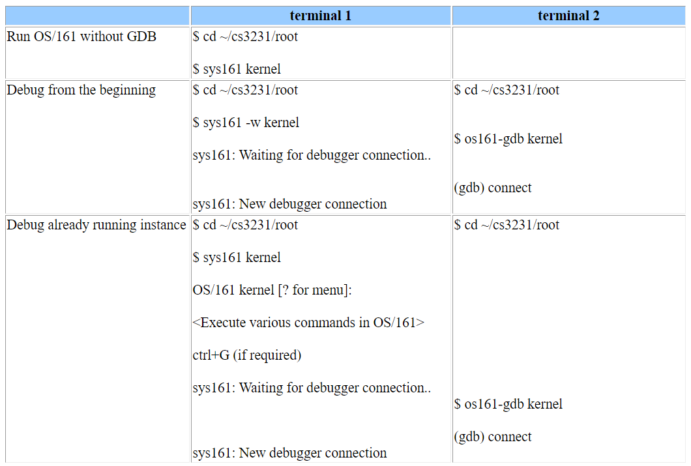

## GDB

### Breakpoints

```c
// Place a break, If only one file, ‘<filename>:’ can be omitted
break <filename>:<line number>
break <filename>:<function>

// List all breakpoints
info break

// Delete a breakpoint
delete <breakpoint number>
```

### View Data

```c
// View simple data including strings, integers, structs, or a statically declared arrays (1D or 2D).
print <variable_name>
p/x <variable_name> 	// Print in hex

// Print all local variables excluding the arguments passed into the function.
info locals

// Print the arguments passed into the function.
info args
    
// Print the type of a variable
ptype <variable_name>
```

View a linked list structure

```c
(gdb) info locals	// Print value of curr
curr = 0x602010

(gdb) ptype curr	// Check the struct of curr
type = struct node {
    int data;
    struct node *next;
} *

(gdb) print *curr	// Dereference a pointer to look the values
$1 = {data = 0, next = 0x602030}

// Do the same for the rest of the linked list
(gdb) print *(curr->next)
$2 = {data = 1, next = 0x602050}
(gdb) print *(curr->next->next)
$3 = {data = 2, next = 0x602070}
(gdb)
```

### Navigate Program

```c
step		// Execute the next statement, step into function
next		// n: Execute the next statement, skip the whole function
continue	// c: Continue execution until reaching a breakpoint/ error
    
where		// Print the function call stack with the current line number.
list		// Print 5 lines above and below
```

To repeat the previous command, just press enter.

Usually, within a function, we set a second breakpoint at the end to examine the value of variable after each iterations.

### Call Stack

GDB can only directly inspect local variables of the current function. In order to inspect the local variables of the function(s) that called the current function, we need to tell GDB to change to the stack frame of the calling function.

```c
up <n_frame>		// Go n frames up the stack
down				// Go 1 frame down the stack

frame <frame_num>	// Go to a specific frame
```

### Watch & Display

**Watch**

Break a program whenever a variable changes, like having a break point, proceed using c (continue)

```c
(gdb) watch <variable_name>		// Set a watchpoint
(gdb) info breakpoints			// View both watchpoints and breakpoints
(gdb) disable <watchpoint_number>	// Remove
```

**Display**

Automatically print how variables change throughout the program’s execution.

```c
(gdb) display expression	
(gdb) info display		// Print a list of displayed expressions
(gdb) delete display <display_number>
```

### Conditional Breakpoints

To set a conditional breakpoint we need to first set a normal breakpoint and then do `info breakpoints` to find out its `<breakpoint_number>`

Then we will set the condtion for that breakpoint

```c
// condition similar to C style
(gdb) condition <breakpoint_number> condition
    
// Remove the condition on a breakpoint
condition <breakpoint_number>
```

### Initial File

Able to add basic commands to a .gdbinit file as default commands (e.g. breakpoints) to avoid entering them every debug session.

Able to write advanced user-defined GDB commands, and use them to debug more complex data structures including linked lists and binary trees.

#### User Initialization File

Create file at `~/.gdbinit` with the following line

```
set auto-load safe-path /
```

to allow our programs to use a current directory initialization file, i.e. you can create a `.gdbinit` for each project you’re debugging.

#### Current Directory Initialization File

Create/edit  file`~/<file_path>/.gdbinit` to contain any startup behavior and user defined commands. Use either standard gdb commands or the GDB scripting syntax.

**Basic Use**

```c
// To always break at a certain function
break <function_name>
break panic
```

**Command**

```c
// Define a command
define <command>
    <code>
end

	// Document a command, they appears when 'help <command>'
	document <command>
   		<information about the command>
	end
```

**GDB Scripting**

<u>Referencing Prameters Passed to the function</u>

```shell
$argc
$arg0
$arg1
$arg2
...
```

<u>Local Variables</u>

```shell
# Declare
$<variable_name>
```

To use recursion you must use unique names for each of the variables in each stack frame. This can be generated using a name base, plus the value of another variable, separated by an underscore:

```
$<name_base>_$<other_variable>
```

<u>Setting variable value</u>

```
set $<variable_name> = <value_or_expression>
```

<u>Control Structures</u>

```c
// If
if <condition>
    <code>
else
    <code>
end

// While
while <condition>
    <code>
end
```

<u>Print</u>

```c
// Similar to that of C
printf "<format string>", <arg0>, <arg1>, ...
```

